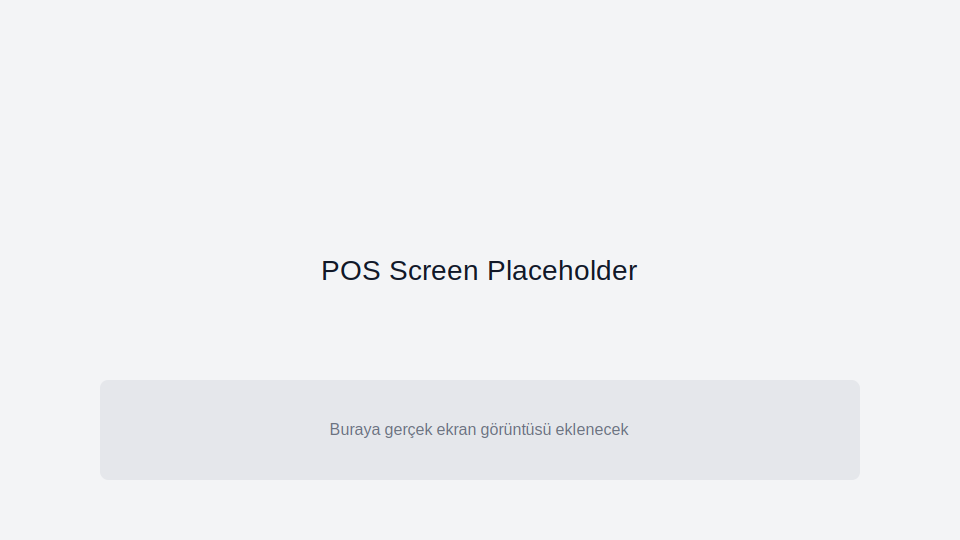
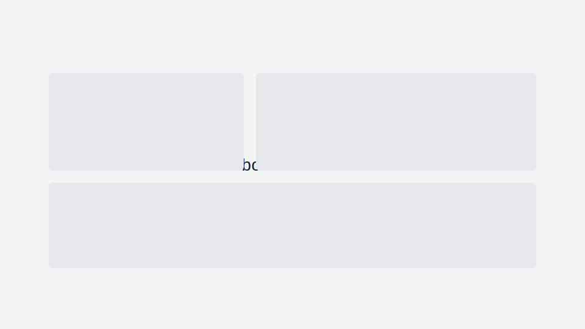
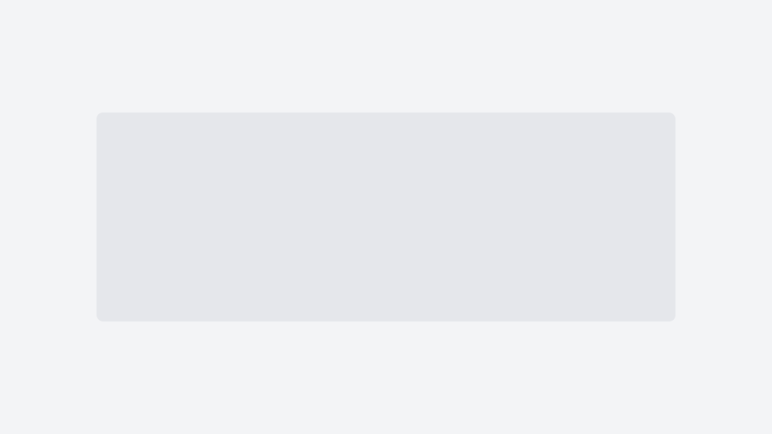

# 🛒 RoxoePOS - Modern Point of Sale Sistemi

<div align="center">


**Küçük ve orta ölçekli işletmeler için geliştirilmiş modern POS sistemi**


[](https://www.typescriptlang.org/)
[](https://www.electronjs.org/)
[](https://reactjs.org/)

[Özellikler](#-özellikler) • [Kurulum](#-kurulum) • [Kullanım](#-kullanım) • [Dokümantasyon](#-dokümantasyon) • [Destek](#-destek)

</div>

---

## 🌟 Özellikler

### 💰 Satış Yönetimi
- ✅ **Hızlı POS İşlemleri**: Multi-tab sepet sistemi
- ✅ **Barkod Desteği**: Otomatik barkod tanıma ve okuma
- ✅ **Ödeme Entegrasyonu**: Fiziksel POS cihazları desteği
- ✅ **Nakit/Kart Ödemeleri**: Manuel ve otomatik mod desteği
- ✅ **Fiş Yazdırma**: Özelleştirilebilir fiş formatları

### 📦 Stok Yönetimi
- ✅ **Ürün Katalogu**: Kategori bazlı ürün yönetimi
- ✅ **Stok Takibi**: Gerçek zamanlı stok seviyeleri
- ✅ **Toplu İşlemler**: Excel import/export desteği
- ✅ **Barkod Üretimi**: Otomatik barkod oluşturma
- ✅ **Fiyat Yönetimi**: KDV dahil/hariç fiyatlandırma

### 💼 İş Yönetimi
- ✅ **Kasa Yönetimi**: Günlük açma/kapama işlemleri
- ✅ **Veresiye Sistemi**: Müşteri bazlı borç takibi
- ✅ **Raporlama**: Detaylı satış analizleri
- ✅ **Dashboard**: Grafik ve istatistikler
- ✅ **Yedekleme**: Otomatik ve manuel backup

### 🔧 Sistem Özellikleri
- ✅ **Cross-Platform**: Windows, macOS, Linux desteği
- ✅ **Offline Çalışma**: İnternet bağımsız operasyon
- ✅ **Serial Aktivasyon**: Basit lisanslama sistemi
- ✅ **Otomatik Güncelleme**: Background update desteği
- ✅ **Çoklu Dil**: Türkçe lokalizasyon

### 🤖 Gelişmiş Özellikler (v0.5.3+)
- ✅ **AI İndeks Optimizasyonu**: Yapay zeka destekli veritabanı performans optimizasyonu
- ✅ **Akıllı Arşivleme**: Kullanım paternlerine göre otomatik veri arşivleme
- ✅ **Performans Dashboard**: Gerçek zamanlı görsel performans analizi
- ✅ **Mobil Optimizasyon**: Touch cihazlar için özel performans iyileştirmeleri
- ✅ **Cloud Senkronizasyon**: Güvenli cloud yedekleme ve çoklu cihaz desteği
- ✅ **Liste Sanallaştırma**: POS ürün/sepet listelerinde react-window ile yüksek performans
- ✅ **Gelişmiş İzleme**: Kapsamlı performans metrikleri ve akıllı uyarılar

---

## 🚀 Kurulum

### Temizlik (Opsiyonel ama önerilir)
Aşağıdaki klasörler güvenle temizlenebilir; kaynak kod ve .git etkilenmez:
- client/node_modules, client/dist, node_modules, coverage, out, .cache/.parcel-cache/.turbo, playwright-report, test-results, .eslintcache, *.tsbuildinfo

Temizlik sonrası bağımlılıkları tekrar kurmanız gerekir.

### Sistem Gereksinimleri
```
🖥️  İşletim Sistemi: Windows 10+, macOS 10.15+, Linux (Ubuntu 18+)
💾  RAM: Minimum 4GB, Önerilen 8GB  
💿  Disk Alanı: 500MB boş alan
🌐  İnternet: İlk kurulum ve güncellemeler için
```

### Hazır Kurulum (Önerilen)
1. Kurulum dosyasını yerel kaynaklardan edinin (ör. `release/0.5.3/` altındaki installer dosyaları)
2. Kurulum dosyasını çalıştırın:
   - **Windows**: `RoxoePOS-Setup-0.5.3.exe`
   - **macOS**: `RoxoePOS-Installer-0.5.3.dmg`
3. Kurulum tamamlandıktan sonra uygulamayı başlatın
4. İlk çalıştırmada geçerli bir serial numarası girin

### Geliştirici Kurulumu
```bash
# Bağımlılıkları yükleyin (kökten çalıştırın)
npm --prefix client install

# Geliştirme modunda çalıştırın
npm --prefix client run dev

# Production build
npm --prefix client run build
```

---

## 🎯 Hızlı Başlangıç

### 1. İlk Kurulum
```
📱 Uygulamayı başlatın
🔑 Serial numarasını girin (ROXOE-2025-001)
⚙️  Ayarlar > Fiş ve İşletme bölümünden işletme bilgilerini girin
🏪 Ürünler sayfasından ilk ürünlerinizi ekleyin
```

### 2. Geçerli Serial Numaraları
```
🔹 ROXOE-2025-001  (Üretim)
🔹 ROXOE-2025-002  (Üretim)
🔹 ROXOE-2025-003  (Üretim)
🔹 ROXOE-DEMO-001  (Demo)
🔹 ROXOE-TEST-001  (Test)
```

### 3. İlk Satış
```
1️⃣  Kasa > "Kasayı Aç" ile günlük kasayı başlatın
2️⃣  Satış sayfasından ürün ekleyin veya barkod taratın
3️⃣  Ödeme butonuna basarak işlemi tamamlayın
4️⃣  Fiş yazdırın (opsiyonel)
```

---

## 📖 Kullanım Kılavuzu

### 🛒 Satış İşlemleri
```typescript
// Hızlı satış akışı
1. Barkod tarama veya manuel ürün seçimi
2. Miktar ayarlama (* tuşu ile)
3. İndirim uygulama (% veya sabit tutar)
4. Ödeme seçimi (nakit/kart)
5. Fiş yazdırma
```

### 📦 Ürün Yönetimi
```typescript
// Toplu ürün ekleme
1. Ürünler > "Toplu İşlemler"
2. Excel şablonunu indirin
3. Ürün bilgilerini doldurun
4. Dosyayı yükleyin ve sütun eşlemesi yapın
5. İçe aktarımı tamamlayın
```

### 💾 Yedekleme
```typescript
// Otomatik yedekleme kurulumu
1. Ayarlar > Yedekleme
2. Yedekleme dizinini seçin
3. Otomatik zamanlama ayarlayın
4. İlk yedeklemeyi manuel başlatın
```

---

## 🏗️ Teknik Mimari

### Frontend Stack
```
🎨 UI Framework: React 18.2 + TypeScript 5.8
🎪 Styling: Tailwind CSS 3.4 + Lucide Icons
🚀 Build Tool: Vite 6.2
📱 Desktop: Electron 35.0
📊 Charts: Recharts 2.15
🔄 State: React Context API + Custom Hooks
```

### Backend & Storage
```
💾 Database: IndexedDB (Browser native)
🔒 Encryption: Crypto-JS + Node Machine ID
📦 Storage: Electron Store (Settings)
🗜️ Compression: LZ-String (Backups)
📄 File Processing: ExcelJS + PapaParse
```

### Hardware Integration
```
🖨️ POS Devices: Ingenico, Verifone
📟 Barcode Readers: USB HID, Serial
🖨️ Receipt Printers: ESC/POS compatible
💳 Payment: Manual/Automatic modes
```

---

### Özel Hook’lar (Önemli)
- usePaymentFlow: Ödeme tamamlandıktan sonraki tüm işlemleri (satış kaydı, kasa kaydı, veresiye, stok güncelleme, sepet temizleme) tek yerde yönetir. POSPage bu hook’u kullanır.
- useRegisterStatus: Kasa açık/kapalı durumunu, aktif oturumu ve open/close/refresh işlemlerini merkezileştirir. POSPage ve diğer sayfalarda tekrar kullanılabilir.
- useSettingsPage: Ayarlar sayfasının tüm durum ve eylemlerini kapsüller (POS/Barkod/Fiş/Backup/Serial/About). SettingsPage bu hook’u kullanır; sekmeler lazy load ile render edilir.

## 📚 Dokümantasyon

### Detaylı Kılavuzlar
- 📖 **[RoxoePOS Teknik Kitap](docs/ROXOEPOS-TEKNIK-KITAP.md)** - Mimari, modüller, IPC ve test rehberi
- 📘 **[RoxoePOS Kitabı (Genel)](docs/BOOK/ROXOEPOS-KITAP.md)** - Yatırımcı + Kullanıcı + Geliştirici perspektifli genel kitap
- 🧹 **[Temizlik Raporu](TEMIZLIK-RAPORU.md)** - Kod kalitesi ve optimizasyon önerileri
- 🛠️ **[KOMUT REHBERİ](KOMUT-REHBERI.md)** - Terminal/komut rehberi
- 🗓️ **[DEĞİŞİKLİK GÜNLÜĞÜ](docs/DEGISIKLIK-GUNLUGU.md)** - Değişiklik günlüğü
- 📊 **[DURUM](docs/DURUM.md)** - Genel proje durumu ve metrikler
- 🧱 **[MODÜLLER](docs/MODULLER.md)** - Modül bazlı durum ve tamamlanma yüzdeleri
- 🔌 **[API](docs/API.md)** - IPC ve servis referansı
- 🧩 **[BİLEŞENLER](docs/BILESENLER.md)** - Bileşen envanteri ve notlar
- 🗺️ Dosya Haritası: docs/DOSYA-HARITASI.md
- 🚀 **[PERFORMANS](docs/PERFORMANS.md)** - Bütçeler ve ölçüm rehberi
- 🧪 **[TEST KAPSAMI](docs/TEST-KAPSAMI.md)** - Kapsam politikası ve komutlar
- 🧾 **[Şemalar (JSON Schema)](docs/schemas/README.md)**
- 🧰 **[Runbook’lar](docs/runbooks/CALISMA-KILAVUZLARI.md)**
- ⚙️ **[Performans Playbook](docs/performance/PERFORMANS-PLAYBOOK.md)**
- 🖨️ Donanım / ESC-POS: docs/hardware/TEST-KONTROL-LISTESI.md ve docs/hardware/ESC-POS-EKI.md
- 🧭 **[ADR – Mimari Kararlar](docs/adr/README.md)**
- 📦 Örnekler: docs/samples/ORNEKLER.md
- 🧩 Bileşen Props Tablosu: docs/components/PROPS.md

### API Dokümantasyonu (özet)
```typescript
// Serial Aktivasyon API
window.ipcRenderer.invoke('activate-serial', serialNo: string)
window.ipcRenderer.invoke('check-serial')

// Yedekleme API  
window.backupAPI.createBackup(options)
window.backupAPI.restoreBackup(content, options)

// Sistem API
window.appInfo.getVersion()
```

### Şema Doğrulama
```bash
# Tüm şemaları ve örnekleri doğrula
npm run validate:all --prefix client
# veya ayrı ayrı
npm run validate:schemas --prefix client
npm run validate:samples --prefix client
```

---

## 🎨 Ekran Görüntüleri

<details>
<summary>📱 Uygulama Ekranları</summary>

### Ana POS Ekranı


### Ürün Yönetimi


### Dashboard


### Ayarlar


</details>

---

## 🔧 Konfigürasyon

### Ortam Değişkenleri
```env
# Electron Builder (Opsiyonel)
GH_TOKEN=github_token_here

# Debug (Development)
DEBUG=true
NODE_ENV=development
```

### Ayarlar Dosyaları
```
📁 Kullanıcı Verileri:
  Windows: %APPDATA%/roxoepos/
  macOS: ~/Library/Application Support/roxoepos/
  Linux: ~/.config/roxoepos/

📁 Yedekleme Dizini:
  Kullanıcı tarafından seçilebilir
  Varsayılan: Desktop/RoxoePOS-Backups/
```

---

## 🐛 Sorun Giderme

### Sık Karşılaşılan Sorunlar

<details>
<summary>🔑 Aktivasyon Sorunları</summary>

**Problem**: "Serial numarası geçersiz" hatası
```bash
Çözüm:
1. Geçerli serial numaralarından birini kullanın
2. İnternet bağlantısını kontrol edin  
3. Sistem saatini kontrol edin
4. Ayarlar > Serial No > "Serial Sıfırla"
```

</details>

<details>
<summary>💳 POS Bağlantı Sorunları</summary>

**Problem**: POS cihazına bağlanılamıyor
```bash
Çözüm:
1. Manuel modu etkinleştirin (Ayarlar > POS Cihazı)
2. Seri port ayarlarını kontrol edin
3. Cihaz driver'larını güncelleyin
4. USB bağlantısını kontrol edin
```

</details>

<details>
<summary>💾 Yedekleme Sorunları</summary>

**Problem**: Yedekleme başarısız oluyor
```bash
Çözüm:
1. Disk alanını kontrol edin (minimum 1GB)
2. Yedekleme dizini izinlerini kontrol edin
3. Streaming backup'ı etkinleştirin
4. Eski yedekleri temizleyin
```

</details>

### Log Dosyaları
```
📁 Log Konumları:
  Windows: %APPDATA%/roxoepos/logs/
  macOS: ~/Library/Logs/roxoepos/
  Linux: ~/.config/roxoepos/logs/

🔍 Debug Modu:
  npm run dev (Geliştirici ortamında)
```

---

## 🤝 Katkıda Bulunma

### Katkı Süreci
Bu projede Git/GitHub kullanılmamaktadır; yerel geliştirme akışı tercih edilir.
```
1. 📦 Proje klasörünün bir kopyasını alın (ZIP/klasör kopyası)
2. 🛠️ Geliştirmeyi `client` altında yapın
3. ✅ Kalite kontrolleri: npm run lint && npm run type-check && npm run test:coverage
4. 🏗️ Paketleme: npm run build (gerekirse platforma özel build komutları)
5. 📚 Değişikliklere karşılık ilgili dokümanları güncelleyin
```

### Geliştirme Kuralları
- ✅ TypeScript kullanın
- ✅ ESLint kurallarına uyun
- ✅ Commit mesajlarını açıklayıcı yazın
- ✅ Testlerinizi yazın

---

## 📞 Destek ve İletişim

### 🏢 Geliştirici
```
👨‍💻 Geliştirici: Batin
📧 Email: batin@cretique.net
🌐 Website: https://www.cretique.net
🎫 Destek: https://www.cretique.net/destek
```

### 🆘 Destek Kanalları
- 📧 **Email Destek**: Teknik sorunlar için
- 🌐 **Web Destek**: Online yardım merkezi
- 📚 **Dokümantasyon**: Kapsamlı kılavuzlar

---


---

## 🎉 Teşekkürler

RoxoePOS'u seçtiğiniz için teşekkür ederiz! İşletmenizin dijital dönüşümünde yanınızdayız.

<div align="center">

**[⬆ Başa Dön](#-roxoepos---modern-point-of-sale-sistemi)**

</div>