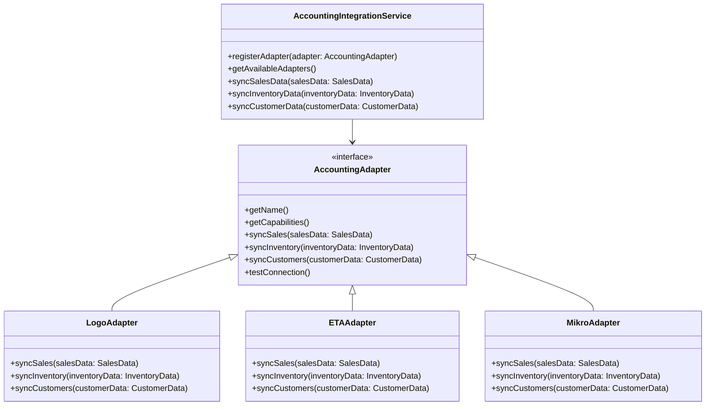
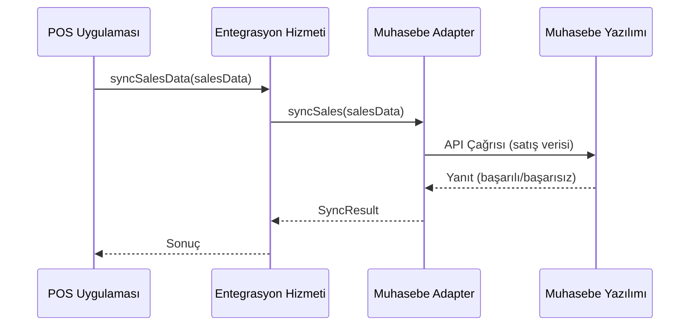
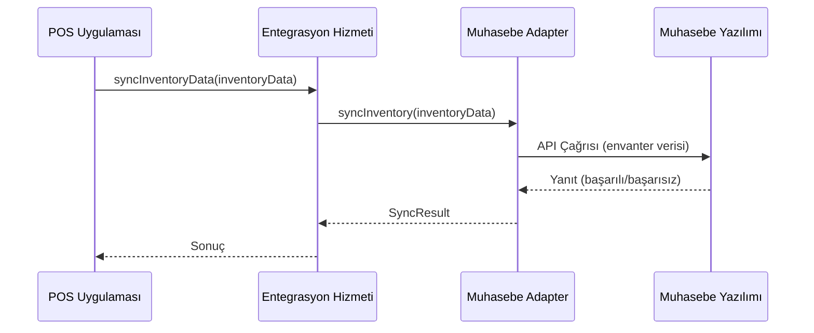

# POS Uygulaması - Muhasebe Yazılımı Entegrasyon Mimarisi

## 1. Giriş

Bu doküman, POS uygulaması ile çeşitli muhasebe yazılımları (Logo, ETA, Mikro vb.) arasında esnek ve genişletilebilir bir entegrasyon mimarisi tasarımını detaylandırır. Mimarinin amacı, farklı müşteri ihtiyaçlarına uyum sağlayabilen, modüler ve bakımı kolay bir entegrasyon çözümü sunmaktır.

## 2. Genel Bakış



## 3. Mimari Bileşenler

### 3.1 Entegrasyon Hizmeti (Integration Service)

Merkezi entegrasyon hizmeti, tüm muhasebe yazılımı entegrasyonlarını yönetir ve koordine eder.

```typescript
// src/services/accounting/AccountingIntegrationService.ts
interface AccountingAdapter {
  getName(): string;
  getCapabilities(): AccountingCapabilities;
  syncSales(salesData: SalesData[]): Promise<SyncResult>;
  syncInventory(inventoryData: InventoryData[]): Promise<SyncResult>;
  syncCustomers(customerData: CustomerData[]): Promise<SyncResult>;
  testConnection(): Promise<ConnectionTestResult>;
}

class AccountingIntegrationService {
  private adapters: Map<string, AccountingAdapter> = new Map();
  private activeAdapter: string | null = null;

  registerAdapter(adapter: AccountingAdapter): void {
    this.adapters.set(adapter.getName(), adapter);
  }

  setActiveAdapter(adapterName: string): void {
    if (this.adapters.has(adapterName)) {
      this.activeAdapter = adapterName;
    } else {
      throw new Error(`Adapter ${adapterName} not found`);
    }
  }

  async syncSalesData(salesData: SalesData[]): Promise<SyncResult> {
    if (!this.activeAdapter) {
      throw new Error('No active adapter selected');
    }
    return this.adapters.get(this.activeAdapter)!.syncSales(salesData);
  }

  // Diğer senkronizasyon metodları...
}
```

### 3.2 Adapter Tasarım Deseni

Her muhasebe yazılımı için özel adapter sınıfları:

```typescript
// src/services/accounting/adapters/LogoAdapter.ts
class LogoAdapter implements AccountingAdapter {
  private config: LogoConfig;

  constructor(config: LogoConfig) {
    this.config = config;
  }

  getName(): string {
    return 'Logo';
  }

  async syncSales(salesData: SalesData[]): Promise<SyncResult> {
    // Logo API'sine özel satış veri senkronizasyonu
    const result = await this.callLogoApi('/sales/sync', salesData);
    return this.mapLogoResponse(result);
  }

  private async callLogoApi(endpoint: string, data: any): Promise<any> {
    // Logo API çağrısı implementasyonu
  }

  private mapLogoResponse(response: any): SyncResult {
    // Logo yanıtını standart forma dönüştürme
  }
}
```

### 3.3 Veri Modelleri

Standart veri modelleri, farklı muhasebe sistemleri arasında uyumluluk sağlar:

```typescript
// src/models/accounting/AccountingModels.ts
interface SalesData {
  id: string;
  date: Date;
  customerId: string;
  items: SalesItem[];
  totalAmount: number;
  paymentMethod: PaymentMethod;
  invoiceNumber?: string;
}

interface InventoryData {
  productId: string;
  quantity: number;
  costPrice: number;
  lastUpdated: Date;
}

interface CustomerData {
  id: string;
  name: string;
  taxNumber: string;
  address: string;
  contactInfo: string;
}
```

## 4. Entegrasyon Akışları

### 4.1 Satış Verisi Senkronizasyonu



### 4.2 Envanter Senkronizasyonu



## 5. Konfigürasyon Yönetimi

```typescript
// src/config/accountingConfig.ts
interface AccountingConfig {
  activeAdapter: string;
  adapters: {
    logo?: LogoConfig;
    eta?: ETAConfig;
    mikro?: MikroConfig;
  };
  syncSettings: {
    autoSync: boolean;
    syncInterval: number; // dakika cinsinden
    retryCount: number;
  };
}
```

## 6. Hata Yönetimi ve Loglama

```typescript
// src/services/accounting/AccountingErrorHandler.ts
class AccountingErrorHandler {
  private logger: Logger;

  constructor(logger: Logger) {
    this.logger = logger;
  }

  handleError(error: Error, context: SyncContext): void {
    this.logger.error(`[AccountingSync] ${context.type} sync failed`, {
      error: error.message,
      stack: error.stack,
      data: context.data,
      timestamp: new Date().toISOString()
    });

    // Hata bildirim sistemi
    this.notifyError(error, context);
  }

  private notifyError(error: Error, context: SyncContext): void {
    // Kullanıcıya veya yöneticiye hata bildirimi
  }
}
```

## 7. Test ve Doğrulama

```typescript
// src/tests/accounting/AccountingIntegration.test.ts
describe('Accounting Integration', () => {
  let service: AccountingIntegrationService;
  let mockLogoAdapter: Mock<LogoAdapter>;
  let mockEtaAdapter: Mock<ETAAdapter>;

  beforeEach(() => {
    service = new AccountingIntegrationService();
    mockLogoAdapter = new MockLogoAdapter();
    mockEtaAdapter = new MockETAAdapter();

    service.registerAdapter(mockLogoAdapter);
    service.registerAdapter(mockEtaAdapter);
  });

  it('should sync sales data with selected adapter', async () => {
    const salesData: SalesData[] = [{ /* test verisi */ }];
    service.setActiveAdapter('Logo');

    const result = await service.syncSalesData(salesData);

    expect(result.success).toBe(true);
    expect(mockLogoAdapter.syncSales).toHaveBeenCalledWith(salesData);
  });

  it('should handle adapter errors gracefully', async () => {
    mockLogoAdapter.syncSales.mockRejectedValue(new Error('Connection failed'));
    service.setActiveAdapter('Logo');

    const result = await service.syncSalesData([{ /* test verisi */ }]);

    expect(result.success).toBe(false);
    expect(result.error).toContain('Connection failed');
  });
});
```

## 8. Dağıtım Stratejisi

### 8.1 Kademeli Dağıtım

1. **Geliştirme Ortamı**: Adapter implementasyonları ve temel entegrasyon testleri
2. **Test Ortamı**: Gerçek muhasebe sistemleriyle entegrasyon testleri
3. **Canlı Ortam**: Kademeli müşteri dağıtımı ve geri bildirim toplama

### 8.2 Geri Alma Planı

- Otomatik senkronizasyonu devre dışı bırakma
- Manuel veri doğrulama ve düzeltme araçları
- Önceki sürüme geri dönüş imkanı

## 9. Gelecek Geliştirmeler

- Yeni muhasebe yazılımları için adapter ekleme kolaylığı
- Gerçek zamanlı senkronizasyon seçenekleri
- Gelişmiş hata kurtarma ve veri düzeltme mekanizmaları
- Kullanıcı dostu adapter konfigürasyon arayüzü

## 10. Sonuç

Bu mimari, POS uygulaması ile çeşitli muhasebe yazılımları arasında esnek ve genişletilebilir bir entegrasyon sağlar. Adapter tasarım deseni sayesinde, yeni muhasebe sistemleri kolayca eklenebilir ve mevcut sistemler bağımsız olarak güncellenebilir. Standart veri modelleri ve merkezi hata yönetimi, sistemin bakımını ve genişletilmesini kolaylaştırır.