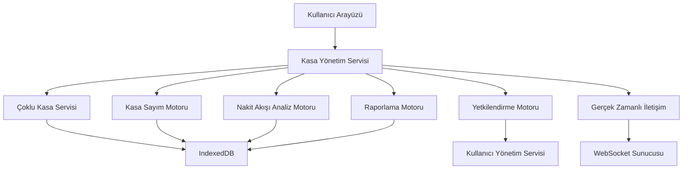
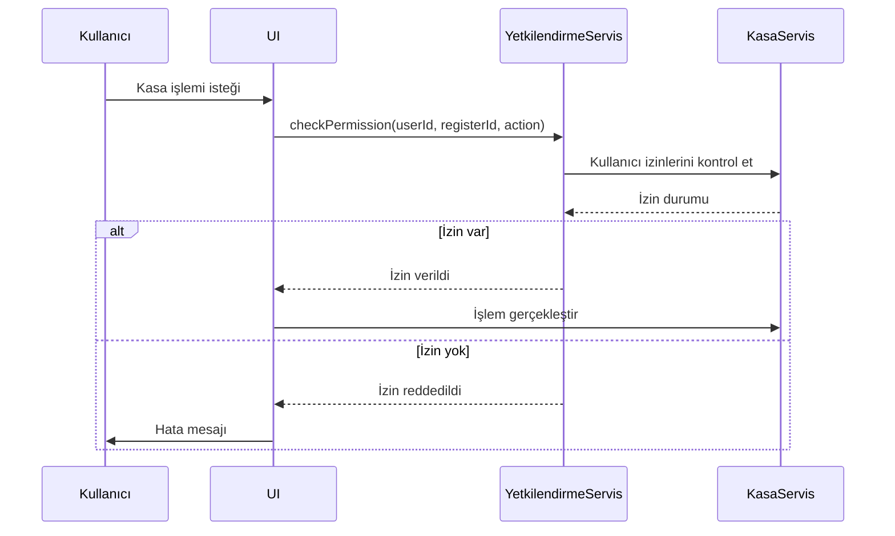
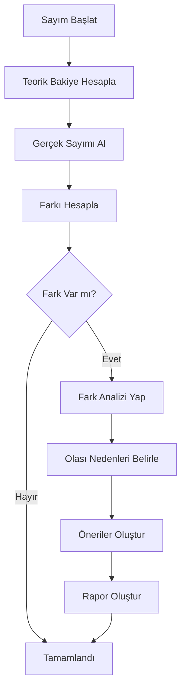
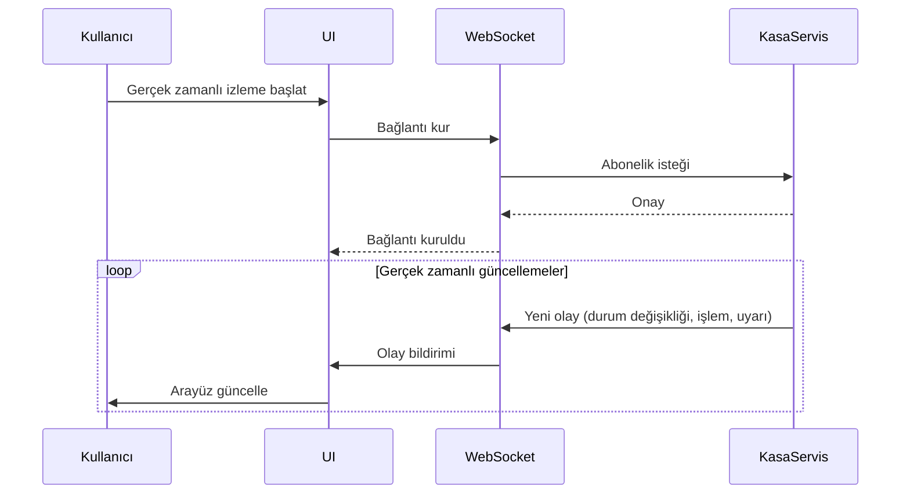
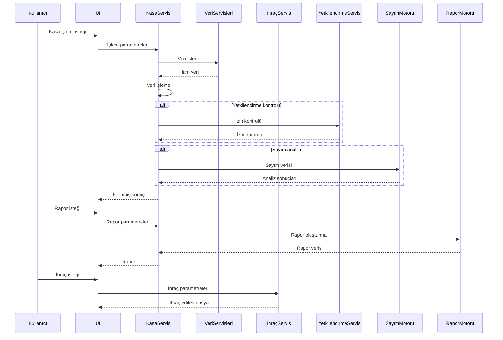

# POS Uygulaması Gelişmiş Kasa Yönetimi Mimari Tasarımı

## 1. Giriş

Bu doküman, mevcut POS uygulamasına gelişmiş kasa yönetimi özelliği eklemek için gereken mimari değişiklikleri ve tasarım kararlarını detaylandırır. Gelişmiş kasa yönetimi sistemi, çoklu kasa desteği, gelişmiş kullanıcı yetkilendirme, otomatik kasa sayımı, nakit akışı tahminleri, gelişmiş raporlama ve gerçek zamanlı izleme gibi özellikleri içermektedir.

## 2. Mevcut Uygulama Analizi

Mevcut uygulama yapısı:
- React ve TypeScript tabanlı
- IndexedDB veritabanı kullanımı
- Modüler bileşen yapısı
- Mevcut kasa yönetimi: Temel kasa açma/kapatma, işlem kayıtları
- Veri servisleri: `cashRegisterDB.ts`, `salesDB.ts`, `productDB.ts`

## 3. Gelişmiş Kasa Yönetimi Mimarisi

### 3.1 Genel Yaklaşım

Gelişmiş kasa yönetimi sistemi için aşağıdaki bileşenler eklenecek:
- Çoklu kasa yönetim servisi
- Gelişmiş yetkilendirme motoru
- Otomatik kasa sayımı ve fark analizi motoru
- Nakit akışı tahmin ve uyarı sistemi
- Gelişmiş raporlama ve analiz motoru
- Gerçek zamanlı izleme ve görselleştirme bileşenleri

### 3.2 Sistem Bileşenleri



## 4. Çoklu Kasa Yönetim Sistemi

### 4.1 Veri Modeli

```typescript
interface CashRegister {
  id: string;
  name: string;
  location: string; // Şube/departman bilgisi
  status: CashRegisterStatus;
  currentSessionId?: string;
  createdAt: Date;
  updatedAt: Date;
}

interface CashRegisterSession {
  id: string;
  registerId: string;
  openingDate: Date;
  openingBalance: number;
  closingDate?: Date;
  cashSalesTotal: number;
  cardSalesTotal: number;
  cashDepositTotal: number;
  cashWithdrawalTotal: number;
  countingAmount?: number;
  countingDifference?: number;
  status: CashRegisterStatus;
  userId: string; // Kasa açan/kullanan personel
}
```

### 4.2 API Endpoint'leri

```typescript
interface CashRegisterAPI {
  // Kasa yönetimi
  GET /api/cash-registers: Tüm kasaları listele
  POST /api/cash-registers: Yeni kasa oluştur
  GET /api/cash-registers/{id}: Kasa detayları
  PUT /api/cash-registers/{id}: Kasa güncelle
  DELETE /api/cash-registers/{id}: Kasa sil

  // Kasa oturumları
  POST /api/cash-registers/{id}/open: Kasa aç
  POST /api/cash-registers/{id}/close: Kasa kapa
  GET /api/cash-registers/{id}/sessions: Kasa oturumları
  GET /api/cash-registers/{id}/sessions/{sessionId}: Oturum detayları

  // Kasa işlemleri
  POST /api/cash-registers/{id}/transactions: Yeni işlem ekle
  GET /api/cash-registers/{id}/transactions: İşlem geçmişi
}
```

## 5. Gelişmiş Yetkilendirme Sistemi

### 5.1 Rol ve İzin Yapısı

```typescript
enum CashRegisterPermission {
  VIEW = "GÖRÜNTÜLE",
  OPEN_CLOSE = "AÇ_KAPAT",
  MANAGE_TRANSACTIONS = "İŞLEM_YÖNET",
  COUNT_CASH = "SAYIM_YAP",
  MANAGE_REGISTERS = "KASA_YÖNET",
  ADMIN = "YÖNETİCİ"
}

interface UserCashRegisterRole {
  userId: string;
  registerId: string;
  permissions: CashRegisterPermission[];
  assignedAt: Date;
}
```

### 5.2 Yetkilendirme Akışı



## 6. Otomatik Kasa Sayımı ve Fark Analizi

### 6.1 Sayım Motoru

```typescript
interface CashCountingEngine {
  startCounting(sessionId: string): Promise<CashCountingResult>;
  analyzeDifference(countingResult: CashCountingResult): CashCountingAnalysis;
  generateReport(analysis: CashCountingAnalysis): CashCountingReport;
}

interface CashCountingResult {
  sessionId: string;
  countedAmount: number;
  theoreticalAmount: number;
  difference: number;
  timestamp: Date;
  userId: string;
}

interface CashCountingAnalysis {
  differenceAmount: number;
  differencePercentage: number;
  possibleReasons: string[];
  severity: "LOW" | "MEDIUM" | "HIGH";
  recommendations: string[];
}
```

### 6.2 Sayım Süreci



## 7. Nakit Akışı Tahmin ve Uyarı Sistemi

### 7.1 Tahmin Motoru

```typescript
interface CashFlowPredictionEngine {
  predictCashFlow(registerId: string, period: "DAILY" | "WEEKLY" | "MONTHLY"): CashFlowPrediction;
  analyzeTrends(registerId: string, period: string): CashFlowTrendAnalysis;
  generateAlerts(predictions: CashFlowPrediction[]): CashFlowAlert[];
}

interface CashFlowPrediction {
  registerId: string;
  period: string;
  predictedAmount: number;
  confidence: number; // 0-1 arası
  timestamp: Date;
}

interface CashFlowAlert {
  id: string;
  registerId: string;
  type: "LOW_CASH" | "HIGH_CASH" | "ANOMALY";
  message: string;
  severity: "INFO" | "WARNING" | "CRITICAL";
  timestamp: Date;
  resolved: boolean;
}
```

### 7.2 Uyarı Türleri

| Uyarı Türü | Açıklama | Eşik Değeri |
|------------|-----------|-------------|
| LOW_CASH | Kasa bakiyesi düşük | < 10% ortalama günlük ihtiyaç |
| HIGH_CASH | Kasa bakiyesi yüksek | > 200% ortalama günlük ihtiyaç |
| ANOMALY | Beklenmeyen nakit akışı | Standart sapma > 2σ |

## 8. Gelişmiş Raporlama ve Analiz Sistemi

### 8.1 Rapor Türleri

```typescript
enum ReportType {
  DAILY_SUMMARY = "GÜNLÜK_ÖZET",
  CASH_FLOW_ANALYSIS = "NAKİT_AKIŞI_ANALİZİ",
  TRANSACTION_HISTORY = "İŞLEM_GEÇMİŞİ",
  COUNTING_REPORT = "SAYIM_RAPORU",
  PREDICTION_REPORT = "TAHMİN_RAPORU",
  COMPARATIVE_ANALYSIS = "KARŞILAŞTIRMALI_ANALİZ"
}
```

### 8.2 Rapor Yapısı

```typescript
interface AdvancedReport {
  id: string;
  type: ReportType;
  registerId: string;
  sessionId?: string;
  title: string;
  description: string;
  createdAt: Date;
  updatedAt: Date;
  filters: {
    dateRange?: { start: Date; end: Date };
    registerIds?: string[];
    userIds?: string[];
    transactionTypes?: CashTransactionType[];
  };
  data: any[]; // Rapor verisi
  metadata: {
    totalRecords: number;
    totalAmount?: number;
    currency: string;
    charts?: {
      type: "bar" | "pie" | "line" | "table";
      data: any;
    }[];
  };
}
```

## 9. Gerçek Zamanlı İletişim ve İletişim

### 9.1 WebSocket API

```typescript
interface CashRegisterWebSocketAPI {
  // Kasa durum değişiklikleri
  event: "register_status_change";
  data: {
    registerId: string;
    newStatus: CashRegisterStatus;
    timestamp: Date;
  };

  // Yeni işlem bildirimi
  event: "new_transaction";
  data: {
    registerId: string;
    transactionId: string;
    type: CashTransactionType;
    amount: number;
    timestamp: Date;
  };

  // Uyarı bildirimi
  event: "alert_triggered";
  data: {
    alertId: string;
    registerId: string;
    type: string;
    message: string;
    severity: string;
  };
}
```

### 9.2 Gerçek Zamanlı Veri Akışı



## 10. Teknik Detaylar

### 10.1 Veri Akışı



### 10.2 Performans Optimizasyonu

- Veri önbelleğe alma
- Arka planda veri işleme
- İlerleme göstergeleri
- Büyük veri setleri için sayfalama
- Gerçek zamanlı güncellemeler için WebSocket kullanımı

## 11. Uygulama Adımları

1. **Veri Servisleri Geliştirme**
   - Yeni kasa yönetim servisleri oluşturma
   - Mevcut servisleri gelişmiş kasa yönetimi için uyarlama

2. **Çoklu Kasa Yönetim Motoru**
   - Kasa CRUD işlemleri
   - Kasa oturum yönetimi
   - Kasa durum izleme

3. **Yetkilendirme Motoru**
   - Rol tabanlı erişim kontrolü
   - İzin yönetimi
   - Kullanıcı-kasa atamaları

4. **Otomatik Sayım ve Analiz Motoru**
   - Kasa sayım algoritması
   - Fark analizi motoru
   - Rapor oluşturma

5. **Nakit Akışı Tahmin Motoru**
   - Tarihsel veri analizi
   - Tahmin algoritmaları
   - Uyarı oluşturma

6. **Gelişmiş Raporlama Motoru**
   - Rapor şablon yönetimi
   - Özelleştirme motoru
   - Çoklu format ihraç

7. **Gerçek Zamanlı İletişim**
   - WebSocket sunucusu
   - Gerçek zamanlı arayüz bileşenleri
   - Bildirim sistemi

8. **Kullanıcı Arayüzü Entegrasyonu**
   - Yeni kasa yönetim bileşenleri
   - Mevcut UI'ye entegrasyon
   - Kullanıcı deneyimi iyileştirmeleri

9. **Test ve Doğrulama**
   - Birim testleri
   - Entegrasyon testleri
   - Kullanıcı kabul testleri
   - Performans testleri

## 12. Gelecek Geliştirmeler

1. Yapay zeka tabanlı anomali tespiti
2. Otomatik kasa dengeleme önerileri
3. Mobil uygulama entegrasyonu
4. Bulut tabanlı çoklu şube senkronizasyonu
5. Sesli komutlarla kasa yönetimi
6. Biyometrik kimlik doğrulama
7. Blokzincir tabanlı işlem kayıtları
8. Gelişmiş dolandırıcılık tespit sistemi