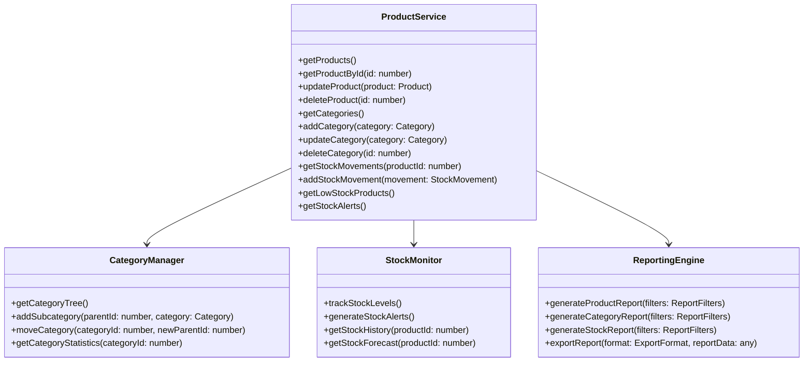
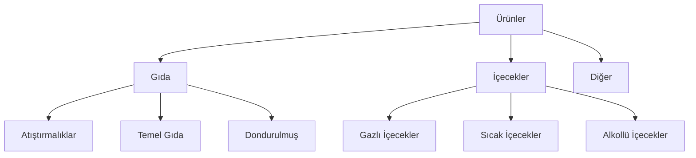
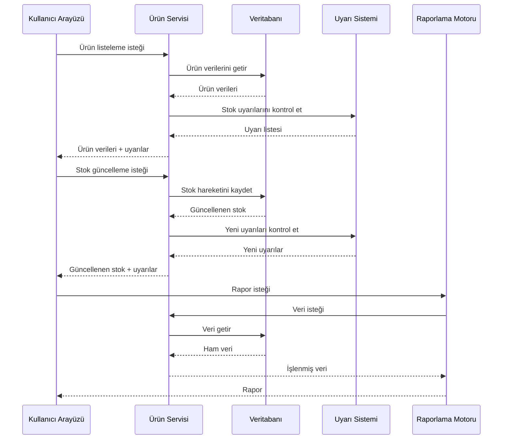

# POS Uygulaması Gelişmiş Ürün Yönetimi Mimarisi

## 1. Giriş

Bu doküman, mevcut POS uygulamasına gelişmiş ürün yönetimi özelliği eklemek için gereken mimari değişiklikleri ve tasarım kararlarını detaylandırır. Gelişmiş ürün yönetimi, ürün kategorileri, stok seviyeleri izleme ve raporlama sistemlerini kapsar.

## 2. Mevcut Durum Analizi

Mevcut uygulama yapısı:
- React ve TypeScript tabanlı
- IndexedDB veritabanı kullanımı
- Modüler bileşen yapısı
- Temel ürün yönetimi özellikleri

Mevcut özellikler:
- Ürün ekleme/düzenleme/silme
- Kategori yönetimi (temel CRUD işlemleri)
- Stok yönetimi (temel giriş/çıkış işlemleri)
- Raporlama (temel satış verileri)

## 3. Gelişmiş Ürün Yönetimi Mimarisi

### 3.1 Genel Yaklaşım

Gelişmiş ürün yönetimi için aşağıdaki bileşenler eklenecek:
- Ürün servis katmanı
- Kategori yönetim sistemi
- Stok izleme ve uyarı sistemi
- Raporlama ve analiz motoru
- Kullanıcı arayüzü entegrasyonu

### 3.2 Sistem Bileşenleri



## 4. Ürün Kategorileri Yönetimi

### 4.1 Kategori Hiyerarşisi

```typescript
interface Category {
  id: number;
  name: string;
  parentId?: number;
  icon?: string;
  description?: string;
  isActive: boolean;
  createdAt: Date;
  updatedAt: Date;
  children?: Category[];
}

interface CategoryTree {
  rootCategories: Category[];
  getCategoryPath(categoryId: number): Category[];
  findCategoryById(categoryId: number): Category | null;
  addCategory(category: Category, parentId?: number): void;
  moveCategory(categoryId: number, newParentId: number): void;
}
```

### 4.2 Kategori Yönetim Özellikleri

- Çok seviyeli kategori hiyerarşisi
- Kategori taşıma ve yeniden düzenleme
- Kategori istatistikleri ve raporları
- Kategori bazında ürün filtreleme
- Kategori ikonları ve görsel özelleştirmeler



## 5. Stok Seviyeleri İzleme Sistemi

### 5.1 Stok Takip Özellikleri

```typescript
interface StockMovement {
  id: string;
  productId: number;
  type: 'in' | 'out' | 'adjustment';
  quantity: number;
  reason: string;
  date: Date;
  userId?: string;
  reference?: string;
}

interface StockAlert {
  id: string;
  productId: number;
  alertType: 'low_stock' | 'expired' | 'overstock';
  threshold: number;
  currentStock: number;
  triggeredAt: Date;
  resolved: boolean;
  resolvedAt?: Date;
}
```

### 5.2 Stok Uyarı Mekanizması

- Minimum stok seviyesi uyarıları
- Maksimum stok seviyesi uyarıları
- Son kullanma tarihi yaklaşan ürünler için uyarılar
- Stok hareketi geçmişi ve trend analizi
- Otomatik stok tahmin ve öneri sistemi

```typescript
class StockAlertManager {
  private alertThresholds: Map<number, StockAlertConfig>;

  constructor() {
    this.alertThresholds = new Map();
  }

  setAlertThreshold(productId: number, config: StockAlertConfig): void {
    this.alertThresholds.set(productId, config);
  }

  checkStockLevels(products: Product[]): StockAlert[] {
    const alerts: StockAlert[] = [];

    products.forEach(product => {
      const config = this.alertThresholds.get(product.id);
      if (config) {
        if (product.stock <= config.minStock) {
          alerts.push({
            productId: product.id,
            alertType: 'low_stock',
            threshold: config.minStock,
            currentStock: product.stock,
            triggeredAt: new Date(),
            resolved: false
          });
        }

        if (product.stock >= config.maxStock) {
          alerts.push({
            productId: product.id,
            alertType: 'overstock',
            threshold: config.maxStock,
            currentStock: product.stock,
            triggeredAt: new Date(),
            resolved: false
          });
        }
      }
    });

    return alerts;
  }
}
```

## 6. Raporlama ve Analiz Sistemi

### 6.1 Rapor Türleri

1. **Ürün Performans Raporu**
   - Satış hacmi
   - Kar marjı
   - Stok dönüş hızı
   - Trend analizi

2. **Kategori Raporu**
   - Kategori bazında satışlar
   - En çok satan kategoriler
   - Kategori kar analizi

3. **Stok Raporu**
   - Stok seviyeleri
   - Stok hareketleri
   - Stok değerlemesi
   - Stok dönüş süresi

### 6.2 Rapor Özelleştirme

```typescript
interface ReportConfig {
  reportType: 'product' | 'category' | 'stock';
  dateRange: { start: Date; end: Date };
  filters: {
    categories?: number[];
    products?: number[];
    stockLevels?: { min?: number; max?: number };
  };
  grouping: 'daily' | 'weekly' | 'monthly' | 'yearly';
  sortBy: string;
  sortDirection: 'asc' | 'desc';
  columns: string[];
  chartType?: 'bar' | 'pie' | 'line' | 'table';
}
```

## 7. Veri Akışı ve Entegrasyon



## 8. Kullanıcı Arayüzü Entegrasyonu

### 8.1 Ana Bileşenler

1. **Ürün Yönetim Paneli**
   - Gelişmiş ürün listeleme ve filtreleme
   - Toplu ürün işlemleri
   - Ürün içe/dışa aktarımı

2. **Kategori Yönetim Arayüzü**
   - Hiyerarşik kategori görüntüleme
   - Kategori düzenleme ve taşıma
   - Kategori istatistikleri

3. **Stok Yönetim Kontrol Paneli**
   - Stok seviyesi görselleştirme
   - Uyarı yönetimi
   - Stok hareketi geçmişi

4. **Raporlama Merkezi**
   - Rapor şablonları
   - Özelleştirilebilir raporlar
   - İhracat seçenekleri

## 9. Teknik Detaylar

### 9.1 Veri Modeli Geliştirmeleri

```typescript
interface Product {
  id: number;
  name: string;
  barcode: string;
  categoryId: number;
  purchasePrice: number;
  salePrice: number;
  vatRate: number;
  priceWithVat: number;
  stock: number;
  minStockLevel?: number;
  maxStockLevel?: number;
  reorderPoint?: number;
  supplierId?: number;
  imageUrl?: string;
  isActive: boolean;
  createdAt: Date;
  updatedAt: Date;
  lastStockUpdate?: Date;
  expiryDate?: Date;
  batchNumber?: string;
}
```

### 9.2 Performans Optimizasyonu

- Veri önbelleğe alma
- Arka planda veri işleme
- İlerleme göstergeleri
- Büyük veri setleri için sayfalama
- Gerçek zamanlı güncellemeler için WebSocket entegrasyonu

## 10. Uygulama Adımları

1. **Veri Modeli Geliştirme**
   - Yeni veri alanları ekleme
   - Veritabanı şeması güncelleme

2. **Servis Katmanı Oluşturma**
   - Ürün servisi geliştirme
   - Kategori yönetim servisi
   - Stok izleme servisi

3. **Raporlama Motoru Geliştirme**
   - Rapor şablonları oluşturma
   - Veri işleme motoru
   - İhracat modülleri

4. **Kullanıcı Arayüzü Entegrasyonu**
   - Yeni bileşenler oluşturma
   - Mevcut UI'ye entegrasyon
   - Kullanıcı deneyimi iyileştirmeleri

5. **Test ve Doğrulama**
   - Birim testleri
   - Entegrasyon testleri
   - Kullanıcı kabul testleri
   - Performans testleri

## 11. Gelecek Geliştirmeler

1. Yapay zeka tabanlı stok tahmini
2. Otomatik sipariş oluşturma
3. Tedarikçi entegrasyonu
4. Çoklu mağaza stok yönetimi
5. Mobil uygulama entegrasyonu

## 12. Sonuç

Bu mimari, POS uygulamasına gelişmiş ürün yönetimi özellikleri eklemek için kapsamlı bir çerçeve sunar. Modüler tasarım sayesinde, her bileşen bağımsız olarak geliştirilebilir ve test edilebilir. Sistem, mevcut altyapıyla uyumlu şekilde çalışacak ve kullanıcı deneyimini önemli ölçüde iyileştirecektir.