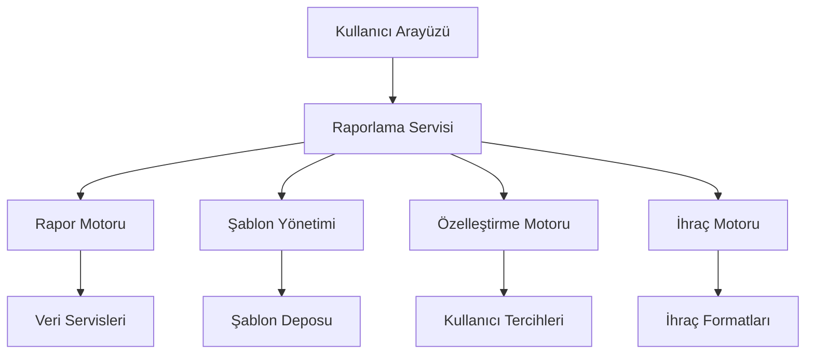
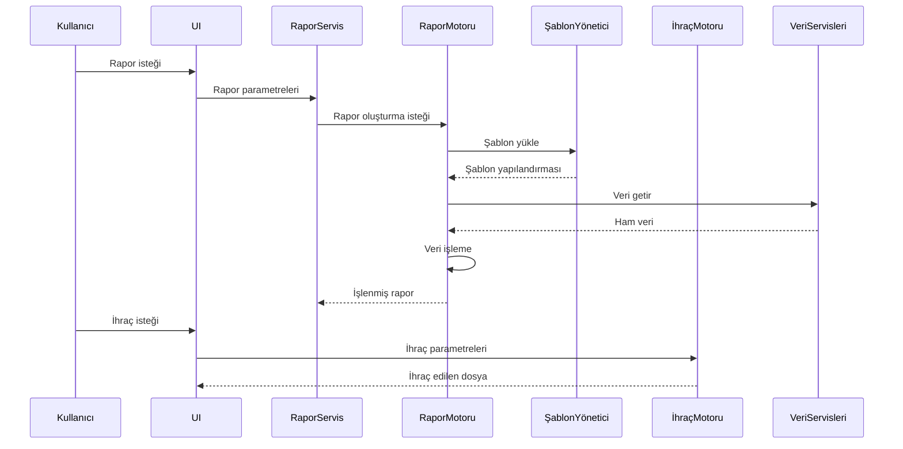
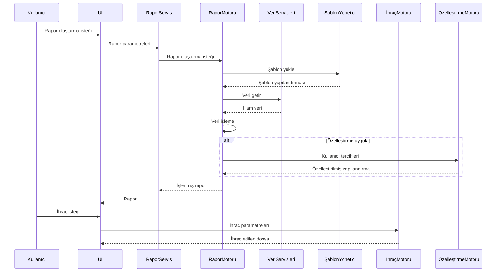

# POS Uygulaması Gelişmiş Raporlama Sistemi Mimari Tasarımı

## 1. Giriş

Bu doküman, POS uygulamasına entegre edilecek gelişmiş raporlama sisteminin mimari tasarımını detaylandırır. Sistem, çoklu rapor türleri, gelişmiş filtreleme, özelleştirme ve ihraç seçeneklerini içermektedir.

## 2. Sistem Genel Bakışı

### 2.1 Sistem Bileşenleri



### 2.2 Veri Akışı



## 3. Rapor Türleri

### 3.1 Rapor Kategorileri

```typescript
enum ReportCategory {
  SALES = "SATIŞ",
  CASH_FLOW = "NAKİT_AKIŞI",
  INVENTORY = "STOK",
  CUSTOMER = "MÜŞTERİ",
  CASH_REGISTER = "KASA",
  COMPARATIVE = "KARŞILAŞTIRMALI"
}
```

### 3.2 Rapor Türleri

```typescript
enum ReportType {
  // Satış Raporları
  DAILY_SALES_SUMMARY = "GÜNLÜK_SATIŞ_ÖZETİ",
  HOURLY_SALES_TREND = "SAATLİK_SATIŞ_TRENDİ",
  PAYMENT_METHOD_ANALYSIS = "ÖDEME_YÖNTEMİ_ANALİZİ",
  CATEGORY_PERFORMANCE = "KATEGORİ_PERFORMANSI",
  PRODUCT_PERFORMANCE = "ÜRÜN_PERFORMANSI",

  // Nakit Akışı Raporları
  CASH_FLOW_ANALYSIS = "NAKİT_AKIŞI_ANALİZİ",
  CASH_REGISTER_SUMMARY = "KASA_ÖZETİ",
  TRANSACTION_HISTORY = "İŞLEM_GEÇMİŞİ",
  COUNTING_REPORT = "SAYIM_RAPORU",

  // Stok Raporları
  INVENTORY_STATUS = "STOK_DURUMU",
  STOCK_MOVEMENT = "STOK_HAREKETİ",
  LOW_STOCK_ALERT = "DÜŞÜK_STOK_UYARISI",

  // Müşteri Raporları
  CUSTOMER_PURCHASE_HISTORY = "MÜŞTERİ_SATIN_ALMA_GEÇMİŞİ",
  CUSTOMER_SEGMENTATION = "MÜŞTERİ_SEGMENTASYONU",
  LOYALTY_ANALYSIS = "SADAKAT_ANALİZİ",

  // Karşılaştırmalı Raporlar
  PERIOD_COMPARISON = "DÖNEM_KARŞILAŞTIRMASI",
  REGISTER_COMPARISON = "KASA_KARŞILAŞTIRMASI",
  CUSTOM_COMPARISON = "ÖZEL_KARŞILAŞTIRMA"
}
```

## 4. Rapor Veri Modeli

### 4.1 Rapor Yapısı

```typescript
interface AdvancedReport {
  id: string;
  type: ReportType;
  category: ReportCategory;
  title: string;
  description: string;
  createdAt: Date;
  updatedAt: Date;
  createdBy: string;
  filters: ReportFilter;
  data: ReportData;
  metadata: ReportMetadata;
  templateId?: string;
  customization?: ReportCustomization;
}
```

### 4.2 Filtre Yapısı

```typescript
interface ReportFilter {
  dateRange?: {
    start: Date;
    end: Date;
    period?: "DAILY" | "WEEKLY" | "MONTHLY" | "CUSTOM";
  };
  registerIds?: string[];
  userIds?: string[];
  paymentMethods?: string[];
  categories?: string[];
  products?: string[];
  customers?: string[];
  transactionTypes?: CashTransactionType[];
  status?: string[];
  customFilters?: Record<string, any>;
}
```

### 4.3 Veri Yapısı

```typescript
interface ReportData {
  rawData: any[]; // Ham veri
  processedData: any[]; // İşlenmiş veri
  statistics: {
    totalAmount: number;
    averageAmount: number;
    count: number;
    min: number;
    max: number;
    stdDev: number;
  };
  charts: ReportChart[];
  tables: ReportTable[];
}
```

### 4.4 Meta Veri Yapısı

```typescript
interface ReportMetadata {
  totalRecords: number;
  totalAmount: number;
  currency: string;
  period: {
    start: Date;
    end: Date;
  };
  generatedAt: Date;
  version: string;
}
```

## 5. Rapor Şablon Yönetim Sistemi

### 5.1 Şablon Yapısı

```typescript
interface ReportTemplate {
  id: string;
  name: string;
  description: string;
  type: ReportType;
  category: ReportCategory;
  version: string;
  createdAt: Date;
  updatedAt: Date;
  createdBy: string;
  isShared: boolean;
  isDefault: boolean;
  configuration: {
    columns: string[];
    sorting: {
      field: string;
      direction: "asc" | "desc";
    };
    filters: ReportFilter;
    chartType?: "bar" | "pie" | "line" | "table" | "scatter";
    colorScheme?: string;
    layout?: "grid" | "list" | "dashboard";
    sections?: {
      title: string;
      type: "chart" | "table" | "summary";
      configuration: any;
    }[];
  };
}
```

### 5.2 Şablon Yönetimi

```typescript
interface TemplateManager {
  createTemplate(template: Omit<ReportTemplate, "id" | "createdAt" | "updatedAt">): Promise<ReportTemplate>;
  getTemplate(id: string): Promise<ReportTemplate | null>;
  getTemplatesByType(type: ReportType): Promise<ReportTemplate[]>;
  updateTemplate(id: string, updates: Partial<ReportTemplate>): Promise<ReportTemplate>;
  deleteTemplate(id: string): Promise<void>;
  duplicateTemplate(id: string): Promise<ReportTemplate>;
  exportTemplate(id: string): Promise<Blob>;
  importTemplate(file: File): Promise<ReportTemplate>;
  getDefaultTemplate(type: ReportType): Promise<ReportTemplate | null>;
  setDefaultTemplate(type: ReportType, templateId: string): Promise<void>;
}
```

## 6. Rapor Özelleştirme Mekanizması

### 6.1 Özelleştirme Seçenekleri

```typescript
interface ReportCustomization {
  userId: string;
  reportType: ReportType;
  preferences: {
    visibleColumns: string[];
    columnOrder: string[];
    defaultSort: {
      field: string;
      direction: "asc" | "desc";
    };
    chartType: "bar" | "pie" | "line" | "table" | "scatter";
    colorScheme: string;
    dateFormat: string;
    currencyFormat: string;
    decimalPlaces: number;
    showSummary: boolean;
    showCharts: boolean;
    showTables: boolean;
    customStyles?: Record<string, any>;
  };
}
```

### 6.2 Özelleştirme Yönetimi

```typescript
interface CustomizationManager {
  getCustomization(userId: string, reportType: ReportType): Promise<ReportCustomization | null>;
  saveCustomization(customization: ReportCustomization): Promise<ReportCustomization>;
  resetCustomization(userId: string, reportType: ReportType): Promise<void>;
  applyCustomization(report: AdvancedReport, customization: ReportCustomization): AdvancedReport;
  getDefaultCustomization(reportType: ReportType): ReportCustomization;
}
```

## 7. Rapor İhraç Formatları

### 7.1 Desteklenen Formatlar

```typescript
enum ExportFormat {
  PDF = "PDF",
  EXCEL = "EXCEL",
  CSV = "CSV",
  JSON = "JSON",
  HTML = "HTML",
  IMAGE = "IMAGE"
}
```

### 7.2 İhraç Motoru

```typescript
interface ExportEngine {
  exportToPDF(report: AdvancedReport, options?: PDFExportOptions): Promise<Blob>;
  exportToExcel(report: AdvancedReport, options?: ExcelExportOptions): Promise<Blob>;
  exportToCSV(report: AdvancedReport, options?: CSVExportOptions): Promise<Blob>;
  exportToJSON(report: AdvancedReport): Promise<Blob>;
  exportToHTML(report: AdvancedReport): Promise<string>;
  exportToImage(report: AdvancedReport, options?: ImageExportOptions): Promise<Blob>;
  getExportOptions(format: ExportFormat): any;
}
```

### 7.3 İhraç Seçenekleri

```typescript
interface PDFExportOptions {
  pageSize?: "A4" | "A3" | "LETTER";
  orientation?: "portrait" | "landscape";
  includeHeader?: boolean;
  includeFooter?: boolean;
  headerContent?: string;
  footerContent?: string;
  showPageNumbers?: boolean;
  margin?: {
    top?: number;
    right?: number;
    bottom?: number;
    left?: number;
  };
}

interface ExcelExportOptions {
  sheetName?: string;
  includeCharts?: boolean;
  includeFormulas?: boolean;
  autoSizeColumns?: boolean;
  freezeHeader?: boolean;
  includeHeader?: boolean;
}

interface CSVExportOptions {
  delimiter?: "," | ";" | "\t";
  includeHeader?: boolean;
  quoteFields?: boolean;
  encoding?: "utf8" | "utf16";
}
```

## 8. Kullanıcı Arayüzü Entegrasyonu

### 8.1 Ana Bileşenler

```typescript
interface ReportingUIProps {
  availableReports: ReportType[];
  onReportSelect: (reportType: ReportType) => void;
  onGenerateReport: (filters: ReportFilter) => void;
  onExportReport: (format: ExportFormat) => void;
  onCustomizeReport: (customization: ReportCustomization) => void;
  onSaveTemplate: (template: ReportTemplate) => void;
}
```

### 8.2 Rapor Seçim Paneli

```typescript
const ReportSelectionPanel: React.FC<{
  categories: ReportCategory[];
  reports: ReportType[];
  onSelect: (reportType: ReportType) => void;
}> = ({ categories, reports, onSelect }) => {
  const [selectedCategory, setSelectedCategory] = useState<ReportCategory | null>(null);

  const filteredReports = selectedCategory
    ? reports.filter(r => getReportCategory(r) === selectedCategory)
    : reports;

  return (
    <div className="report-selection-panel">
      <CategoryFilter
        categories={categories}
        selectedCategory={selectedCategory}
        onCategoryChange={setSelectedCategory}
      />
      <ReportList
        reports={filteredReports}
        onReportSelect={onSelect}
      />
    </div>
  );
};
```

### 8.3 Filtreleme ve Özelleştirme Paneli

```typescript
const FilterCustomizationPanel: React.FC<{
  filters: ReportFilter;
  customization: ReportCustomization;
  onFilterChange: (filters: ReportFilter) => void;
  onCustomizationChange: (customization: ReportCustomization) => void;
}> = ({ filters, customization, onFilterChange, onCustomizationChange }) => {
  return (
    <div className="filter-customization-panel">
      <FilterSection
        filters={filters}
        onChange={onFilterChange}
      />
      <CustomizationSection
        customization={customization}
        onChange={onCustomizationChange}
      />
    </div>
  );
};
```

### 8.4 Rapor Görüntüleyici

```typescript
const ReportViewer: React.FC<{
  report: AdvancedReport;
  onChartClick?: (chart: ReportChart) => void;
  onTableRowClick?: (row: any) => void;
}> = ({ report, onChartClick, onTableRowClick }) => {
  return (
    <div className="report-viewer">
      <ReportHeader report={report} />
      <ReportSummary statistics={report.data.statistics} />
      <ChartsSection
        charts={report.data.charts}
        onChartClick={onChartClick}
      />
      <TablesSection
        tables={report.data.tables}
        onRowClick={onTableRowClick}
      />
      <ReportFooter report={report} />
    </div>
  );
};
```

## 9. Teknik Detaylar

### 9.1 Veri Akışı



### 9.2 Performans Optimizasyonu

- Veri önbelleğe alma
- Arka planda veri işleme
- İlerleme göstergeleri
- Büyük veri setleri için sayfalama
- İhraç işlemleri için optimizasyon

## 10. Uygulama Adımları

1. **Veri Servisleri Geliştirme**
   - Raporlama için veri servisleri
   - Veri dönüşüm ve işleme

2. **Rapor Motoru**
   - Rapor oluşturma motoru
   - Veri işleme algoritmaları
   - İstatistik hesaplama

3. **Şablon Yönetimi**
   - Şablon CRUD işlemleri
   - Şablon içe/dışa aktarımı
   - Varsayılan şablonlar

4. **Özelleştirme Motoru**
   - Kullanıcı tercihleri yönetimi
   - Özelleştirme uygulama
   - Varsayılan özelleştirmeler

5. **İhraç Motoru**
   - PDF ihraç modülü
   - Excel ihraç modülü
   - CSV ihraç modülü
   - Diğer formatlar

6. **Kullanıcı Arayüzü**
   - Rapor seçim bileşenleri
   - Filtreleme ve özelleştirme
   - Rapor görüntüleyici
   - İhraç kontrolleri

7. **Test ve Doğrulama**
   - Birim testleri
   - Entegrasyon testleri
   - Performans testleri
   - Kullanıcı kabul testleri

## 11. Gelecek Geliştirmeler

1. Otomatik rapor zamanlama
2. E-posta ile rapor gönderimi
3. Bulut tabanlı rapor paylaşımı
4. Yapay zeka tabanlı rapor analizi
5. Sesli rapor özetleri
6. Gelişmiş görselleştirme seçenekleri
7. Etkileşimli rapor düzenleyici
8. Gerçek zamanlı rapor güncellemeleri