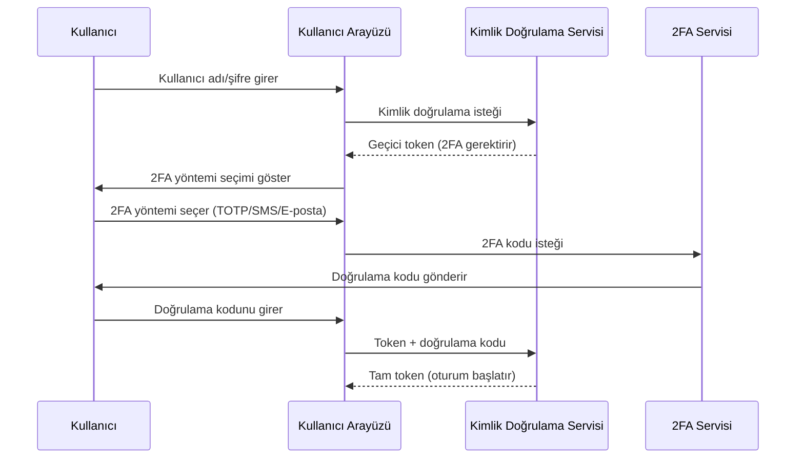
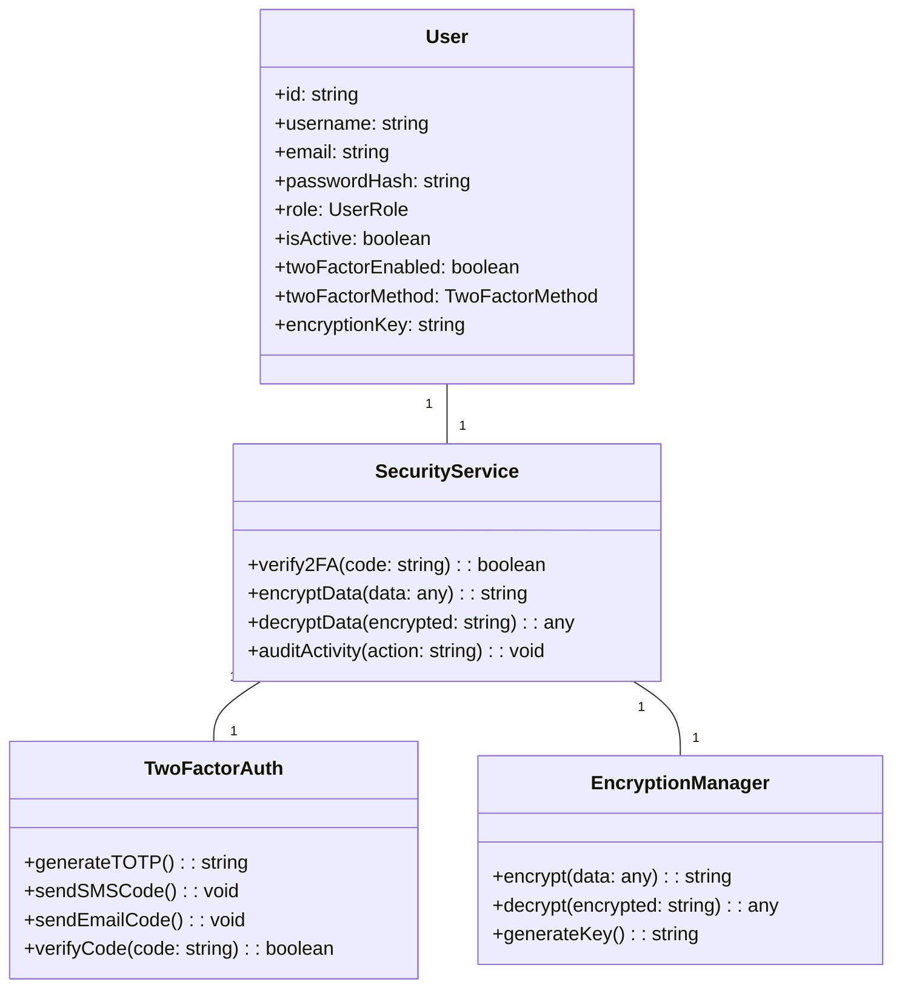
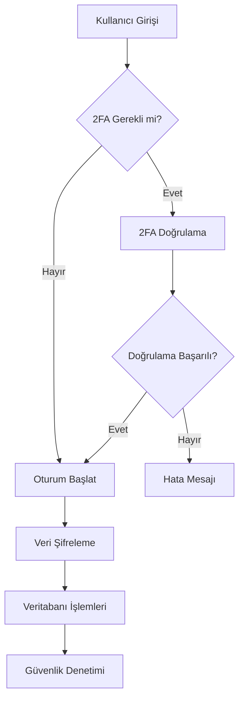

# POS Uygulaması Gelişmiş Güvenlik Mimarisi

## 1. Giriş

Bu doküman, mevcut POS uygulamasına gelişmiş güvenlik özellikleri eklemek için gereken mimari değişiklikleri ve tasarım kararlarını detaylandırır. İki faktörlü kimlik doğrulama, veri şifreleme ve diğer güvenlik önlemlerinin entegrasyonunu içerir.

## 2. Mevcut Sistem Analizi

Mevcut uygulama yapısı:
- React ve TypeScript tabanlı
- JWT tabanlı kimlik doğrulama sistemi
- Rol tabanlı yetkilendirme (ADMIN, MANAGER, SALES, ACCOUNTING, REPORTING)
- Kullanıcı aktivite izleme mekanizması
- Context API kullanımı (`UserManagementContext`)

## 3. Güvenlik Gereksinimleri

### 3.1 İki Faktörlü Kimlik Doğrulama (2FA)

#### 3.1.1 2FA Yöntemleri
- **TOTP (Time-based One-Time Password)**: Google Authenticator/Microsoft Authenticator uyumlu
- **SMS Tabanlı 2FA**: Telefon numarası doğrulama
- **E-posta Tabanlı 2FA**: Doğrulama kodu gönderme

#### 3.1.2 2FA Akışı



#### 3.1.3 2FA Uygulama Detayları

```typescript
// client/src/contexts/TwoFactorAuthContext.tsx
interface TwoFactorAuthContextType {
  is2FARequired: boolean;
  availableMethods: TwoFactorMethod[];
  setup2FA: (method: TwoFactorMethod) => Promise<boolean>;
  verify2FA: (method: TwoFactorMethod, code: string) => Promise<boolean>;
  disable2FA: () => Promise<boolean>;
}

type TwoFactorMethod = 'TOTP' | 'SMS' | 'EMAIL';

const TwoFactorAuthContext = createContext<TwoFactorAuthContextType | undefined>(undefined);
```

### 3.2 Veri Şifreleme

#### 3.2.1 Şifreleme Stratejisi
- **Uçuşta Şifreleme**: TLS 1.3 ile HTTPS
- **Dinlenme Halinde Şifreleme**: AES-256-CBC için yerel veritabanı
- **Uçtan Uca Şifreleme**: Hassas müşteri verileri için

#### 3.2.2 Şifreleme Uygulaması

```typescript
// client/src/services/EncryptionService.ts
interface EncryptionService {
  encryptData: (data: any, key: string) => Promise<string>;
  decryptData: (encryptedData: string, key: string) => Promise<any>;
  generateKey: () => Promise<string>;
  hashPassword: (password: string) => Promise<string>;
  verifyPassword: (password: string, hash: string) => Promise<boolean>;
}

class AESEncryptionService implements EncryptionService {
  private readonly algorithm = 'aes-256-cbc';
  private readonly keyLength = 32;
  private readonly ivLength = 16;

  async encryptData(data: any, key: string): Promise<string> {
    const iv = crypto.randomBytes(this.ivLength);
    const cipher = crypto.createCipheriv(this.algorithm, Buffer.from(key, 'hex'), iv);
    let encrypted = cipher.update(JSON.stringify(data), 'utf8', 'hex');
    encrypted += cipher.final('hex');
    return `${iv.toString('hex')}:${encrypted}`;
  }

  async decryptData(encryptedData: string, key: string): Promise<any> {
    const [ivHex, encrypted] = encryptedData.split(':');
    const iv = Buffer.from(ivHex, 'hex');
    const decipher = crypto.createDecipheriv(this.algorithm, Buffer.from(key, 'hex'), iv);
    let decrypted = decipher.update(encrypted, 'hex', 'utf8');
    decrypted += decipher.final('utf8');
    return JSON.parse(decrypted);
  }
}
```

### 3.3 Diğer Güvenlik Önlemleri

#### 3.3.1 Oturum Yönetimi
- **Oturum Süresi Sınırlama**: 30 dakika aktivite olmazsa oturum sonlandırma
- **Çoklu Oturum Kontrolü**: Aynı anda sadece bir aktif oturum
- **Oturum Aktivite İzleme**: Şüpheli aktivite tespiti

#### 3.3.2 Güvenlik Duvarı Kuralları
- **IP Tabanlı Kısıtlama**: Şüpheli IP'leri engelleme
- **Hız Sınırlama**: Brute-force saldırılarına karşı koruma
- **CORS Politikaları**: Güvenli kaynaklara erişim sınırlama

#### 3.3.3 Güvenlik Denetimleri
- **Düzenli Güvenlik Denetimleri**: Aylık penetrasyon testleri
- **Kod İnceleme**: Statik kod analizi araçları
- **Zafiyet Tarama**: Otomatik güvenlik zafiyeti tarama

## 4. Mimari Tasarım

### 4.1 Genel Sistem Mimarisi



### 4.2 Bileşenler ve Sorumluluklar

| Bileşen | Sorumluluk |
|---------|------------|
| `TwoFactorAuthContext` | 2FA işlemlerini yönetir |
| `EncryptionService` | Veri şifreleme/şifre çözme işlemleri |
| `SecurityAuditService` | Güvenlik denetimleri ve aktivite izleme |
| `SessionManager` | Oturum yönetimi ve güvenliği |
| `FirewallService` | Ağ güvenliği ve saldırı koruması |

### 4.3 Veri Akışı



## 5. Uygulama Adımları

### 5.1 İki Faktörlü Kimlik Doğrulama Entegrasyonu

1. **2FA Context Oluşturma**
   - Yeni `TwoFactorAuthContext.tsx` dosyası
   - 2FA yöntemleri yönetimi

2. **Backend API Entegrasyonu**
   - 2FA doğrulama endpoint'leri
   - Doğrulama kodları oluşturma ve doğrulama

3. **Kullanıcı Arayüzü Güncellemeleri**
   - 2FA kurulum sayfası
   - Doğrulama kodu giriş bileşenleri

### 5.2 Veri Şifreleme Uygulaması

1. **Şifreleme Servisi Oluşturma**
   - `EncryptionService` implementasyonu
   - Anahtar yönetimi sistemi

2. **Veritabanı Şifreleme**
   - Hassas alanları şifreleme
   - Şifre çözme işlemleri için API endpoint'leri

3. **Uçuşta Şifreleme**
   - TLS 1.3 konfigurasyonu
   - Güvenli bağlantı doğrulama

### 5.3 Güvenlik Önlemleri Entegrasyonu

1. **Oturum Yönetimi**
   - Oturum süresi sınırlama
   - Aktivite izleme sistemi

2. **Güvenlik Duvarı Kuralları**
   - IP tabanlı kısıtlama
   - Hız sınırlama mekanizması

3. **Düzenli Denetimler**
   - Otomatik zafiyet tarama
   - Güvenlik denetim raporlama

## 6. Teknik Detaylar

### 6.1 2FA Uygulama Örneği

```typescript
// 2FA kurulum işlemi
const setupTwoFactorAuth = async (method: TwoFactorMethod): Promise<boolean> => {
  try {
    const response = await api.post('/auth/setup-2fa', { method });
    if (response.data.success) {
      // Kullanıcıya QR kodu göster (TOTP için) veya doğrulama kodu gönder (SMS/E-posta)
      return true;
    }
    return false;
  } catch (error) {
    console.error('2FA setup failed:', error);
    return false;
  }
};

// 2FA doğrulama işlemi
const verifyTwoFactorCode = async (method: TwoFactorMethod, code: string): Promise<boolean> => {
  try {
    const response = await api.post('/auth/verify-2fa', { method, code });
    return response.data.success;
  } catch (error) {
    console.error('2FA verification failed:', error);
    return false;
  }
};
```

### 6.2 Şifreleme Uygulama Örneği

```typescript
// Veri şifreleme işlemi
const encryptSensitiveData = async (data: any): Promise<string> => {
  const encryptionKey = await encryptionService.generateKey();
  const encryptedData = await encryptionService.encryptData(data, encryptionKey);
  // Şifrelenmiş veriyi ve anahtarı güvenli bir şekilde sakla
  return encryptedData;
};

// Veri şifre çözme işlemi
const decryptSensitiveData = async (encryptedData: string): Promise<any> => {
  // Anahtarı güvenli bir şekilde al
  const encryptionKey = await getEncryptionKey();
  return await encryptionService.decryptData(encryptedData, encryptionKey);
};
```

### 6.3 Güvenlik Denetimi Örneği

```typescript
// Aktivite izleme işlemi
const logSecurityActivity = async (action: string, details: any): Promise<void> => {
  await auditService.logActivity({
    userId: currentUser.id,
    action,
    entityType: 'SECURITY',
    details: {
      ...details,
      ipAddress: getClientIP(),
      timestamp: new Date().toISOString()
    }
  });
};
```

## 7. Test ve Doğrulama

1. **2FA Testleri**
   - TOTP, SMS ve e-posta yöntemleri doğrulama
   - Yanlış kod girişleri ve hata yönetimi

2. **Şifreleme Testleri**
   - Veri şifreleme/şifre çözme doğruluğu
   - Performans testleri (şifreleme süresi)

3. **Güvenlik Testleri**
   - Penetrasyon testleri
   - Oturum yönetimi doğrulama
   - Güvenlik duvarı kuralları testleri

## 8. Gelecek Geliştirmeler

1. **Biyometrik Kimlik Doğrulama**
   - Parmak izi ve yüz tanıma entegrasyonu
   - Çok faktörlü biyometrik doğrulama

2. **Gelişmiş Tehdit Tespiti**
   - Anomali tespit sistemi
   - Makine öğrenimi tabanlı saldırı tespiti

3. **Blokzincir Tabanlı Denetim**
   - Değiştirilemez aktivite kayıtları
   - Dağıtık denetim sistemi