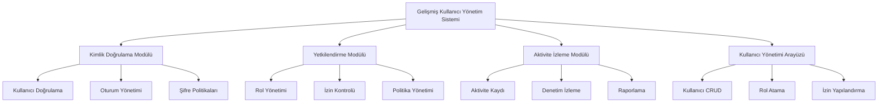
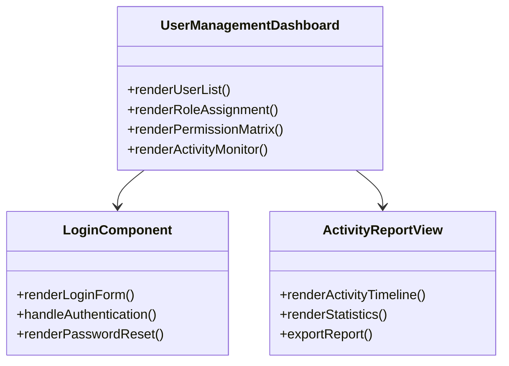
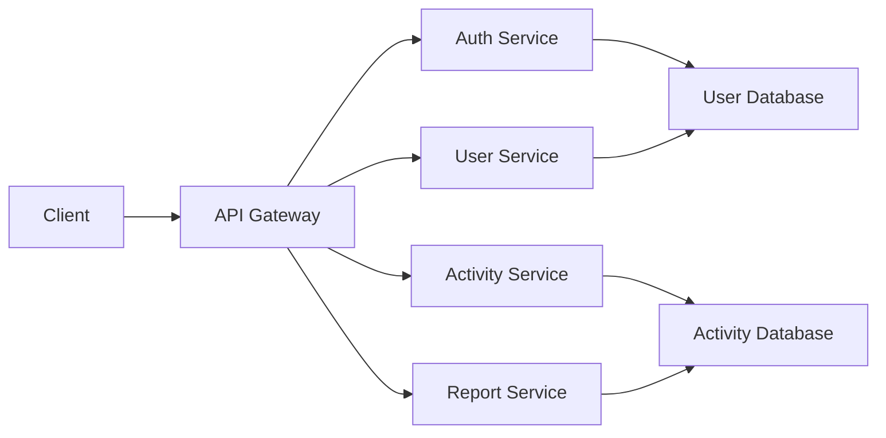

# Gelişmiş Kullanıcı Yönetim Sistemi - Kapsamlı Mimari Tasarım

## 1. Doküman Hakkında

Bu doküman, POS uygulaması için gelişmiş kullanıcı yönetim sisteminin kapsamlı mimari tasarımını sunar. Kullanıcı yönetimi, izin sistemi ve aktivite izleme bileşenlerini birleştirerek uygulamanın güvenlik, denetim ve yönetim yeteneklerini önemli ölçüde artırmayı hedefler.

## 2. Sistem Genel Bakış



## 3. Temel Bileşenler

### 3.1 Kimlik Doğrulama Modülü

```typescript
interface AuthenticationModule {
  login: (credentials: { username: string; password: string }) => Promise<AuthResult>;
  logout: () => Promise<void>;
  refreshToken: () => Promise<AuthResult>;
  changePassword: (currentPassword: string, newPassword: string) => Promise<boolean>;
  resetPassword: (username: string) => Promise<PasswordResetToken>;
  validateToken: (token: string) => Promise<boolean>;
}

interface AuthResult {
  success: boolean;
  user?: User;
  token?: string;
  error?: string;
}
```

### 3.2 Yetkilendirme Modülü

```typescript
interface AuthorizationModule {
  checkPermission: (userId: string, permission: Permission) => Promise<boolean>;
  getUserPermissions: (userId: string) => Promise<Permission[]>;
  assignRole: (userId: string, role: UserRole) => Promise<boolean>;
  createCustomRole: (roleData: CustomRoleData) => Promise<UserRole>;
  updateRolePermissions: (roleId: string, permissions: Permission[]) => Promise<boolean>;
}

interface CustomRoleData {
  name: string;
  description: string;
  baseRole?: UserRole;
  additionalPermissions: Permission[];
  restrictions?: Permission[];
}
```

### 3.3 Aktivite İzleme Modülü

```typescript
interface ActivityTrackingModule {
  logActivity: (activity: ActivityLog) => Promise<ActivityLog>;
  getActivityStream: (filters?: ActivityFilter) => Observable<ActivityLog>;
  generateReport: (reportType: ReportType, filters?: ActivityFilter) => Promise<Report>;
  setupAlerts: (alertConfig: AlertConfiguration) => Promise<boolean>;
  exportActivities: (format: ExportFormat, filters?: ActivityFilter) => Promise<Blob>;
}

enum ReportType {
  DAILY_SUMMARY = 'DAILY_SUMMARY',
  USER_ACTIVITY = 'USER_ACTIVITY',
  SECURITY_EVENTS = 'SECURITY_EVENTS',
  SYSTEM_USAGE = 'SYSTEM_USAGE'
}
```

## 4. Veri Modelleri

### 4.1 Kullanıcı Veri Modeli

```typescript
interface User {
  id: string;
  username: string;
  email: string;
  passwordHash: string;
  salt: string;
  role: UserRole | string; // Built-in role or custom role ID
  status: UserStatus;
  lastLogin?: Date;
  failedLoginAttempts: number;
  accountLockedUntil?: Date;
  createdAt: Date;
  updatedAt: Date;
  metadata?: {
    fullName?: string;
    phone?: string;
    department?: string;
  };
}

enum UserStatus {
  ACTIVE = 'ACTIVE',
  INACTIVE = 'INACTIVE',
  SUSPENDED = 'SUSPENDED',
  LOCKED = 'LOCKED'
}
```

### 4.2 Rol ve İzin Yapısı

```typescript
interface Role {
  id: string;
  name: string;
  description: string;
  isSystemRole: boolean;
  permissions: Permission[];
  inheritance?: string[]; // Parent roles
  constraints?: RoleConstraint[];
}

interface RoleConstraint {
  maxUsers?: number;
  expirationDate?: Date;
  ipRestrictions?: string[];
  timeRestrictions?: TimeRange[];
}

interface TimeRange {
  start: string; // HH:mm
  end: string;   // HH:mm
  days: number[]; // 0-6 (Sunday-Saturday)
}
```

## 5. Güvenlik Mimarisi

### 5.1 Şifre Politikaları

```typescript
interface PasswordPolicy {
  minLength: number;
  requireUppercase: boolean;
  requireLowercase: boolean;
  requireNumbers: boolean;
  requireSpecialChars: boolean;
  maxAgeDays: number;
  historySize: number; // Prevent reuse of last N passwords
  lockoutThreshold: number;
  lockoutDurationMinutes: number;
}
```

### 5.2 Oturum Yönetimi

```typescript
interface SessionManagement {
  maxSessionDuration: number; // minutes
  idleTimeout: number; // minutes
  maxConcurrentSessions: number;
  requireReauthenticationFor: Permission[];
  sessionStorage: 'localStorage' | 'sessionStorage' | 'secureCookie';
}
```

## 6. Uygulama Katmanları

### 6.1 Sunum Katmanı



### 6.2 İş Mantığı Katmanı

```typescript
class UserManagementService {
  private userRepository: UserRepository;
  private roleRepository: RoleRepository;
  private activityLogger: ActivityLogger;

  constructor(
    userRepository: UserRepository,
    roleRepository: RoleRepository,
    activityLogger: ActivityLogger
  ) {
    this.userRepository = userRepository;
    this.roleRepository = roleRepository;
    this.activityLogger = activityLogger;
  }

  async createUser(userData: CreateUserDto): Promise<User> {
    // Validate input
    // Check for duplicates
    // Hash password
    // Create user
    // Log activity
    // Return result
  }

  async authenticate(username: string, password: string): Promise<AuthResult> {
    // Find user
    // Verify password
    // Check account status
    // Update last login
    // Log activity
    // Return auth result
  }
}
```

## 7. Veri Erişim Katmanı

### 7.1 Veritabanı Şeması

```typescript
interface DatabaseSchema {
  users: UserTable;
  roles: RoleTable;
  permissions: PermissionTable;
  user_roles: UserRoleMapping;
  role_permissions: RolePermissionMapping;
  activity_logs: ActivityLogTable;
  sessions: SessionTable;
}

interface UserTable {
  id: PrimaryKey;
  username: UniqueString;
  email: UniqueString;
  password_hash: String;
  salt: String;
  role_id: ForeignKey;
  status: Enum;
  // ... other fields
}

interface ActivityLogTable {
  id: PrimaryKey;
  user_id: ForeignKey;
  action: Enum;
  entity_type: Enum;
  entity_id: String;
  timestamp: DateTime;
  ip_address: String;
  user_agent: String;
  details: JSON;
}
```

### 7.2 Veri Erişim Sınıfları

```typescript
abstract class BaseRepository<T> {
  abstract findById(id: string): Promise<T | null>;
  abstract findAll(): Promise<T[]>;
  abstract create(entity: Omit<T, 'id'>): Promise<T>;
  abstract update(id: string, updates: Partial<T>): Promise<T>;
  abstract delete(id: string): Promise<boolean>;
}

class UserRepository extends BaseRepository<User> {
  async findByUsername(username: string): Promise<User | null> {
    // Implementation
  }

  async findByEmail(email: string): Promise<User | null> {
    // Implementation
  }

  async updateLastLogin(userId: string): Promise<void> {
    // Implementation
  }
}
```

## 8. Entegrasyon Stratejisi

### 8.1 Mevcut Uygulama ile Entegrasyon

```typescript
// Main App Integration
const AppWithUserManagement: React.FC = () => {
  return (
    <UserManagementProvider>
      <ActivityTrackingProvider>
        <PermissionProvider>
          <Router>
            <AppRoutes />
          </Router>
        </PermissionProvider>
      </ActivityTrackingProvider>
    </UserManagementProvider>
  );
};
```

### 8.2 Mevcut Bileşenlerin Güncellenmesi

```typescript
// Updated POSHeader with permission checks
const EnhancedPOSHeader: React.FC = () => {
  const { hasPermission } = usePermission();
  const { trackAction } = useActivityTracking();

  const handleAction = async (action: string, permission: Permission) => {
    if (hasPermission(permission)) {
      await trackAction({
        action: action as ActivityAction,
        entityType: EntityType.SYSTEM,
        details: { source: 'POSHeader' }
      });
      // Execute action
    } else {
      await trackAction({
        action: ActivityAction.ACCESS_DENIED,
        entityType: EntityType.SYSTEM,
        details: { attemptedAction: action }
      });
    }
  };

  return (
    <header>
      {hasPermission(Permission.SALES_TRANSACTIONS) && (
        <button onClick={() => handleAction('NEW_SALE', Permission.SALES_TRANSACTIONS)}>
          Yeni Satış
        </button>
      )}
      {/* Other buttons with similar permission checks */}
    </header>
  );
};
```

## 9. Performans Optimizasyonu

### 9.1 Önbellekleme Stratejileri

```typescript
class CachedUserService {
  private cache: Map<string, User>;
  private ttl: number; // Time to live in milliseconds

  constructor(ttl: number = 300000) { // Default 5 minutes
    this.cache = new Map();
    this.ttl = ttl;
  }

  async getUser(userId: string): Promise<User | null> {
    const cached = this.cache.get(userId);
    if (cached && (Date.now() - cached.timestamp < this.ttl)) {
      return cached.data;
    }

    const user = await this.userRepository.findById(userId);
    if (user) {
      this.cache.set(userId, { data: user, timestamp: Date.now() });
    }
    return user;
  }

  invalidateCache(userId: string): void {
    this.cache.delete(userId);
  }
}
```

### 9.2 Toplu İşlemler

```typescript
class BatchOperationService {
  async batchCreateUsers(users: CreateUserDto[]): Promise<BatchResult> {
    const results: BatchResult = { success: 0, failed: 0, errors: [] };

    const transaction = await this.db.beginTransaction();

    try {
      for (const user of users) {
        try {
          await this.userRepository.create(user);
          results.success++;
        } catch (error) {
          results.failed++;
          results.errors.push({ user, error: error.message });
        }
      }

      await transaction.commit();
    } catch (error) {
      await transaction.rollback();
      throw error;
    }

    return results;
  }
}
```

## 10. Test ve Doğrulama

### 10.1 Test Senaryoları

1. **Kimlik Doğrulama Testleri**
   - Başarılı oturum açma
   - Başarısız oturum açma (yanlış kimlik bilgileri)
   - Hesap kilitleme (çoklu başarısız girişimler)
   - Şifre sıfırlama akışı

2. **Yetkilendirme Testleri**
   - Rol tabanlı erişim kontrolü
   - İzin mirası (parent rol izinleri)
   - Zaman tabanlı kısıtlamalar
   - IP tabanlı kısıtlamalar

3. **Aktivite İzleme Testleri**
   - Aktivite kaydı doğruluğu
   - Toplu aktivite işleme
   - Veri ihracatı formatları
   - Performans testleri

### 10.2 Performans Metrikleri

| Metrik | Hedef Değer |
|--------|-------------|
| Oturum açma süresi | < 500ms |
| İzin kontrolü süresi | < 100ms |
| Aktivite kaydı süresi | < 200ms |
| 1000 aktivite ihracatı | < 2s |
| Eşzamanlı kullanıcı sayısı | 100+ |

## 11. Dağıtım ve Ölçeklenebilirlik

### 11.1 Mikro Servis Mimarisi



### 11.2 Ölçeklenebilirlik Stratejileri

- **Yatay Ölçekleme**: Her servis bağımsız olarak ölçeklenebilir
- **Veri Bölümlendirme**: Kullanıcı verileri bölümlere ayrılır
- **Önbellekleme**: Sık erişilen veriler önbelleğe alınır
- **Asenkron İşleme**: Aktivite izleme ve raporlama asenkron çalışır

## 12. Gelecek Geliştirmeler

1. **Gelişmiş Güvenlik Özellikleri**
   - İki faktörlü kimlik doğrulama
   - Biyometrik doğrulama
   - Risk tabanlı doğrulama

2. **Gelişmiş Raporlama**
   - Özel rapor oluşturucu
   - Gerçek zamanlı dashboard'lar
   - Makine öğrenimi tabanlı anomali tespiti

3. **Entegrasyonlar**
   - LDAP/Active Directory entegrasyonu
   - SSO (Single Sign-On) desteği
   - Dış denetim sistemleri ile entegrasyon

4. **Kullanıcı Deneyimi Geliştirmeleri**
   - Kullanıcı davranış analizi
   - Kişiselleştirilmiş arayüzler
   - Adaptif izin sistemleri

## 13. Uygulama Planı

| Aşama | Süre | Bağımlılıklar |
|-------|------|---------------|
| 1. Temel altyapı | 2 hafta | - |
| 2. Kimlik doğrulama | 1 hafta | Temel altyapı |
| 3. Yetkilendirme | 2 hafta | Kimlik doğrulama |
| 4. Aktivite izleme | 1 hafta | Yetkilendirme |
| 5. Kullanıcı arayüzü | 2 hafta | Tüm bileşenler |
| 6. Test ve doğrulama | 1 hafta | Tüm bileşenler |
| 7. Dağıtım | 3 gün | Test tamamlandı |

## 14. Risk Yönetimi

| Risk | Olasılık | Etki | Azaltma Stratejisi |
|------|----------|------|-------------------|
| Veri ihlali | Düşük | Yüksek | Şifreleme, erişim kontrolü |
| Performans sorunları | Orta | Orta | Önbellekleme, optimizasyon |
| Kullanıcı kabulü | Yüksek | Orta | Kullanıcı eğitimi, pilot test |
| Entegrasyon sorunları | Orta | Yüksek | Kapsamlı test, geri dönüş planı |

## 15. Sonuç

Bu kapsamlı mimari tasarım, POS uygulamasına gelişmiş kullanıcı yönetimi özelliği eklemek için gereken tüm bileşenleri ve entegrasyon noktalarını detaylandırır. Sistem, güvenlik, performans ve kullanıcı deneyimini dengelerken, uygulamanın mevcut yapısıyla sorunsuz entegrasyon sağlar.