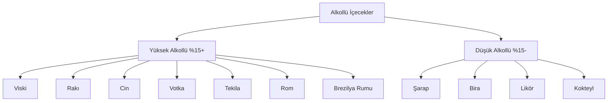

# Alkollü İçecekler Sınıflandırma Sistemi

## 1. Genel Yapı



## 2. Yüksek Alkollü İçecekler (%15 ve üzeri)

### 2.1 Viski
- **Tanım**: Arpa, mısır, çavdar veya buğdaydan damıtılan ve meşe fıçılarda olgunlaştırılan alkollü içki
- **Alkol Oranı**: %40-%60
- **Markalar**:
  - Johnnie Walker (Red Label, Black Label, Blue Label)
  - Chivas Regal (12 Year, 18 Year)
  - Jack Daniel's (Old No. 7, Gentleman Jack)
  - Jim Beam (White Label, Black Label)
  - Macallan (Sherry Oak, Double Cask)

### 2.2 Rakı
- **Tanım**: Üzümden damıtılan ve anason ile tatlandırılan geleneksel Türk içkisi
- **Alkol Oranı**: %40-%50
- **Markalar**:
  - Yeni Raki (Classic, Altın)
  - Tekirdağ Rakısı (Kulüp, Altın)
  - Efe Rakı (Beyaz, Siyah)
  - Mercan Rakı
  - Burgaz Rakı

### 2.3 Cin
- **Tanım**: Arpadan damıtılan ve ardıç meyvesi ile tatlandırılan içki
- **Alkol Oranı**: %37.5-%50
- **Markalar**:
  - Gordon's (London Dry, Pink)
  - Beefeater (London Dry, 24)
  - Tanqueray (No. TEN, Rangpur)
  - Bombay Sapphire
  - Hendrick's (Orbium, Negroni)

### 2.4 Votka
- **Tanım**: Tahıl veya patatesten damıtılan nötr alkollü içki
- **Alkol Oranı**: %35-%50
- **Markalar**:
  - Absolut (Vodka, Elyx, Citron)
  - Smirnoff (No. 21, Red, Blue)
  - Grey Goose
  - Belvedere
  - Cîroc (Mango, Pineapple, Red Berry)

### 2.5 Tekila
- **Tanım**: Mavi agav bitkisinden üretilen Meksika içkisi
- **Alkol Oranı**: %38-%55
- **Markalar**:
  - Jose Cuervo (Especial, Tradicional)
  - Patrón (Silver, Reposado, Añejo)
  - Don Julio (1942, Blanco, Reposado)
  - Herradura (Blanco, Reposado)
  - Sauza (Hornitos, Tres Generaciones)

### 2.6 Rom
- **Tanım**: Şeker kamışından üretilen ve genellikle Karayipler'de damıtılan içki
- **Alkol Oranı**: %40-%75
- **Markalar**:
  - Bacardi (Superior, Gold, 8 Años)
  - Captain Morgan (Original, Spiced, Dark)
  - Havana Club (3 Años, 7 Años, Añejo)
  - Malibu (Coconut, Pineapple, Mango)
  - Appleton Estate (Signature, Reserve)

### 2.7 Brezilya Rumu
- **Tanım**: Brezilya'ya özgü şeker kamışından üretilen ve genellikle kaşar ağacı ile tatlandırılan içki
- **Alkol Oranı**: %38-%54
- **Markalar**:
  - Cachaça 51
  - Pitu
  - Velho Barreiro (Ouro, Prata)
  - Caninha 51
  - Germana

## 3. Düşük Alkollü İçecekler (%15 altı)

### 3.1 Şarap
- **Kırmızı Şarap**:
  - Doluca (Öküzgözü, Kalecik Karası)
  - Kavaklıdere (Prestige, Yakut)
  - Sevil (Cabernet Sauvignon, Merlot)
  - Pamukkale (Shiraz, Pinot Noir)
  - Corvus (Boğazkere, Öküzgözü)

- **Beyaz Şarap**:
  - Kavaklıdere (Narince, Emir)
  - Doluca (Sauvignon Blanc, Chardonnay)
  - Sevil (Chardonnay, Sauvignon Blanc)
  - Pamukkale (Riesling, Viognier)
  - Corvus (Sémillon, Muscat)

- **Rose Şarap**:
  - Kavaklıdere (Rose d'Anatolie)
  - Doluca (Rose)
  - Sevil (Rose)
  - Pamukkale (Rose)
  - Corvus (Rose)

### 3.2 Bira
- **Lager**:
  - Efes (Pilsen, Malt)
  - Tuborg (Gold, Red)
  - Miller (Genuine Draft, Lite)
  - Heineken
  - Corona

- **Ale**:
  - Guinness (Draught, Foreign Extra)
  - Newcastle Brown Ale
  - Sierra Nevada Pale Ale
  - Fullers London Pride
  - Bass Pale Ale

- **Stout**:
  - Guinness (Foreign Extra Stout)
  - Murphy's Irish Stout
  - Beamish Stout
  - Samuel Smith's Oatmeal Stout
  - Young's Double Chocolate Stout

- **IPA (India Pale Ale)**:
  - Efes (IPA)
  - Tuborg (IPA)
  - BrewDog (Punk IPA)
  - Sierra Nevada (Torpedo IPA)
  - Stone IPA

- **Pilsner**:
  - Efes (Pilsen)
  - Tuborg (Pilsner)
  - Pilsner Urquell
  - Heineken (Pilsner)
  - Warsteiner

- **Porter**:
  - Guinness (Porter)
  - Fuller's London Porter
  - Anchor Porter
  - Samuel Smith's Taddy Porter
  - Meantime London Porter

- **Lambic**:
  - Lindemans (Framboise, Pêche)
  - Boon (Oude Geuze, Kriek)
  - Cantillon (Gueuze, Rosé de Gambrinus)
  - Mort Subite (Oude Gueuze, Kriek)
  - 3 Fonteinen (Oude Geuze, Schaerbeekse Kriek)

- **Sour**:
  - Rodenbach (Classic, Grand Cru)
  - Duchesse de Bourgogne
  - Liefmans (Goudenband, Fruesse)
  - Boon (Oude Kriek)
  - Lindemans (Cuvée René)

- **Wheat (Buğday Birası)**:
  - Hoegaarden
  - Blue Moon
  - Paulaner (Hefe-Weißbier)
  - Weihenstephaner (Hefeweissbier)
  - Schneider Weisse

- **Pale Ale**:
  - Sierra Nevada Pale Ale
  - Bass Pale Ale
  - Fuller's London Pride
  - Young's Special
  - Adnams Broadside

### 3.3 Likör
- **Krema Likörleri**:
  - Baileys (Irish Cream)
  - Carolans (Irish Cream)
  - Amarula (Cream Liqueur)
  - Dooley's (Toffee Cream)
  - Sheridan's (Coffee & Cream)

- **Meyve Likörleri**:
  - Cointreau (Orange)
  - Grand Marnier (Orange)
  - Chambord (Raspberry)
  - Midori (Melon)
  - Peach Schnapps

- **Baharat Likörleri**:
  - Jägermester (Herbal)
  - Underberg (Herbal)
  - Chartreuse (Green, Yellow)
  - Benedictine
  - Galliano

- **Ot Likörleri**:
  - Absinthe (Pernod, Ricard)
  - Sambuca (Black, White)
  - Ouzo
  - Pastis
  - Raki (Anise-flavored)

- **Fındık Likörleri**:
  - Frangelico (Hazelnut)
  - Amaretto (Almond)
  - Nocello (Walnut)
  - Crème de Noyaux
  - Crème de Cacao

- **Kahve Likörleri**:
  - Kahlúa
  - Tia Maria
  - Sheridan's (Coffee & Cream)
  - Mr. Black (Cold Brew)
  - Patrón XO Café

- **Çikolata Likörleri**:
  - Crème de Cacao (Brown, White)
  - Godiva (Chocolate)
  - Mozart (Dark Chocolate)
  - Sheridan's (Chocolate & Cream)
  - Dooley's (Chocolate Cream)

- **Vanilya Likörleri**:
  - Vanilla Vodka (Absolut Vanilia)
  - Vanilla Rum (Malibu Vanilla)
  - Vanilla Schnapps
  - Vanilla Cream (Baileys Vanilla)
  - Vanilla Liqueur (Marie Brizard)

### 3.4 Kokteyl
- **Klasik Kokteyller**:
  - Martini (Gin/Vodka)
  - Manhattan (Whiskey)
  - Old Fashioned (Bourbon)
  - Negroni (Gin)
  - Daiquiri (Rum)

- **Modern Kokteyller**:
  - Cosmopolitan (Vodka)
  - Mojito (Rum)
  - Espresso Martini (Vodka)
  - Aperol Spritz (Prosecco)
  - Pornstar Martini (Vodka)

- **Tropikal Kokteyller**:
  - Piña Colada (Rum)
  - Mai Tai (Rum)
  - Blue Hawaii (Rum)
  - Zombie (Rum)
  - Hurricane (Rum)

- **Meyveli Kokteyller**:
  - Strawberry Daiquiri (Rum)
  - Raspberry Collins (Gin)
  - Peach Margarita (Tequila)
  - Watermelon Martini (Vodka)
  - Mango Mojito (Rum)

- **Kremsi Kokteyller**:
  - White Russian (Vodka)
  - Mudslide (Vodka)
  - Brandy Alexander (Brandy)
  - Grasshopper (Creme de Menthe)
  - Pink Squirrel (Creme de Noyaux)

- **Baharatlı Kokteyller**:
  - Spicy Margarita (Tequila)
  - Ginger Mojito (Rum)
  - Cinnamon Toast Crunch (Rum)
  - Peppermint Patty (Vodka)
  - Chai White Russian (Vodka)

- **Gazlı Kokteyller**:
  - Gin Fizz (Gin)
  - Vodka Soda (Vodka)
  - Rum & Coke (Rum)
  - Whiskey Sour (Whiskey)
  - Tom Collins (Gin)

## 4. Marka Bazlı Detaylandırma Stratejisi

Her kategori için aşağıdaki yapı izlenmelidir:

```json
{
  "kategori_adi": {
    "alt_kategori": [
      {
        "marka": "Marka Adı",
        "urunler": [
          {
            "adi": "Ürün Adı",
            "alkol_orani": "%XX",
            "aciklama": "Ürün açıklaması",
            "menşei": "Üretim yeri"
          }
        ]
      }
    ]
  }
}
```

## 5. Uygulama Önerileri

1. **Veri Tabanı Tasarımı**:
   - Her kategori için ayrı tablolar oluşturulmalı
   - Marka ve ürün bilgileri ilişkisel olarak saklanmalı
   - Alkol oranı ve menşei bilgileri zorunlu alanlar olmalı

2. **Kullanıcı Arayüzü**:
   - Hiyerarşik kategori seçimi için ağaç yapısı kullanılması
   - Filtreleme için alkol oranı aralığı seçeneği eklenmeli
   - Marka bazlı arama özelliği geliştirilmeli

3. **Raporlama**:
   - Satış analizi için kategori bazlı raporlar oluşturulmalı
   - En çok satılan markalar için sıralama yapısı eklenmeli
   - Alkol oranı dağılımı için grafikler geliştirilmeli

## 6. Gelecek Geliştirmeler

- Uluslararası markaların yerel varyasyonlarının eklenmesi
- Craft bira ve boutique şarap kategorilerinin genişletilmesi
- Kokteyl tarifleri için interaktif hazırlama aracı
- Alkol oranı bazlı öneri sistemi