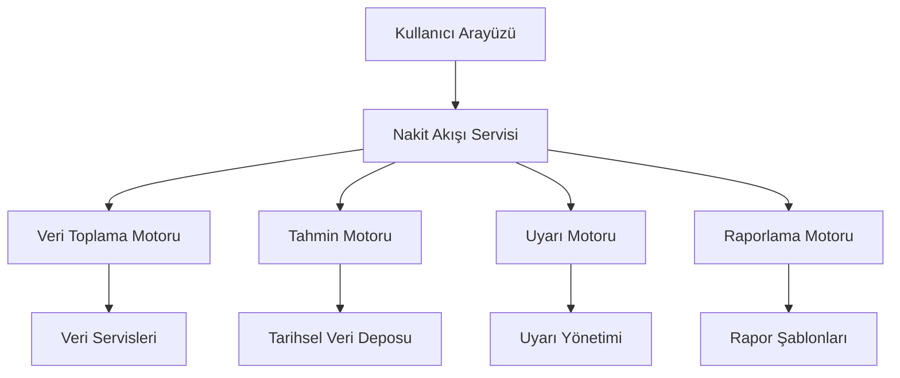
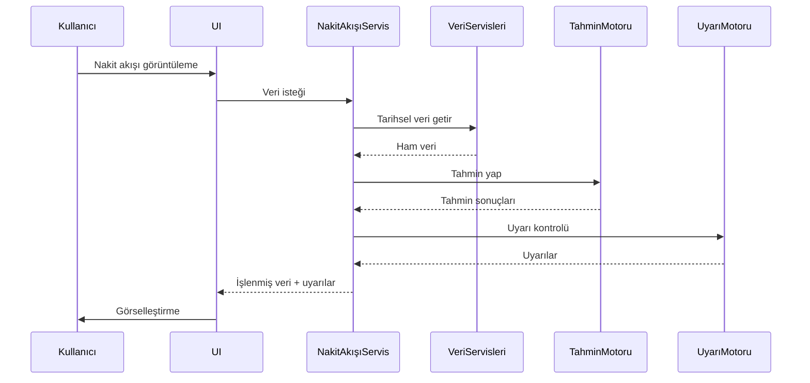
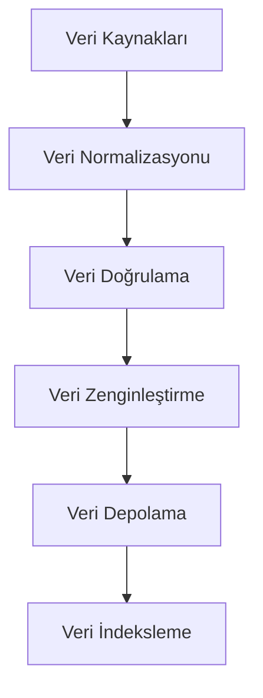
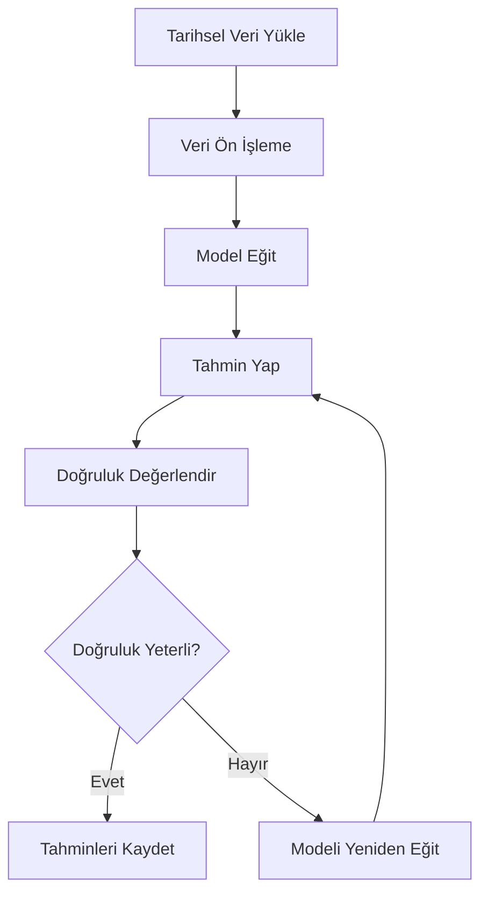
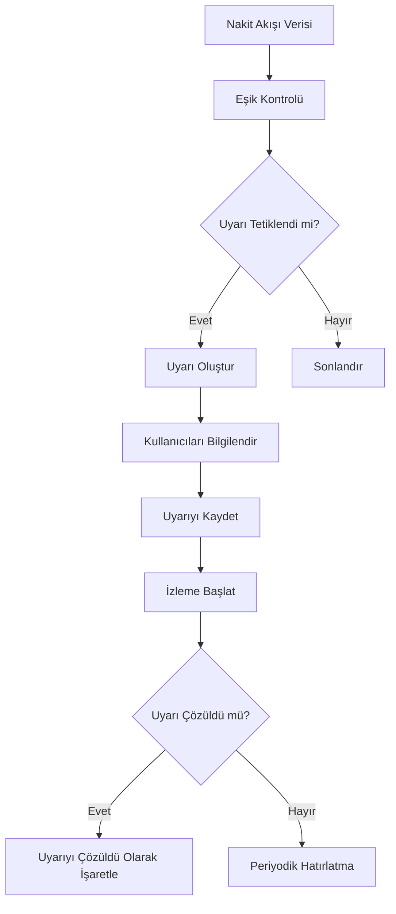
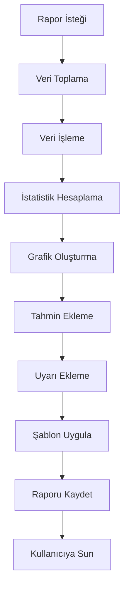

# POS Uygulaması Nakit Akışı İzleme Sistemi Mimari Tasarımı

## 1. Giriş

Bu doküman, POS uygulamasına entegre edilecek gelişmiş nakit akışı izleme sisteminin mimari tasarımını detaylandırır. Sistem, gerçek zamanlı nakit akışı izleme, tahmin, uyarı ve raporlama özelliklerini içermektedir.

## 2. Sistem Genel Bakışı

### 2.1 Sistem Bileşenleri



### 2.2 Veri Akışı



## 3. Veri Modeli

### 3.1 Nakit Akışı Veri Yapısı

```typescript
interface CashFlowData {
  id: string;
  registerId: string;
  date: Date;
  inflow: number; // Nakit girişleri
  outflow: number; // Nakit çıkışları
  netFlow: number; // Net akış
  balance: number; // Bakiye
  transactionCount: number; // İşlem sayısı
  metadata: {
    source: "SALES" | "DEPOSIT" | "WITHDRAWAL" | "TRANSFER";
    userId?: string;
    description?: string;
  };
}
```

### 3.2 Tahmin Veri Yapısı

```typescript
interface CashFlowPrediction {
  id: string;
  registerId: string;
  predictionDate: Date;
  period: "DAILY" | "WEEKLY" | "MONTHLY";
  predictedAmount: number;
  confidence: number; // 0-1 arası
  createdAt: Date;
  updatedAt: Date;
}
```

### 3.3 Uyarı Veri Yapısı

```typescript
interface CashFlowAlert {
  id: string;
  registerId: string;
  type: "LOW_CASH" | "HIGH_CASH" | "ANOMALY" | "TREND_CHANGE";
  message: string;
  severity: "INFO" | "WARNING" | "CRITICAL";
  threshold: number;
  currentValue: number;
  timestamp: Date;
  resolved: boolean;
  resolvedBy?: string;
  resolvedAt?: Date;
}
```

## 4. Veri Toplama Motoru

### 4.1 Veri Kaynakları

1. **Satış Verileri**
   - Nakit ve kart satışları
   - İade işlemleri
   - İndirimler

2. **Kasa İşlemleri**
   - Nakit giriş/çıkışlar
   - Veresiye tahsilatları
   - Kasa sayım farkları

3. **Sistem İşlemleri**
   - Kasa açma/kapatma
   - Oturum değişiklikleri
   - Kullanıcı aktiviteleri

### 4.2 Veri Toplama Süreci



## 5. Tahmin Motoru

### 5.1 Tahmin Algoritmaları

```typescript
interface PredictionEngine {
  trainModel(registerId: string, historicalData: CashFlowData[]): PredictionModel;
  predictCashFlow(model: PredictionModel, period: string): CashFlowPrediction;
  evaluateAccuracy(predictions: CashFlowPrediction[], actuals: CashFlowData[]): PredictionAccuracy;
  retrainModel(model: PredictionModel, newData: CashFlowData[]): PredictionModel;
}

interface PredictionModel {
  id: string;
  registerId: string;
  algorithm: "ARIMA" | "LSTM" | "PROPHET" | "LINEAR_REGRESSION";
  parameters: any;
  trainedAt: Date;
  accuracy: number;
}

interface PredictionAccuracy {
  registerId: string;
  period: string;
  accuracy: number; // 0-1 arası
  meanError: number;
  maxError: number;
}
```

### 5.2 Tahmin Süreci



## 6. Uyarı Motoru

### 6.1 Uyarı Türleri ve Eşikler

| Uyarı Türü | Açıklama | Eşik Değeri | Şiddet |
|------------|-----------|-------------|--------|
| LOW_CASH | Kasa bakiyesi düşük | < 10% ortalama günlük ihtiyaç | CRITICAL |
| HIGH_CASH | Kasa bakiyesi yüksek | > 200% ortalama günlük ihtiyaç | WARNING |
| ANOMALY | Beklenmeyen nakit akışı | Standart sapma > 2σ | WARNING |
| TREND_CHANGE | Akış trendinde değişiklik | > 15% sapma | INFO |

### 6.2 Uyarı Tetikleme Mantığı

```typescript
interface AlertTrigger {
  checkAlerts(registerId: string, currentData: CashFlowData): CashFlowAlert[];
  evaluateThresholds(data: CashFlowData, thresholds: AlertThresholds): AlertEvaluation[];
  createAlert(evaluation: AlertEvaluation): CashFlowAlert;
  notifyUsers(alert: CashFlowAlert): NotificationResult[];
}

interface AlertThresholds {
  lowCash: number;
  highCash: number;
  anomalyStdDev: number;
  trendChangePercentage: number;
}

interface AlertEvaluation {
  type: string;
  triggered: boolean;
  currentValue: number;
  thresholdValue: number;
  severity: string;
}
```

### 6.3 Uyarı Yönetim Süreci



## 7. Raporlama Motoru

### 7.1 Rapor Türleri

```typescript
enum CashFlowReportType {
  DAILY_SUMMARY = "GÜNLÜK_ÖZET",
  WEEKLY_TREND = "HAFTALIK_TREND",
  MONTHLY_ANALYSIS = "AYLIK_ANALİZ",
  PREDICTION_REPORT = "TAHMİN_RAPORU",
  ALERT_SUMMARY = "UYARI_ÖZETİ",
  COMPARATIVE_ANALYSIS = "KARŞILAŞTIRMALI_ANALİZ"
}
```

### 7.2 Rapor Yapısı

```typescript
interface CashFlowReport {
  id: string;
  type: CashFlowReportType;
  registerId: string;
  title: string;
  description: string;
  period: {
    startDate: Date;
    endDate: Date;
  };
  data: {
    cashFlowData: CashFlowData[];
    predictions?: CashFlowPrediction[];
    alerts?: CashFlowAlert[];
    statistics: {
      totalInflow: number;
      totalOutflow: number;
      netFlow: number;
      averageBalance: number;
      transactionCount: number;
    };
  };
  charts: {
    type: "line" | "bar" | "pie" | "table";
    title: string;
    data: any;
    options: any;
  }[];
  createdAt: Date;
  createdBy: string;
}
```

### 7.3 Rapor Oluşturma Süreci



## 8. Gerçek Zamanlı İzleme

### 8.1 WebSocket API

```typescript
interface CashFlowWebSocketAPI {
  // Nakit akışı güncellemesi
  event: "cash_flow_update";
  data: {
    registerId: string;
    timestamp: Date;
    inflow: number;
    outflow: number;
    balance: number;
  };

  // Tahmin güncellemesi
  event: "prediction_update";
  data: {
    registerId: string;
    period: string;
    predictedAmount: number;
    confidence: number;
  };

  // Uyarı bildirimi
  event: "alert_triggered";
  data: {
    alertId: string;
    registerId: string;
    type: string;
    message: string;
    severity: string;
  };
}
```

### 8.2 Gerçek Zamanlı Arayüz Bileşenleri

```typescript
interface RealTimeDashboardProps {
  registerId: string;
  onAlertClick: (alert: CashFlowAlert) => void;
  onPredictionClick: (prediction: CashFlowPrediction) => void;
}

const RealTimeDashboard: React.FC<RealTimeDashboardProps> = ({
  registerId,
  onAlertClick,
  onPredictionClick
}) => {
  const [cashFlowData, setCashFlowData] = useState<CashFlowData[]>([]);
  const [predictions, setPredictions] = useState<CashFlowPrediction[]>([]);
  const [alerts, setAlerts] = useState<CashFlowAlert[]>([]);
  const [isConnected, setIsConnected] = useState(false);

  // WebSocket bağlantısı
  useEffect(() => {
    const socket = new WebSocket(`wss://api.example.com/cashflow/${registerId}`);

    socket.onopen = () => {
      setIsConnected(true);
      console.log("Nakit akışı izleme bağlantısı kuruldu");
    };

    socket.onmessage = (event) => {
      const data = JSON.parse(event.data);
      handleWebSocketMessage(data);
    };

    socket.onclose = () => {
      setIsConnected(false);
      console.log("Nakit akışı izleme bağlantısı kapatıldı");
    };

    return () => {
      socket.close();
    };
  }, [registerId]);

  const handleWebSocketMessage = (data: any) => {
    switch (data.event) {
      case "cash_flow_update":
        setCashFlowData(prev => [...prev, data.data]);
        break;
      case "prediction_update":
        setPredictions(prev => [...prev, data.data]);
        break;
      case "alert_triggered":
        setAlerts(prev => [...prev, data.data]);
        break;
    }
  };

  return (
    <div className="cash-flow-dashboard">
      <ConnectionStatus isConnected={isConnected} />
      <CashFlowChart data={cashFlowData} />
      <PredictionPanel predictions={predictions} onClick={onPredictionClick} />
      <AlertPanel alerts={alerts} onClick={onAlertClick} />
    </div>
  );
};
```

## 9. Kullanıcı Arayüzü Entegrasyonu

### 9.1 Ana Bileşenler

1. **Nakit Akışı Paneli**
   - Gerçek zamanlı grafikler
   - Bakiye göstergesi
   - Hızlı istatistikler

2. **Tahmin Paneli**
   - Gelecek tahminleri
   - Güven aralıkları
   - Trend göstergeleri

3. **Uyarı Paneli**
   - Aktif uyarılar
   - Uyarı geçmişi
   - Çözümleme araçları

4. **Raporlama Paneli**
   - Rapor seçimi
   - Özelleştirme seçenekleri
   - İhraç kontrolleri

### 9.2 Entegrasyon Noktaları

- Ana dashboard'a nakit akışı sekmesi
- Kasa yönetim sayfasına entegrasyon
- Raporlama sistemine bağlantı
- Bildirim sistemine entegrasyon

## 10. Teknik Detaylar

### 10.1 Performans Optimizasyonu

- Veri akışı için WebSocket kullanımı
- İstemci tarafında veri önbelleğe alma
- Arka planda veri işleme
- Büyük veri setleri için sayfalama
- Gerçek zamanlı güncellemeler için optimizasyon

### 10.2 Veri Güvenliği

- Veri şifreleme
- Kullanıcı yetkilendirme
- Veri bütünlüğü kontrolü
- İletişim güvenliği (TLS)
- Veri yedekleme

## 11. Uygulama Adımları

1. **Veri Servisleri Geliştirme**
   - Nakit akışı veri servisleri
   - Tarihsel veri depolama

2. **Tahmin Motoru**
   - Tahmin algoritmaları
   - Model eğitimi
   - Doğruluk değerlendirme

3. **Uyarı Motoru**
   - Uyarı tetikleme mantığı
   - Bildirim sistemi
   - Uyarı yönetimi

4. **Raporlama Motoru**
   - Rapor şablonları
   - Grafik oluşturma
   - İstatistik hesaplama

5. **Gerçek Zamanlı İletişim**
   - WebSocket sunucusu
   - İstemci tarafı bağlantı
   - Veri senkronizasyonu

6. **Kullanıcı Arayüzü**
   - Dashboard bileşenleri
   - Görselleştirme araçları
   - Etkileşimli kontroller

7. **Test ve Doğrulama**
   - Birim testleri
   - Entegrasyon testleri
   - Performans testleri
   - Kullanıcı kabul testleri

## 12. Gelecek Geliştirmeler

1. Yapay zeka tabanlı anomali tespiti
2. Otomatik kasa dengeleme önerileri
3. Mobil uygulama entegrasyonu
4. Bulut tabanlı çoklu şube senkronizasyonu
5. Makine öğrenimi tabanlı tahmin iyileştirmeleri
6. Gerçek zamanlı veri analitiği
7. Gelişmiş görselleştirme seçenekleri
8. Sesli uyarı bildirimleri