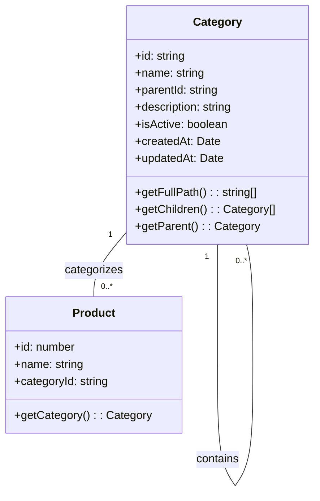
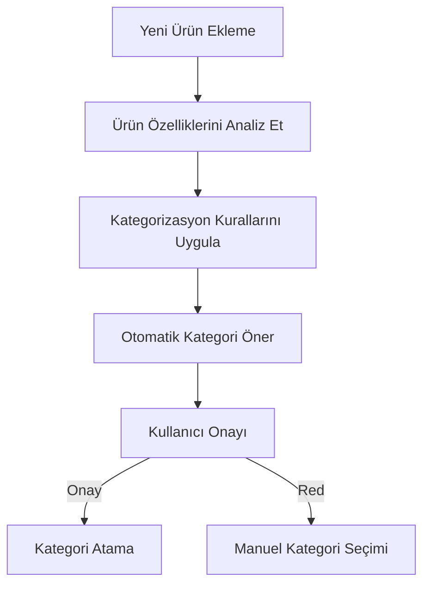
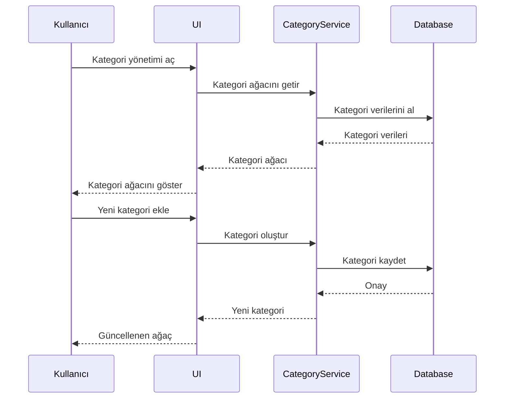

# POS Uygulaması Kategori Sistemi Analizi ve Tasarımı

## 1. Giriş

Bu doküman, POS uygulaması için geliştirilecek gelişmiş kategori sisteminin detaylı analizini, veri modelini ve mimari tasarımını içerir. Sistem, ürünlerin hiyerarşik olarak organize edilmesini, akıllı kategorizasyonunu ve raporlama için optimize edilmiş bir yapı sunmayı hedefler.

## 2. Mevcut Durum Analizi

### 2.1 Mevcut Kategori Yapısı

Mevcut sistemde temel kategori yönetimi bulunmaktadır:
- Basit kategori ekleme/düzenleme/silme işlemleri
- Sınırlı hiyerarşi desteği
- Temel kategori bazlı filtreleme

### 2.2 İyileştirme Alanları

- Çok seviyeli hiyerarşik kategori desteği
- Akıllı kategorizasyon algoritmaları
- Gelişmiş filtreleme ve raporlama özellikleri
- Kategori bazlı analiz ve istatistikler

## 3. Kategori Sistemi Gereksinimleri

### 3.1 Fonksiyonel Gereksinimler

1. **Çok Seviyeli Hiyerarşi**: Ürünler - Sıvı/Gıda/Diğer - Alkollü/Alkolsüz - Aburcubur/Temel Gıda gibi derinlemesine kategori yapısı. Detaylandırılmış kategori hiyerarşisi için bkz. [Detaylandırılmış Kategori Hiyerarşisi](detailed-category-hierarchy.md)
2. **Akıllı Kategorizasyon**: Ürün özelliklerine göre otomatik kategori önerileri
3. **Esnek Filtreleme**: Kategori bazlı gelişmiş filtreleme seçenekleri
4. **Raporlama Entegrasyonu**: Kategori bazlı satış ve stok raporları
5. **Görsel Hiyerarşi**: Kullanıcı dostu ağaç yapısı görselleştirme

### 3.2 Teknik Gereksinimler

- Verimli veri yapıları için hiyerarşik veri saklama
- Hızlı kategori arama ve filtreleme algoritmaları
- Gerçek zamanlı kategori güncellemeleri
- Veri bütünlüğü ve tutarlılığı

## 4. Kategori Veri Modeli

### 4.1 Temel Kategori Yapısı

```typescript
interface Category {
  id: string;
  name: string;
  parentId?: string;
  description?: string;
  icon?: string;
  isActive: boolean;
  createdAt: Date;
  updatedAt: Date;
  metadata?: {
    priority?: number;
    color?: string;
    tags?: string[];
  };
  children?: Category[];
}
```

### 4.2 Gelişmiş Kategori Hiyerarşisi

```typescript
interface CategoryTree {
  rootCategories: Category[];
  getCategoryPath(categoryId: string): Category[];
  findCategoryById(categoryId: string): Category | null;
  addCategory(category: Category, parentId?: string): void;
  moveCategory(categoryId: string, newParentId: string): void;
  removeCategory(categoryId: string): void;
  getSubtree(categoryId: string): Category[];
}
```

### 4.3 Kategori İlişkileri



## 5. Kategori Hiyerarşisi Örneği

```mermaid
graph TD
    A[Yiyecek & İçecek] --> B[Yiyecekler]
    A --> C[İçecekler]

    B --> B1[Atıştırmalıklar]
    B --> B2[Temel Gıda]

    B1 --> B1a[Cipsler]
    B1 --> B1b[Çikolatalar]
    B1 --> B1c[Bisküviler]

    B2 --> B2a[Süt Ürünleri]
    B2 --> B2b[Et Ürünleri]
    B2 --> B2c[Sebzeler]

    C --> C1[Gazlı İçecekler]
    C --> C2[Sıcak İçecekler]
    C --> C3[Alkollü İçecekler]

    B1a --> B1a1[Patates Cipsi]
    B1a --> B1a2[Mısır Cipsi]
    B1a --> B1a3[Sebze Cipsi]

    B1b --> B1b1[Sütlü Çikolata]
    B1b --> B1b2[Bitter Çikolata]
    B1b --> B1b3[Beyaz Çikolata]

    B1c --> B1c1[Tuzlu Bisküvi]
    B1c --> B1c2[Tatlı Bisküvi]
    B1c --> B1c3[Sandviç Bisküvi]

    B2a --> B2a1[İçme Sütü]
    B2a --> B2a2[Yoğurt]
    B2a --> B2a3[Peni]

    B2b --> B2b1[Kırmızı Et]
    B2b --> B2b2[Beyaz Et]
    B2b --> B2b3[İşlenmiş Et]

    B2c --> B2c1[Taze Sebze]
    B2c --> B2c2[Dondurulmuş Sebze]
    B2c --> B2c3[Konserve Sebze]

    C1 --> C1a[Kola]
    C1 --> C1b[Gazoz]
    C1 --> C1c[Enerji İçeceği]

    C2 --> C2a[Kahve]
    C2 --> C2b[Çay]
    C2 --> C2c[Kakao]

    C3 --> C3a[Bira]
    C3 --> C3b[Şarap]
    C3 --> C3c[Likör]
```



## 6. Akıllı Kategorizasyon Algoritması

### 6.1 Kategorizasyon Kuralları

1. **Ürün Tipine Göre**: Sıvı/Gıda/Diğer
2. **İçerik Özelliklerine Göre**: Alkollü/Alkolsüz
3. **Kullanım Amacına Göre**: Aburcubur/Temel Gıda
4. **Stok Özelliklerine Göre**: Dondurulmuş/Taze

### 6.2 Otomatik Kategorizasyon Akışı



## 7. Kategori Yönetim Sistemi

### 7.1 Kategori Servis Arayüzü

```typescript
interface CategoryService {
  getCategoryTree(): Promise<CategoryTree>;
  getCategoryById(id: string): Promise<Category | null>;
  createCategory(category: Omit<Category, 'id' | 'createdAt' | 'updatedAt'>, parentId?: string): Promise<Category>;
  updateCategory(id: string, updates: Partial<Category>): Promise<Category>;
  moveCategory(categoryId: string, newParentId: string): Promise<void>;
  deleteCategory(id: string): Promise<void>;
  getCategoryStatistics(categoryId: string): Promise<CategoryStatistics>;
  searchCategories(query: string): Promise<Category[]>;
}
```

### 7.2 Kategori İstatistikleri

```typescript
interface CategoryStatistics {
  categoryId: string;
  totalProducts: number;
  totalSales: number;
  totalRevenue: number;
  averagePrice: number;
  stockLevel: number;
  lowStockProducts: number;
}
```

## 8. Veri Saklama ve Performans

### 8.1 Veri Saklama Stratejisi

- **Hiyerarşik Veri Yapısı**: Ağaç tabanlı veri saklama
- **İndeksleme**: Hızlı arama için kategori indeksleri
- **Önbellekleme**: Sık kullanılan kategori yapılarının önbelleğe alınması

### 8.2 Performans Optimizasyonları

- **Lazy Loading**: Alt kategorilerin ihtiyaç duyulduğunda yüklenmesi
- **Batch İşlemler**: Toplu kategori güncellemeleri
- **Veri Sıkıştırma**: Büyük kategori yapılarının sıkıştırılması

## 9. Kullanıcı Arayüzü Entegrasyonu

### 9.1 Ana Bileşenler

1. **Kategori Ağacı Görünümü**: Hiyerarşik yapının görselleştirilmesi
2. **Kategori Düzenleyici**: Kategori ekleme/düzenleme/silme
3. **Akıllı Kategorizasyon Paneli**: Otomatik kategori önerileri
4. **Kategori İstatistikleri Paneli**: Kategori bazlı analizler

### 9.2 Kullanıcı Akışı



## 10. Raporlama Entegrasyonu

### 10.1 Kategori Bazlı Rapor Türleri

1. **Kategori Satış Raporu**: Kategori bazında satış analizleri
2. **Kategori Stok Raporu**: Kategori bazında stok seviyeleri
3. **Kategori Kar Raporu**: Kategori bazında kar marjları
4. **Kategori Trend Raporu**: Zaman bazlı kategori performansı

### 10.2 Rapor Veri Modeli

```typescript
interface CategoryReport {
  categoryId: string;
  categoryName: string;
  period: {
    start: Date;
    end: Date;
  };
  sales: {
    totalAmount: number;
    totalQuantity: number;
    averagePrice: number;
  };
  stock: {
    currentLevel: number;
    minLevel: number;
    maxLevel: number;
  };
  profitability: {
    grossProfit: number;
    profitMargin: number;
  };
}
```

## 11. Uygulama Adımları

1. **Veri Modeli Geliştirme**: Kategori yapılarını tanımlama
2. **Servis Katmanı**: Kategori yönetim servislerini oluşturma
3. **Veri Saklama**: Veritabanı şemalarını güncelleme
4. **Kullanıcı Arayüzü**: Kategori yönetim bileşenlerini geliştirme
5. **Raporlama Entegrasyonu**: Kategori bazlı raporlama özellikleri
6. **Test ve Doğrulama**: Birim ve entegrasyon testleri

## 12. Gelecek Geliştirmeler

1. **Yapay Zeka Entegrasyonu**: Makine öğrenimi tabanlı kategori önerileri
2. **Çoklu Mağaza Desteği**: Farklı mağazalar için kategori yönetimi
3. **Gelişmiş Analitik**: Kategori performansı tahminleri
4. **Otomatik Stok Yönetimi**: Kategori bazlı stok uyarıları

## 13. Sonuç

Bu kategori sistemi tasarımı, POS uygulamasına esnek ve güçlü bir kategorizasyon altyapısı sunmayı hedefler. Ters piramit şeklindeki hiyerarşik yapı, ürünlerin detaylı bir şekilde organize edilmesini ve raporlama için optimize edilmiş analizler yapılmasını sağlar.