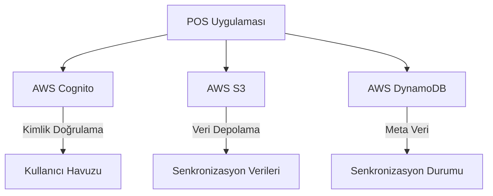
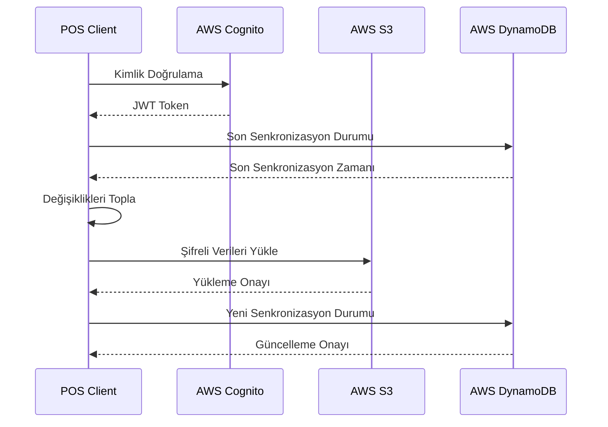
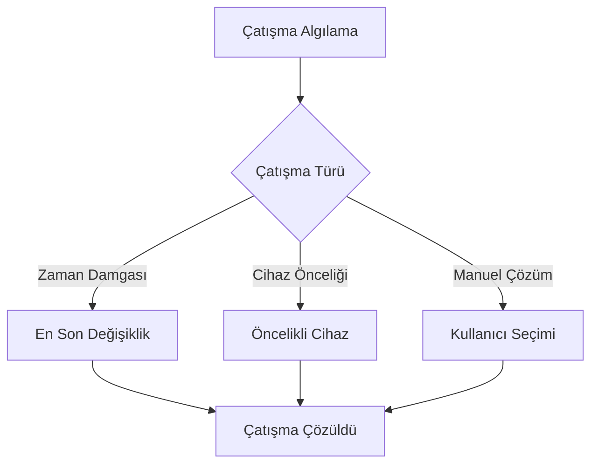

# POS Uygulaması Bulut Senkronizasyonu Mimari Tasarımı

## 1. Giriş

Bu doküman, mevcut POS uygulamasına AWS bulut senkronizasyonu özelliği eklemek için gereken mimari değişiklikleri ve tasarım kararlarını detaylandırır.

## 2. Mevcut Uygulama Analizi

Mevcut uygulama yapısı:
- React ve TypeScript tabanlı
- Ana bileşenler: `App.tsx`, `POSHeader.tsx`, `POSSettingsTab.tsx` vb.
- Context API kullanımı (`NotificationContext.tsx`)
- Sayfa tabanlı yönlendirme (`react-router-dom`)
- UI bileşenleri (`components/ui/` klasörü altında)
- IndexedDB tabanlı yerel veri depolama
- Mevcut `CloudSyncManager.ts` dosyası temel senkronizasyon altyapısı sunuyor

## 3. Bulut Senkronizasyonu Mimarisi

### 3.1 Genel Yaklaşım

AWS bulut senkronizasyonu için aşağıdaki bileşenler eklenecek:
- AWS Cognito tabanlı kimlik doğrulama
- AWS S3 tabanlı veri depolama
- AWS DynamoDB tabanlı meta veri yönetimi
- Veri çatışma çözümleme mekanizması
- Gerçek zamanlı senkronizasyon durumu izleme

### 3.2 AWS Servisleri ve Bileşenler



### 3.3 Veri Senkronizasyon Mekanizması

#### 3.3.1 Senkronizasyon Akışı



#### 3.3.2 Veri Akışı

1. **Kimlik Doğrulama**: Kullanıcı AWS Cognito ile kimlik doğrular
2. **Durum Kontrolü**: Son senkronizasyon durumunu DynamoDB'den alır
3. **Değişiklik Tespiti**: Yerel değişiklikleri algılar
4. **Veri Şifreleme**: Verileri AES-256 ile şifreler
5. **Bulut Yükleme**: Şifreli verileri S3'e yükler
6. **Durum Güncelleme**: Yeni senkronizasyon durumunu DynamoDB'ye kaydeder

### 3.4 Kullanıcı Kimlik Doğrulama Sistemi

#### 3.4.1 AWS Cognito Entegrasyonu

```typescript
// client/src/services/AuthService.ts
interface AuthConfig {
  region: string;
  userPoolId: string;
  clientId: string;
}

class AuthService {
  private cognitoClient: CognitoIdentityProviderClient;
  private userPool: CognitoUserPool;

  constructor(config: AuthConfig) {
    this.cognitoClient = new CognitoIdentityProviderClient({ region: config.region });
    this.userPool = new CognitoUserPool({
      UserPoolId: config.userPoolId,
      ClientId: config.clientId
    });
  }

  async signIn(email: string, password: string): Promise<CognitoUserSession> {
    const user = new CognitoUser({ Username: email, Pool: this.userPool });
    return new Promise((resolve, reject) => {
      user.authenticateUser(new AuthenticationDetails({
        Username: email,
        Password: password
      }), {
        onSuccess: resolve,
        onFailure: reject
      });
    });
  }

  async signUp(email: string, password: string): Promise<void> {
    return this.cognitoClient.signUp({
      ClientId: this.config.clientId,
      Username: email,
      Password: password,
      UserAttributes: [
        { Name: 'email', Value: email }
      ]
    });
  }
}
```

### 3.5 Veri Çatışma Çözümleme

#### 3.5.1 Çatışma Algılama ve Çözümleme Stratejisi



#### 3.5.2 Çatışma Çözümleme Algoritması

```typescript
// client/src/services/ConflictResolver.ts
interface ConflictResolution {
  resolveTimestampConflict(local: SyncData, remote: SyncData): SyncData;
  resolveDevicePriorityConflict(local: SyncData, remote: SyncData): SyncData;
  resolveManualConflict(local: SyncData, remote: SyncData): Promise<SyncData>;
}

class ConflictResolver implements ConflictResolution {
  resolveTimestampConflict(local: SyncData, remote: SyncData): SyncData {
    return new Date(local.lastSync) > new Date(remote.lastSync) ? local : remote;
  }

  resolveDevicePriorityConflict(local: SyncData, remote: SyncData): SyncData {
    // Öncelikli cihazı belirle
    const priorityDevice = local.deviceId === 'main-device' ? local : remote;
    return priorityDevice;
  }

  async resolveManualConflict(local: SyncData, remote: SyncData): Promise<SyncData> {
    // Kullanıcıya çatışma çözümleme arayüzü göster
    const userChoice = await showConflictResolutionDialog(local, remote);
    return userChoice;
  }
}
```

## 4. Uygulama Adımları

### 4.1 AWS Altyapısı Kurulumu

1. **AWS Cognito Kurulumu**
   - Kullanıcı havuzu oluşturma
   - Uygulama istemcisi oluşturma
   - Kimlik doğrulama akışını yapılandırma

2. **AWS S3 Kurulumu**
   - Senkronizasyon verileri için bucket oluşturma
   - Erişim politikalarını yapılandırma
   - Versiyonlamayı etkinleştirme

3. **AWS DynamoDB Kurulumu**
   - Senkronizasyon durumu tablosu oluşturma
   - İndeksleri yapılandırma
   - Erişim politikalarını ayarlama

### 4.2 İstemci Taraflı Uygulama

1. **Kimlik Doğrulama Servisi**
   - `AuthService.ts` dosyası oluşturma
   - Cognito entegrasyonunu uygulama
   - Oturum yönetimi ekleme

2. **Geliştirilmiş CloudSyncManager**
   - AWS S3 entegrasyonu ekleme
   - DynamoDB entegrasyonu ekleme
   - Çatışma çözümleme mekanizması ekleme

3. **UI Entegrasyonu**
   - Kimlik doğrulama arayüzü ekleme
   - Senkronizasyon durumu göstergesi ekleme
   - Çatışma çözümleme arayüzü ekleme

### 4.3 Veri Modeli Güncellemeleri

```typescript
// client/src/types/cloudSync.ts
export interface CloudSyncConfig {
  provider: 'aws';
  region: string;
  s3Bucket: string;
  dynamoDBTable: string;
  cognitoUserPoolId: string;
  cognitoClientId: string;
  encryptionKey: string;
  autoSync: boolean;
  syncInterval: number;
  conflictResolutionStrategy: 'timestamp' | 'devicePriority' | 'manual';
}

export interface SyncMetadata {
  deviceId: string;
  lastSync: Date;
  syncVersion: string;
  conflictResolutionStrategy: string;
}

export interface CloudSyncData {
  products: Product[];
  sales: Sale[];
  customers: Customer[];
  cashRegister: CashRegisterSession[];
  metadata: SyncMetadata;
  checksum: string;
}
```

## 5. Teknik Detaylar

### 5.1 AWS Cognito Entegrasyonu

```typescript
// client/src/services/AuthService.ts
import { CognitoUserPool, CognitoUser, AuthenticationDetails } from 'amazon-cognito-identity-js';

export class AuthService {
  private userPool: CognitoUserPool;

  constructor() {
    this.userPool = new CognitoUserPool({
      UserPoolId: import.meta.env.VITE_COGNITO_USER_POOL_ID,
      ClientId: import.meta.env.VITE_COGNITO_CLIENT_ID
    });
  }

  async login(email: string, password: string): Promise<string> {
    const user = new CognitoUser({ Username: email, Pool: this.userPool });
    return new Promise((resolve, reject) => {
      user.authenticateUser(new AuthenticationDetails({
        Username: email,
        Password: password
      }), {
        onSuccess: (session) => resolve(session.getIdToken().getJwtToken()),
        onFailure: (err) => reject(err)
      });
    });
  }
}
```

### 5.2 AWS S3 Entegrasyonu

```typescript
// client/src/services/S3Service.ts
import { S3Client, PutObjectCommand, GetObjectCommand } from '@aws-sdk/client-s3';

export class S3Service {
  private s3Client: S3Client;

  constructor() {
    this.s3Client = new S3Client({
      region: import.meta.env.VITE_AWS_REGION,
      credentials: {
        accessKeyId: import.meta.env.VITE_AWS_ACCESS_KEY_ID,
        secretAccessKey: import.meta.env.VITE_AWS_SECRET_ACCESS_KEY
      }
    });
  }

  async uploadData(key: string, data: string): Promise<void> {
    const command = new PutObjectCommand({
      Bucket: import.meta.env.VITE_S3_BUCKET,
      Key: key,
      Body: data
    });
    await this.s3Client.send(command);
  }
}
```

### 5.3 AWS DynamoDB Entegrasyonu

```typescript
// client/src/services/DynamoDBService.ts
import { DynamoDBClient, PutItemCommand, GetItemCommand } from '@aws-sdk/client-dynamodb';

export class DynamoDBService {
  private dynamoDBClient: DynamoDBClient;

  constructor() {
    this.dynamoDBClient = new DynamoDBClient({
      region: import.meta.env.VITE_AWS_REGION,
      credentials: {
        accessKeyId: import.meta.env.VITE_AWS_ACCESS_KEY_ID,
        secretAccessKey: import.meta.env.VITE_AWS_SECRET_ACCESS_KEY
      }
    });
  }

  async getSyncStatus(deviceId: string): Promise<SyncMetadata> {
    const command = new GetItemCommand({
      TableName: import.meta.env.VITE_DYNAMODB_TABLE,
      Key: { deviceId: { S: deviceId } }
    });
    const result = await this.dynamoDBClient.send(command);
    return result.Item as SyncMetadata;
  }
}
```

## 6. Entegrasyon Örneği

### 6.1 Mevcut CloudSyncManager Güncellemesi

```typescript
// client/src/services/CloudSyncManager.ts
export class CloudSyncManager {
  private authService: AuthService;
  private s3Service: S3Service;
  private dynamoDBService: DynamoDBService;
  private conflictResolver: ConflictResolver;

  constructor() {
    this.authService = new AuthService();
    this.s3Service = new S3Service();
    this.dynamoDBService = new DynamoDBService();
    this.conflictResolver = new ConflictResolver();
  }

  async performSync(): Promise<CloudSyncResult> {
    // 1. Kimlik doğrulama
    const token = await this.authService.login();

    // 2. Son senkronizasyon durumunu al
    const lastSync = await this.dynamoDBService.getSyncStatus(this.deviceId);

    // 3. Değişiklikleri topla
    const changes = await this.collectChanges(lastSync);

    // 4. Çatışmaları çöz
    const resolvedData = await this.resolveConflicts(changes);

    // 5. Verileri şifrele ve yükle
    const encryptedData = this.encryptData(resolvedData);
    await this.s3Service.uploadData(`${this.deviceId}/sync`, encryptedData);

    // 6. Yeni senkronizasyon durumunu kaydet
    await this.dynamoDBService.updateSyncStatus({
      deviceId: this.deviceId,
      lastSync: new Date(),
      syncVersion: '1.0'
    });

    return { success: true };
  }
}
```

## 7. Test ve Doğrulama

1. **Kimlik Doğrulama Testleri**
   - Başarılı giriş/çıkış senaryoları
   - Hatalı kimlik bilgileri senaryoları
   - Oturum süresi dolma senaryoları

2. **Senkronizasyon Testleri**
   - Veri yükleme/büncelleme senaryoları
   - Çatışma çözümleme senaryoları
   - Ağ bağlantısı kesilmesi senaryoları

3. **Performans Testleri**
   - Büyük veri setleri ile senkronizasyon
   - Eşzamanlı cihaz senkronizasyonu
   - Bellek kullanımı analizi

## 8. Gelecek Geliştirmeler

1. **Gerçek Zamanlı Senkronizasyon**
   - WebSocket tabanlı anlık güncellemeler
   - Server-Sent Events (SSE) entegrasyonu

2. **Gelişmiş Çatışma Çözümleme**
   - Makine öğrenimi tabanlı çatışma çözümleme
   - Kullanıcı davranış analizi

3. **Çoklu Cihaz Yönetimi**
   - Cihaz grupları ve roller
   - Merkezi yönetim paneli

4. **Gelişmiş Güvenlik**
   - İki faktörlü kimlik doğrulama
   - Biyometrik kimlik doğrulama