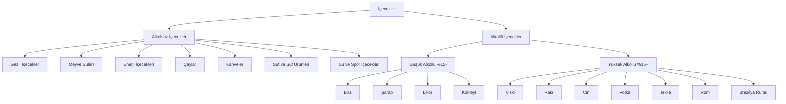

# Kapsamlı İçecek Kategori Dokümantasyonu

## 1. Giriş

Bu dokümantasyon, alkollü ve alkolsüz içecekler için detaylı bir kategori hiyerarşisi sunmaktadır. Sistem, veri analizi ve raporlama süreçlerini optimize etmek üzere tasarlanmıştır.

## 2. Genel Kategori Yapısı



## 3. Detaylı Kategori Hiyerarşisi

### 3.1 Alkolsüz İçecekler

#### 3.1.1 Gazlı İçecekler
- **Kola**
  - Coca-Cola (Classic, Zero, Light)
  - Pepsi (Classic, Max, Diet)
  - Cola Turka
- **Limonata**
  - Fanta (Portakal, Limon)
  - Sprite
  - 7Up
- **Gazoz**
  - Ülker Gazoz
  - Aroma Gazoz
- **Tonik Su**
  - Schweppes
  - Kinley

#### 3.1.2 Meyve Suları
- **Portakal Suyu**
  - Tameki
  - Alpella
  - Cappy
- **Elma Suyu**
  - Alpella
  - Cappy
  - Del Monte
- **Üzüm Suyu**
  - Cappy
  - Del Monte
- **Ananas Suyu**
  - Cappy
  - Del Monte

#### 3.1.3 Enerji İçecekleri
- **Red Bull**
  - Red Bull Classic
  - Red Bull Sugarfree
  - Red Bull Zero
- **Monster**
  - Monster Energy
  - Monster Zero Ultra
  - Monster Rehab
- **Burn**
  - Burn Energy
  - Burn Zero

#### 3.1.4 Çaylar
- **Siyah Çay**
  - Lipton
  - Çaykur
  - Twinings
- **Yeşil Çay**
  - Lipton
  - Çaykur
  - Twinings
- **Bitki Çayları**
  - Doğadan
  - Salus
  - Pukka

#### 3.1.5 Kahveler
- **Filtre Kahve**
  - Nescafé
  - Jacobs
  - Starbucks
- **Espresso**
  - Nescafé
  - Lavazza
  - Illy
- **Latte**
  - Starbucks
  - Costa Coffee
  - Gloria Jean's

#### 3.1.6 Süt ve Süt Ürünleri
- **İnek Sütü**
  - Pınar
  - Sütaş
  - Sek
- **Badem Sütü**
  - Alpro
  - Silk
  - Oatly
- **Yoğurt İçecekleri**
  - Pınar
  - Sütaş
  - Danone

#### 3.1.7 Su ve Spor İçecekleri
- **Maden Suyu**
  - Erikli
  - Hayat
  - Sırma
- **Spor İçecekleri**
  - Gatorade
  - Powerade
  - Isostar
- **Elektrolit Su**
  - Gatorade
  - Powerade
  - Isostar

### 3.2 Alkollü İçecekler

#### 3.2.1 Düşük Alkollü İçecekler (%15 altı)

##### 3.2.1.1 Bira
- **Lager**
  - Efes (Pilsen, Malt)
  - Tuborg (Gold, Red)
  - Miller (Genuine Draft, Lite)
  - Heineken
  - Corona
- **Ale**
  - Guinness (Draught, Foreign Extra)
  - Newcastle Brown Ale
  - Sierra Nevada Pale Ale
  - Fullers London Pride
  - Bass Pale Ale
- **Stout**
  - Guinness (Foreign Extra Stout)
  - Murphy's Irish Stout
  - Beamish Stout
  - Samuel Smith's Oatmeal Stout
  - Young's Double Chocolate Stout
- **IPA (India Pale Ale)**
  - Efes (IPA)
  - Tuborg (IPA)
  - BrewDog (Punk IPA)
  - Sierra Nevada (Torpedo IPA)
  - Stone IPA
- **Pilsner**
  - Efes (Pilsen)
  - Tuborg (Pilsner)
  - Pilsner Urquell
  - Heineken (Pilsner)
  - Warsteiner
- **Porter**
  - Guinness (Porter)
  - Fuller's London Porter
  - Anchor Porter
  - Samuel Smith's Taddy Porter
  - Meantime London Porter
- **Lambic**
  - Lindemans (Framboise, Pêche)
  - Boon (Oude Geuze, Kriek)
  - Cantillon (Gueuze, Rosé de Gambrinus)
  - Mort Subite (Oude Gueuze, Kriek)
  - 3 Fonteinen (Oude Geuze, Schaerbeekse Kriek)
- **Sour**
  - Rodenbach (Classic, Grand Cru)
  - Duchesse de Bourgogne
  - Liefmans (Goudenband, Fruesse)
  - Boon (Oude Kriek)
  - Lindemans (Cuvée René)
- **Wheat (Buğday Birası)**
  - Hoegaarden
  - Blue Moon
  - Paulaner (Hefe-Weißbier)
  - Weihenstephaner (Hefeweissbier)
  - Schneider Weisse
- **Pale Ale**
  - Sierra Nevada Pale Ale
  - Bass Pale Ale
  - Fuller's London Pride
  - Young's Special
  - Adnams Broadside

##### 3.2.1.2 Şarap
- **Kırmızı Şarap**
  - Doluca (Öküzgözü, Kalecik Karası)
  - Kavaklıdere (Prestige, Yakut)
  - Sevil (Cabernet Sauvignon, Merlot)
  - Pamukkale (Shiraz, Pinot Noir)
  - Corvus (Boğazkere, Öküzgözü)
- **Beyaz Şarap**
  - Kavaklıdere (Narince, Emir)
  - Doluca (Sauvignon Blanc, Chardonnay)
  - Sevil (Chardonnay, Sauvignon Blanc)
  - Pamukkale (Riesling, Viognier)
  - Corvus (Sémillon, Muscat)
- **Rose Şarap**
  - Kavaklıdere (Rose d'Anatolie)
  - Doluca (Rose)
  - Sevil (Rose)
  - Pamukkale (Rose)
  - Corvus (Rose)

##### 3.2.1.3 Likör
- **Krema Likörleri**
  - Baileys (Irish Cream)
  - Carolans (Irish Cream)
  - Amarula (Cream Liqueur)
  - Dooley's (Toffee Cream)
  - Sheridan's (Coffee & Cream)
- **Meyve Likörleri**
  - Cointreau (Orange)
  - Grand Marnier (Orange)
  - Chambord (Raspberry)
  - Midori (Melon)
  - Peach Schnapps
- **Baharat Likörleri**
  - Jägermester (Herbal)
  - Underberg (Herbal)
  - Chartreuse (Green, Yellow)
  - Benedictine
  - Galliano
- **Ot Likörleri**
  - Absinthe (Pernod, Ricard)
  - Sambuca (Black, White)
  - Ouzo
  - Pastis
  - Raki (Anise-flavored)
- **Fındık Likörleri**
  - Frangelico (Hazelnut)
  - Amaretto (Almond)
  - Nocello (Walnut)
  - Crème de Noyaux
  - Crème de Cacao
- **Kahve Likörleri**
  - Kahlúa
  - Tia Maria
  - Sheridan's (Coffee & Cream)
  - Mr. Black (Cold Brew)
  - Patrón XO Café
- **Çikolata Likörleri**
  - Crème de Cacao (Brown, White)
  - Godiva (Chocolate)
  - Mozart (Dark Chocolate)
  - Sheridan's (Chocolate & Cream)
  - Dooley's (Chocolate Cream)
- **Vanilya Likörleri**
  - Vanilla Vodka (Absolut Vanilia)
  - Vanilla Rum (Malibu Vanilla)
  - Vanilla Schnapps
  - Vanilla Cream (Baileys Vanilla)
  - Vanilla Liqueur (Marie Brizard)

##### 3.2.1.4 Kokteyl
- **Klasik Kokteyller**
  - Martini (Gin/Vodka)
  - Manhattan (Whiskey)
  - Old Fashioned (Bourbon)
  - Negroni (Gin)
  - Daiquiri (Rum)
- **Modern Kokteyller**
  - Cosmopolitan (Vodka)
  - Mojito (Rum)
  - Espresso Martini (Vodka)
  - Aperol Spritz (Prosecco)
  - Pornstar Martini (Vodka)
- **Tropikal Kokteyller**
  - Piña Colada (Rum)
  - Mai Tai (Rum)
  - Blue Hawaii (Rum)
  - Zombie (Rum)
  - Hurricane (Rum)
- **Meyveli Kokteyller**
  - Strawberry Daiquiri (Rum)
  - Raspberry Collins (Gin)
  - Peach Margarita (Tequila)
  - Watermelon Martini (Vodka)
  - Mango Mojito (Rum)
- **Kremsi Kokteyller**
  - White Russian (Vodka)
  - Mudslide (Vodka)
  - Brandy Alexander (Brandy)
  - Grasshopper (Creme de Menthe)
  - Pink Squirrel (Creme de Noyaux)
- **Baharatlı Kokteyller**
  - Spicy Margarita (Tequila)
  - Ginger Mojito (Rum)
  - Cinnamon Toast Crunch (Rum)
  - Peppermint Patty (Vodka)
  - Chai White Russian (Vodka)
- **Gazlı Kokteyller**
  - Gin Fizz (Gin)
  - Vodka Soda (Vodka)
  - Rum & Coke (Rum)
  - Whiskey Sour (Whiskey)
  - Tom Collins (Gin)

#### 3.2.2 Yüksek Alkollü İçecekler (%15 ve üzeri)

##### 3.2.2.1 Viski
- **Tanım**: Arpa, mısır, çavdar veya buğdaydan damıtılan ve meşe fıçılarda olgunlaştırılan alkollü içki
- **Alkol Oranı**: %40-%60
- **Markalar**:
  - Johnnie Walker (Red Label, Black Label, Blue Label)
  - Chivas Regal (12 Year, 18 Year)
  - Jack Daniel's (Old No. 7, Gentleman Jack)
  - Jim Beam (White Label, Black Label)
  - Macallan (Sherry Oak, Double Cask)

##### 3.2.2.2 Rakı
- **Tanım**: Üzümden damıtılan ve anason ile tatlandırılan geleneksel Türk içkisi
- **Alkol Oranı**: %40-%50
- **Markalar**:
  - Yeni Raki (Classic, Altın)
  - Tekirdağ Rakısı (Kulüp, Altın)
  - Efe Rakı (Beyaz, Siyah)
  - Mercan Rakı
  - Burgaz Rakı

##### 3.2.2.3 Cin
- **Tanım**: Arpadan damıtılan ve ardıç meyvesi ile tatlandırılan içki
- **Alkol Oranı**: %37.5-%50
- **Markalar**:
  - Gordon's (London Dry, Pink)
  - Beefeater (London Dry, 24)
  - Tanqueray (No. TEN, Rangpur)
  - Bombay Sapphire
  - Hendrick's (Orbium, Negroni)

##### 3.2.2.4 Votka
- **Tanım**: Tahıl veya patatesten damıtılan nötr alkollü içki
- **Alkol Oranı**: %35-%50
- **Markalar**:
  - Absolut (Vodka, Elyx, Citron)
  - Smirnoff (No. 21, Red, Blue)
  - Grey Goose
  - Belvedere
  - Cîroc (Mango, Pineapple, Red Berry)

##### 3.2.2.5 Tekila
- **Tanım**: Mavi agav bitkisinden üretilen Meksika içkisi
- **Alkol Oranı**: %38-%55
- **Markalar**:
  - Jose Cuervo (Especial, Tradicional)
  - Patrón (Silver, Reposado, Añejo)
  - Don Julio (1942, Blanco, Reposado)
  - Herradura (Blanco, Reposado)
  - Sauza (Hornitos, Tres Generaciones)

##### 3.2.2.6 Rom
- **Tanım**: Şeker kamışından üretilen ve genellikle Karayipler'de damıtılan içki
- **Alkol Oranı**: %40-%75
- **Markalar**:
  - Bacardi (Superior, Gold, 8 Años)
  - Captain Morgan (Original, Spiced, Dark)
  - Havana Club (3 Años, 7 Años, Añejo)
  - Malibu (Coconut, Pineapple, Mango)
  - Appleton Estate (Signature, Reserve)

##### 3.2.2.7 Brezilya Rumu
- **Tanım**: Brezilya'ya özgü şeker kamışından üretilen ve genellikle kaşar ağacı ile tatlandırılan içki
- **Alkol Oranı**: %38-%54
- **Markalar**:
  - Cachaça 51
  - Pitu
  - Velho Barreiro (Ouro, Prata)
  - Caninha 51
  - Germana

## 4. JSON Formatında Kategori Hiyerarşisi

```json
{
  "name": "İçecekler",
  "children": [
    {
      "name": "Alkolsüz İçecekler",
      "children": [
        {
          "name": "Gazlı İçecekler",
          "children": [
            {
              "name": "Kola",
              "children": [
                {
                  "name": "Coca-Cola",
                  "children": [
                    {
                      "name": "Coca-Cola Classic",
                      "type": "product"
                    },
                    {
                      "name": "Coca-Cola Zero",
                      "type": "product"
                    }
                  ]
                },
                {
                  "name": "Pepsi",
                  "children": [
                    {
                      "name": "Pepsi Classic",
                      "type": "product"
                    },
                    {
                      "name": "Pepsi Max",
                      "type": "product"
                    }
                  ]
                }
              ]
            },
            {
              "name": "Limonata",
              "children": [
                {
                  "name": "Fanta",
                  "children": [
                    {
                      "name": "Fanta Portakal",
                      "type": "product"
                    },
                    {
                      "name": "Fanta Limon",
                      "type": "product"
                    }
                  ]
                },
                {
                  "name": "Sprite",
                  "children": [
                    {
                      "name": "Sprite Classic",
                      "type": "product"
                    }
                  ]
                }
              ]
            }
          ]
        },
        {
          "name": "Meyve Suları",
          "children": [
            {
              "name": "Portakal Suyu",
              "children": [
                {
                  "name": "Tameki",
                  "children": [
                    {
                      "name": "Tameki Portakal Suyu",
                      "type": "product"
                    }
                  ]
                }
              ]
            },
            {
              "name": "Elma Suyu",
              "children": [
                {
                  "name": "Alpella",
                  "children": [
                    {
                      "name": "Alpella Elma Suyu",
                      "type": "product"
                    }
                  ]
                }
              ]
            }
          ]
        },
        {
          "name": "Enerji İçecekleri",
          "children": [
            {
              "name": "Red Bull",
              "children": [
                {
                  "name": "Red Bull Classic",
                  "type": "product"
                },
                {
                  "name": "Red Bull Sugarfree",
                  "type": "product"
                }
              ]
            }
          ]
        }
      ]
    },
    {
      "name": "Alkollü İçecekler",
      "children": [
        {
          "name": "Düşük Alkollü İçecekler (%15 altı)",
          "children": [
            {
              "name": "Bira",
              "children": [
                {
                  "name": "Efes",
                  "children": [
                    {
                      "name": "Efes Pilsen",
                      "type": "product"
                    },
                    {
                      "name": "Efes Dark",
                      "type": "product"
                    }
                  ]
                },
                {
                  "name": "Tuborg",
                  "children": [
                    {
                      "name": "Tuborg Gold",
                      "type": "product"
                    },
                    {
                      "name": "Tuborg Red",
                      "type": "product"
                    }
                  ]
                }
              ]
            },
            {
              "name": "Şarap",
              "children": [
                {
                  "name": "Kırmızı Şarap",
                  "children": [
                    {
                      "name": "Doluca",
                      "children": [
                        {
                          "name": "Doluca Öküzgözü",
                          "type": "product"
                        }
                      ]
                    }
                  ]
                },
                {
                  "name": "Beyaz Şarap",
                  "children": [
                    {
                      "name": "Kavaklıdere",
                      "children": [
                        {
                          "name": "Kavaklıdere Yakut",
                          "type": "product"
                        }
                      ]
                    }
                  ]
                }
              ]
            }
          ]
        },
        {
          "name": "Yüksek Alkollü İçecekler (%15 ve üzeri)",
          "children": [
            {
              "name": "Viski",
              "children": [
                {
                  "name": "Johnnie Walker",
                  "children": [
                    {
                      "name": "Johnnie Walker Red Label",
                      "type": "product"
                    },
                    {
                      "name": "Johnnie Walker Black Label",
                      "type": "product"
                    }
                  ]
                }
              ]
            },
            {
              "name": "Rakı",
              "children": [
                {
                  "name": "Yeni Raki",
                  "children": [
                    {
                      "name": "Yeni Raki Classic",
                      "type": "product"
                    }
                  ]
                }
              ]
            },
            {
              "name": "Votka",
              "children": [
                {
                  "name": "Absolut",
                  "children": [
                    {
                      "name": "Absolut Vodka",
                      "type": "product"
                    }
                  ]
                }
              ]
            }
          ]
        }
      ]
    }
  ]
}
```

## 5. Uygulama Önerileri

### 5.1 Veri Tabanı Tasarımı
- Her kategori için ayrı tablolar oluşturulmalı
- Marka ve ürün bilgileri ilişkisel olarak saklanmalı
- Alkol oranı ve menşei bilgileri zorunlu alanlar olmalı

### 5.2 Kullanıcı Arayüzü
- Hiyerarşik kategori seçimi için ağaç yapısı kullanılması
- Filtreleme için alkol oranı aralığı seçeneği eklenmeli
- Marka bazlı arama özelliği geliştirilmeli

### 5.3 Raporlama
- Satış analizi için kategori bazlı raporlar oluşturulmalı
- En çok satılan markalar için sıralama yapısı eklenmeli
- Alkol oranı dağılımı için grafikler geliştirilmeli

## 6. Gelecek Geliştirmeler
- Uluslararası markaların yerel varyasyonlarının eklenmesi
- Craft bira ve boutique şarap kategorilerinin genişletilmesi
- Kokteyl tarifleri için interaktif hazırlama aracı
- Alkol oranı bazlı öneri sistemi
- Besin değeri ve kalori bilgilerinin eklenmesi