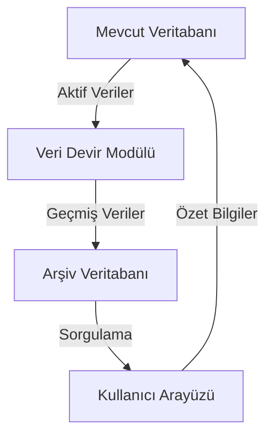

# Müşteri Veresiye Sistemi - Detaylı Belgeleme

## 1. Giriş

Bu belge, müşteri veresiye sistemindeki performans sorunlarını çözmek için tasarlanan aylık/haftalık veri devir sisteminin detaylı bir şekilde belgelenmesini sağlar. Sistem, mevcut verilerin ana veritabanında tutulmasını, geçmiş verilerin IndexedDB tabanlı bir arşiv veritabanına taşınmasını ve kullanıcı arayüzünde hızlı erişim için özet bilgilerin gösterilmesini sağlar.

## 2. Sistem Genel Bakışı

### 2.1 Sistem Mimarisi

### 2.2 Bileşenler

- **Veri Devir Modülü**: Aktif verileri ana veritabanında tutarken, geçmiş verileri arşiv veritabanına taşır.
- **Arşiv Veritabanı**: Geçmiş verileri saklama ve sorgulama imkanı sağlama.
- **Kullanıcı Arayüzü**: Kullanıcılara hızlı erişim için özet bilgiler sunma.

## 3. Veri Devir Süreci

### 3.1 Veri Toplama

- **Amaç**: Mevcut veritabanından aktif verileri toplama.
- **Süreç**:
  1. Mevcut veritabanından aktif verileri al.
  2. Veri bütünlüğünü doğrula.
  3. Toplamları koru.

### 3.2 Veri Arşivleme

- **Amaç**: Geçmiş verileri arşiv veritabanına taşıma.
- **Süreç**:
  1. Geçmiş verileri al.
  2. Arşiv veritabanına taşı.
  3. Veri bütünlüğünü doğrula.

### 3.3 Toplam Koruma

- **Amaç**: Devir işlemleri sırasında toplamları koruma.
- **Süreç**:
  1. Toplamları al.
  2. Toplamları doğrula.
  3. Toplamları koru.

### 3.4 Özet Bilgiler

- **Amaç**: Kullanıcı arayüzünde özet bilgiler gösterme.
- **Süreç**:
  1. Özet bilgileri al.
  2. Özet bilgileri göster.
  3. Kullanıcı deneyimini iyileştir.

## 4. Veri Sorgulama Süreci

### 4.1 Sorgulama Talebi

- **Amaç**: Kullanıcı, tarih aralığına göre verileri sorgulama.
- **Süreç**:
  1. Sorgulama talebi al.
  2. Veri getirme.
  3. Veri gösterme.

### 4.2 Veri Getirme

- **Amaç**: Arşiv veritabanından verileri getirme.
- **Süreç**:
  1. Veri sorgulama.
  2. Veri doğrulama.
  3. Veri getirme.

### 4.3 Veri Gösterme

- **Amaç**: Kullanıcı arayüzünde verileri gösterme.
- **Süreç**:
  1. Veri gösterme.
  2. Kullanıcı deneyimini iyileştirme.
  3. Veri bütünlüğünü sağlama.

## 5. Performans Optimizasyonu

### 5.1 Veri Bütünlüğü

- **Amaç**: Veri bütünlüğünü koruma.
- **Süreç**:
  1. Veri doğrulama.
  2. Veri bütünlüğünü sağlama.
  3. Veri bütünlüğünü doğrula.

### 5.2 Performans Optimizasyonu

- **Amaç**: Performans optimizasyonu sağlama.
- **Süreç**:
  1. İndeksleme.
  2. Sorgulama optimizasyonu.
  3. Performans optimizasyonu.

## 6. Kullanıcı Deneyimi

### 6.1 Özet Bilgiler

- **Amaç**: Kullanıcı arayüzünde hızlı erişim için özet bilgiler gösterme.
- **Süreç**:
  1. Özet bilgileri al.
  2. Özet bilgileri göster.
  3. Kullanıcı deneyimini iyileştir.

### 6.2 Kullanıcı Deneyimi

- **Amaç**: Kullanıcı deneyimini iyileştirme.
- **Süreç**:
  1. Kullanıcı tercihlerini al.
  2. Kullanıcı tercihlerini uygula.
  3. Kullanıcı deneyimini iyileştir.

## 7. Mevcut Sistemle Uyumluluk

### 7.1 Veri Yapıları

- **Amaç**: Mevcut veri yapılarını koruma.
- **Süreç**:
  1. Veri yapılarını koru.
  2. Veri bütünlüğünü sağla.
  3. Veri bütünlüğünü doğrula.

### 7.2 Performans Optimizasyonu

- **Amaç**: Mevcut sistemle uyumlu performans optimizasyonu sağlama.
- **Süreç**:
  1. Performans optimizasyonu sağla.
  2. Kullanıcı deneyimini olumsuz etkileme.
  3. Veri bütünlüğünü sağla.

## 8. Sonuç

Bu belge, müşteri veresiye sistemindeki performans sorunlarını çözmek için tasarlanan aylık/haftalık veri devir sisteminin detaylı bir şekilde belgelenmesini sağlar. Sistem, veri bütünlüğünü korur, performans optimizasyonu sağlar, kullanıcı deneyimini olumsuz etkilemez ve mevcut sistemle uyumludur.