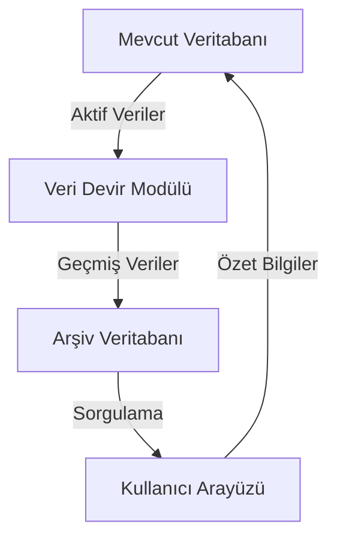

# Müşteri Veresiye Sistemi - Aylık/Haftalık Veri Devir Mimarisi

## 1. Giriş

Bu belge, müşteri veresiye sistemindeki performans sorunlarını çözmek için tasarlanan aylık/haftalık veri devir sisteminin mimarisini detaylı bir şekilde tanımlar. Sistem, mevcut verilerin ana veritabanında tutulmasını, geçmiş verilerin IndexedDB tabanlı bir arşiv veritabanına taşınmasını ve kullanıcı arayüzünde hızlı erişim için özet bilgilerin gösterilmesini sağlar.

## 2. Sistem Gereksinimleri

### 2.1 Fonksiyonel Gereksinimler

1. **Mevcut Veri Yönetimi**: Mevcut ay/saat verilerini ana veritabanında tut
2. **Arşivleme Sistemi**: Geçmiş verileri ayrı bir arşiv veritabanına taşı (IndexedDB tabanlı)
3. **Sorgulama Yeteneği**: Arşiv verilerini tarih aralığına göre sorgulayabilme imkanı sağla
4. **Toplam Koruma**: Devir işlemleri sırasında toplamları koru (örneğin: toplam satış, kalan stok)
5. **Özet Bilgiler**: Kullanıcı arayüzünde hızlı erişim için özet bilgiler göster

### 2.2 Performans Gereksinimleri

- Veri bütünlüğünü koru
- Performans optimizasyonu sağla
- Kullanıcı deneyimini olumsuz etkileme
- Mevcut sistemle uyumlu ol

## 3. Sistem Mimarisi

### 3.1 Genel Bakış



### 3.2 Bileşenler

#### 3.2.1 Veri Devir Modülü

- **Amaç**: Aktif verileri ana veritabanında tutarken, geçmiş verileri arşiv veritabanına taşır.
- **Sorumluluklar**:
  - Veri devir işlemlerini yönetme
  - Toplamları koruma
  - Veri bütünlüğünü sağlama

#### 3.2.2 Arşiv Veritabanı

- **Amaç**: Geçmiş verileri saklama ve sorgulama imkanı sağlama.
- **Sorumluluklar**:
  - Veri sorgulama
  - Veri bütünlüğünü koruma
  - Performans optimizasyonu

#### 3.2.3 Kullanıcı Arayüzü

- **Amaç**: Kullanıcılara hızlı erişim için özet bilgiler sunma.
- **Sorumluluklar**:
  - Özet bilgileri gösterme
  - Kullanıcı deneyimini iyileştirme

## 4. Veri Akışı

### 4.1 Veri Devir Süreci

1. **Veri Toplama**: Mevcut veritabanından aktif veriler toplanır.
2. **Veri Arşivleme**: Geçmiş veriler arşiv veritabanına taşınır.
3. **Toplam Koruma**: Devir işlemleri sırasında toplamlar korunur.
4. **Özet Bilgiler**: Kullanıcı arayüzünde özet bilgiler gösterilir.

### 4.2 Veri Sorgulama Süreci

1. **Sorgulama Talebi**: Kullanıcı, tarih aralığına göre verileri sorgular.
2. **Veri Getirme**: Arşiv veritabanından veriler getirilir.
3. **Veri Gösterme**: Kullanıcı arayüzünde veriler gösterilir.

## 5. Uygulama Detayları

### 5.1 Veri Devir Modülü

```typescript
interface DataTransferModule {
  transferData(): Promise<void>;
  ensureDataIntegrity(): Promise<void>;
  maintainTotals(): Promise<void>;
}
```

### 5.2 Arşiv Veritabanı

```typescript
interface ArchiveDatabase {
  queryData(startDate: Date, endDate: Date): Promise<CreditTransaction[]>;
  ensureDataIntegrity(): Promise<void>;
  optimizePerformance(): Promise<void>;
}
```

### 5.3 Kullanıcı Arayüzü

```typescript
interface UserInterface {
  displaySummary(): Promise<void>;
  improveUserExperience(): Promise<void>;
}
```

## 6. Performans Optimizasyonu

### 6.1 Veri Bütünlüğü

- **Veri Doğrulama**: Veri devir işlemleri sırasında veri doğrulama yapılır.
- **Toplam Koruma**: Devir işlemleri sırasında toplamlar korunur.

### 6.2 Performans Optimizasyonu

- **İndeksleme**: Arşiv veritabanında indeksleme yapılır.
- **Sorgulama Optimizasyonu**: Veri sorgulama işlemleri optimize edilir.

## 7. Kullanıcı Deneyimi

### 7.1 Özet Bilgiler

- **Hızlı Erişim**: Kullanıcı arayüzünde hızlı erişim için özet bilgiler gösterilir.
- **Kullanıcı Deneyimi**: Kullanıcı deneyimini iyileştirmek için özet bilgiler optimize edilir.

## 8. Mevcut Sistemle Uyumluluk

### 8.1 Veri Yapıları

- **Veri Yapıları**: Mevcut veri yapıları korunur.
- **Veri Bütünlüğü**: Veri bütünlüğü sağlanır.

### 8.2 Performans Optimizasyonu

- **Performans Optimizasyonu**: Mevcut sistemle uyumlu performans optimizasyonu sağlanır.
- **Kullanıcı Deneyimi**: Kullanıcı deneyimini olumsuz etkilemeyen performans optimizasyonu sağlanır.

## 9. Sonuç

Bu mimari, müşteri veresiye sistemindeki performans sorunlarını çözmek için tasarlanmış aylık/haftalık veri devir sistemini detaylı bir şekilde tanımlar. Sistem, veri bütünlüğünü korur, performans optimizasyonu sağlar, kullanıcı deneyimini olumsuz etkilemez ve mevcut sistemle uyumludur.