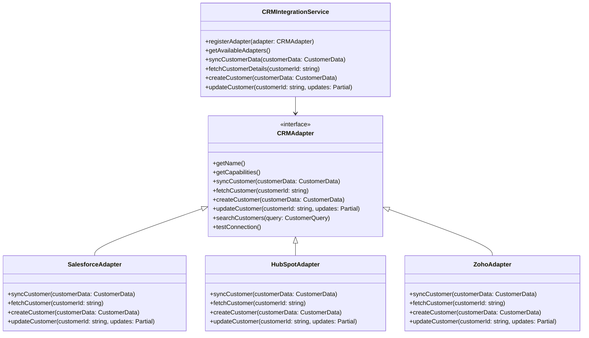
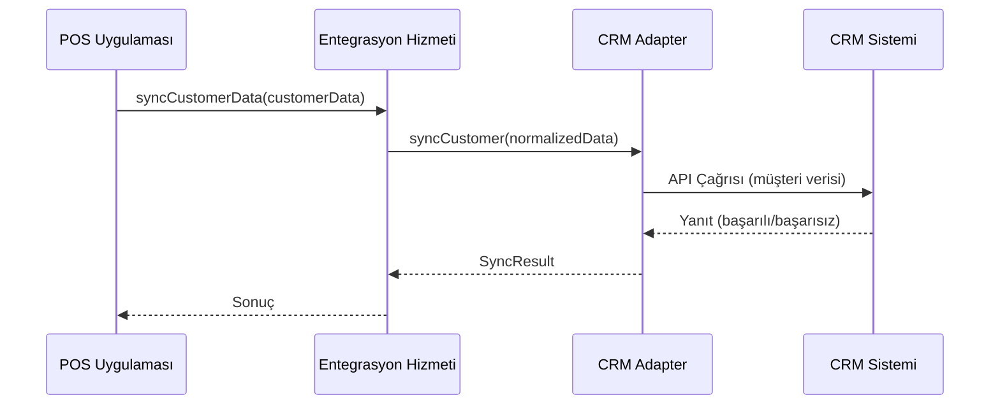
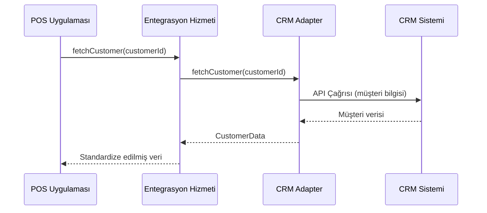

# POS Uygulaması - CRM Sistemi Entegrasyon Mimarisi

## 1. Giriş

Bu doküman, POS uygulaması ile çeşitli CRM (Müşteri İlişkileri Yönetimi) sistemleri arasında esnek ve genişletilebilir bir entegrasyon mimarisi tasarımını detaylandırır. Mimarinin amacı, müşteri verilerini merkezi olarak yönetebilen, satış ve pazarlama faaliyetlerini destekleyen bir çözüm sunmaktır.

## 2. Genel Bakış



## 3. Mimari Bileşenler

### 3.1 Entegrasyon Hizmeti

Merkezi entegrasyon hizmeti, tüm CRM sistemi entegrasyonlarını yönetir:

```typescript
// src/services/crm/CRMIntegrationService.ts
interface CRMAdapter {
  getName(): string;
  getCapabilities(): CRMCapabilities;
  syncCustomer(customerData: CustomerData): Promise<SyncResult>;
  fetchCustomer(customerId: string): Promise<CustomerData>;
  createCustomer(customerData: CustomerData): Promise<CustomerData>;
  updateCustomer(customerId: string, updates: Partial<CustomerData>): Promise<CustomerData>;
  searchCustomers(query: CustomerQuery): Promise<CustomerData[]>;
  testConnection(): Promise<ConnectionTestResult>;
}

class CRMIntegrationService {
  private adapters: Map<string, CRMAdapter> = new Map();
  private activeAdapter: string | null = null;
  private dataMapper: CRMDataMapper;

  constructor() {
    this.dataMapper = new CRMDataMapper();
  }

  registerAdapter(adapter: CRMAdapter): void {
    this.adapters.set(adapter.getName(), adapter);
  }

  setActiveAdapter(adapterName: string): void {
    if (this.adapters.has(adapterName)) {
      this.activeAdapter = adapterName;
    } else {
      throw new Error(`Adapter ${adapterName} not found`);
    }
  }

  async syncCustomerData(customerData: CustomerData): Promise<SyncResult> {
    if (!this.activeAdapter) {
      throw new Error('No active adapter selected');
    }

    const normalizedData = this.dataMapper.normalizeCustomerData(customerData);
    return this.adapters.get(this.activeAdapter)!.syncCustomer(normalizedData);
  }

  async fetchCustomer(customerId: string): Promise<CustomerData> {
    if (!this.activeAdapter) {
      throw new Error('No active adapter selected');
    }

    const result = await this.adapters.get(this.activeAdapter)!.fetchCustomer(customerId);
    return this.dataMapper.standardizeCustomerData(result);
  }
}
```

### 3.2 Adapter Tasarım Deseni

Her CRM sistemi için özel adapter sınıfları:

```typescript
// src/services/crm/adapters/SalesforceAdapter.ts
class SalesforceAdapter implements CRMAdapter {
  private config: SalesforceConfig;
  private apiClient: SalesforceApiClient;

  constructor(config: SalesforceConfig) {
    this.config = config;
    this.apiClient = new SalesforceApiClient(config);
  }

  getName(): string {
    return 'Salesforce';
  }

  async createCustomer(customerData: CustomerData): Promise<CustomerData> {
    // Salesforce'a özel müşteri oluşturma
    const salesforceCustomer = this.mapToSalesforceFormat(customerData);
    const result = await this.apiClient.create('Account', salesforceCustomer);
    return this.mapFromSalesforceFormat(result);
  }

  async updateCustomer(customerId: string, updates: Partial<CustomerData>): Promise<CustomerData> {
    // Salesforce'a özel müşteri güncelleme
    const result = await this.apiClient.update('Account', customerId, updates);
    return this.mapFromSalesforceFormat(result);
  }

  private mapToSalesforceFormat(data: CustomerData): any {
    // POS verisini Salesforce formatına dönüştürme
  }

  private mapFromSalesforceFormat(data: any): CustomerData {
    // Salesforce verisini POS formatına dönüştürme
  }
}
```

### 3.3 Veri Modelleri

Standart veri modelleri, farklı CRM sistemleri arasında uyumluluk sağlar:

```typescript
// src/models/crm/CRMModels.ts
interface CustomerData {
  id: string;
  firstName: string;
  lastName: string;
  email: string;
  phone: string;
  address: Address;
  taxNumber?: string;
  companyName?: string;
  customerType: 'INDIVIDUAL' | 'CORPORATE';
  loyaltyPoints?: number;
  lastPurchaseDate?: Date;
  totalSpent?: number;
  tags?: string[];
  customFields?: Record<string, any>;
}

interface Address {
  street: string;
  city: string;
  state?: string;
  postalCode: string;
  country: string;
}

interface CustomerQuery {
  name?: string;
  email?: string;
  phone?: string;
  taxNumber?: string;
  customerType?: 'INDIVIDUAL' | 'CORPORATE';
  minTotalSpent?: number;
  tags?: string[];
}
```

## 4. Entegrasyon Akışları

### 4.1 Müşteri Senkronizasyonu



### 4.2 Müşteri Bilgisi Alma



## 5. Veri Eşleme ve Dönüşüm

```typescript
// src/services/crm/CRMDataMapper.ts
class CRMDataMapper {
  normalizeCustomerData(data: CustomerData): CustomerData {
    // Veri normalizasyonu
    return {
      ...data,
      firstName: data.firstName?.trim(),
      lastName: data.lastName?.trim(),
      email: data.email?.toLowerCase(),
      phone: this.normalizePhoneNumber(data.phone)
    };
  }

  standardizeCustomerData(data: any): CustomerData {
    // Farklı CRM formatlarını standart forma dönüştürme
    return {
      id: data.id || data.Id || data.customerId,
      firstName: data.firstName || data.FirstName || data.name?.split(' ')[0],
      lastName: data.lastName || data.LastName || data.name?.split(' ')[1],
      email: data.email || data.Email || data.emailAddress,
      phone: data.phone || data.Phone || data.mobile,
      // Diğer alanlar...
    };
  }

  private normalizePhoneNumber(phone: string): string {
    // Telefon numarası normalizasyonu
    return phone.replace(/\D/g, '');
  }
}
```

## 6. Hata Yönetimi ve Veri Senkronizasyonu

```typescript
// src/services/crm/CRMErrorHandler.ts
class CRMErrorHandler {
  private logger: Logger;
  private conflictResolver: CRMConflictResolver;

  constructor(logger: Logger) {
    this.logger = logger;
    this.conflictResolver = new CRMConflictResolver();
  }

  async handleSyncError(error: Error, customerData: CustomerData): Promise<void> {
    this.logger.error('CRM sync error', {
      error: error.message,
      customerId: customerData.id,
      timestamp: new Date().toISOString()
    });

    if (error instanceof ConflictError) {
      await this.handleConflict(error, customerData);
    } else if (this.isRetryableError(error)) {
      await this.retryWithBackoff(customerData);
    } else {
      await this.logCriticalError(error, customerData);
    }
  }

  private async handleConflict(error: ConflictError, customerData: CustomerData): Promise<void> {
    // Çakışma çözümleme
    const resolvedData = await this.conflictResolver.resolve(error, customerData);
    await this.retrySync(resolvedData);
  }
}
```

## 7. Test ve Doğrulama

```typescript
// src/tests/crm/CRMIntegration.test.ts
describe('CRM Integration', () => {
  let service: CRMIntegrationService;
  let mockAdapter: Mock<CRMAdapter>;

  beforeEach(() => {
    service = new CRMIntegrationService();
    mockAdapter = new MockCRMAdapter();

    service.registerAdapter(mockAdapter);
    service.setActiveAdapter('TestCRM');
  });

  it('should sync customer data successfully', async () => {
    const customerData: CustomerData = {
      id: 'CUST-001',
      firstName: 'John',
      lastName: 'Doe',
      email: 'john@example.com',
      phone: '5551234567',
      customerType: 'INDIVIDUAL'
    };

    mockAdapter.syncCustomer.mockResolvedValue({ success: true, syncedCount: 1 });

    const result = await service.syncCustomerData(customerData);

    expect(result.success).toBe(true);
    expect(result.syncedCount).toBe(1);
  });

  it('should handle data mapping between systems', async () => {
    const posCustomer: CustomerData = {
      id: 'CUST-001',
      firstName: 'John',
      lastName: 'Doe',
      email: 'john@example.com',
      phone: '555-123-4567',
      customerType: 'INDIVIDUAL'
    };

    const crmCustomer = {
      Id: 'CUST-001',
      FirstName: 'John',
      LastName: 'Doe',
      Email: 'john@example.com',
      Phone: '5551234567',
      Type: 'Individual'
    };

    const mapper = new CRMDataMapper();
    const normalized = mapper.normalizeCustomerData(posCustomer);
    const standardized = mapper.standardizeCustomerData(crmCustomer);

    expect(normalized.phone).toBe('5551234567');
    expect(standardized.firstName).toBe('John');
  });
});
```

## 8. Dağıtım Stratejisi

### 8.1 Kademeli Dağıtım

1. **Geliştirme Ortamı**: Adapter implementasyonları ve temel entegrasyon testleri
2. **Test Ortamı**: Gerçek CRM sistemleriyle entegrasyon ve veri senkronizasyon testleri
3. **Canlı Ortam**: Kademeli müşteri dağıtımı ve geri bildirim toplama

### 8.2 Geri Alma Planı

- Senkronizasyonu devre dışı bırakma
- Manuel veri doğrulama araçları
- Önceki sürüme geri dönüş imkanı
- Veri yedekleme ve geri yükleme prosedürleri

## 9. Gelecek Geliştirmeler

- Yeni CRM sistemleri için adapter ekleme kolaylığı
- Gelişmiş müşteri segmentasyonu ve analitik
- Otomatik pazarlama kampanyası entegrasyonu
- Kullanıcı dostu CRM konfigürasyon arayüzü
- Gerçek zamanlı müşteri aktivite izleme

## 10. Sonuç

Bu mimari, POS uygulaması ile çeşitli CRM sistemleri arasında esnek ve genişletilebilir bir entegrasyon sağlar. Adapter tasarım deseni sayesinde, yeni CRM sistemleri kolayca eklenebilir ve mevcut sistemler bağımsız olarak güncellenebilir. Veri eşleme ve çakışma çözümleme mekanizmaları, farklı sistemler arasında veri bütünlüğünü ve tutarlılığını sağlar.