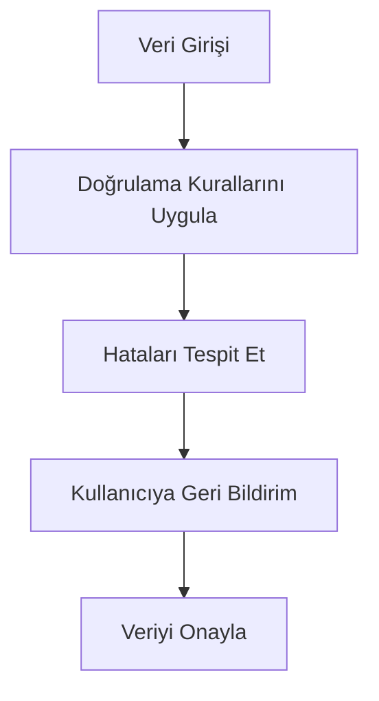
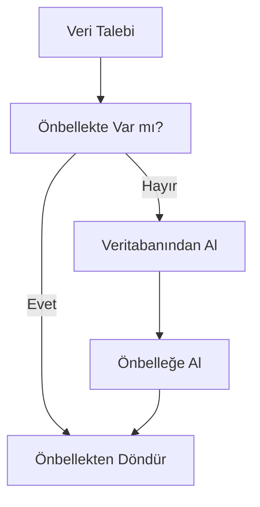
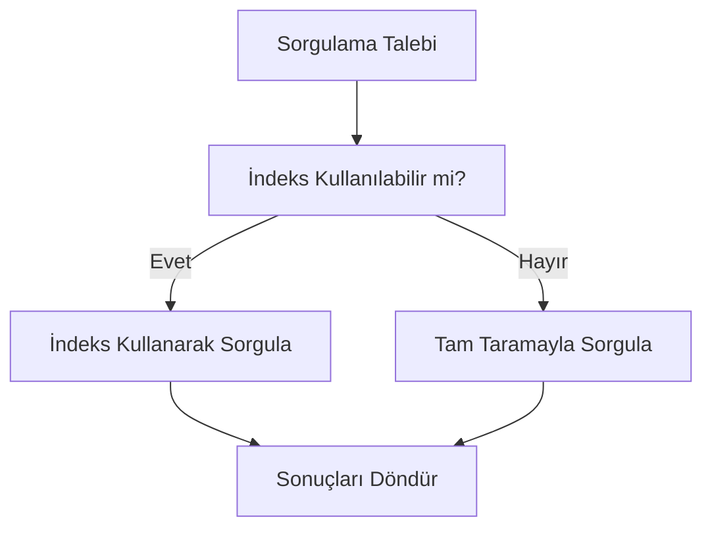
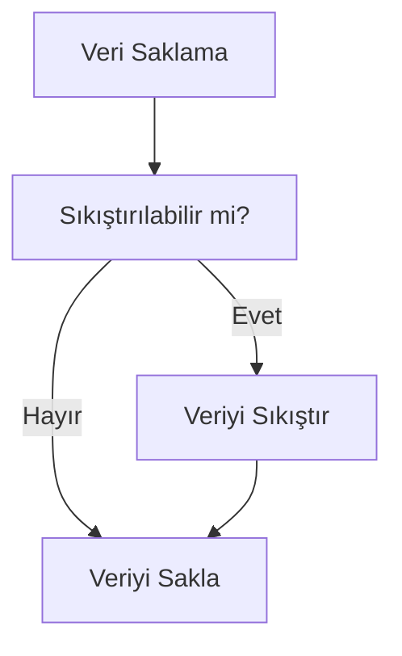
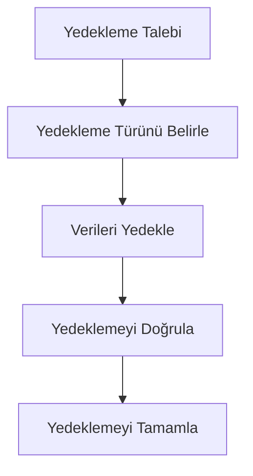
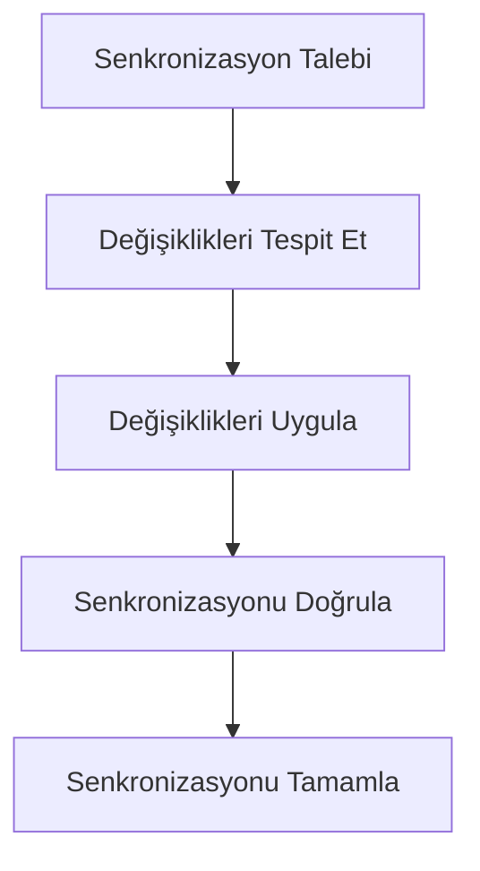
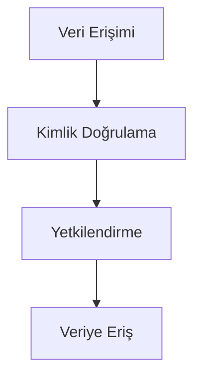
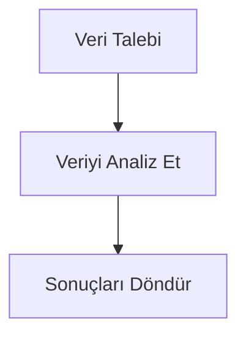
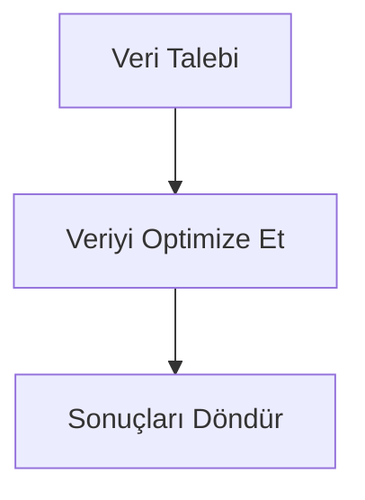

# POS Uygulaması Veri Bütünlüğü ve Performans Stratejileri

## 1. Giriş

Bu doküman, POS uygulaması için geliştirilecek veri bütünlüğü ve performans optimizasyon stratejilerini detaylandırır. Sistem, veri tutarlılığını sağlamak ve performansı optimize etmek için çeşitli teknikler içerir.

## 2. Veri Bütünlüğü Stratejileri

### 2.1 Veri Doğrulama

```typescript
interface DataValidator {
  validateProduct(product: Product): boolean;
  validateCategory(category: Category): boolean;
  validatePayment(payment: Payment): boolean;
  validateTransaction(transaction: Transaction): boolean;
}
```

### 2.2 Veri Doğrulama Akışı



### 2.3 Veri Tutarlılığı

- **İşlemler**: ACID uyumlu işlemler
- **Kilitler**: Veri kilitleme mekanizmaları
- **Denetimler**: Veri bütünlüğü denetimleri

## 3. Performans Optimizasyonu

### 3.1 Veri Önbelleğe Alma

```typescript
interface CacheManager {
  get(key: string): any;
  set(key: string, value: any, ttl?: number): void;
  delete(key: string): void;
  clear(): void;
}
```

### 3.2 Önbellekleme Stratejileri

- **Veri Önbelleği**: Sık kullanılan verilerin önbelleğe alınması
- **Sorgulama Önbelleği**: Sık sorgulanan sonuçların önbelleğe alınması
- **İşlem Önbelleği**: Sık işlemlerin önbelleğe alınması

### 3.3 Önbellekleme Akışı



## 4. Veri Saklama Stratejileri

### 4.1 Veri İndeksleme

```typescript
interface IndexManager {
  createIndex(field: string): void;
  deleteIndex(field: string): void;
  rebuildIndex(): void;
}
```

### 4.2 İndeksleme Stratejileri

- **Tek Alan İndeksleri**: Sık sorgulanan alanlar için indeksler
- **Çok Alan İndeksleri**: Çoklu alan sorguları için indeksler
- **Metin İndeksleri**: Metin tabanlı aramalar için indeksler

### 4.3 İndeksleme Akışı



## 5. Veri Sıkıştırma

### 5.1 Sıkıştırma Stratejileri

- **Veri Sıkıştırma**: Büyük veri setleri için sıkıştırma
- **Görüntü Sıkıştırma**: Görüntü dosyaları için sıkıştırma
- **Metin Sıkıştırma**: Metin verileri için sıkıştırma

### 5.2 Sıkıştırma Akışı



## 6. Veri Yedekleme

### 6.1 Yedekleme Stratejileri

- **Düzenli Yedeklemeler**: Otomatik yedekleme zamanlamaları
- **Artımlı Yedeklemeler**: Değişen verilerin yedeklenmesi
- **Tam Yedeklemeler**: Tüm verilerin yedeklenmesi

### 6.2 Yedekleme Akışı



## 7. Veri Senkronizasyonu

### 7.1 Senkronizasyon Stratejileri

- **Gerçek Zamanlı Senkronizasyon**: Anlık veri senkronizasyonu
- **Düzenli Senkronizasyon**: Belirli aralıklarla senkronizasyon
- **Manuel Senkronizasyon**: Kullanıcı tarafından tetiklenen senkronizasyon

### 7.2 Senkronizasyon Akışı



## 8. Veri Güvenliği

### 8.1 Güvenlik Stratejileri

- **Şifreleme**: Veri şifreleme
- **Kimlik Doğrulama**: Kullanıcı kimlik doğrulama
- **Yetkilendirme**: Kullanıcı yetkilendirme

### 8.2 Güvenlik Akışı



## 9. Veri Analizi

### 9.1 Analiz Stratejileri

- **Veri Madenciliği**: Veri madenciliği teknikleri
- **Makine Öğrenimi**: Makine öğrenimi modelleri
- **İstatistiksel Analiz**: İstatistiksel analiz teknikleri

### 9.2 Analiz Akışı



## 10. Veri Optimizasyonu

### 10.1 Optimizasyon Stratejileri

- **Veri Normalizasyonu**: Veri normalizasyonu teknikleri
- **Veri Denormalizasyonu**: Veri denormalizasyonu teknikleri
- **Veri Bölümlendirme**: Veri bölümlendirme teknikleri

### 10.2 Optimizasyon Akışı



## 11. Uygulama Adımları

1. **Veri Doğrulama**: Veri doğrulama mekanizmaları
2. **Veri Önbelleğe Alma**: Veri önbelleğe alma stratejileri
3. **Veri İndeksleme**: Veri indeksleme stratejileri
4. **Veri Sıkıştırma**: Veri sıkıştırma stratejileri
5. **Veri Yedekleme**: Veri yedekleme stratejileri
6. **Veri Senkronizasyonu**: Veri senkronizasyonu stratejileri
7. **Veri Güvenliği**: Veri güvenliği stratejileri
8. **Veri Analizi**: Veri analizi stratejileri
9. **Veri Optimizasyonu**: Veri optimizasyonu stratejileri

## 12. Gelecek Geliştirmeler

1. **Gelişmiş Önbellekleme**: Dağıtık önbellekleme sistemleri
2. **Gelişmiş İndeksleme**: Çok boyutlu indeksleme teknikleri
3. **Gelişmiş Sıkıştırma**: Yeni sıkıştırma algoritmaları
4. **Gelişmiş Yedekleme**: Bulut tabanlı yedekleme sistemleri
5. **Gelişmiş Senkronizasyon**: Gerçek zamanlı senkronizasyon sistemleri
6. **Gelişmiş Güvenlik**: Yeni güvenlik protokolleri
7. **Gelişmiş Analiz**: Yeni analiz teknikleri
8. **Gelişmiş Optimizasyon**: Yeni optimizasyon teknikleri

## 13. Sonuç

Bu veri bütünlüğü ve performans stratejileri, POS uygulaması için veri tutarlılığını sağlamak ve performansı optimize etmek için çeşitli teknikler içerir. Veri doğrulama, önbelleğe alma, indeksleme, sıkıştırma, yedekleme, senkronizasyon, güvenlik, analiz ve optimizasyon stratejileri ile birleştirilen sistem, kullanıcı dostu bir arayüz ve güçlü veri yönetimi özellikleri sunar.