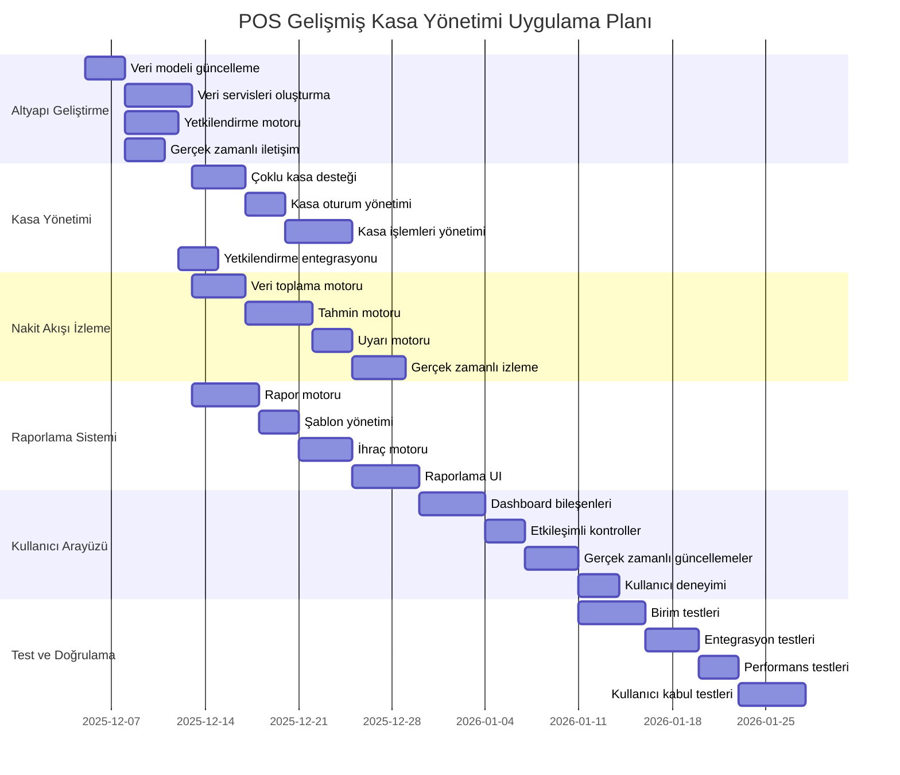

# POS Uygulaması Gelişmiş Kasa Yönetimi Uygulama Planı

## 1. Giriş

Bu doküman, POS uygulamasına gelişmiş kasa yönetimi özelliği eklemek için gereken uygulama adımlarını, zaman çizelgesini ve kaynak gereksinimlerini detaylandırır.

## 2. Proje Genel Bakışı

### 2.1 Proje Hedefleri

1. Çoklu kasa desteği eklemek
2. Gelişmiş yetkilendirme sistemi uygulamak
3. Otomatik kasa sayımı ve fark analizi özelliği eklemek
4. Nakit akışı tahmin ve uyarı sistemi geliştirmek
5. Gelişmiş raporlama ve analiz araçları eklemek
6. Gerçek zamanlı izleme ve görselleştirme sağlamak

### 2.2 Proje Kapsamı

**Dahil Olanlar:**
- Çoklu kasa yönetimi
- Rol tabanlı erişim kontrolü
- Otomatik kasa sayımı
- Nakit akışı tahminleri
- Gelişmiş raporlama
- Gerçek zamanlı izleme

**Dahil Olmayanlar:**
- Muhasebe yazılımı entegrasyonu
- Banka sistemi entegrasyonu
- Mobil uygulama geliştirme
- Bulut tabanlı senkronizasyon

## 3. Uygulama Adımları

### 3.1 Faz 1: Altyapı Geliştirme

| Görev | Süre | Sorumlu | Bağımlılıklar |
|-------|------|----------|---------------|
| Veri modeli güncelleme | 3 gün | Backend Ekibi | - |
| Veri servisleri oluşturma | 5 gün | Backend Ekibi | Veri modeli |
| Yetkilendirme motoru geliştirme | 4 gün | Güvenlik Ekibi | Veri servisleri |
| Gerçek zamanlı iletişim altyapısı | 3 gün | Altyapı Ekibi | - |

### 3.2 Faz 2: Kasa Yönetimi

| Görev | Süre | Sorumlu | Bağımlılıklar |
|-------|------|----------|---------------|
| Çoklu kasa desteği | 4 gün | Backend Ekibi | Veri servisleri |
| Kasa oturum yönetimi | 3 gün | Backend Ekibi | Çoklu kasa |
| Kasa işlemleri yönetimi | 5 gün | Backend Ekibi | Kasa oturum |
| Yetkilendirme entegrasyonu | 3 gün | Güvenlik Ekibi | Yetkilendirme motoru |

### 3.3 Faz 3: Nakit Akışı İzleme

| Görev | Süre | Sorumlu | Bağımlılıklar |
|-------|------|----------|---------------|
| Veri toplama motoru | 4 gün | Veri Ekibi | Veri servisleri |
| Tahmin motoru | 5 gün | AI Ekibi | Veri toplama |
| Uyarı motoru | 3 gün | AI Ekibi | Tahmin motoru |
| Gerçek zamanlı izleme | 4 gün | Frontend Ekibi | Uyarı motoru |

### 3.4 Faz 4: Raporlama Sistemi

| Görev | Süre | Sorumlu | Bağımlılıklar |
|-------|------|----------|---------------|
| Rapor motoru | 5 gün | Backend Ekibi | Veri servisleri |
| Şablon yönetimi | 3 gün | Backend Ekibi | Rapor motoru |
| İhraç motoru | 4 gün | Backend Ekibi | Rapor motoru |
| Raporlama UI | 5 gün | Frontend Ekibi | Rapor motoru |

### 3.5 Faz 5: Kullanıcı Arayüzü

| Görev | Süre | Sorumlu | Bağımlılıklar |
|-------|------|----------|---------------|
| Dashboard bileşenleri | 5 gün | Frontend Ekibi | Tüm servisler |
| Etkileşimli kontroller | 3 gün | Frontend Ekibi | Dashboard |
| Gerçek zamanlı güncellemeler | 4 gün | Frontend Ekibi | WebSocket |
| Kullanıcı deneyimi iyileştirmeleri | 3 gün | UX Ekibi | UI bileşenleri |

### 3.6 Faz 6: Test ve Doğrulama

| Görev | Süre | Sorumlu | Bağımlılıklar |
|-------|------|----------|---------------|
| Birim testleri | 5 gün | QA Ekibi | Tüm bileşenler |
| Entegrasyon testleri | 4 gün | QA Ekibi | Birim testleri |
| Performans testleri | 3 gün | QA Ekibi | Entegrasyon testleri |
| Kullanıcı kabul testleri | 5 gün | QA Ekibi | Performans testleri |

## 4. Zaman Çizelgesi

## 5. Kaynak Gereksinimleri

### 5.1 Ekip Yapısı

| Rol | Kişi Sayısı | Sorumluluklar |
|-----|-------------|---------------|
| Proje Yöneticisi | 1 | Proje planlama, koordinasyon |
| Backend Geliştirici | 3 | Servis geliştirme, API entegrasyonu |
| Frontend Geliştirici | 2 | Kullanıcı arayüzü, etkileşim |
| Veri Mühendisi | 1 | Veri modeli, veri işleme |
| Güvenlik Uzmanı | 1 | Yetkilendirme, güvenlik |
| QA Mühendisi | 2 | Test, doğrulama |
| UX Tasarımcısı | 1 | Kullanıcı deneyimi, arayüz |

### 5.2 Teknik Kaynaklar

| Kaynak | Açıklama |
|--------|-----------|
| Geliştirme Ortamı | VS Code, Git, Docker |
| Veritabanı | IndexedDB, SQLite (test) |
| Sunucu | Node.js, Express |
| İstemci | React, TypeScript |
| Gerçek Zamanlı | WebSocket, Socket.IO |
| Test Araçları | Jest, React Testing Library |
| CI/CD | GitHub Actions, Docker |

## 6. Risk Yönetimi

### 6.1 Potansiyel Riskler

| Risk | Olasılık | Etki | Azaltma Stratejisi |
|------|----------|------|-------------------|
| Veri bütünlüğü sorunları | Orta | Yüksek | Düzenli yedekleme, veri doğrulama |
| Performans sorunları | Yüksek | Orta | Optimizasyon, önbellekleme |
| Güvenlik açıkları | Düşük | Çok Yüksek | Güvenlik denetimleri, şifreleme |
| Kullanıcı kabulü | Orta | Yüksek | Kullanıcı eğitimi, geri bildirim |
| Entegrasyon sorunları | Yüksek | Orta | Modüler tasarım, API testleri |

### 6.2 Risk Azaltma Planı

1. **Veri Bütünlüğü**
   - Düzenli veri yedekleme
   - Veri doğrulama ve temizleme
   - Hata kurtarma mekanizmaları

2. **Performans**
   - Veri önbelleğe alma
   - Arka planda işleme
   - Optimize edilmiş sorgular

3. **Güvenlik**
   - Düzenli güvenlik denetimleri
   - Veri şifreleme
   - Rol tabanlı erişim kontrolü

4. **Kullanıcı Kabulü**
   - Kullanıcı eğitim programları
   - Geri bildirim mekanizmaları
   - Kullanıcı testleri

5. **Entegrasyon**
   - Modüler tasarım
   - API testleri
   - Geri uyumluluk testleri

## 7. Kalite Güvencesi

### 7.1 Test Stratejisi

1. **Birim Testleri**
   - Her bileşen için ayrı testler
   - Fonksiyonel testler
   - Hata durumları testleri

2. **Entegrasyon Testleri**
   - Bileşenler arası iletişim
   - API entegrasyonu
   - Veri akışı testleri

3. **Performans Testleri**
   - Yük testleri
   - Stres testleri
   - Yanıt süresi testleri

4. **Kullanıcı Kabul Testleri**
   - Kullanıcı senaryoları
   - Geri bildirim toplama
   - Kullanılabilirlik testleri

### 7.2 Kalite Metrikleri

| Metrik | Hedef |
|--------|-------|
| Kod kapsama oranı | > 80% |
| Hata yoğunluğu | < 0.5 hata/1000 satır |
| Yanıt süresi | < 2 saniye |
| Kullanıcı memnuniyeti | > 85% |
| Sistem kullanılabilirliği | > 99.5% |

## 8. Dağıtım Planı

### 8.1 Dağıtım Stratejisi

1. **Pilot Dağıtım**
   - Sınırlı kullanıcı grubu
   - Geri bildirim toplama
   - Sorun giderme

2. **Kademeli Dağıtım**
   - Kademeli kullanıcı artışı
   - Performans izleme
   - Hata düzeltmeleri

3. **Tam Dağıtım**
   - Tüm kullanıcılara açılış
   - Sürekli izleme
   - Destek sağlama

### 8.2 Dağıtım Adımları

| Adım | Açıklama | Süre |
|------|-----------|------|
| Pilot hazırlık | Pilot kullanıcı seçimi | 2 gün |
| Pilot dağıtım | Sınırlı dağıtım | 1 gün |
| Pilot test | Geri bildirim toplama | 5 gün |
| Sorun giderme | Hata düzeltmeleri | 3 gün |
| Kademeli dağıtım | Kademeli kullanıcı artışı | 7 gün |
| Tam dağıtım | Tüm kullanıcılara açılış | 1 gün |

## 9. Bakım ve Destek

### 9.1 Bakım Planı

| Aktivite | Sıklık | Sorumlu |
|----------|--------|----------|
| Veri yedekleme | Günlük | Veri Ekibi |
| Sistem izleme | Sürekli | Altyapı Ekibi |
| Güvenlik güncellemeleri | Aylık | Güvenlik Ekibi |
| Performans optimizasyonu | Çeyreklik | Backend Ekibi |
| Kullanıcı eğitimi | Aylık | UX Ekibi |

### 9.2 Destek Planı

| Destek Türü | Yanıt Süresi | Çözüm Süresi |
|-------------|--------------|--------------|
| Kritik hata | < 1 saat | < 4 saat |
| Yüksek öncelik | < 4 saat | < 1 gün |
| Orta öncelik | < 1 gün | < 3 gün |
| Düşük öncelik | < 3 gün | < 7 gün |

## 10. Başarı Kriterleri

### 10.1 Proje Başarı Metrikleri

| Metrik | Hedef | Ölçüm Yöntemi |
|--------|-------|---------------|
| Kullanıcı memnuniyeti | > 85% | Anketler, geri bildirim |
| Sistem kullanılabilirliği | > 99.5% | İzleme araçları |
| Performans | < 2 saniye | Yanıt süresi testleri |
| Hata oranı | < 0.5% | Hata raporları |
| Kullanım oranı | > 70% | Kullanım istatistikleri |

### 10.2 Kullanıcı Geri Bildirim Metrikleri

| Metrik | Hedef | Ölçüm Yöntemi |
|--------|-------|---------------|
| Kolay kullanım | > 4/5 | Kullanıcı anketleri |
| İşlevsellik | > 4/5 | Kullanıcı anketleri |
| Güvenilirlik | > 4/5 | Kullanıcı anketleri |
| Genel memnuniyet | > 4/5 | Kullanıcı anketleri |

## 11. Proje Takvimi

### 11.1 Genel Takvim

| Faz | Başlangıç | Bitiş | Süre |
|-----|-----------|-------|------|
| Altyapı Geliştirme | 2025-12-05 | 2025-12-15 | 10 gün |
| Kasa Yönetimi | 2025-12-16 | 2025-12-25 | 10 gün |
| Nakit Akışı İzleme | 2025-12-26 | 2026-01-05 | 11 gün |
| Raporlama Sistemi | 2025-12-26 | 2026-01-08 | 14 gün |
| Kullanıcı Arayüzü | 2026-01-06 | 2026-01-15 | 10 gün |
| Test ve Doğrulama | 2026-01-16 | 2026-01-25 | 10 gün |
| Pilot Dağıtım | 2026-01-26 | 2026-02-05 | 11 gün |
| Tam Dağıtım | 2026-02-06 | 2026-02-06 | 1 gün |

### 11.2 Kilometre Taşları

| Kilometre Taşı | Tarih | Açıklama |
|----------------|-------|-----------|
| Altyapı Tamamlandı | 2025-12-15 | Tüm altyapı bileşenleri hazır |
| Kasa Yönetimi Tamamlandı | 2025-12-25 | Kasa yönetimi özellikleri hazır |
| Nakit Akışı Tamamlandı | 2026-01-05 | Nakit akışı izleme hazır |
| Raporlama Tamamlandı | 2026-01-08 | Raporlama sistemi hazır |
| UI Tamamlandı | 2026-01-15 | Kullanıcı arayüzü hazır |
| Test Tamamlandı | 2026-01-25 | Tüm testler tamamlandı |
| Pilot Tamamlandı | 2026-02-05 | Pilot dağıtım tamamlandı |
| Proje Tamamlandı | 2026-02-06 | Tam dağıtım tamamlandı |

## 12. Bütçe Tahmini

### 12.1 Kaynak Maliyetleri

| Kaynak | Birim Maliyet | Miktar | Toplam |
|--------|---------------|--------|--------|
| Geliştirici | 5000 TL/gün | 9 kişi | 45000 TL/gün |
| QA Mühendisi | 4000 TL/gün | 2 kişi | 8000 TL/gün |
| UX Tasarımcısı | 4500 TL/gün | 1 kişi | 4500 TL/gün |
| Proje Yöneticisi | 6000 TL/gün | 1 kişi | 6000 TL/gün |
| **Toplam** | | | **63500 TL/gün** |

### 12.2 Toplam Proje Maliyeti

| Faz | Süre (gün) | Günlük Maliyet | Toplam Maliyet |
|-----|------------|----------------|---------------|
| Altyapı Geliştirme | 10 | 63500 TL | 635000 TL |
| Kasa Yönetimi | 10 | 63500 TL | 635000 TL |
| Nakit Akışı İzleme | 11 | 63500 TL | 698500 TL |
| Raporlama Sistemi | 14 | 63500 TL | 889000 TL |
| Kullanıcı Arayüzü | 10 | 63500 TL | 635000 TL |
| Test ve Doğrulama | 10 | 63500 TL | 635000 TL |
| Pilot Dağıtım | 11 | 63500 TL | 698500 TL |
| **Toplam** | **76** | | **4,826,000 TL** |

## 13. Proje Ekibi

### 13.1 Ekip Üyeleri

| Rol | İsim | Sorumluluklar |
|-----|------|---------------|
| Proje Yöneticisi | [Proje Yöneticisi] | Proje planlama, koordinasyon |
| Backend Lideri | [Backend Lideri] | Backend geliştirme, API entegrasyonu |
| Frontend Lideri | [Frontend Lideri] | Kullanıcı arayüzü, etkileşim |
| Veri Mühendisi | [Veri Mühendisi] | Veri modeli, veri işleme |
| Güvenlik Uzmanı | [Güvenlik Uzmanı] | Yetkilendirme, güvenlik |
| QA Lideri | [QA Lideri] | Test, doğrulama |
| UX Tasarımcısı | [UX Tasarımcısı] | Kullanıcı deneyimi, arayüz |

### 13.2 İletişim Planı

| Toplantı Türü | Sıklık | Katılımcılar |
|---------------|--------|---------------|
| Günlük stand-up | Her gün | Tüm ekip |
| Haftalık ilerleme | Haftalık | Tüm ekip, paydaşlar |
| Risk değerlendirme | Aylık | Proje yöneticisi, liderler |
| Geri bildirim oturumu | İki haftada bir | Kullanıcılar, ekip |

## 14. Sonuç

Bu uygulama planı, POS uygulamasına gelişmiş kasa yönetimi özelliği eklemek için gereken tüm adımları, kaynakları ve zaman çizelgesini detaylandırır. Plan, projenin başarılı bir şekilde tamamlanması için gereken tüm bileşenleri içerir ve gelecekteki genişlemeler için esnek bir temel sağlar.