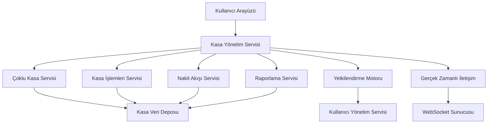
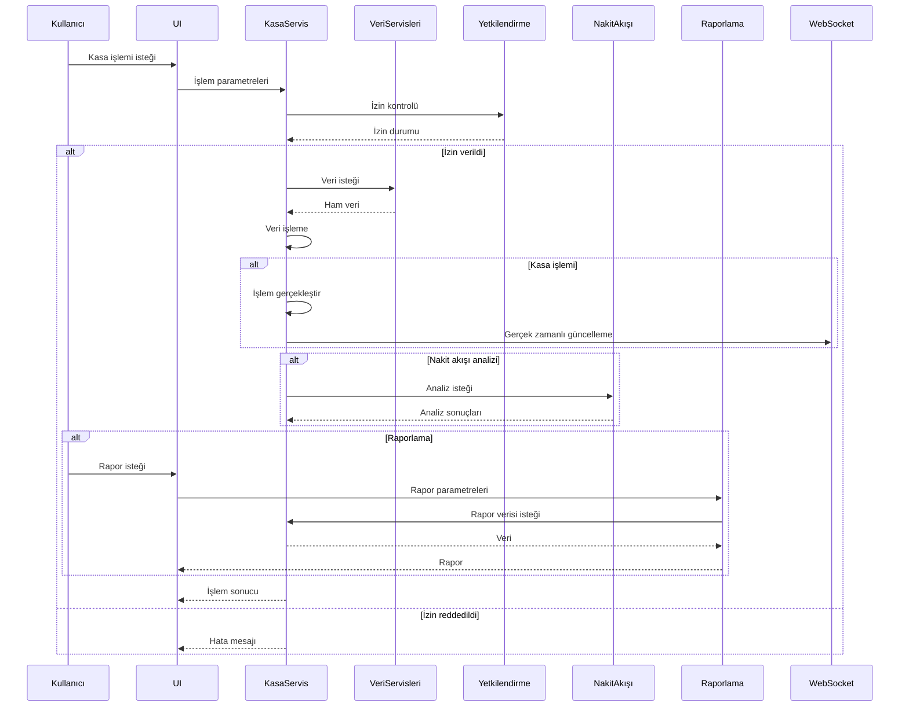
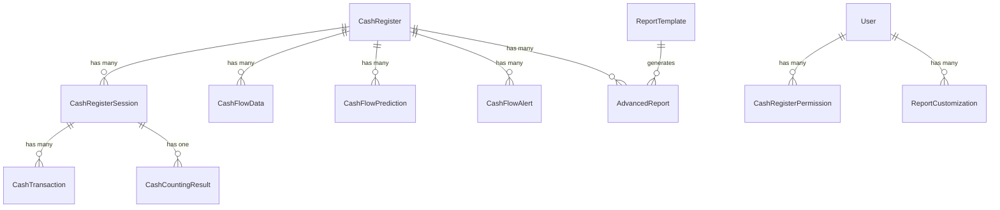
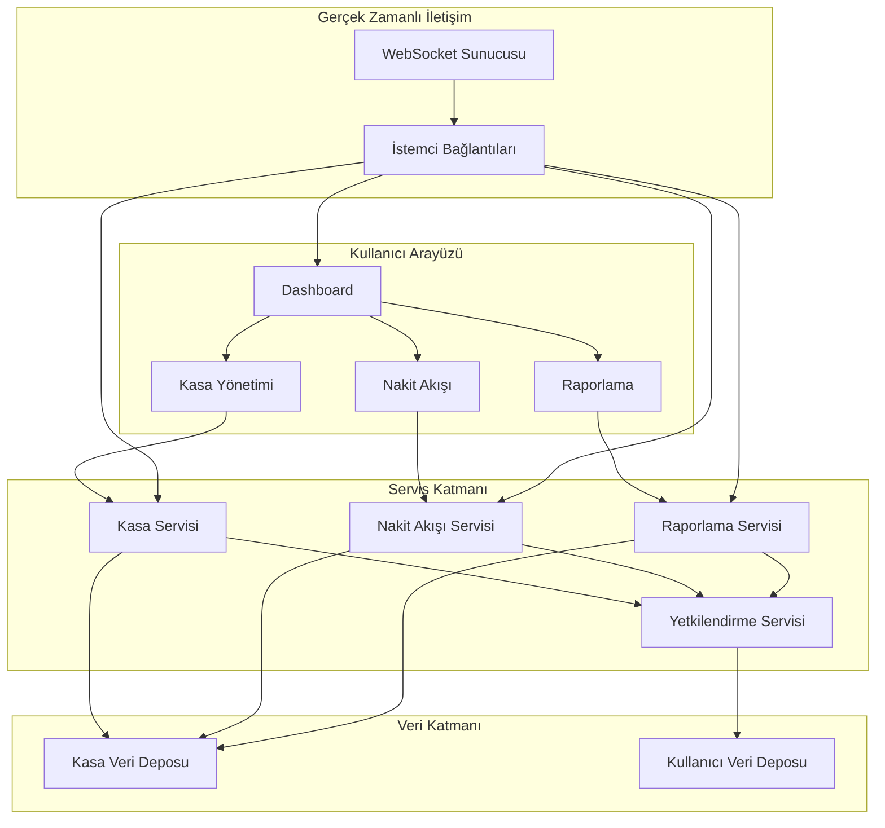
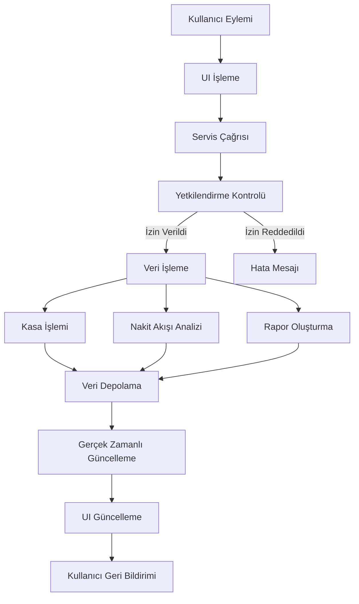

# POS Uygulaması Entegre Kasa Yönetimi Mimari Tasarımı

## 1. Giriş

Bu doküman, POS uygulamasına entegre edilecek gelişmiş kasa yönetimi sisteminin tüm bileşenlerini kapsayan genel mimari tasarımını detaylandırır. Sistem, kasa işlemleri yönetimi, nakit akışı izleme ve raporlama sistemlerini bir araya getirerek kapsamlı bir kasa yönetimi çözümü sunar.

## 2. Sistem Genel Bakışı

### 2.1 Genel Mimari



### 2.2 Veri Akışı



## 3. Bileşenler Arası İletişim

### 3.1 Servis Arayüzleri

```typescript
interface CashManagementService {
  // Kasa yönetimi
  cashRegister: {
    createRegister(register: Omit<CashRegister, "id">): Promise<CashRegister>;
    getRegister(id: string): Promise<CashRegister | null>;
    updateRegister(id: string, updates: Partial<CashRegister>): Promise<CashRegister>;
    deleteRegister(id: string): Promise<void>;
    listRegisters(): Promise<CashRegister[]>;
    openSession(registerId: string, openingBalance: number): Promise<CashRegisterSession>;
    closeSession(sessionId: string): Promise<CashRegisterSession>;
    getActiveSession(registerId: string): Promise<CashRegisterSession | null>;
    getSessionDetails(sessionId: string): Promise<SessionDetails>;
  };

  // Yetkilendirme
  authorization: {
    checkPermission(userId: string, registerId: string, action: string): Promise<boolean>;
    getUserPermissions(userId: string, registerId: string): Promise<CashRegisterPermission[]>;
    assignPermission(userId: string, registerId: string, permission: CashRegisterPermission): Promise<void>;
    revokePermission(userId: string, registerId: string, permission: CashRegisterPermission): Promise<void>;
  };

  // Kasa işlemleri
  transactions: {
    addTransaction(sessionId: string, transaction: Omit<CashTransaction, "id">): Promise<CashTransaction>;
    getTransactions(sessionId: string, filters?: TransactionFilter): Promise<CashTransaction[]>;
    updateTransaction(id: string, updates: Partial<CashTransaction>): Promise<CashTransaction>;
    deleteTransaction(id: string): Promise<void>;
    recordSale(sessionId: string, cashAmount: number, cardAmount: number): Promise<void>;
    addCashDeposit(sessionId: string, amount: number, description?: string): Promise<void>;
    addCashWithdrawal(sessionId: string, amount: number, description?: string): Promise<void>;
    addCreditCollection(sessionId: string, amount: number, customerId?: string): Promise<void>;
    saveCounting(sessionId: string, countingAmount: number): Promise<CashCountingResult>;
  };

  // Nakit akışı
  cashFlow: {
    getCashFlowData(registerId: string, period: DateRange): Promise<CashFlowData[]>;
    getCashFlowPrediction(registerId: string, period: "DAILY" | "WEEKLY" | "MONTHLY"): Promise<CashFlowPrediction>;
    getCashFlowAlerts(registerId: string): Promise<CashFlowAlert[]>;
    resolveAlert(alertId: string, resolvedBy: string): Promise<CashFlowAlert>;
    getCashFlowStatistics(registerId: string, period: DateRange): Promise<CashFlowStatistics>;
  };

  // Raporlama
  reporting: {
    generateReport(reportType: ReportType, filters: ReportFilter): Promise<AdvancedReport>;
    getReportTemplates(reportType: ReportType): Promise<ReportTemplate[]>;
    saveReportTemplate(template: ReportTemplate): Promise<ReportTemplate>;
    exportReport(reportId: string, format: ExportFormat): Promise<Blob>;
    getReportHistory(userId: string): Promise<AdvancedReport[]>;
    getDefaultReport(reportType: ReportType): Promise<AdvancedReport | null>;
  };
}
```

### 3.2 Olay Tabanlı İletişim

```typescript
interface CashManagementEvents {
  // Kasa durum değişiklikleri
  "register_status_change": {
    registerId: string;
    newStatus: CashRegisterStatus;
    timestamp: Date;
    userId: string;
  };

  // Yeni işlem
  "new_transaction": {
    transactionId: string;
    sessionId: string;
    registerId: string;
    type: CashTransactionType;
    amount: number;
    timestamp: Date;
    userId: string;
  };

  // Nakit akışı uyarısı
  "cash_flow_alert": {
    alertId: string;
    registerId: string;
    type: string;
    message: string;
    severity: string;
    timestamp: Date;
  };

  // Rapor oluşturma tamamlandı
  "report_generated": {
    reportId: string;
    reportType: ReportType;
    timestamp: Date;
    userId: string;
  };

  // Kasa sayımı tamamlandı
  "cash_counting_completed": {
    sessionId: string;
    registerId: string;
    countingAmount: number;
    difference: number;
    timestamp: Date;
    userId: string;
  };
}
```

## 4. Veri Modeli Entegrasyonu

### 4.1 Entegre Veri Yapısı

```typescript
interface IntegratedCashData {
  register: CashRegister;
  session: CashRegisterSession;
  transactions: CashTransaction[];
  cashFlow: CashFlowData[];
  predictions: CashFlowPrediction[];
  alerts: CashFlowAlert[];
  reports: AdvancedReport[];
  statistics: {
    daily: CashFlowStatistics;
    weekly: CashFlowStatistics;
    monthly: CashFlowStatistics;
  };
}
```

### 4.2 Veri İlişkileri



## 5. Kullanıcı Arayüzü Entegrasyonu

### 5.1 Ana Dashboard Yapısı

```typescript
interface CashManagementDashboardProps {
  registerId: string;
  userId: string;
  onRegisterChange: (registerId: string) => void;
}

const CashManagementDashboard: React.FC<CashManagementDashboardProps> = ({
  registerId,
  userId,
  onRegisterChange
}) => {
  const [activeTab, setActiveTab] = useState<"overview" | "transactions" | "cashflow" | "reports">("overview");
  const [registerData, setRegisterData] = useState<IntegratedCashData | null>(null);
  const [isLoading, setIsLoading] = useState(true);

  useEffect(() => {
    const loadData = async () => {
      setIsLoading(true);
      try {
        const data = await cashManagementService.getIntegratedData(registerId);
        setRegisterData(data);
      } catch (error) {
        console.error("Veri yüklenirken hata:", error);
      } finally {
        setIsLoading(false);
      }
    };

    loadData();
  }, [registerId]);

  return (
    <div className="cash-management-dashboard">
      <DashboardHeader
        registerId={registerId}
        onRegisterChange={onRegisterChange}
      />
      <TabNavigation
        activeTab={activeTab}
        onTabChange={setActiveTab}
      />
      {isLoading ? (
        <LoadingSpinner />
      ) : (
        <>
          {activeTab === "overview" && (
            <OverviewTab
              register={registerData?.register}
              session={registerData?.session}
              statistics={registerData?.statistics}
            />
          )}
          {activeTab === "transactions" && (
            <TransactionsTab
              session={registerData?.session}
              transactions={registerData?.transactions}
            />
          )}
          {activeTab === "cashflow" && (
            <CashFlowTab
              cashFlow={registerData?.cashFlow}
              predictions={registerData?.predictions}
              alerts={registerData?.alerts}
            />
          )}
          {activeTab === "reports" && (
            <ReportsTab
              reports={registerData?.reports}
              onGenerateReport={handleGenerateReport}
            />
          )}
        </>
      )}
    </div>
  );
};
```

### 5.2 Bileşenler Arası İletişim

```typescript
interface DashboardComponentProps {
  // Genel özellikler
  registerId: string;
  userId: string;
  permissions: CashRegisterPermission[];

  // Veri özellikleri
  data: any;
  isLoading: boolean;
  error: Error | null;

  // Olay işleyicileri
  onDataChange: (newData: any) => void;
  onAction: (action: string, params?: any) => void;
  onError: (error: Error) => void;

  // Gerçek zamanlı güncellemeler
  onRealTimeUpdate: (event: string, data: any) => void;
}
```

## 6. Teknik Detaylar

### 6.1 Performans Optimizasyonu

- Veri önbelleğe alma
- Arka planda veri işleme
- İlerleme göstergeleri
- Büyük veri setleri için sayfalama
- Gerçek zamanlı güncellemeler için WebSocket kullanımı
- İstemci tarafında veri doğrulama

### 6.2 Veri Güvenliği

- Veri şifreleme
- Kullanıcı yetkilendirme
- Veri bütünlüğü kontrolü
- İletişim güvenliği (TLS)
- Veri yedekleme
- Denetim kayıtları

### 6.3 Hata Yönetimi

- Kapsamlı hata işleme
- Kullanıcı dostu hata mesajları
- Otomatik geri alma işlemleri
- Hata raporlama sistemi
- Kurtarma mekanizmaları

## 7. Uygulama Adımları

1. **Altyapı Geliştirme**
   - Veri servisleri entegrasyonu
   - Yetkilendirme motoru
   - Gerçek zamanlı iletişim altyapısı

2. **Kasa Yönetimi**
   - Çoklu kasa desteği
   - Kasa oturum yönetimi
   - Kasa işlemleri yönetimi

3. **Nakit Akışı İzleme**
   - Veri toplama motoru
   - Tahmin motoru
   - Uyarı motoru

4. **Raporlama Sistemi**
   - Rapor motoru
   - Şablon yönetimi
   - İhraç motoru

5. **Kullanıcı Arayüzü**
   - Dashboard bileşenleri
   - Etkileşimli kontroller
   - Gerçek zamanlı güncellemeler

6. **Test ve Doğrulama**
   - Birim testleri
   - Entegrasyon testleri
   - Performans testleri
   - Kullanıcı kabul testleri

7. **Dağıtım ve Bakım**
   - Dağıtım stratejisi
   - Bakım planı
   - Güncelleme mekanizması

## 8. Gelecek Geliştirmeler

1. Yapay zeka tabanlı anomali tespiti
2. Otomatik kasa dengeleme önerileri
3. Mobil uygulama entegrasyonu
4. Bulut tabanlı çoklu şube senkronizasyonu
5. Makine öğrenimi tabanlı tahmin iyileştirmeleri
6. Gerçek zamanlı veri analitiği
7. Gelişmiş görselleştirme seçenekleri
8. Sesli uyarı bildirimleri
9. Biyometrik kimlik doğrulama
10. Blokzincir tabanlı işlem kayıtları

## 9. Entegrasyon Diyagramı



## 10. Veri Akışı Diyagramı



## 11. Sistemin Faydaları

1. **Merkezi Yönetim**: Tüm kasa işlemlerinin tek bir arayüzden yönetilmesi
2. **Gerçek Zamanlı İzleme**: Nakit akışının anlık olarak izlenmesi
3. **Gelişmiş Analitik**: Detaylı raporlama ve tahmin yetenekleri
4. **Güvenlik**: Rol tabanlı erişim kontrolü ve yetkilendirme
5. **Verimlilik**: Otomatik işlemler ve uyarılar
6. **Esneklik**: Özelleştirilebilir raporlar ve görselleştirmeler
7. **Bütünleşik Çözüm**: Tüm kasa yönetimi ihtiyaçlarını karşılayan tek bir sistem

## 12. Başarı Metrikleri

1. **Kullanıcı Memnuniyeti**: Kullanıcı geri bildirimleri ve memnuniyet anketleri
2. **Operasyonel Verimlilik**: Kasa işlemleri süresi ve hata oranları
3. **Veri Doğruluğu**: Nakit akışı tahminleri ve raporlama doğruluğu
4. **Sistem Performansı**: Yanıt süreleri ve kaynak kullanımı
5. **Güvenlik**: Yetkisiz erişim girişimleri ve veri ihlalleri
6. **Kullanım Oranı**: Sistem kullanım sıklığı ve özellik kullanımı

## 13. Bakım ve Destek

1. **Düzenli Güncellemeler**: Yeni özellikler ve iyileştirmeler
2. **Hata Düzeltmeleri**: Kullanıcı raporlarına dayalı düzeltmeler
3. **Dokümantasyon**: Kullanıcı kılavuzları ve teknik dokümanlar
4. **Eğitim**: Kullanıcı eğitimleri ve destek
5. **Yedekleme**: Düzenli veri yedekleme ve kurtarma
6. **İzleme**: Sistem performansı ve kullanım izleme

## 14. Sonuç

Bu entegre kasa yönetimi sistemi, POS uygulamasına kapsamlı bir kasa yönetimi çözümü sunarak işletmelerin nakit akışlarını daha etkili bir şekilde yönetmelerine, izlemelerine ve analiz etmelerine olanak tanır. Sistem, mevcut altyapıyla sorunsuz bir şekilde entegre olacak şekilde tasarlanmış olup, gelecekteki genişlemeler için esnek bir temel sağlar.