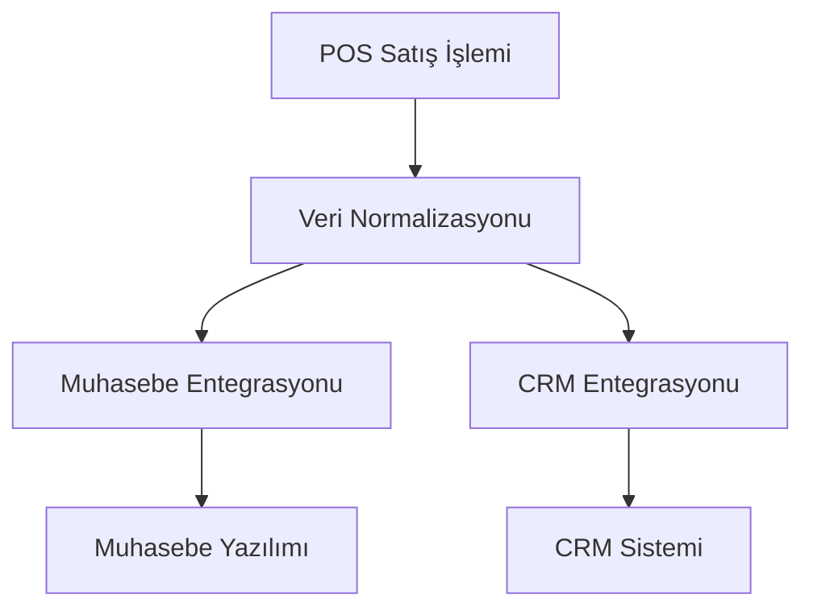
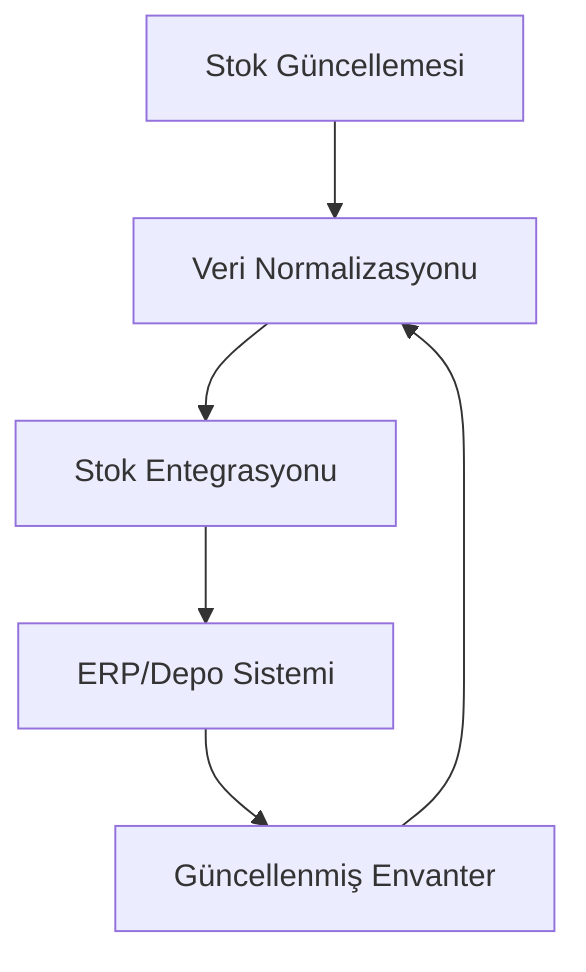

# POS Uygulaması - Entegrasyon Mimarisi Özeti

## 1. Giriş

Bu doküman, POS uygulaması için geliştirilen entegrasyon mimarisinin genel bir özetini sunar. Doküman, muhasebe yazılımları, stok yönetimi sistemleri, ödeme ağ geçitleri ve CRM sistemleri entegrasyonlarını kapsayan kapsamlı bir mimari çerçevesi sağlar.

## 2. Genel Mimari Yaklaşımı

```mermaid
componentDiagram
    component POSApplication {
        component IntegrationService
        component AccountingService
        component InventoryService
        component PaymentService
        component CRMService
    }

    component ExternalSystems {
        component AccountingSoftware
        component InventorySystems
        component PaymentGateways
        component CRMSystems
    }

    POSApplication --> ExternalSystems : Adapter Pattern
    IntegrationService --> AccountingService : Manages
    IntegrationService --> InventoryService : Manages
    IntegrationService --> PaymentService : Manages
    IntegrationService --> CRMService : Manages
```

## 3. Temel Mimari İlkeler

### 3.1 Modülerlik ve Genişletilebilirlik

- **Adapter Tasarım Deseni**: Her entegrasyon türü için adapter sınıfları
- **Bağımlılık Enjeksiyonu**: Servisler arasında gevşek bağlılık
- **Açık/Kapalı Prensibi**: Yeni entegrasyonlar mevcut kodu değiştirmeden eklenebilir

### 3.2 Veri Tutarlılığı ve Bütünlüğü

- **Standart Veri Modelleri**: Farklı sistemler arasında uyumluluk
- **Veri Eşleme Katmanı**: Format dönüşümleri için merkezi servis
- **Çakışma Çözümleme**: Otomatik ve manuel çakışma yönetimi

### 3.3 Hata Dayanıklılığı

- **Hata Yönetimi**: Merkezi hata işleme ve loglama
- **Yeniden Deneme Mekanizmaları**: Üstel geri çekilme stratejileri
- **Senkronizasyon Kuyrukları**: İşlem sıralama ve önceliklendirme

## 4. Entegrasyon Türleri ve Mimarileri

### 4.1 Muhasebe Yazılımı Entegrasyonu

**Temel Özellikler:**
- Çoklu muhasebe yazılımı desteği (Logo, ETA, Mikro)
- Satış verisi senkronizasyonu
- Fatura ve ödeme kayıtları aktarımı
- Gerçek zamanlı veya toplu senkronizasyon

**Mimari Bileşenler:**
- `AccountingIntegrationService`: Merkezi yönetim
- `AccountingAdapter`: Her yazılım için özel adapter
- `SalesData`, `InventoryData`, `CustomerData`: Standart veri modelleri

### 4.2 Stok Yönetimi Sistemi Entegrasyonu

**Temel Özellikler:**
- ERP ve depo yönetim sistemleri desteği
- Gerçek zamanlı envanter güncellemeleri
- Ürün kataloğu senkronizasyonu
- Çakışma tespiti ve çözümleme

**Mimari Bileşenler:**
- `InventoryIntegrationService`: Merkezi yönetim
- `InventoryAdapter`: Her sistem için özel adapter
- `RealTimeSyncService`: Gerçek zamanlı güncellemeler
- `BatchSyncService`: Toplu veri aktarımları

### 4.3 Ödeme Ağ Geçidi Entegrasyonu

**Temel Özellikler:**
- Çoklu ödeme yöntemi desteği
- PCI DSS uyumluluğu
- Güvenli veri işleme
- İade ve iptal işlemleri

**Mimari Bileşenler:**
- `PaymentGatewayService`: Merkezi yönetim
- `PaymentGateway`: Her yöntem için özel gateway
- `PaymentSecurityService`: Güvenlik ve şifreleme
- `PaymentErrorHandler`: Hata yönetimi

### 4.4 CRM Sistemi Entegrasyonu

**Temel Özellikler:**
- Müşteri veri senkronizasyonu
- Satış ve pazarlama entegrasyonu
- Müşteri segmentasyonu
- Aktivite izleme

**Mimari Bileşenler:**
- `CRMIntegrationService`: Merkezi yönetim
- `CRMAdapter`: Her sistem için özel adapter
- `CRMDataMapper`: Veri dönüşümleri
- `CRMConflictResolver`: Çakışma yönetimi

## 5. Veri Akışları ve Entegrasyon Noktaları

### 5.1 Satış Verisi Akışı



### 5.2 Envanter Verisi Akışı



## 6. Güvenlik ve Uyumluluk

### 6.1 Güvenlik Önlemleri

- **Veri Şifreleme**: AES-256 için hassas veriler
- **API Anahtarı Yönetimi**: Güvenli depolama ve döndürme
- **Yetkilendirme Kontrolleri**: Rol tabanlı erişim
- **Günlük Denetimi**: Tüm entegrasyon aktiviteleri

### 6.2 Uyumluluk Standartları

- **PCI DSS**: Ödeme veri güvenliği
- **GDPR**: Kişisel veri koruma
- **ISO 27001**: Bilgi güvenliği yönetimi
- **Sektöre Özel Standartlar**: Muhasebe ve finans standartları

## 7. Performans ve Ölçeklenebilirlik

### 7.1 Performans Optimizasyonları

- **Senkronizasyon Kuyrukları**: İş yükü yönetimi
- **Toplu İşlemler**: Verimli veri aktarımları
- **Önbellekleme**: Sık erişilen veriler için
- **Asenkron İşleme**: Kullanıcı arayüzü blokajını önleme

### 7.2 Ölçeklenebilirlik Stratejileri

- **Yatay Ölçeklenme**: Mikro servis mimarisi
- **Yük Dengeleme**: İş yükü dağılımı
- **Otomatik Ölçeklendirme**: Talep bazlı kaynak yönetimi

## 8. İzleme ve Bakım

### 8.1 İzleme Mekanizmaları

- **Gerçek Zamanlı İzleme**: Senkronizasyon durumları
- **Uyarı Sistemleri**: Hata ve anormallik tespiti
- **Performans Metrikleri**: Yanıt süreleri ve başarı oranları
- **Kullanım Analitiği**: Entegrasyon kullanım istatistikleri

### 8.2 Bakım Prosedürleri

- **Düzenli Yedeklemeler**: Veri koruma
- **Sistem Güncellemeleri**: Güvenlik yamaları
- **Adapter Güncellemeleri**: Yeni sürüm uyumluluğu
- **Veri Temizliği**: Eski ve gereksiz verilerin silinmesi

## 9. Dağıtım ve Geçiş Stratejisi

### 9.1 Kademeli Dağıtım Planı

1. **Pilot Test**: Sınırlı kullanıcı grubu ile test
2. **Beta Dağıtım**: Genişletilmiş kullanıcı grubu
3. **Tam Dağıtım**: Tüm kullanıcılara açılış
4. **Geri Bildirim Toplama**: Kullanıcı deneyimi iyileştirmeleri

### 9.2 Geçiş Yönetimi

- **Eski Sistem Uyumluluğu**: Geriye dönük uyumluluk
- **Veri Göçü**: Mevcut verilerin yeni sisteme aktarımı
- **Eğitim ve Dokümantasyon**: Kullanıcı eğitimi
- **Destek Kanalları**: Sorun çözme ve yardım

## 10. Gelecek Geliştirmeler

### 10.1 Kısa Vadeli Geliştirmeler

- **Yeni Entegrasyonlar**: Daha fazla muhasebe ve CRM sistemi
- **Gelişmiş Raporlama**: Entegrasyon analitiği
- **Otomatik Hata Kurtarma**: Daha akıllı yeniden deneme mekanizmaları

### 10.2 Uzun Vadeli Geliştirmeler

- **Yapay Zeka Entegrasyonu**: Tahmin ve öneri sistemleri
- **Blokzincir Entegrasyonu**: İşlem doğrulama
- **IoT Entegrasyonu**: Akıllı cihazlar ve sensörler

## 11. Sonuç

Bu entegrasyon mimarisi, POS uygulamasına esneklik, genişletilebilirlik ve güvenilirlik kazandırır. Adapter tasarım deseni ve modüler servis yapısı sayesinde, sistem gelecekteki ihtiyaçlara uyum sağlayabilir ve yeni entegrasyonlar kolayca eklenebilir. Güvenlik, performans ve kullanıcı deneyimi, mimarinin temel odak noktalarıdır.

## 12. Ek Dokümanlar

- [Muhasebe Entegrasyonu Detayları](accounting-integration-architecture.md)
- [Stok Entegrasyonu Detayları](inventory-integration-architecture.md)
- [Ödeme Entegrasyonu Detayları](payment-gateway-integration-architecture.md)
- [CRM Entegrasyonu Detayları](crm-integration-architecture.md)
- [Değişiklikler Planı](integration-changes-plan.md)