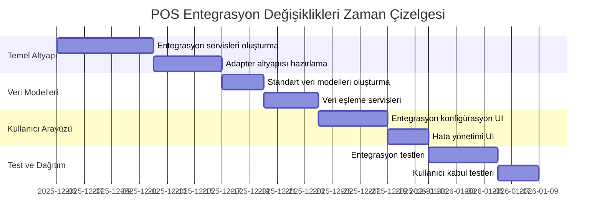

# POS Uygulaması - Entegrasyonlar İçin Gerekli Değişiklikler Planı

## 1. Giriş

Bu doküman, POS uygulamasına muhasebe yazılımları, stok yönetimi sistemleri, ödeme ağ geçitleri ve CRM sistemleri entegrasyonları için gerekli değişiklikleri detaylandırır. Değişiklikler, mevcut mimariyi minimum düzeyde etkileyecek şekilde planlanmıştır.

## 2. Genel Değişiklik Stratejisi



## 3. Altyapı Değişiklikleri

### 3.1 Yeni Servis Katmanı

```typescript
// src/services/index.ts - Yeni servisler eklenmeli
export * from './accounting/AccountingIntegrationService';
export * from './inventory/InventoryIntegrationService';
export * from './payment/PaymentGatewayService';
export * from './crm/CRMIntegrationService';
```

### 3.2 Bağımlılık Enjeksiyonu

```typescript
// src/composables/useIntegrationServices.ts
export const useIntegrationServices = () => {
  const accountingService = new AccountingIntegrationService();
  const inventoryService = new InventoryIntegrationService();
  const paymentService = new PaymentGatewayService(new PaymentSecurityService());
  const crmService = new CRMIntegrationService();

  // Adapter'ları kaydet
  accountingService.registerAdapter(new LogoAdapter(config.accounting.logo));
  accountingService.registerAdapter(new ETAAdapter(config.accounting.eta));
  accountingService.registerAdapter(new MikroAdapter(config.accounting.mikro));

  inventoryService.registerAdapter(new ERPAdapter(config.inventory.erp));
  inventoryService.registerAdapter(new WarehouseAdapter(config.inventory.warehouse));

  paymentService.registerGateway(new CreditCardGateway(config.payment.creditCard));
  paymentService.registerGateway(new MobilePaymentGateway(config.payment.mobile));

  crmService.registerAdapter(new SalesforceAdapter(config.crm.salesforce));
  crmService.registerAdapter(new HubSpotAdapter(config.crm.hubspot));

  return {
    accountingService,
    inventoryService,
    paymentService,
    crmService
  };
};
```

## 4. Veri Tabanı Değişiklikleri

### 4.1 Yeni Tablolar

```sql
-- Entegrasyon konfigürasyonları
CREATE TABLE integration_configurations (
  id TEXT PRIMARY KEY,
  type TEXT NOT NULL, -- 'ACCOUNTING', 'INVENTORY', 'PAYMENT', 'CRM'
  adapter_name TEXT NOT NULL,
  config_data TEXT NOT NULL, -- JSON formatında
  is_active BOOLEAN DEFAULT FALSE,
  last_sync_time DATETIME,
  created_at DATETIME DEFAULT CURRENT_TIMESTAMP,
  updated_at DATETIME DEFAULT CURRENT_TIMESTAMP
);

-- Senkronizasyon logları
CREATE TABLE integration_sync_logs (
  id TEXT PRIMARY KEY,
  integration_type TEXT NOT NULL,
  adapter_name TEXT NOT NULL,
  sync_type TEXT NOT NULL, -- 'SALES', 'INVENTORY', 'CUSTOMER', 'PAYMENT'
  status TEXT NOT NULL, -- 'SUCCESS', 'FAILED', 'PENDING'
  record_count INTEGER,
  error_message TEXT,
  start_time DATETIME,
  end_time DATETIME,
  created_at DATETIME DEFAULT CURRENT_TIMESTAMP
);
```

### 4.2 Mevcut Tablolara Ek Alanlar

```sql
-- Müşteriler tablosuna CRM entegrasyonu için alanlar eklenmeli
ALTER TABLE customers ADD COLUMN crm_id TEXT;
ALTER TABLE customers ADD COLUMN crm_system TEXT;
ALTER TABLE customers ADD COLUMN last_crm_sync DATETIME;

-- Ürünler tablosuna stok entegrasyonu için alanlar eklenmeli
ALTER TABLE products ADD COLUMN external_id TEXT;
ALTER TABLE products ADD COLUMN inventory_system TEXT;
ALTER TABLE products ADD COLUMN last_inventory_sync DATETIME;

-- Satışlar tablosuna muhasebe entegrasyonu için alanlar eklenmeli
ALTER TABLE sales ADD COLUMN accounting_id TEXT;
ALTER TABLE sales ADD COLUMN accounting_system TEXT;
ALTER TABLE sales ADD COLUMN exported_to_accounting BOOLEAN DEFAULT FALSE;
```

## 5. API Değişiklikleri

### 5.1 Yeni API Endpoint'leri

```typescript
// src/api/integration.ts
export const integrationApi = {
  // Entegrasyon konfigürasyonu
  getIntegrationConfigs: () => api.get('/integration/configs'),
  updateIntegrationConfig: (config: IntegrationConfig) => api.put('/integration/configs', config),
  testIntegrationConnection: (adapterName: string) => api.post(`/integration/${adapterName}/test`),

  // Senkronizasyon API'leri
  triggerManualSync: (type: IntegrationType) => api.post(`/integration/${type}/sync`),
  getSyncStatus: (syncId: string) => api.get(`/integration/sync/${syncId}/status`),
  getSyncHistory: (type: IntegrationType) => api.get(`/integration/${type}/history`),

  // Hata yönetimi
  getSyncErrors: (type: IntegrationType) => api.get(`/integration/${type}/errors`),
  retryFailedSync: (errorId: string) => api.post(`/integration/errors/${errorId}/retry`)
};
```

### 5.2 Mevcut API'lerin Güncellenmesi

```typescript
// src/api/sales.ts - Muhasebe entegrasyonu için güncellenmeli
export const salesApi = {
  // ... mevcut metodlar
  exportToAccounting: (saleId: string) => api.post(`/sales/${saleId}/export-accounting`),
  getExportStatus: (saleId: string) => api.get(`/sales/${saleId}/export-status`)
};

// src/api/customers.ts - CRM entegrasyonu için güncellenmeli
export const customersApi = {
  // ... mevcut metodlar
  syncWithCRM: (customerId: string) => api.post(`/customers/${customerId}/sync-crm`),
  getCRMStatus: (customerId: string) => api.get(`/customers/${customerId}/crm-status`)
};
```

## 6. Kullanıcı Arayüzü Değişiklikleri

### 6.1 Yeni Yönetim Paneli

```typescript
// src/components/admin/IntegrationSettingsPanel.tsx
export const IntegrationSettingsPanel: React.FC = () => {
  const { services } = useIntegrationServices();
  const [activeTab, setActiveTab] = useState<'accounting' | 'inventory' | 'payment' | 'crm'>('accounting');

  return (
    <div className="space-y-6">
      <h2 className="text-2xl font-bold">Entegrasyon Ayarları</h2>

      <Tabs value={activeTab} onValueChange={setActiveTab}>
        <TabsList>
          <TabsTrigger value="accounting">Muhasebe</TabsTrigger>
          <TabsTrigger value="inventory">Stok</TabsTrigger>
          <TabsTrigger value="payment">Ödeme</TabsTrigger>
          <TabsTrigger value="crm">CRM</TabsTrigger>
        </TabsList>

        <TabsContent value="accounting">
          <AccountingIntegrationSettings service={services.accountingService} />
        </TabsContent>

        <TabsContent value="inventory">
          <InventoryIntegrationSettings service={services.inventoryService} />
        </TabsContent>

        <TabsContent value="payment">
          <PaymentIntegrationSettings service={services.paymentService} />
        </TabsContent>

        <TabsContent value="crm">
          <CRMIntegrationSettings service={services.crmService} />
        </TabsContent>
      </Tabs>
    </div>
  );
};
```

### 6.2 Senkronizasyon Durum Göstergesi

```typescript
// src/components/IntegrationStatusIndicator.tsx
export const IntegrationStatusIndicator: React.FC<{
  type: IntegrationType;
  lastSync: Date;
  status: SyncStatus;
}> = ({ type, lastSync, status }) => {
  const getStatusColor = () => {
    switch (status) {
      case 'SUCCESS': return 'bg-green-500';
      case 'FAILED': return 'bg-red-500';
      case 'PENDING': return 'bg-yellow-500';
      default: return 'bg-gray-500';
    }
  };

  return (
    <div className="flex items-center space-x-2">
      <div className={`w-3 h-3 rounded-full ${getStatusColor()}`} />
      <div className="text-sm">
        <span className="font-medium">{getIntegrationName(type)}</span>
        <span className="text-gray-500 ml-2">
          Son senkronizasyon: {formatDate(lastSync)} - {getStatusText(status)}
        </span>
      </div>
    </div>
  );
};
```

## 7. Güvenlik Değişiklikleri

### 7.1 Yeni Güvenlik Politikaları

```typescript
// src/security/IntegrationSecurityPolicy.ts
export class IntegrationSecurityPolicy {
  static validateApiKey(apiKey: string): boolean {
    // API anahtarı doğrulama
    return apiKey.length >= 32 && /^[A-Za-z0-9]+$/.test(apiKey);
  }

  static encryptSensitiveData(data: any): string {
    // Hassas verileri şifreleme
    return encryptAES256(JSON.stringify(data), process.env.ENCRYPTION_KEY!);
  }

  static validateIntegrationConfig(config: IntegrationConfig): boolean {
    // Entegrasyon konfigürasyonu doğrulama
    return config.apiKey && this.validateApiKey(config.apiKey) &&
           config.endpoint && isValidUrl(config.endpoint);
  }
}
```

### 7.2 Yetkilendirme Kontrolleri

```typescript
// src/permissions/integrationPermissions.ts
export const INTEGRATION_PERMISSIONS = {
  MANAGE_ACCOUNTING_INTEGRATION: 'manage_accounting_integration',
  MANAGE_INVENTORY_INTEGRATION: 'manage_inventory_integration',
  MANAGE_PAYMENT_INTEGRATION: 'manage_payment_integration',
  MANAGE_CRM_INTEGRATION: 'manage_crm_integration',
  VIEW_INTEGRATION_LOGS: 'view_integration_logs',
  RETRY_FAILED_SYNCS: 'retry_failed_syncs'
};
```

## 8. Test ve Doğrulama

### 8.1 Entegrasyon Testleri

```typescript
// src/tests/integration/IntegrationTests.test.ts
describe('Integration Changes', () => {
  it('should initialize all integration services', () => {
    const services = useIntegrationServices();

    expect(services.accountingService).toBeDefined();
    expect(services.inventoryService).toBeDefined();
    expect(services.paymentService).toBeDefined();
    expect(services.crmService).toBeDefined();
  });

  it('should validate integration configurations', () => {
    const validConfig = {
      apiKey: 'valid-api-key-1234567890abcdefghijklmnopqrstuv',
      endpoint: 'https://api.example.com'
    };

    const invalidConfig = {
      apiKey: 'short',
      endpoint: 'invalid-url'
    };

    expect(IntegrationSecurityPolicy.validateIntegrationConfig(validConfig)).toBe(true);
    expect(IntegrationSecurityPolicy.validateIntegrationConfig(invalidConfig)).toBe(false);
  });
});
```

## 9. Dağıtım Planı

### 9.1 Kademeli Dağıtım Stratejisi

1. **Faz 1: Altyapı Değişiklikleri (2 Hafta)**
   - Yeni servis katmanı implementasyonu
   - Veri tabanı değişiklikleri
   - Temel API endpoint'leri

2. **Faz 2: Adapter Implementasyonu (3 Hafta)**
   - Her entegrasyon türü için adapter'lar
   - Veri eşleme servisleri
   - Hata yönetimi mekanizmaları

3. **Faz 3: Kullanıcı Arayüzü (2 Hafta)**
   - Yönetim paneli
   - Durum göstergeleri
   - Hata raporlama arayüzü

4. **Faz 4: Test ve Optimizasyon (2 Hafta)**
   - Entegrasyon testleri
   - Performans optimizasyonu
   - Kullanıcı kabul testleri

### 9.2 Geri Alma Planı

- Her fazdan sonra otomatik yedek alma
- Önceki sürüme geri dönüş script'leri
- Veri bütünlüğü doğrulama araçları
- Kullanıcı bildirim sistemi

## 10. Bakım ve İzleme

### 10.1 İzleme Metrikleri

```typescript
// src/monitoring/IntegrationMonitor.ts
export class IntegrationMonitor {
  trackSyncOperation(type: IntegrationType, status: SyncStatus, duration: number): void {
    // Senkronizasyon işlemlerini izleme
    metrics.increment(`integration.${type}.${status}`);
    metrics.timing(`integration.${type}.duration`, duration);
  }

  trackError(type: IntegrationType, error: Error): void {
    // Hataları izleme
    metrics.increment(`integration.${type}.errors`);
    logger.error(`[Integration] ${type} error`, { error });
  }

  getHealthStatus(): IntegrationHealthStatus {
    // Genel sağlık durumunu hesaplama
    return {
      overallStatus: 'HEALTHY',
      details: {
        accounting: { status: 'HEALTHY', lastSync: new Date() },
        inventory: { status: 'HEALTHY', lastSync: new Date() },
        payment: { status: 'HEALTHY', lastSync: new Date() },
        crm: { status: 'HEALTHY', lastSync: new Date() }
      }
    };
  }
}
```

## 11. Sonuç

Bu değişiklikler planı, POS uygulamasına entegrasyon özellikleri eklerken minimum kesinti ve maksimum uyumluluk sağlar. Modüler tasarım sayesinde, her entegrasyon türü bağımsız olarak geliştirilebilir, test edilebilir ve dağıtılabilir. Değişiklikler, mevcut sistemin stabilitesini korurken yeni özellikler eklemeyi hedefler.