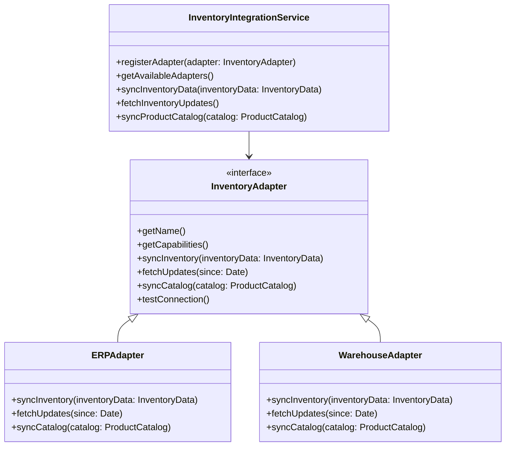
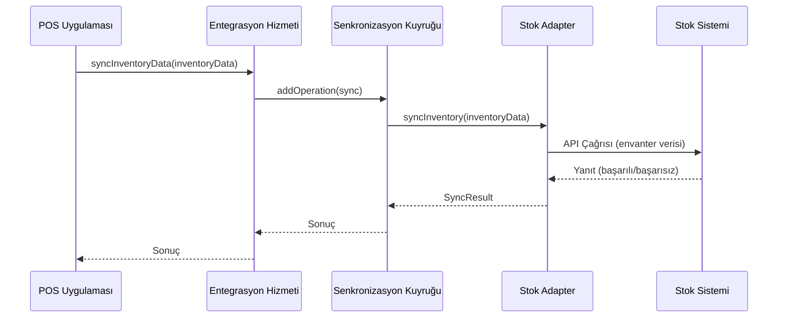
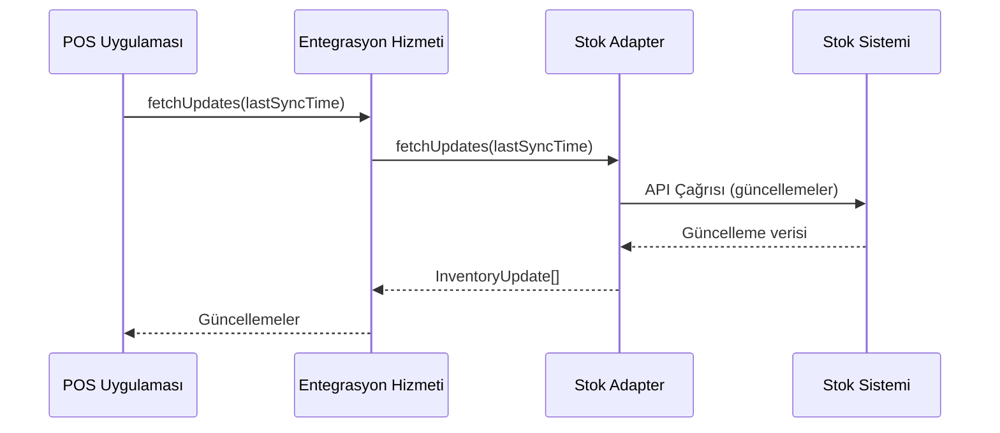

# POS Uygulaması - Stok Yönetimi Sistemi Entegrasyon Mimarisi

## 1. Giriş

Bu doküman, POS uygulaması ile çeşitli stok yönetimi sistemleri arasında esnek ve genişletilebilir bir entegrasyon mimarisi tasarımını detaylandırır. Mimarinin amacı, farklı müşteri ihtiyaçlarına uyum sağlayabilen, gerçek zamanlı veya toplu veri senkronizasyonu sağlayan modüler bir çözüm sunmaktır.

## 2. Genel Bakış



## 3. Mimari Bileşenler

### 3.1 Entegrasyon Hizmeti

Merkezi entegrasyon hizmeti, tüm stok yönetimi sistemi entegrasyonlarını yönetir:

```typescript
// src/services/inventory/InventoryIntegrationService.ts
interface InventoryAdapter {
  getName(): string;
  getCapabilities(): InventoryCapabilities;
  syncInventory(inventoryData: InventoryData[]): Promise<SyncResult>;
  fetchUpdates(since: Date): Promise<InventoryUpdate[]>;
  syncCatalog(catalog: ProductCatalog): Promise<SyncResult>;
  testConnection(): Promise<ConnectionTestResult>;
}

class InventoryIntegrationService {
  private adapters: Map<string, InventoryAdapter> = new Map();
  private activeAdapter: string | null = null;
  private syncQueue: InventorySyncQueue;

  constructor() {
    this.syncQueue = new InventorySyncQueue();
  }

  registerAdapter(adapter: InventoryAdapter): void {
    this.adapters.set(adapter.getName(), adapter);
  }

  setActiveAdapter(adapterName: string): void {
    if (this.adapters.has(adapterName)) {
      this.activeAdapter = adapterName;
    } else {
      throw new Error(`Adapter ${adapterName} not found`);
    }
  }

  async syncInventoryData(inventoryData: InventoryData[]): Promise<SyncResult> {
    if (!this.activeAdapter) {
      throw new Error('No active adapter selected');
    }

    return this.syncQueue.addOperation(async () => {
      return this.adapters.get(this.activeAdapter)!.syncInventory(inventoryData);
    });
  }

  async fetchUpdates(since: Date): Promise<InventoryUpdate[]> {
    if (!this.activeAdapter) {
      throw new Error('No active adapter selected');
    }
    return this.adapters.get(this.activeAdapter)!.fetchUpdates(since);
  }
}
```

### 3.2 Adapter Tasarım Deseni

Her stok yönetim sistemi için özel adapter sınıfları:

```typescript
// src/services/inventory/adapters/ERPAdapter.ts
class ERPAdapter implements InventoryAdapter {
  private config: ERPConfig;

  constructor(config: ERPConfig) {
    this.config = config;
  }

  getName(): string {
    return 'GenericERP';
  }

  async syncInventory(inventoryData: InventoryData[]): Promise<SyncResult> {
    // ERP sistemine özel envanter veri senkronizasyonu
    const result = await this.callERPApi('/inventory/sync', inventoryData);
    return this.mapERPResponse(result);
  }

  async fetchUpdates(since: Date): Promise<InventoryUpdate[]> {
    // ERP sisteminden güncellemeleri çekme
    const updates = await this.callERPApi('/inventory/updates', { since });
    return this.mapERPUpdates(updates);
  }

  private async callERPApi(endpoint: string, data: any): Promise<any> {
    // ERP API çağrısı implementasyonu
  }
}
```

### 3.3 Veri Modelleri

Standart veri modelleri, farklı stok yönetim sistemleri arasında uyumluluk sağlar:

```typescript
// src/models/inventory/InventoryModels.ts
interface InventoryData {
  productId: string;
  locationId: string;
  currentQuantity: number;
  reservedQuantity: number;
  lastUpdated: Date;
  costPrice: number;
  batchNumber?: string;
  expiryDate?: Date;
}

interface ProductCatalog {
  products: Product[];
  categories: Category[];
  lastUpdated: Date;
}

interface InventoryUpdate {
  productId: string;
  oldQuantity: number;
  newQuantity: number;
  updateType: 'INCREASE' | 'DECREASE' | 'ADJUSTMENT';
  timestamp: Date;
  reason?: string;
}
```

## 4. Entegrasyon Akışları

### 4.1 Envanter Senkronizasyonu



### 4.2 Gerçek Zamanlı Güncelleme Alma



## 5. Senkronizasyon Stratejileri

### 5.1 Gerçek Zamanlı Senkronizasyon

```typescript
// src/services/inventory/RealTimeSyncService.ts
class RealTimeSyncService {
  private service: InventoryIntegrationService;
  private pollInterval: number;
  private lastSyncTime: Date;

  constructor(service: InventoryIntegrationService, interval: number = 5) {
    this.service = service;
    this.pollInterval = interval * 60 * 1000; // dakikaya çevir
    this.lastSyncTime = new Date();
  }

  start(): void {
    setInterval(async () => {
      try {
        const updates = await this.service.fetchUpdates(this.lastSyncTime);
        if (updates.length > 0) {
          await this.processUpdates(updates);
          this.lastSyncTime = new Date();
        }
      } catch (error) {
        console.error('Real-time sync failed:', error);
      }
    }, this.pollInterval);
  }

  private async processUpdates(updates: InventoryUpdate[]): Promise<void> {
    // Güncellemeleri POS sistemine uygula
  }
}
```

### 5.2 Toplu Senkronizasyon

```typescript
// src/services/inventory/BatchSyncService.ts
class BatchSyncService {
  private service: InventoryIntegrationService;
  private batchSize: number;

  constructor(service: InventoryIntegrationService, batchSize: number = 100) {
    this.service = service;
    this.batchSize = batchSize;
  }

  async syncAllInventory(): Promise<BatchSyncResult> {
    const allInventory = await this.fetchAllInventory();
    const batches = this.createBatches(allInventory, this.batchSize);

    const results: SyncResult[] = [];
    for (const batch of batches) {
      const result = await this.service.syncInventoryData(batch);
      results.push(result);
    }

    return this.aggregateResults(results);
  }
}
```

## 6. Hata Yönetimi ve Çakışma Çözümleme

```typescript
// src/services/inventory/InventoryConflictResolver.ts
class InventoryConflictResolver {
  private logger: Logger;

  constructor(logger: Logger) {
    this.logger = logger;
  }

  resolveConflict(localData: InventoryData, remoteData: InventoryData): InventoryData {
    // Çakışma çözümleme stratejisi
    if (localData.lastUpdated > remoteData.lastUpdated) {
      this.logger.warn('Conflict resolved in favor of local data', {
        productId: localData.productId,
        localUpdate: localData.lastUpdated,
        remoteUpdate: remoteData.lastUpdated
      });
      return localData;
    } else {
      this.logger.warn('Conflict resolved in favor of remote data', {
        productId: localData.productId,
        localUpdate: localData.lastUpdated,
        remoteUpdate: remoteData.lastUpdated
      });
      return remoteData;
    }
  }

  async handleSyncError(error: Error, data: InventoryData): Promise<void> {
    this.logger.error('Inventory sync error', {
      error: error.message,
      productId: data.productId,
      timestamp: new Date().toISOString()
    });

    // Hata kurtarma stratejisi
    await this.retryWithBackoff(data, 3);
  }

  private async retryWithBackoff(data: InventoryData, maxRetries: number): Promise<void> {
    // Üstel geri çekilme ile yeniden deneme
  }
}
```

## 7. Test ve Doğrulama

```typescript
// src/tests/inventory/InventoryIntegration.test.ts
describe('Inventory Integration', () => {
  let service: InventoryIntegrationService;
  let mockAdapter: Mock<InventoryAdapter>;

  beforeEach(() => {
    service = new InventoryIntegrationService();
    mockAdapter = new MockInventoryAdapter();
    service.registerAdapter(mockAdapter);
    service.setActiveAdapter('TestAdapter');
  });

  it('should sync inventory data successfully', async () => {
    const inventoryData: InventoryData[] = [
      { productId: 'P001', currentQuantity: 100, lastUpdated: new Date() }
    ];

    mockAdapter.syncInventory.mockResolvedValue({ success: true, syncedCount: 1 });

    const result = await service.syncInventoryData(inventoryData);

    expect(result.success).toBe(true);
    expect(result.syncedCount).toBe(1);
  });

  it('should handle sync conflicts', async () => {
    const localData: InventoryData = {
      productId: 'P001',
      currentQuantity: 100,
      lastUpdated: new Date('2023-01-01')
    };

    const remoteData: InventoryData = {
      productId: 'P001',
      currentQuantity: 150,
      lastUpdated: new Date('2023-01-02')
    };

    const resolver = new InventoryConflictResolver(new ConsoleLogger());
    const result = resolver.resolveConflict(localData, remoteData);

    expect(result.currentQuantity).toBe(150);
  });
});
```

## 8. Dağıtım Stratejisi

### 8.1 Kademeli Dağıtım

1. **Geliştirme Ortamı**: Adapter implementasyonları ve temel entegrasyon testleri
2. **Test Ortamı**: Gerçek stok sistemleriyle entegrasyon ve performans testleri
3. **Canlı Ortam**: Kademeli müşteri dağıtımı ve geri bildirim toplama

### 8.2 Geri Alma Planı

- Senkronizasyonu devre dışı bırakma
- Manuel veri doğrulama araçları
- Önceki sürüme geri dönüş imkanı
- Veri yedekleme ve geri yükleme prosedürleri

## 9. Gelecek Geliştirmeler

- Yeni stok yönetim sistemleri için adapter ekleme kolaylığı
- Gelişmiş çakışma çözümleme algoritmaları
- Otomatik stok tahmin ve uyarı sistemleri
- Kullanıcı dostu adapter konfigürasyon arayüzü
- Gerçek zamanlı stok izleme ve raporlama

## 10. Sonuç

Bu mimari, POS uygulaması ile çeşitli stok yönetim sistemleri arasında esnek ve genişletilebilir bir entegrasyon sağlar. Adapter tasarım deseni sayesinde, yeni stok sistemleri kolayca eklenebilir ve mevcut sistemler bağımsız olarak güncellenebilir. Senkronizasyon kuyruğu ve çakışma çözümleme mekanizmaları, veri bütünlüğünü ve sistemin güvenilirliğini artırır.