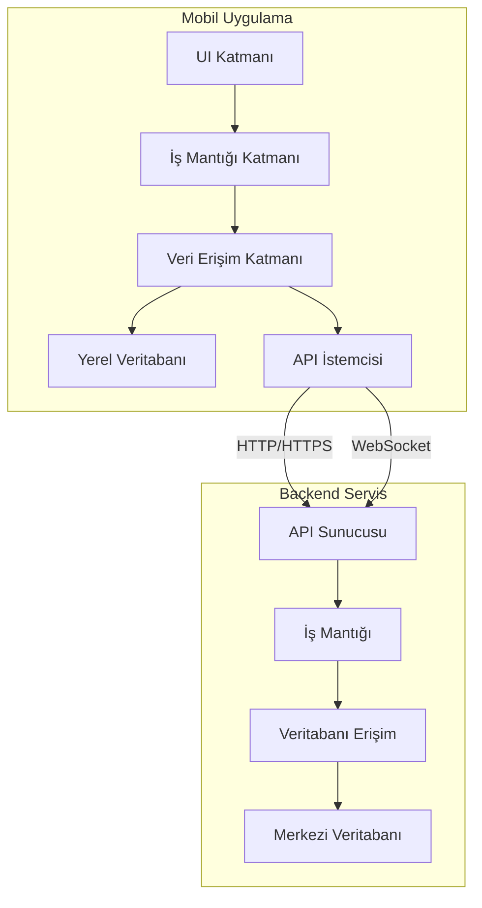
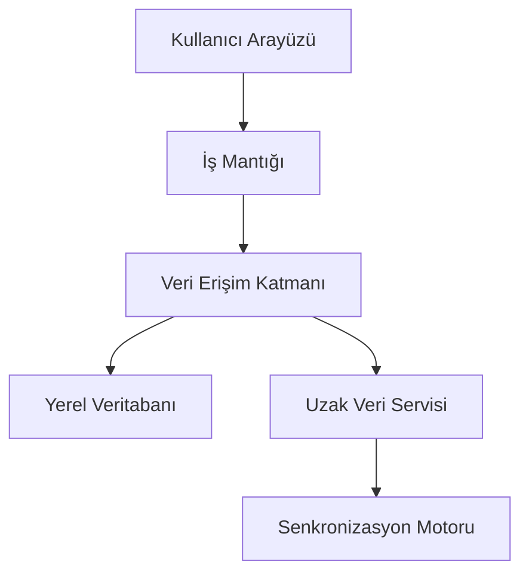
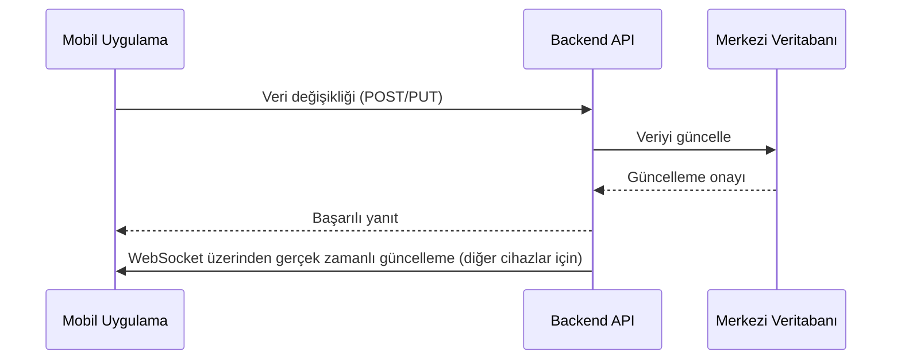

# RoxoePOS Mobil Uygulama Mimari Tasarım Özeti

## 1. Giriş

Bu belge, RoxoePOS sistemine mobil uygulama desteği eklemek için hazırlanan mimari tasarımın genel bir özetini sunar. Mobil uygulama, hem iOS hem de Android platformlarında çalışacak ve masaüstü versiyonu ile gerçek zamanlı senkronizasyon sağlayacaktır.

## 2. Mimari Genel Bakış

### 2.1 Genel Mimari

### 2.2 Katmanlı Yapı

## 3. Teknoloji Yığını

### 3.1 Mobil Uygulama Framework'ü
- **React Native**: Çapraz platform desteği
- **TypeScript**: Tip güvenliği

### 3.2 State Management
- **Redux Toolkit** veya **Zustand**: State yönetimi

### 3.3 Veritabanı
- **Yerel Veritabanı**: SQLite (React Native SQLite Storage)
- **Merkezi Veritabanı**: PostgreSQL veya Firebase Realtime Database

### 3.4 API ve Senkronizasyon
- **REST API**: Temel CRUD işlemleri için
- **WebSocket**: Gerçek zamanlı güncellemeler için

## 4. Veri Senkronizasyonu

### 4.1 Senkronizasyon Stratejisi
- **Optimistik UI**: Kullanıcı arayüzünü hemen güncelle
- **Çevrimdışı İlk**: Verileri yerel olarak sakla, bağlantı olduğunda senkronize et
- **Çatışma Çözümleme**: Son yazan kazan (last-write-wins) veya manuel çözümleme

### 4.2 Senkronizasyon Akışı

## 5. Kullanıcı Arayüzü Uyarlama

### 5.1 Tasarım Prensipleri
- **Duyarlı Tasarım**: Farklı ekran boyutlarına uyum
- **Platforma Özel Bileşenler**: Yerel görünüm ve his için
- **Basit ve Kullanışlı**: Mobil cihazlar için optimize edilmiş arayüz

### 5.2 Ana Ekranlar
- **Ana POS Ekranı**: Ürün grid'i, sepet, ödeme kontrolleri
- **Ürün Yönetimi**: Ürün listeleme, ekleme, düzenleme
- **Satış Geçmişi**: Geçmiş satışlar, detaylar
- **Raporlar**: Satış raporları, analizler
- **Ayarlar**: Uygulama ayarları, senkronizasyon yönetimi

## 6. Güvenlik Hususları

### 6.1 Kimlik Doğrulama
- **JWT Tabanlı Kimlik Doğrulama**: Güvenli oturum yönetimi
- **Biyometrik Kimlik Doğrulama**: Parmak izi veya yüz tanıma (isteğe bağlı)

### 6.2 Veri Güvenliği
- **Şifreleme**: Verileri şifrele (AES-256)
- **Güvenli İletişim**: HTTPS ve WSS (WebSocket Secure)
- **Yerel Veri Koruma**: Cihazda şifreleme ve güvenlik önlemleri

## 7. Performans Hususları

### 7.1 Optimizasyon Stratejileri
- **Veri Önbelleğe Alma**: Sık kullanılan verileri önbelleğe al
- **Lazy Loading**: Verileri ihtiyaç duyuldukça yükle
- **Resim Optimizasyonu**: Resimleri sıkıştır ve optimize et
- **Arka Plan Senkronizasyonu**: Veri senkronizasyonunu arka planda yap

### 7.2 Performans Metrikleri
- **Yükleme Süresi**: < 2 saniye
- **Senkronizasyon Gecikmesi**: < 1 saniye (gerçek zamanlı güncellemeler için)
- **Bellek Kullanımı**: < 100MB (normal kullanımda)

## 8. Uygulama Planı

### 8.1 Faz 1: Temel Altyapı
- React Native projesi kurulumu
- Temel navigasyon ve routing
- Yerel veritabanı entegrasyonu
- API istemcisi geliştirme

### 8.2 Faz 2: Temel İşlevler
- Ürün yönetimi ekranları
- Satış işlemleri ekranları
- Sepet ve ödeme işlemleri
- Temel raporlama

### 8.3 Faz 3: Senkronizasyon
- REST API entegrasyonu
- WebSocket entegrasyonu
- Çevrimdışı çalışma desteği
- Çatışma çözümleme mekanizması

### 8.4 Faz 4: Gelişmiş Özellikler
- Gelişmiş raporlama ve analiz
- Müşteri yönetimi
- Stok yönetimi
- Güvenlik ve performans optimizasyonları

### 8.5 Faz 5: Test ve Dağıtım
- Birim testleri
- Entegrasyon testleri
- Kullanıcı kabul testleri
- App Store ve Google Play dağıtımı

## 9. Sonuç

Bu mimari tasarım özeti, RoxoePOS sistemine mobil uygulama desteği eklemek için gereken temel yapıyı ve stratejileri tanımlar. Mobil uygulama, masaüstü versiyonu ile gerçek zamanlı senkronizasyon sağlayarak kullanıcılara esneklik ve hareketlilik sunacaktır.

## 10. İlgili Belgeler

- [Mobil Uygulama Mimarisi](mobile-app-architecture.md)
- [Kullanıcı Arayüzü Uyarlama Stratejisi](mobile-ui-adaptation.md)
- [Veri Senkronizasyonu Mekanizması](mobile-data-sync.md)
- [Güvenlik ve Performans Hususları](mobile-security-performance.md)