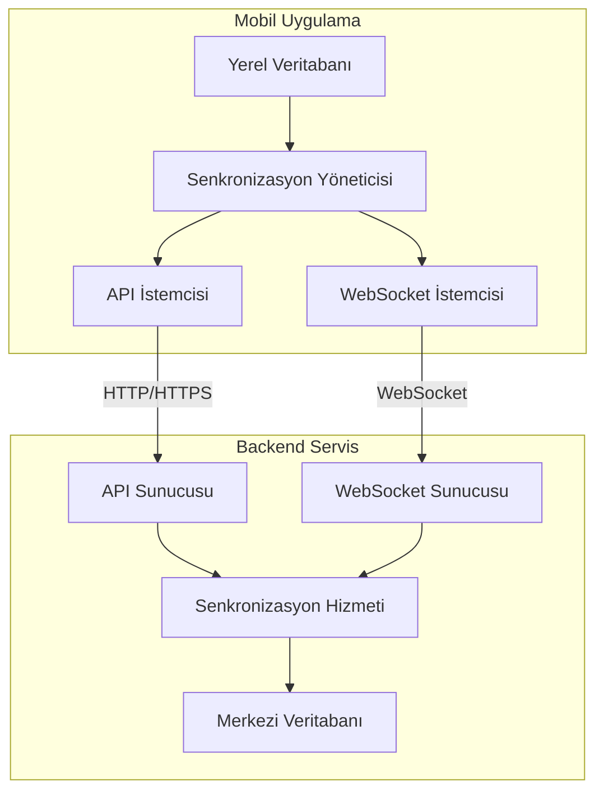
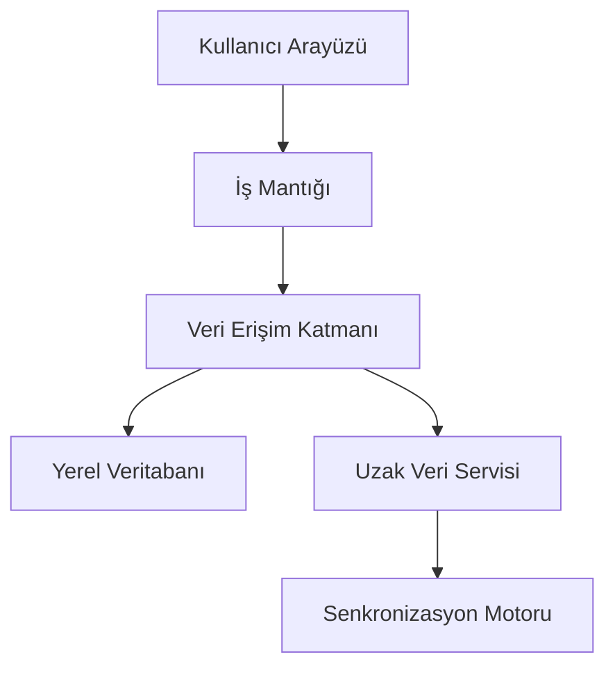
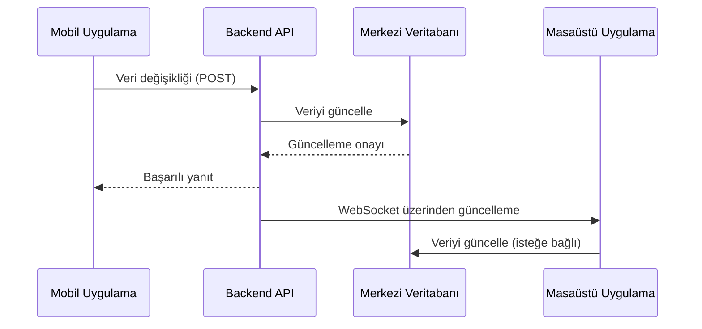
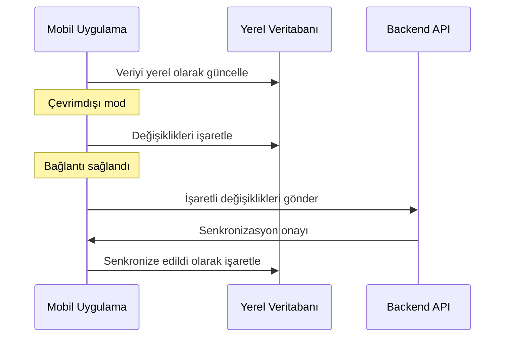
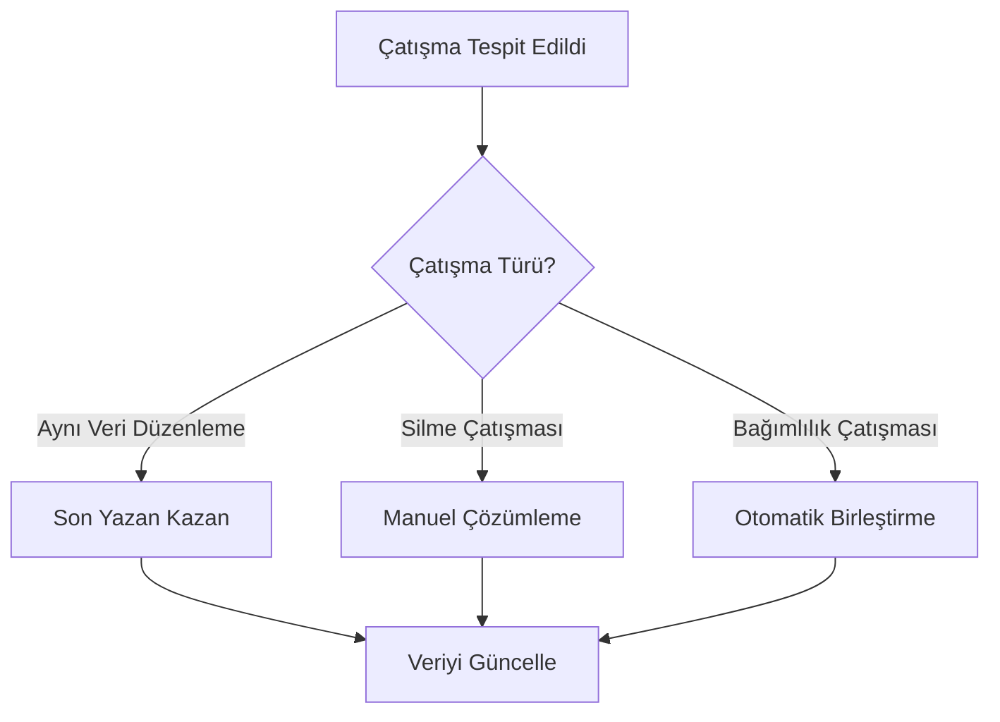

# RoxoePOS Mobil Veri Senkronizasyonu Mekanizması

## 1. Giriş

Bu belge, RoxoePOS mobil uygulamasının veri senkronizasyonu mekanizmasını detaylandırır. Mobil uygulama ile masaüstü versiyonu arasında gerçek zamanlı ve güvenilir veri senkronizasyonu sağlamak için gereken mimari ve teknik detayları içerir.

## 2. Senkronizasyon Gereksinimleri

### 2.1 Temel Gereksinimler
- **Gerçek Zamanlı Senkronizasyon**: Veri değişikliklerinin anında yansıtılması
- **Çevrimdışı Çalışma**: İnternet bağlantısı olmadan çalışabilme
- **Veri Tutarlılığı**: Tüm cihazlarda veri bütünlüğünün sağlanması
- **Çatışma Çözümleme**: Eşzamanlı değişikliklerin yönetimi

### 2.2 Veri Türleri
- Ürün verileri
- Satış işlemleri
- Müşteri bilgileri
- Stok bilgileri
- Raporlama verileri

## 3. Senkronizasyon Mimarisi

### 3.1 Genel Mimari



### 3.2 Katmanlı Yapı



## 4. Senkronizasyon Stratejisi

### 4.1 Optimistik UI Yaklaşımı
- Kullanıcı arayüzünü hemen güncelle
- Arka planda senkronizasyonu gerçekleştir
- Başarısızlık durumunda geri al seçeneği sun

### 4.2 Çevrimdışı İlk Yaklaşımı
- Verileri yerel olarak sakla
- Bağlantı olduğunda otomatik senkronize et
- Çatışma durumlarında kullanıcıya seçenek sun

### 4.3 Senkronizasyon Türleri
- **Tam Senkronizasyon**: Tüm verilerin senkronize edilmesi
- **Artımsal Senkronizasyon**: Sadece değişikliklerin senkronize edilmesi
- **Gerçek Zamanlı Senkronizasyon**: WebSocket üzerinden anlık güncellemeler

## 5. Veri Akışı

### 5.1 Temel Veri Akışı



### 5.2 Çevrimdışı Veri Akışı



## 6. Çatışma Çözümleme

### 6.1 Çatışma Türleri
- **Aynı Verinin Eşzamanlı Düzenlenmesi**: İki cihaz aynı veriyi aynı anda düzenler
- **Silme Çatışmaları**: Bir cihaz veriyi silerken diğer cihaz düzenler
- **Bağımlılık Çatışmaları**: İlişkili verilerin tutarsız güncellenmesi

### 6.2 Çözümleme Stratejileri
- **Son Yazan Kazan (Last-Write-Wins)**: En son değişiklik geçerli olur
- **Manuel Çözümleme**: Kullanıcıya çatışmayı çözmesi için seçenek sun
- **Otomatik Birleştirme**: Değişiklikleri otomatik olarak birleştir

### 6.3 Çatışma Çözümleme Akışı



## 7. Teknik Uygulama

### 7.1 Senkronizasyon Motoru

```typescript
// Örnek senkronizasyon motoru sınıfı
class SyncEngine {
  private localDb: LocalDatabase;
  private apiClient: ApiClient;
  private websocketClient: WebSocketClient;
  private syncQueue: SyncOperation[] = [];
  private isSyncing: boolean = false;

  constructor(localDb: LocalDatabase, apiClient: ApiClient, websocketClient: WebSocketClient) {
    this.localDb = localDb;
    this.apiClient = apiClient;
    this.websocketClient = websocketClient;

    // WebSocket olaylarını dinle
    this.websocketClient.on('message', this.handleWebSocketMessage);
    this.websocketClient.on('connect', this.handleWebSocketConnect);
  }

  // Veri değişikliklerini kuyruğa al
  public enqueueChange(operation: SyncOperation): void {
    this.syncQueue.push(operation);
    this.processQueue();
  }

  // Kuyruğu işle
  private async processQueue(): Promise<void> {
    if (this.isSyncing || this.syncQueue.length === 0) {
      return;
    }

    this.isSyncing = true;

    while (this.syncQueue.length > 0) {
      const operation = this.syncQueue.shift()!;
      try {
        await this.syncOperation(operation);
      } catch (error) {
        console.error('Senkronizasyon hatası:', error);
        // Hata durumunda kuyruğun başına geri al
        this.syncQueue.unshift(operation);
        break;
      }
    }

    this.isSyncing = false;
  }

  // Tekil işlemi senkronize et
  private async syncOperation(operation: SyncOperation): Promise<void> {
    // Yerel veritabanını güncelle
    await this.localDb.applyChange(operation);

    // Uzak sunucuya gönder
    const response = await this.apiClient.sync(operation);

    // Başarılı senkronizasyonu işaretle
    await this.localDb.markSynced(operation.id);
  }

  // WebSocket mesajlarını işle
  private handleWebSocketMessage = (message: any): void => {
    const remoteOperation = JSON.parse(message);
    this.enqueueChange(remoteOperation);
  };

  // WebSocket bağlantısını işle
  private handleWebSocketConnect = (): void => {
    // Bağlantı sağlandığında kuyruğu işle
    this.processQueue();
  };
}
```

### 7.2 Veri Modeli Senkronizasyonu

```typescript
// Örnek veri modeli senkronizasyonu
interface Product {
  id: string;
  name: string;
  price: number;
  stock: number;
  version: number; // Sürüm numarası için çatışma çözümleme
  lastUpdated: Date; // Son güncelleme tarihi
  synced: boolean; // Senkronize edildi mi?
}

interface SyncOperation {
  id: string;
  type: 'create' | 'update' | 'delete';
  entity: 'product' | 'sale' | 'customer';
  data: any;
  timestamp: Date;
  deviceId: string;
}
```

## 8. Güvenlik Hususları

### 8.1 Veri Şifreleme
- **Uçuşta Şifreleme**: HTTPS ve WSS kullanımı
- **Dinlenme Halinde Şifreleme**: Yerel veritabanı şifreleme
- **Uçtan Uca Şifreleme**: Hassas veriler için

### 8.2 Kimlik Doğrulama
- **JWT Tabanlı Kimlik Doğrulama**: Güvenli oturum yönetimi
- **Cihaz Kimlik Doğrulama**: Cihaz başına benzersiz kimlik
- **İki Faktörlü Kimlik Doğrulama**: İsteğe bağlı ek güvenlik

## 9. Performans Optimizasyonu

### 9.1 Veri Transferi Optimizasyonu
- **Sıkıştırma**: Verileri sıkıştırarak transfer et
- **Batch İşlemler**: Çoklu değişiklikleri tek seferde gönder
- **Delta Senkronizasyonu**: Sadece değişiklikleri gönder

### 9.2 Bellek Yönetimi
- **Önbelleğe Alma**: Sık kullanılan verileri önbelleğe al
- **Temizleme**: Kullanılmayan verileri temizle
- **Sınırlama**: Bellek kullanımını sınırla

## 10. Hata Yönetimi ve Kurtarma

### 10.1 Hata Türleri
- **Ağ Hataları**: Bağlantı kesilmesi, zaman aşımı
- **Veri Hataları**: Geçersiz veri formatı, tutarsız veriler
- **Sunucu Hataları**: API hataları, sunucu meşgul

### 10.2 Kurtarma Stratejileri
- **Otomatik Yeniden Deneme**: Belirli bir süre sonra yeniden dene
- **Kullanıcıya Bildirim**: Hata durumunda kullanıcıya bildir
- **Manuel Müdahale**: Kullanıcıya manuel senkronizasyon seçeneği sun

## 11. İzleme ve Günlük Kaydı

### 11.1 İzleme Metrikleri
- **Senkronizasyon Süresi**: İşlem başına geçen süre
- **Hata Oranı**: Başarısız senkronizasyon oranı
- **Veri Tutarsızlığı**: Çatışma oranı

### 11.2 Günlük Kaydı
- **Detaylı Günlükler**: Senkronizasyon işlemlerini günlükle
- **Hata Günlükleri**: Hataları ve kurtarma girişimlerini kaydet
- **Performans Günlükleri**: Performans metriklerini izle

## 12. Uygulama Planı

### 12.1 Faz 1: Temel Senkronizasyon
- Yerel veritabanı entegrasyonu
- Temel API istemcisi geliştirme
- Basit senkronizasyon mantığı

### 12.2 Faz 2: Gerçek Zamanlı Senkronizasyon
- WebSocket entegrasyonu
- Gerçek zamanlı güncelleme işleme
- Çatışma çözümleme mekanizması

### 12.3 Faz 3: Çevrimdışı Desteği
- Çevrimdışı değişiklik izleme
- Otomatik senkronizasyon tetikleme
- Çevrimdışı kullanıcı arayüzü güncellemeleri

### 12.4 Faz 4: Optimizasyon ve Test
- Performans optimizasyonları
- Hata yönetimi ve kurtarma
- Kapsamlı test ve doğrulama

## 13. Sonuç

Bu belge, RoxoePOS mobil uygulamasının veri senkronizasyonu mekanizmasını detaylı bir şekilde tanımlar. Gerçek zamanlı senkronizasyon, çevrimdışı çalışma desteği ve çatışma çözümleme mekanizmaları ile mobil uygulama, masaüstü versiyonu ile sorunsuz bir şekilde entegre olacak ve kullanıcılara kesintisiz bir deneyim sunacaktır.