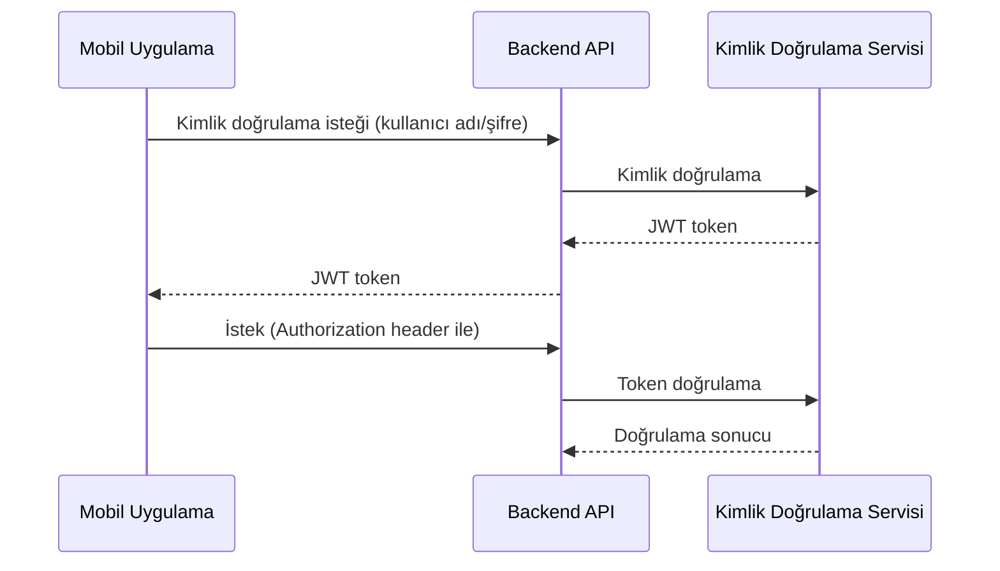

# RoxoePOS Mobil Uygulama Güvenlik ve Performans Hususları

## 1. Giriş

Bu belge, RoxoePOS mobil uygulamasının güvenlik ve performans gereksinimlerini detaylandırır. Mobil uygulamanın güvenli, hızlı ve verimli çalışmasını sağlamak için gereken teknik detayları içerir.

## 2. Güvenlik Hususları

### 2.1 Kimlik Doğrulama ve Yetkilendirme

#### 2.1.1 Kimlik Doğrulama Mekanizmaları
- **JWT Tabanlı Kimlik Doğrulama**: Güvenli oturum yönetimi
- **Biyometrik Kimlik Doğrulama**: Parmak izi veya yüz tanıma (isteğe bağlı)
- **Çok Faktörlü Kimlik Doğrulama**: Ek güvenlik katmanı

#### 2.1.2 Yetkilendirme
- **Rol Tabanlı Erişim Kontrolü (RBAC)**: Kullanıcı rolleri ve izinleri
- **Kaynak Tabanlı Yetkilendirme**: Veri erişim kontrolü

### 2.2 Veri Güvenliği

#### 2.2.1 Şifreleme
- **Uçuşta Şifreleme**: HTTPS ve WSS kullanımı
- **Dinlenme Halinde Şifreleme**: Yerel veritabanı şifreleme (AES-256)
- **Uçtan Uca Şifreleme**: Hassas veriler için

#### 2.2.2 Veri Koruma
- **Veri Maskeleme**: Hassas verileri maskeleme
- **Veri Doğrulama**: Giriş verilerini doğrulama
- **Veri Temizleme**: Kullanılmayan verileri temizleme

### 2.3 Ağ Güvenliği

#### 2.3.1 Güvenli İletişim
- **HTTPS**: Tüm API istekleri için
- **WSS**: WebSocket bağlantılar için
- **Sertifika Pimleme**: Güvenli bağlantı doğrulama

#### 2.3.2 Ağ Saldılarına Karşı Koruma
- **DDoS Koruma**: Hız sınırlama ve IP engelleme
- **SQL Enjeksiyonu Koruma**: Parametreli sorgular
- **CSRF Koruma**: CSRF token'ları

### 2.4 Cihaz Güvenliği

#### 2.4.1 Cihaz Kimlik Doğrulama
- **Cihaz Kimliği**: Benzersiz cihaz kimliği
- **Cihaz Doğrulama**: Cihaz doğrulama mekanizması

#### 2.4.2 Yerel Veri Koruma
- **Şifreleme**: Yerel veritabanı şifreleme
- **Güvenlik Duvarı**: Cihaz güvenlik duvarı
- **Uygulama Koruma**: Uygulama şifreleme ve imza

## 3. Performans Hususları

### 3.1 Performans Metrikleri
- **Yükleme Süresi**: < 2 saniye
- **Senkronizasyon Gecikmesi**: < 1 saniye (gerçek zamanlı güncellemeler için)
- **Bellek Kullanımı**: < 100MB (normal kullanımda)
- **Pil Tüketimi**: Minimum pil tüketimi

### 3.2 Optimizasyon Stratejileri

#### 3.2.1 Veri Önbelleğe Alma
- **Sık Kullanılan Verileri Önbelleğe Al**: Ürün listeleri, satış geçmişi
- **Önbellek Süresi**: Veri tazeliği ve önbellek süresi dengesi

#### 3.2.2 Lazy Loading
- **Verileri İhtiyaç Duyuldukça Yükle**: Sayfalama ve sonsuz kaydırma
- **Görüntü Optimizasyonu**: Resimleri sıkıştır ve optimize et

#### 3.2.3 Arka Plan Senkronizasyonu
- **Veri Senkronizasyonunu Arka Planda Yap**: Kullanıcı arayüzünü engelleme
- **Batch İşlemler**: Çoklu değişiklikleri tek seferde gönder

### 3.3 Bellek Yönetimi

#### 3.3.1 Bellek Sızıntılarını Önleme
- **Gereksiz Render'ları Önleme**: React.memo ve useMemo
- **Büyük Listeleri Parçalara Ayırma**: Sanal listeleme (FlatList)

#### 3.3.2 Bellek Temizleme
- **Kullanılmayan Verileri Temizleme**: Bellek yönetimi
- **Sınırlama**: Bellek kullanımını sınırlama

### 3.4 Pil Optimizasyonu

#### 3.4.1 Arka Plan İşlemleri
- **Arka Plan İşlemlerini Optimize Et**: Pil tüketimini minimize et
- **İşlem Sıklığı**: Arka plan işlem sıklığını optimize et

#### 3.4.2 Ağ Kullanımı
- **Ağ İsteklerini Optimize Et**: Veri transferini minimize et
- **Ağ Bağlantısını Yönet**: Ağ bağlantısını verimli kullan

## 4. Güvenlik ve Performans Testleri

### 4.1 Güvenlik Testleri

#### 4.1.1 Penetrasyon Testleri
- **Zafiyet Tarama**: Güvenlik zafiyetlerini tarama
- **Sızma Testleri**: Sızma testleri gerçekleştirme

#### 4.1.2 Kod İnceleme
- **Güvenlik Kod İnceleme**: Güvenlik kod inceleme
- **Statik Kod Analizi**: Statik kod analizi

### 4.2 Performans Testleri

#### 4.2.1 Yük Testleri
- **Yük Testleri**: Yük testleri gerçekleştirme
- **Stress Testleri**: Stress testleri gerçekleştirme

#### 4.2.2 Kullanıcı Deneyimi Testleri
- **Kullanıcı Deneyimi Testleri**: Kullanıcı deneyimi testleri
- **Gerçek Cihaz Testleri**: Gerçek cihazlarda test etme

## 5. Uygulama Planı

### 5.1 Faz 1: Temel Güvenlik
- Kimlik doğrulama ve yetkilendirme
- Veri şifreleme ve koruma
- Ağ güvenliği

### 5.2 Faz 2: Temel Performans
- Veri önbelleğe alma
- Lazy loading
- Arka plan senkronizasyonu

### 5.3 Faz 3: Gelişmiş Güvenlik
- Cihaz güvenliği
- Güvenlik testleri
- Kod inceleme

### 5.4 Faz 4: Gelişmiş Performans
- Bellek yönetimi
- Pil optimizasyonu
- Performans testleri

## 6. Sonuç

Bu belge, RoxoePOS mobil uygulamasının güvenlik ve performans gereksinimlerini detaylı bir şekilde tanımlar. Güvenlik ve performans optimizasyonları ile mobil uygulama, kullanıcılara güvenli, hızlı ve verimli bir deneyim sunacaktır.