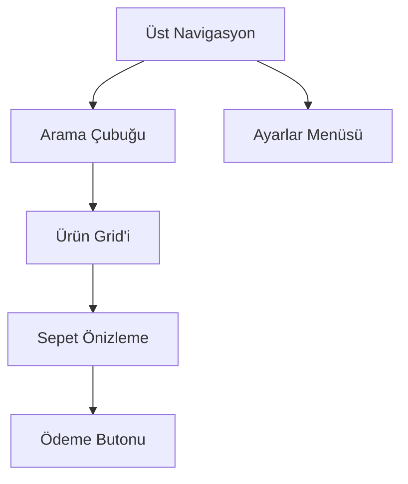
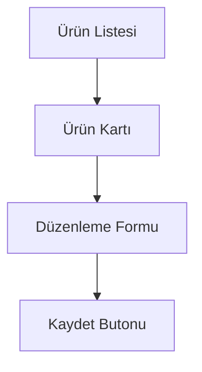
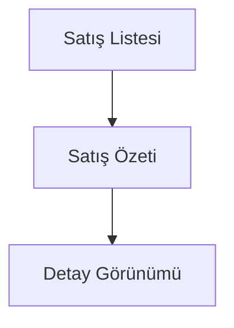
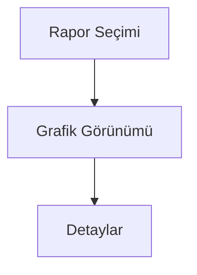
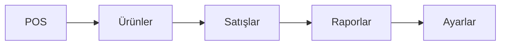

# RoxoePOS Mobil Kullanıcı Arayüzü Uyarlama Stratejisi

## 1. Giriş

Bu belge, RoxoePOS masaüstü uygulamasının kullanıcı arayüzünün mobil platformlara (iOS ve Android) nasıl uyarlanacağını detaylandırır. Mobil arayüz, kullanıcı deneyimini optimize etmek için özel olarak tasarlanmalı ve platforma özgü tasarım kılavuzlarına uygun olmalıdır.

## 2. Tasarım Prensipleri

### 2.1 Duyarlı Tasarım
- Farklı ekran boyutlarına ve oryantasyonlara uyum sağlama
- Dinamik layout sistemleri kullanma
- Ekran boyutuna göre bileşen boyutlandırma

### 2.2 Platforma Özel Bileşenler
- **iOS**: Cupertino tasarım dili
- **Android**: Material Design kılavuzları
- Yerel görünüm ve his için platforma özgü bileşenler kullanma

### 2.3 Basitlik ve Kullanılabilirlik
- Dokunmatik arayüzler için optimize edilmiş kontroller
- Büyük dokunma hedefleri (en az 48x48 piksel)
- Basit ve sezgisel navigasyon

## 3. Ana Ekranlar ve Uyarlamalar

### 3.1 Ana POS Ekranı

#### Masaüstü Versiyonu
- Geniş ekran için optimize edilmiş
- Ürün grid'i, sepet paneli ve ödeme kontrolleri yan yana
- Klavye ve fare girişine optimize edilmiş

#### Mobil Versiyonu


- Dikey kaydırılabilir ürün grid'i
- Altta sabit sepet önizleme ve ödeme butonu
- Dokunmatik optimizasyonlu ürün kartları
- Hızlı erişim için büyük butonlar

### 3.2 Ürün Yönetimi Ekranı

#### Masaüstü Versiyonu
- Tablo tabanlı ürün listeleme
- Geniş form alanları
- Çoklu düzenleme desteği

#### Mobil Versiyonu


- Kart tabanlı ürün listeleme
- Tek sütunlu düzenleme formu
- Kaydırılabilir alanlar için optimize edilmiş

### 3.3 Satış Geçmişi Ekranı

#### Masaüstü Versiyonu
- Tablo tabanlı satış listeleme
- Geniş filtreleme seçenekleri
- Detaylı satış bilgileri

#### Mobil Versiyonu


- Kart tabanlı satış özetleri
- Dokunmatik optimizasyonlu filtreleme
- Genişletilebilir satış detayları

### 3.4 Raporlar Ekranı

#### Masaüstü Versiyonu
- Grafikler ve tablolar için geniş alan
- Çoklu grafik gösterimi
- Detaylı raporlama seçenekleri

#### Mobil Versiyonu


- Tek grafik odaklı görüntüleme
- Kaydırılabilir rapor kategorileri
- Basit ve özlü grafik gösterimi

## 4. Navigasyon Stratejisi

### 4.1 Alt Sekme Navigasyonu


- Altta sabit sekme navigasyonu
- Platforma özgü ikonlar ve etiketler
- Hızlı geçiş için optimize edilmiş

### 4.2 Yığın Navigasyonu
- Ekranlar arasında yığın tabanlı geçiş
- Geri butonu desteği
- Geçiş animasyonları

## 5. Bileşen Uyarlamaları

### 5.1 Butonlar ve Kontroller
- **Masaüstü**: Küçük butonlar, fare hover efektleri
- **Mobil**: Büyük dokunma hedefleri, basınca animasyonlar

### 5.2 Form Elemanları
- **Masaüstü**: Çoklu sütunlu formlar
- **Mobil**: Tek sütunlu, kaydırılabilir formlar

### 5.3 Tablolar ve Listeler
- **Masaüstü**: Geniş tablolar, çoklu sütunlar
- **Mobil**: Kart tabanlı listeler, tek sütunlu görüntüleme

## 6. Performans Optimizasyonları

### 6.1 Görüntüleme Optimizasyonu
- Sanal listeleme (React Native FlatList)
- Görüntü önbelleğe alma
- Lazy loading için yer tutucular

### 6.2 Bellek Yönetimi
- Gereksiz render'ları önleme (React.memo)
- Büyük listeleri parçalara ayırma
- Arka plan işlemleri için optimize

## 7. Platforma Özel Uyarlamalar

### 7.1 iOS Uyarlamaları
- Cupertino tarzı navigasyon çubuğu
- iOS tarzı alert ve dialoglar
- Face ID/Touch ID entegrasyonu

### 7.2 Android Uyarlamaları
- Material Design navigasyon çubuğu
- Android tarzı snackbars ve toasts
- Parmak izi entegrasyonu

## 8. Uygulama Örnekleri

### 8.1 Ana POS Ekranı (Mobil)
```typescript
// Örnek React Native bileşeni
import React from 'react';
import { View, Text, FlatList, TouchableOpacity, StyleSheet } from 'react-native';

const POScreen = () => {
  const products = [
    { id: '1', name: 'Ürün 1', price: 10.99 },
    { id: '2', name: 'Ürün 2', price: 15.99 },
    // Daha fazla ürün...
  ];

  const renderProduct = ({ item }) => (
    <TouchableOpacity style={styles.productCard}>
      <Text style={styles.productName}>{item.name}</Text>
      <Text style={styles.productPrice}>{item.price} TL</Text>
    </TouchableOpacity>
  );

  return (
    <View style={styles.container}>
      <View style={styles.searchBar}>
        <Text>Arama...</Text>
      </View>
      <FlatList
        data={products}
        renderItem={renderProduct}
        keyExtractor={item => item.id}
        numColumns={2}
        contentContainerStyle={styles.productGrid}
      />
      <View style={styles.cartPreview}>
        <Text>Sepet: 0 ürün</Text>
        <TouchableOpacity style={styles.paymentButton}>
          <Text>Ödeme Yap</Text>
        </TouchableOpacity>
      </View>
    </View>
  );
};

const styles = StyleSheet.create({
  container: {
    flex: 1,
    backgroundColor: '#f5f5f5',
  },
  searchBar: {
    padding: 16,
    backgroundColor: 'white',
    borderBottomWidth: 1,
    borderBottomColor: '#eee',
  },
  productGrid: {
    padding: 8,
  },
  productCard: {
    flex: 1,
    margin: 4,
    padding: 16,
    backgroundColor: 'white',
    borderRadius: 8,
    alignItems: 'center',
  },
  productName: {
    fontSize: 16,
    fontWeight: 'bold',
  },
  productPrice: {
    fontSize: 14,
    color: '#666',
    marginTop: 4,
  },
  cartPreview: {
    position: 'absolute',
    bottom: 0,
    left: 0,
    right: 0,
    padding: 16,
    backgroundColor: 'white',
    borderTopWidth: 1,
    borderTopColor: '#eee',
    flexDirection: 'row',
    justifyContent: 'space-between',
    alignItems: 'center',
  },
  paymentButton: {
    padding: 12,
    backgroundColor: '#007bff',
    borderRadius: 8,
  },
});

export default POScreen;
```

### 8.2 Ürün Detay Ekranı (Mobil)
```typescript
import React from 'react';
import { View, Text, TextInput, Button, StyleSheet } from 'react-native';

const ProductDetailScreen = () => {
  const [name, setName] = React.useState('');
  const [price, setPrice] = React.useState('');
  const [stock, setStock] = React.useState('');

  return (
    <View style={styles.container}>
      <Text style={styles.label}>Ürün Adı</Text>
      <TextInput
        style={styles.input}
        value={name}
        onChangeText={setName}
        placeholder="Ürün adı girin"
      />

      <Text style={styles.label}>Fiyat</Text>
      <TextInput
        style={styles.input}
        value={price}
        onChangeText={setPrice}
        placeholder="Fiyat girin"
        keyboardType="numeric"
      />

      <Text style={styles.label}>Stok Miktarı</Text>
      <TextInput
        style={styles.input}
        value={stock}
        onChangeText={setStock}
        placeholder="Stok miktarı girin"
        keyboardType="numeric"
      />

      <Button title="Kaydet" onPress={() => {}} />
    </View>
  );
};

const styles = StyleSheet.create({
  container: {
    flex: 1,
    padding: 16,
    backgroundColor: 'white',
  },
  label: {
    fontSize: 16,
    fontWeight: 'bold',
    marginTop: 16,
    marginBottom: 8,
  },
  input: {
    height: 48,
    borderWidth: 1,
    borderColor: '#ddd',
    borderRadius: 8,
    paddingHorizontal: 12,
    fontSize: 16,
  },
});

export default ProductDetailScreen;
```

## 9. Test ve Doğrulama

### 9.1 Kullanıcı Testleri
- Farklı cihazlarda test etme
- Kullanıcı geri bildirimleri toplama
- Kullanılabilirlik testleri

### 9.2 Performans Testleri
- Ekran geçiş hızları
- Bellek kullanımı
- Pil tüketimi

## 10. Sonuç

Bu uyarlama stratejisi, RoxoePOS mobil uygulamasının kullanıcı arayüzünün nasıl tasarlanacağını ve uygulanacağını detaylandırır. Mobil arayüz, kullanıcı deneyimini optimize etmek için özel olarak tasarlanmalı ve platforma özgü tasarım kılavuzlarına uygun olmalıdır. Bu strateji, kullanıcıların mobil cihazlarda verimli ve etkili bir şekilde POS işlemlerini gerçekleştirmelerini sağlayacaktır.