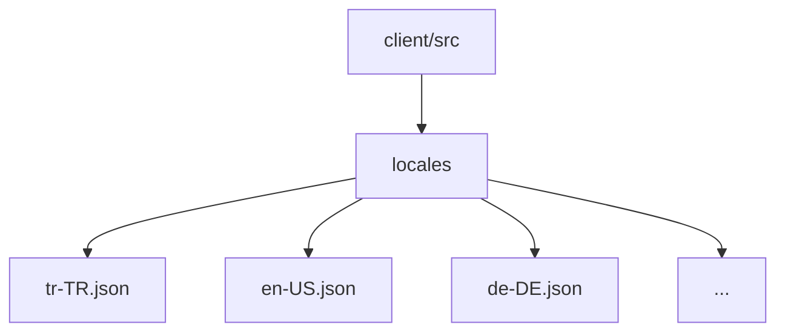

# POS Uygulaması Çoklu Dil Desteği Mimari Tasarımı

## 1. Giriş

Bu doküman, mevcut POS uygulamasına çoklu dil desteği eklemek için gereken mimari değişiklikleri ve tasarım kararlarını detaylandırır.

## 2. Mevcut Uygulama Analizi

Mevcut uygulama yapısı:
- React ve TypeScript tabanlı
- Ana bileşenler: `App.tsx`, `POSHeader.tsx`, `POSSettingsTab.tsx` vb.
- Context API kullanımı (`NotificationContext.tsx`)
- Sayfa tabanlı yönlendirme (`react-router-dom`)
- UI bileşenleri (`components/ui/` klasörü altında)

## 3. Çoklu Dil Desteği Mimarisi

### 3.1 Genel Yaklaşım

Çoklu dil desteği için aşağıdaki bileşenler eklenecek:
- Dil yönetim context'i
- Dil dosyaları ve çeviri mekanizması
- Dil değiştirme arayüzü
- UI bileşenlerinin dil uyumluluğu

### 3.2 Dil Dosyaları Organizasyonu



Her dil dosyası aşağıdaki yapıya sahip olacak:
```json
{
  "common": {
    "save": "Kaydet",
    "cancel": "İptal",
    "refresh": "Yenile"
  },
  "pos": {
    "newSale": "Yeni Satış",
    "cart": "Sepet",
    "payment": "Ödeme"
  },
  "settings": {
    "posSettings": "POS Ayarları",
    "connectionStatus": "Bağlantı Durumu"
  }
}
```

### 3.3 Dil Yönetim Sistemi

Yeni bir `LanguageContext` oluşturulacak:

```typescript
// client/src/contexts/LanguageContext.tsx
interface LanguageContextType {
  language: string;
  translations: Record<string, string>;
  changeLanguage: (lang: string) => void;
  availableLanguages: string[];
}

const LanguageContext = createContext<LanguageContextType | undefined>(undefined);
```

### 3.4 Dil Değiştirme Mekanizması

1. Kullanıcı arayüzünde dil seçici bileşeni
2. Seçilen dilin `localStorage`'da saklanması
3. Uygulama başlangıcında varsayılan dilin yüklenmesi
4. Dil değişikliklerinde tüm UI'nin güncellenmesi

### 3.5 UI Uyarlamaları

- Tüm statik metinler çeviri fonksiyonu ile sarılacak
- Dinamik içerikler için yer tutucular kullanılacak
- Sağdan sola diller için CSS uyarlamaları

## 4. Uygulama Adımları

1. **Dil Context'i Oluşturma**
   - Yeni `LanguageContext.tsx` dosyası
   - Dil yükleme ve değiştirme fonksiyonları

2. **Dil Dosyalarını Ekleme**
   - `locales/` klasörü oluşturma
   - Varsayılan dil dosyalarını ekleme

3. **Ana Uygulamayı Güncelleme**
   - `App.tsx`'de LanguageProvider ekleme
   - Dil yükleme mantığını entegre etme

4. **Bileşenleri Güncelleme**
   - `POSHeader.tsx` ve diğer bileşenleri çeviri desteği ile güncelleme
   - `POSSettingsTab.tsx` için dil seçici ekleme

5. **Ayarlar Sayfasını Güncelleme**
   - Dil seçimi için yeni sekme veya bölüm ekleme

## 5. Teknik Detaylar

### 5.1 Dil Yükleme Mantığı

```typescript
const loadLanguage = async (lang: string) => {
  try {
    const translations = await import(`../locales/${lang}.json`);
    return translations.default;
  } catch (error) {
    console.error(`Dil dosyası yüklenemedi: ${lang}`, error);
    return await loadLanguage('en-US'); // Varsayılan dile dön
  }
};
```

### 5.2 Çeviri Hook'u

```typescript
const useTranslation = () => {
  const context = useContext(LanguageContext);
  if (!context) {
    throw new Error('useTranslation must be used within a LanguageProvider');
  }

  const t = (key: string, params?: Record<string, string>) => {
    let translation = context.translations[key] || key;

    if (params) {
      Object.entries(params).forEach(([param, value]) => {
        translation = translation.replace(`{{${param}}}`, value);
      });
    }

    return translation;
  };

  return { t, language: context.language, changeLanguage: context.changeLanguage };
};
```

### 5.3 Dil Seçici Bileşeni

```typescript
const LanguageSelector = () => {
  const { language, changeLanguage, availableLanguages } = useTranslation();

  return (
    <select
      value={language}
      onChange={(e) => changeLanguage(e.target.value)}
      className="px-3 py-2 border rounded"
    >
      {availableLanguages.map(lang => (
        <option key={lang} value={lang}>
          {lang}
        </option>
      ))}
    </select>
  );
};
```

## 6. Entegrasyon Örneği

### 6.1 Mevcut Bileşen (Önce)

```typescript
// POSHeader.tsx
<button onClick={onStartNewSale}>
  Yeni Satış
</button>
```

### 6.2 Güncellenmiş Bileşen (Sonra)

```typescript
// POSHeader.tsx
const { t } = useTranslation();

<button onClick={onStartNewSale}>
  {t('pos.newSale')}
</button>
```

## 7. Test ve Doğrulama

1. Dil dosyalarının doğru yüklendiğinin test edilmesi
2. Dil değiştirme işlevselliğinin doğrulanması
3. Tüm UI bileşenlerinin çeviri desteğinin kontrol edilmesi
4. Performans testleri (dil değiştirme süresi)

## 8. Gelecek Geliştirmeler

1. Otomatik dil algılama (tarayıcı diline göre)
2. Kullanıcı tercihlerini sunucu ile senkronize etme
3. Topluluk çevirileri için destek
4. Çeviri eksikliklerini raporlama sistemi