# Alkolsüz İçecekler Sınıflandırma Sistemi

## 1. Genel Yapı

```mermaid
graph TD
    A[Alkolsüz İçecekler] --> B[Gazlı İçecekler]
    A --> C[Meyve Suları]
    A --> D[Enerji İçecekleri]
    A --> E[Çaylar]
    A --> F[Kahveler]
    A --> G[Süt ve Süt Ürünleri]
    A --> H[Su ve Spor İçecekleri]

    B --> B1[Kola]
    B --> B2[Limonata]
    B --> B3[Gazoz]
    B --> B4[Tonik Su]

    C --> C1[Portakal Suyu]
    C --> C2[Elma Suyu]
    C --> C3[Üzüm Suyu]
    C --> C4[Ananas Suyu]

    D --> D1[Red Bull]
    D --> D2[Monster]
    D --> D3[Burn]

    E --> E1[Siyah Çay]
    E --> E2[Yeşil Çay]
    E --> E3[Bitki Çayları]

    F --> F1[Filtre Kahve]
    F --> F2[Espresso]
    F --> F3[Latte]

    G --> G1[İnek Sütü]
    G --> G2[Badem Sütü]
    G --> G3[Yoğurt İçecekleri]

    H --> H1[Maden Suyu]
    H --> H2[Spor İçecekleri]
    H --> H3[Elektrolit Su]
```



## 2. Gazlı İçecekler

### 2.1 Kola
- **Tanım**: Karbonatlı, tatlandırılmış içecek
- **Markalar**:
  - Coca-Cola (Classic, Zero, Light)
  - Pepsi (Classic, Max, Diet)
  - Cola Turka

### 2.2 Limonata
- **Tanım**: Limon aromalı, karbonatlı içecek
- **Markalar**:
  - Fanta (Portakal, Limon)
  - Sprite
  - 7Up

### 2.3 Gazoz
- **Tanım**: Şekerli, aromalı, karbonatlı içecek
- **Markalar**:
  - Ülker Gazoz
  - Aroma Gazoz

### 2.4 Tonik Su
- **Tanım**: Kınakına aromalı, karbonatlı içecek
- **Markalar**:
  - Schweppes
  - Kinley

## 3. Meyve Suları

### 3.1 Portakal Suyu
- **Tanım**: Taze sıkılmış veya konsantre portakal suyu
- **Markalar**:
  - Tameki
  - Alpella
  - Cappy

### 3.2 Elma Suyu
- **Tanım**: Taze sıkılmış veya konsantre elma suyu
- **Markalar**:
  - Alpella
  - Cappy
  - Del Monte

### 3.3 Üzüm Suyu
- **Tanım**: Taze sıkılmış veya konsantre üzüm suyu
- **Markalar**:
  - Cappy
  - Del Monte

### 3.4 Ananas Suyu
- **Tanım**: Taze sıkılmış veya konsantre ananas suyu
- **Markalar**:
  - Cappy
  - Del Monte

## 4. Enerji İçecekleri

### 4.1 Red Bull
- **Tanım**: Kafeinli, enerji verici içecek
- **Ürünler**:
  - Red Bull Classic
  - Red Bull Sugarfree
  - Red Bull Zero

### 4.2 Monster
- **Tanım**: Kafeinli, enerji verici içecek
- **Ürünler**:
  - Monster Energy
  - Monster Zero Ultra
  - Monster Rehab

### 4.3 Burn
- **Tanım**: Kafeinli, enerji verici içecek
- **Ürünler**:
  - Burn Energy
  - Burn Zero

## 5. Çaylar

### 5.1 Siyah Çay
- **Tanım**: Fermente edilmiş çay yaprakları
- **Markalar**:
  - Lipton
  - Çaykur
  - Twinings

### 5.2 Yeşil Çay
- **Tanım**: Fermente edilmemiş çay yaprakları
- **Markalar**:
  - Lipton
  - Çaykur
  - Twinings

### 5.3 Bitki Çayları
- **Tanım**: Bitkisel karışımlardan yapılan çaylar
- **Markalar**:
  - Doğadan
  - Salus
  - Pukka

## 6. Kahveler

### 6.1 Filtre Kahve
- **Tanım**: Filtrelenmiş kahve
- **Markalar**:
  - Nescafé
  - Jacobs
  - Starbucks

### 6.2 Espresso
- **Tanım**: Yoğun, demlenmiş kahve
- **Markalar**:
  - Nescafé
  - Lavazza
  - Illy

### 6.3 Latte
- **Tanım**: Sütlü kahve
- **Markalar**:
  - Starbucks
  - Costa Coffee
  - Gloria Jean's

## 7. Süt ve Süt Ürünleri

### 7.1 İnek Sütü
- **Tanım**: Taze inek sütü
- **Markalar**:
  - Pınar
  - Sütaş
  - Sek

### 7.2 Badem Sütü
- **Tanım**: Bademden yapılan bitkisel süt
- **Markalar**:
  - Alpro
  - Silk
  - Oatly

### 7.3 Yoğurt İçecekleri
- **Tanım**: Yoğurt bazlı içecekler
- **Markalar**:
  - Pınar
  - Sütaş
  - Danone

## 8. Su ve Spor İçecekleri

### 8.1 Maden Suyu
- **Tanım**: Doğal kaynak suyu
- **Markalar**:
  - Erikli
  - Hayat
  - Sırma

### 8.2 Spor İçecekleri
- **Tanım**: Elektrolit içeren sporcu içecekleri
- **Markalar**:
  - Gatorade
  - Powerade
  - Isostar

### 8.3 Elektrolit Su
- **Tanım**: Elektrolit takviyeli su
- **Markalar**:
  - Gatorade
  - Powerade
  - Isostar

## 9. Marka Bazlı Detaylandırma Stratejisi

Her kategori için aşağıdaki yapı izlenmelidir:

```json
{
  "kategori_adi": {
    "alt_kategori": [
      {
        "marka": "Marka Adı",
        "urunler": [
          {
            "adi": "Ürün Adı",
            "aciklama": "Ürün açıklaması",
            "menşei": "Üretim yeri"
          }
        ]
      }
    ]
  }
}
```

## 10. Uygulama Önerileri

1. **Veri Tabanı Tasarımı**:
   - Her kategori için ayrı tablolar oluşturulmalı
   - Marka ve ürün bilgileri ilişkisel olarak saklanmalı
   - Ürün açıklamaları ve menşei bilgileri zorunlu alanlar olmalı

2. **Kullanıcı Arayüzü**:
   - Hiyerarşik kategori seçimi için ağaç yapısı kullanılması
   - Filtreleme için ürün türü seçeneği eklenmeli
   - Marka bazlı arama özelliği geliştirilmeli

3. **Raporlama**:
   - Satış analizi için kategori bazlı raporlar oluşturulmalı
   - En çok satılan markalar için sıralama yapısı eklenmeli
   - Ürün türü dağılımı için grafikler geliştirilmeli

## 11. Gelecek Geliştirmeler

- Uluslararası markaların yerel varyasyonlarının eklenmesi
- Organik ve doğal ürün kategorilerinin genişletilmesi
- Ürün öneri sistemi
- Besin değeri ve kalori bilgilerinin eklenmesi