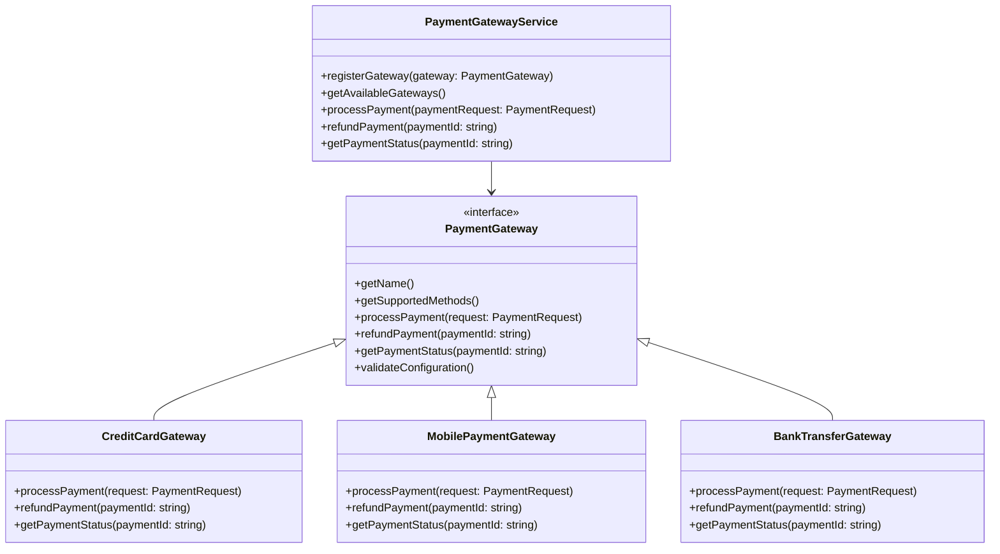
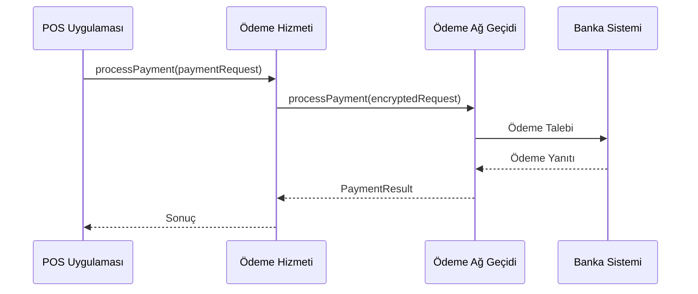
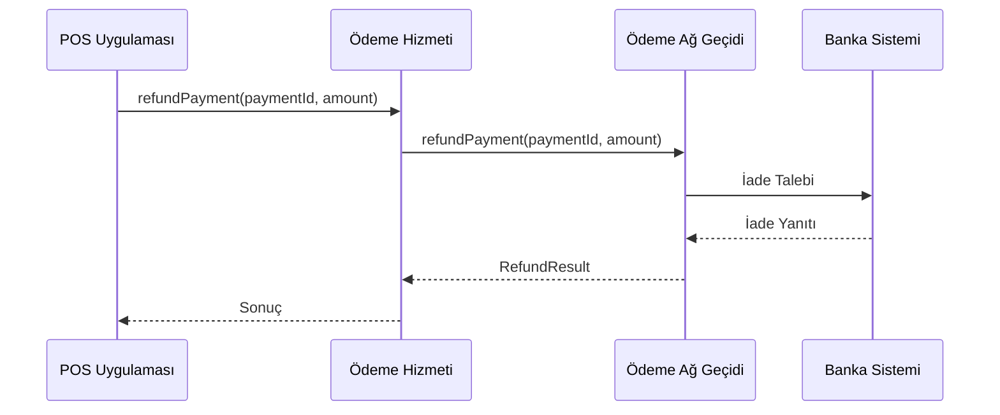

# POS Uygulaması - Ödeme Ağ Geçidi Entegrasyon Mimarisi

## 1. Giriş

Bu doküman, POS uygulaması ile çeşitli ödeme ağ geçitleri arasında esnek ve genişletilebilir bir entegrasyon mimarisi tasarımını detaylandırır. Mimarinin amacı, farklı ödeme yöntemlerini destekleyen, güvenli ve PCI uyumlu bir ödeme işleme çözümü sunmaktır.

## 2. Genel Bakış



## 3. Mimari Bileşenler

### 3.1 Ödeme Hizmeti

Merkezi ödeme hizmeti, tüm ödeme ağ geçidi entegrasyonlarını yönetir:

```typescript
// src/services/payment/PaymentGatewayService.ts
interface PaymentGateway {
  getName(): string;
  getSupportedMethods(): PaymentMethod[];
  processPayment(request: PaymentRequest): Promise<PaymentResult>;
  refundPayment(paymentId: string, amount?: number): Promise<RefundResult>;
  getPaymentStatus(paymentId: string): Promise<PaymentStatus>;
  validateConfiguration(): boolean;
}

class PaymentGatewayService {
  private gateways: Map<string, PaymentGateway> = new Map();
  private activeGateway: string | null = null;
  private securityService: PaymentSecurityService;

  constructor(securityService: PaymentSecurityService) {
    this.securityService = securityService;
  }

  registerGateway(gateway: PaymentGateway): void {
    if (gateway.validateConfiguration()) {
      this.gateways.set(gateway.getName(), gateway);
    } else {
      throw new Error(`Gateway ${gateway.getName()} configuration is invalid`);
    }
  }

  setActiveGateway(gatewayName: string): void {
    if (this.gateways.has(gatewayName)) {
      this.activeGateway = gatewayName;
    } else {
      throw new Error(`Gateway ${gatewayName} not found`);
    }
  }

  async processPayment(request: PaymentRequest): Promise<PaymentResult> {
    if (!this.activeGateway) {
      throw new Error('No active gateway selected');
    }

    // Güvenlik doğrulama
    this.securityService.validatePaymentRequest(request);

    return this.gateways.get(this.activeGateway)!.processPayment(request);
  }

  async refundPayment(paymentId: string, amount?: number): Promise<RefundResult> {
    if (!this.activeGateway) {
      throw new Error('No active gateway selected');
    }
    return this.gateways.get(this.activeGateway)!.refundPayment(paymentId, amount);
  }
}
```

### 3.2 Ödeme Ağ Geçidi Adapterları

Her ödeme yöntemi için özel gateway sınıfları:

```typescript
// src/services/payment/gateways/CreditCardGateway.ts
class CreditCardGateway implements PaymentGateway {
  private config: CreditCardConfig;
  private securityService: PaymentSecurityService;

  constructor(config: CreditCardConfig, securityService: PaymentSecurityService) {
    this.config = config;
    this.securityService = securityService;
  }

  getName(): string {
    return 'CreditCard';
  }

  getSupportedMethods(): PaymentMethod[] {
    return ['VISA', 'MASTERCARD', 'AMEX'];
  }

  async processPayment(request: PaymentRequest): Promise<PaymentResult> {
    // Kredi kartı ödeme işleme
    const encryptedData = this.securityService.encryptPaymentData(request);

    const result = await this.callGatewayApi('/payments/process', {
      ...request,
      encryptedData
    });

    return this.mapGatewayResponse(result);
  }

  private async callGatewayApi(endpoint: string, data: any): Promise<any> {
    // Ödeme ağ geçidine API çağrısı
  }
}
```

### 3.3 Veri Modelleri

Standart veri modelleri, farklı ödeme yöntemleri arasında uyumluluk sağlar:

```typescript
// src/models/payment/PaymentModels.ts
interface PaymentRequest {
  amount: number;
  currency: string;
  orderId: string;
  customerId: string;
  paymentMethod: PaymentMethod;
  cardDetails?: CardDetails; // Sadece kredi kartı için
  installment?: number; // Taksit sayısı
  metadata?: Record<string, any>;
}

interface PaymentResult {
  success: boolean;
  paymentId: string;
  transactionId: string;
  amount: number;
  currency: string;
  status: PaymentStatus;
  timestamp: Date;
  error?: PaymentError;
}

interface RefundResult {
  success: boolean;
  refundId: string;
  originalPaymentId: string;
  amount: number;
  timestamp: Date;
  error?: PaymentError;
}
```

## 4. Entegrasyon Akışları

### 4.1 Ödeme İşleme Akışı



### 4.2 İade İşleme Akışı



## 5. Güvenlik ve PCI Uyumluluğu

```typescript
// src/services/payment/PaymentSecurityService.ts
class PaymentSecurityService {
  private encryptionKey: string;

  constructor(encryptionKey: string) {
    this.encryptionKey = encryptionKey;
  }

  validatePaymentRequest(request: PaymentRequest): void {
    if (request.amount <= 0) {
      throw new Error('Invalid payment amount');
    }

    if (!request.orderId || !request.customerId) {
      throw new Error('Missing required payment information');
    }

    // PCI DSS uyumluluk kontrolleri
    this.validatePCICompliance(request);
  }

  encryptPaymentData(request: PaymentRequest): string {
    // Hassas verileri şifreleme
    const sensitiveData = {
      cardNumber: request.cardDetails?.number,
      cvv: request.cardDetails?.cvv,
      expiry: request.cardDetails?.expiry
    };

    return this.encrypt(JSON.stringify(sensitiveData));
  }

  private encrypt(data: string): string {
    // AES-256 şifreleme implementasyonu
  }

  private validatePCICompliance(request: PaymentRequest): void {
    // PCI DSS standartlarına uyumluluk kontrolleri
  }
}
```

## 6. Hata Yönetimi ve Yeniden Deneme Stratejisi

```typescript
// src/services/payment/PaymentErrorHandler.ts
class PaymentErrorHandler {
  private logger: Logger;
  private maxRetries: number;

  constructor(logger: Logger, maxRetries: number = 3) {
    this.logger = logger;
    this.maxRetries = maxRetries;
  }

  async handlePaymentError(
    error: Error,
    paymentRequest: PaymentRequest,
    retryCount: number = 0
  ): Promise<PaymentResult> {
    this.logger.error('Payment processing error', {
      error: error.message,
      paymentId: paymentRequest.orderId,
      retryCount,
      timestamp: new Date().toISOString()
    });

    if (retryCount < this.maxRetries && this.isRetryableError(error)) {
      const delay = this.calculateRetryDelay(retryCount);
      await this.delay(delay);

      try {
        const gateway = this.getPaymentGateway();
        return await gateway.processPayment(paymentRequest);
      } catch (retryError) {
        return this.handlePaymentError(retryError, paymentRequest, retryCount + 1);
      }
    }

    return this.createFailedPaymentResult(error, paymentRequest);
  }

  private isRetryableError(error: Error): boolean {
    // Yeniden denemeye uygun hata türlerini belirleme
    return error.message.includes('timeout') ||
           error.message.includes('network') ||
           error.message.includes('rate limit');
  }
}
```

## 7. Test ve Doğrulama

```typescript
// src/tests/payment/PaymentIntegration.test.ts
describe('Payment Gateway Integration', () => {
  let service: PaymentGatewayService;
  let mockGateway: Mock<PaymentGateway>;
  let securityService: PaymentSecurityService;

  beforeEach(() => {
    securityService = new PaymentSecurityService('test-key');
    service = new PaymentGatewayService(securityService);
    mockGateway = new MockPaymentGateway();

    service.registerGateway(mockGateway);
    service.setActiveGateway('TestGateway');
  });

  it('should process payment successfully', async () => {
    const paymentRequest: PaymentRequest = {
      amount: 100,
      currency: 'TRY',
      orderId: 'ORD-001',
      customerId: 'CUST-001',
      paymentMethod: 'VISA'
    };

    mockGateway.processPayment.mockResolvedValue({
      success: true,
      paymentId: 'PAY-001',
      transactionId: 'TRANS-001',
      status: 'COMPLETED'
    });

    const result = await service.processPayment(paymentRequest);

    expect(result.success).toBe(true);
    expect(result.paymentId).toBe('PAY-001');
  });

  it('should handle payment errors gracefully', async () => {
    const paymentRequest: PaymentRequest = {
      amount: 100,
      currency: 'TRY',
      orderId: 'ORD-001',
      customerId: 'CUST-001',
      paymentMethod: 'VISA'
    };

    mockGateway.processPayment.mockRejectedValue(new Error('Payment declined'));

    const result = await service.processPayment(paymentRequest);

    expect(result.success).toBe(false);
    expect(result.error).toBeDefined();
  });
});
```

## 8. Dağıtım Stratejisi

### 8.1 Kademeli Dağıtım

1. **Geliştirme Ortamı**: Gateway implementasyonları ve temel ödeme testleri
2. **Test Ortamı**: Gerçek ödeme sistemleriyle entegrasyon ve güvenlik testleri
3. **Canlı Ortam**: Kademeli müşteri dağıtımı ve geri bildirim toplama

### 8.2 Geri Alma Planı

- Ödeme işlemlerini devre dışı bırakma
- Manuel ödeme doğrulama araçları
- Önceki sürüme geri dönüş imkanı
- Müşteri ödeme bilgilerini koruma prosedürleri

## 9. Gelecek Geliştirmeler

- Yeni ödeme yöntemleri için gateway ekleme kolaylığı
- Gelişmiş dolandırıcılık tespit sistemleri
- Çoklu ödeme yöntemi desteği
- Kullanıcı dostu ödeme konfigürasyon arayüzü
- Gerçek zamanlı ödeme izleme ve raporlama

## 10. Sonuç

Bu mimari, POS uygulaması ile çeşitli ödeme ağ geçitleri arasında esnek ve genişletilebilir bir entegrasyon sağlar. Gateway tasarım deseni sayesinde, yeni ödeme yöntemleri kolayca eklenebilir ve mevcut yöntemler bağımsız olarak güncellenebilir. Güvenlik hizmeti ve hata yönetimi mekanizmaları, ödeme işlemlerinin güvenliğini ve güvenilirliğini artırır.