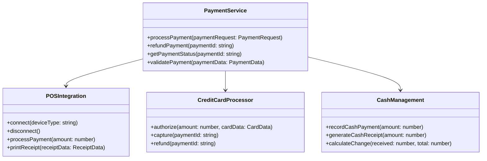
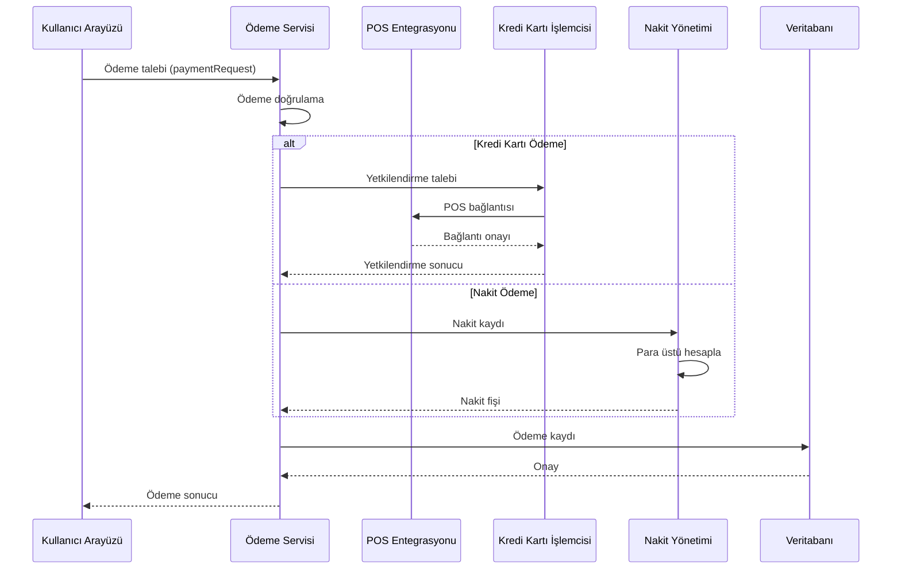
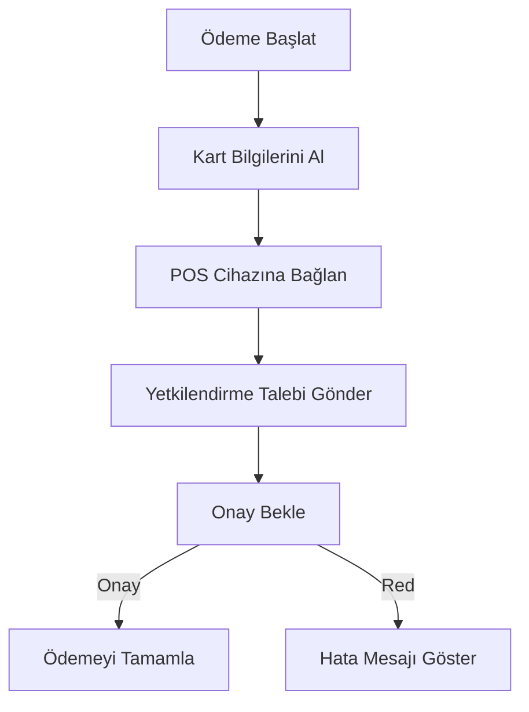
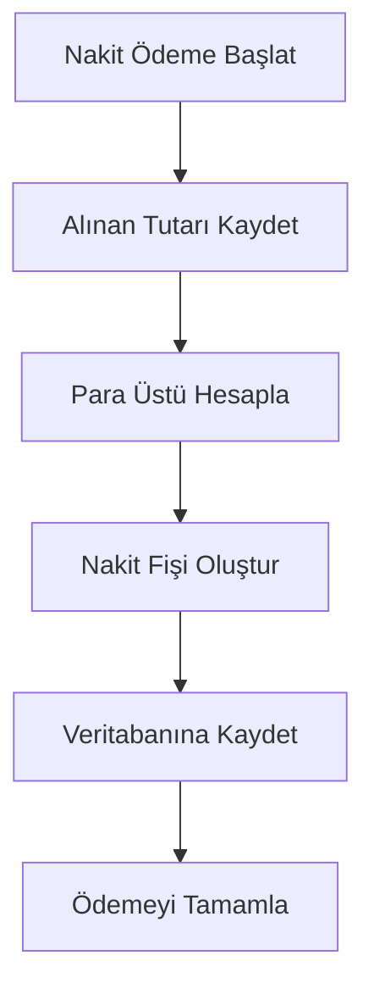
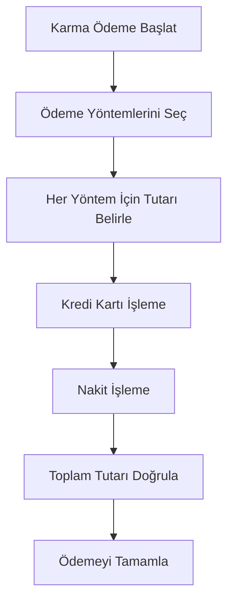

# POS Uygulaması Ödeme Entegrasyonu Tasarımı

## 1. Giriş

Bu doküman, POS uygulaması için geliştirilecek ödeme entegrasyon sisteminin detaylı tasarımını içerir. Sistem, kredi kartı, yazarkasa POS entegrasyonu, nakit ödeme ve karma ödeme senaryolarını destekleyecek şekilde tasarlanmıştır.

## 2. Mevcut Durum Analizi

### 2.1 Mevcut Ödeme Sistemi

- Temel nakit ve kart ödeme desteği
- Manuel ödeme girişleri
- Sınırlı POS entegrasyonu
- Temel ödeme doğrulama

### 2.2 İyileştirme Alanları

- Gelişmiş POS entegrasyonu
- Kredi kartı işleme optimizasyonu
- Karma ödeme senaryoları desteği
- Gerçek zamanlı ödeme doğrulama
- Mali veri çıkarma ve raporlama

## 3. Ödeme Entegrasyonu Gereksinimleri

### 3.1 Fonksiyonel Gereksinimler

1. **Kredi Kartı Entegrasyonu**: Banka POS sistemleriyle entegrasyon
2. **Yazarkasa Entegrasyonu**: Yazarkasa ile senkronizasyon
3. **Nakit Ödeme Yönetimi**: Nakit fişi oluşturma ve yönetimi
4. **Karma Ödeme Desteği**: Çoklu ödeme yöntemi kombinasyonları
5. **Gerçek Zamanlı Doğrulama**: Ödeme onayı ve geri bildirim

### 3.2 Teknik Gereksinimler

- Güvenli ödeme işleme
- PCI DSS uyumluluğu
- Hızlı ödeme işleme
- Veri bütünlüğü ve tutarlılığı
- Hata yönetimi ve yeniden deneme mekanizmaları

## 4. Ödeme Sistemi Mimarisi

### 4.1 Genel Mimari



### 4.2 Ödeme Akış Diyagramı



## 5. Ödeme Veri Modelleri

### 5.1 Ödeme Talebi

```typescript
interface PaymentRequest {
  orderId: string;
  amount: number;
  paymentMethod: 'credit_card' | 'cash' | 'mixed';
  cardDetails?: {
    number: string;
    expiry: string;
    cvv: string;
    holderName: string;
  };
  cashDetails?: {
    receivedAmount: number;
    changeAmount: number;
  };
  installment?: number;
  customerId?: string;
}
```

### 5.2 Ödeme Sonucu

```typescript
interface PaymentResult {
  success: boolean;
  paymentId: string;
  transactionId: string;
  amount: number;
  method: string;
  status: 'completed' | 'pending' | 'failed';
  timestamp: Date;
  receiptData?: ReceiptData;
  error?: PaymentError;
}
```

## 6. Kredi Kartı Entegrasyonu

### 6.1 Entegrasyon Akışı



### 6.2 Güvenlik Önlemleri

- PCI DSS uyumluluğu
- End-to-end şifreleme
- Tokenizasyon
- Güvenlik duvarı ve saldırı tespit sistemleri

## 7. Nakit Ödeme Yönetimi

### 7.1 Nakit İşleme Akışı



### 7.2 Nakit Fişi Yapısı

```typescript
interface CashReceipt {
  receiptId: string;
  transactionId: string;
  amount: number;
  receivedAmount: number;
  changeAmount: number;
  timestamp: Date;
  cashierId: string;
  registerId: string;
}
```

## 8. Karma Ödeme Senaryoları

### 8.1 Karma Ödeme Akışı



### 8.2 Karma Ödeme Veri Modeli

```typescript
interface MixedPayment {
  paymentId: string;
  totalAmount: number;
  methods: Array<{
    type: 'credit_card' | 'cash';
    amount: number;
    details: CreditCardDetails | CashDetails;
  }>;
  timestamp: Date;
  status: 'completed' | 'partial' | 'failed';
}
```

## 9. POS Entegrasyonu

### 9.1 Cihaz Entegrasyonu

```typescript
interface POSDevice {
  deviceId: string;
  deviceType: 'Ingenico' | 'Verifone' | 'Generic';
  connectionStatus: 'connected' | 'disconnected' | 'error';
  lastConnectionTime: Date;
  supportedFeatures: string[];
}
```

### 9.2 Entegrasyon Yöntemleri

1. **Doğrudan Bağlantı**: USB/Bluetooth üzerinden doğrudan bağlantı
2. **Ağ Tabanlı**: TCP/IP üzerinden ağ bağlantısı
3. **Manuel Mod**: Manuel ödeme girişleri

## 10. Mali Veri ve Raporlama

### 10.1 Mali Veri Yapısı

```typescript
interface FinancialData {
  transactionId: string;
  amount: number;
  taxAmount: number;
  paymentMethod: string;
  timestamp: Date;
  receiptNumber: string;
  fiscalData: {
    taxId: string;
    taxOffice: string;
    documentNumber: string;
  };
}
```

### 10.2 Raporlama Özellikleri

- Günlük ödeme raporları
- Ödeme yöntemi analizleri
- Mali veri ihracatı
- Vergi raporları

## 11. Uygulama Adımları

1. **Ödeme Servisi Geliştirme**: Temel ödeme işleme servisleri
2. **POS Entegrasyonu**: Cihaz bağlantı ve işleme
3. **Kredi Kartı İşleme**: Güvenli ödeme işleme
4. **Nakit Yönetimi**: Nakit fişi ve para üstü hesaplama
5. **Karma Ödeme Desteği**: Çoklu ödeme yöntemi entegrasyonu
6. **Test ve Doğrulama**: Güvenlik ve performans testleri

## 12. Gelecek Geliştirmeler

1. **Yeni Ödeme Yöntemleri**: Mobil ödeme, kripto para desteği
2. **Gelişmiş Güvenlik**: Biyometrik doğrulama
3. **Otomatik Uzlaşma**: Banka uzlaşma sistemleri
4. **Gerçek Zamanlı Analitik**: Ödeme trendleri ve tahminler

## 13. Sonuç

Bu ödeme entegrasyonu tasarımı, POS uygulamasına kapsamlı ve güvenli bir ödeme işleme altyapısı sunmayı hedefler. Kredi kartı, nakit ve karma ödeme senaryolarını destekleyen sistem, kullanıcı dostu bir arayüz ve güçlü raporlama özellikleri ile birleştirilmiştir.