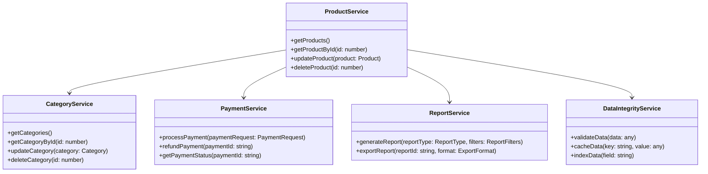
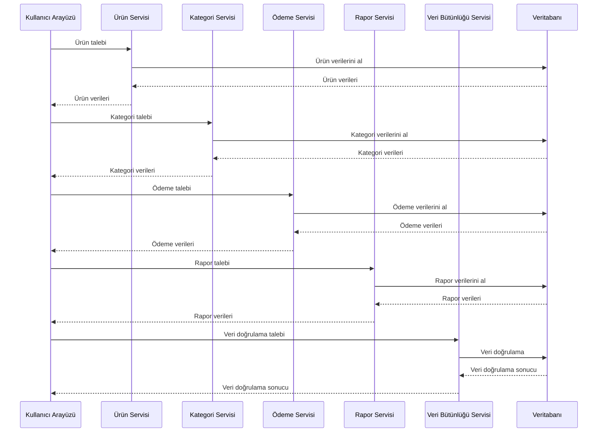
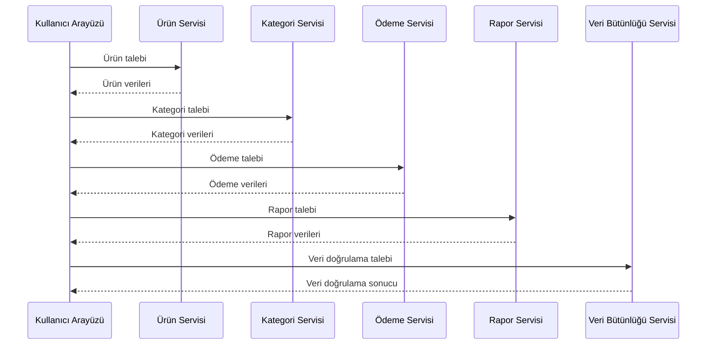
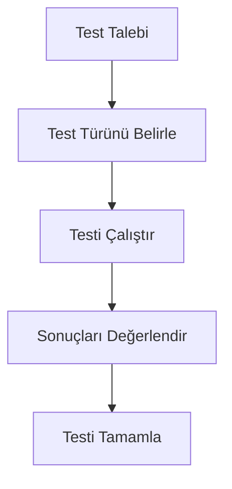
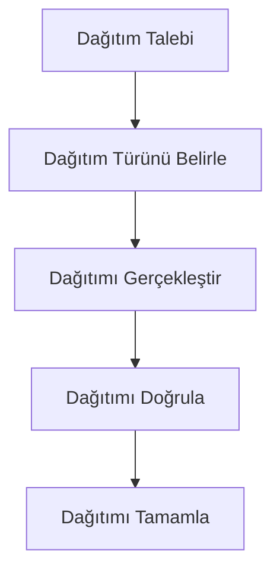
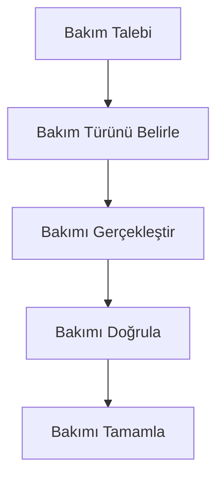
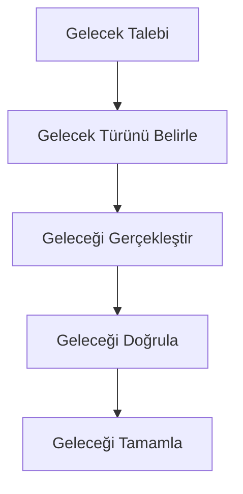

# POS Uygulaması Proje Ansiklopedisi

## 1. Giriş

Bu doküman, POS uygulaması için kapsamlı bir proje ansiklopedisi sunar. Proje ansiklopedisi, projenin tüm yönlerini detaylı bir şekilde belgeleyen ve sürekli güncellenen bir referans kaynağıdır.

## 2. Proje Genel Bakışı

### 2.1 Proje Hedefleri

- Kapsamlı bir POS uygulaması geliştirmek
- Kullanıcı dostu bir arayüz sunmak
- Güvenli ve verimli bir ödeme sistemi sağlamak
- Gelişmiş raporlama ve analiz özellikleri sunmak
- Veri bütünlüğü ve performans optimizasyonu sağlamak

### 2.2 Proje Kapsamı

- Ürün yönetimi
- Kategori yönetimi
- Ödeme entegrasyonu
- Raporlama sistemi
- Veri bütünlüğü ve performans optimizasyonu

## 3. Proje Yapısı

### 3.1 Dosya Yapısı

```
client/
├── src/
│   ├── architecture/
│   ├── components/
│   ├── services/
│   ├── types/
│   ├── utils/
│   └── ...
├── public/
└── ...
```

### 3.2 Ana Bileşenler

- **Ürün Yönetimi**: Ürün ekleme, düzenleme, silme
- **Kategori Yönetimi**: Kategori ekleme, düzenleme, silme
- **Ödeme Entegrasyonu**: Kredi kartı, nakit, karma ödeme
- **Raporlama Sistemi**: Fiş bazlı raporlama, filtreleme, ihracat
- **Veri Bütünlüğü**: Veri doğrulama, önbelleğe alma, indeksleme

## 4. Proje Mimarisi

### 4.1 Genel Mimari



### 4.2 Veri Akışı



## 5. Proje Bileşenleri

### 5.1 Ürün Yönetimi

- **Ürün Ekleme**: Yeni ürün ekleme
- **Ürün Düzenleme**: Mevcut ürün düzenleme
- **Ürün Silme**: Ürün silme
- **Ürün Listeleme**: Ürün listeleme ve filtreleme

### 5.2 Kategori Yönetimi

- **Kategori Ekleme**: Yeni kategori ekleme
- **Kategori Düzenleme**: Mevcut kategori düzenleme
- **Kategori Silme**: Kategori silme
- **Kategori Listeleme**: Kategori listeleme ve filtreleme

### 5.3 Ödeme Entegrasyonu

- **Kredi Kartı Ödeme**: Kredi kartı ödeme işleme
- **Nakit Ödeme**: Nakit ödeme işleme
- **Karma Ödeme**: Karma ödeme işleme
- **Ödeme Doğrulama**: Ödeme doğrulama ve onay

### 5.4 Raporlama Sistemi

- **Fiş Bazlı Raporlama**: Fiş bazlı raporlama
- **Filtreleme**: Gelişmiş filtreleme seçenekleri
- **İhracat**: Çeşitli formatlarda veri ihracatı
- **Görselleştirme**: Kullanıcı dostu görselleştirme

### 5.5 Veri Bütünlüğü

- **Veri Doğrulama**: Veri doğrulama mekanizmaları
- **Veri Önbelleğe Alma**: Veri önbelleğe alma stratejileri
- **Veri İndeksleme**: Veri indeksleme stratejileri
- **Veri Sıkıştırma**: Veri sıkıştırma stratejileri

## 6. Proje Entegrasyonu

### 6.1 Entegrasyon Noktaları

- **Ürün Yönetimi**: Ürün servisi ile entegrasyon
- **Kategori Yönetimi**: Kategori servisi ile entegrasyon
- **Ödeme Entegrasyonu**: Ödeme servisi ile entegrasyon
- **Raporlama Sistemi**: Rapor servisi ile entegrasyon
- **Veri Bütünlüğü**: Veri bütünlüğü servisi ile entegrasyon

### 6.2 Entegrasyon Akışı



## 7. Proje Testleri

### 7.1 Test Stratejileri

- **Birim Testleri**: Bileşenlerin birim testleri
- **Entegrasyon Testleri**: Bileşenlerin entegrasyon testleri
- **Kullanıcı Kabul Testleri**: Kullanıcı kabul testleri
- **Performans Testleri**: Performans testleri

### 7.2 Test Akışı



## 8. Proje Dağıtımı

### 8.1 Dağıtım Stratejileri

- **Geliştirme Ortamı**: Geliştirme ortamı dağıtımı
- **Test Ortamı**: Test ortamı dağıtımı
- **Canlı Ortam**: Canlı ortam dağıtımı

### 8.2 Dağıtım Akışı



## 9. Proje Bakımı

### 9.1 Bakım Stratejileri

- **Düzenli Güncellemeler**: Düzenli güncellemeler
- **Hata Düzeltmeleri**: Hata düzeltmeleri
- **Yeni Özellikler**: Yeni özellikler

### 9.2 Bakım Akışı



## 10. Proje Geleceği

### 10.1 Gelecek Geliştirmeler

- **Yeni Özellikler**: Yeni özellikler
- **Gelişmiş Analitik**: Gelişmiş analitik
- **Yapay Zeka Entegrasyonu**: Yapay zeka entegrasyonu
- **Bulut Entegrasyonu**: Bulut entegrasyonu

### 10.2 Gelecek Akışı



## 11. Sonuç

Bu proje ansiklopedisi, POS uygulaması için kapsamlı bir referans kaynağı sunar. Proje ansiklopedisi, projenin tüm yönlerini detaylı bir şekilde belgeleyen ve sürekli güncellenen bir referans kaynağıdır.