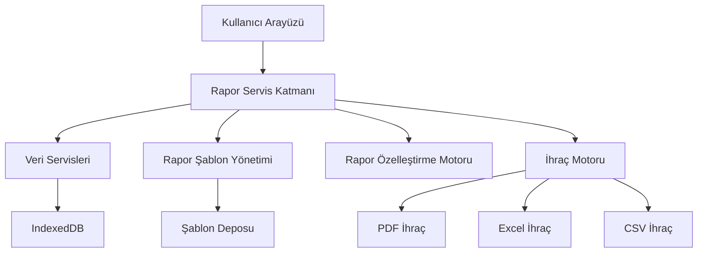
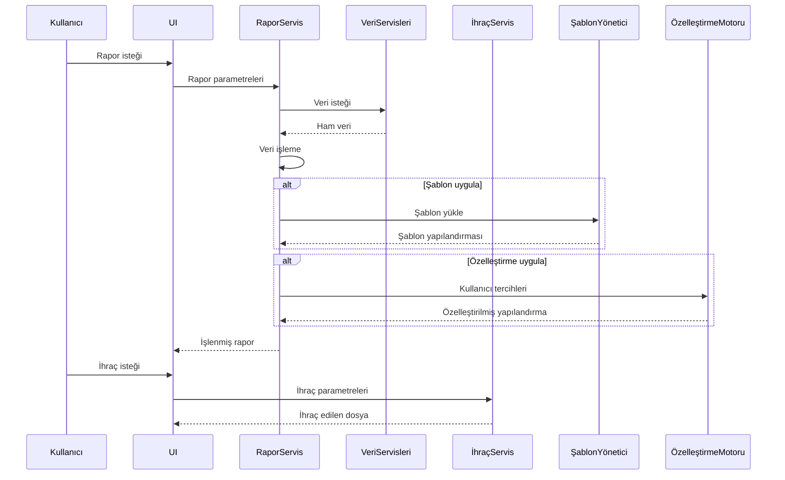

# POS Uygulaması Gelişmiş Raporlama Sistemi Mimari Tasarımı

## 1. Giriş

Bu doküman, mevcut POS uygulamasına gelişmiş raporlama özelliği eklemek için gereken mimari değişiklikleri ve tasarım kararlarını detaylandırır.

## 2. Mevcut Uygulama Analizi

Mevcut uygulama yapısı:
- React ve TypeScript tabanlı
- IndexedDB veritabanı kullanımı
- Modüler bileşen yapısı
- Mevcut raporlama: Temel satış özetleri ve grafikler
- Veri servisleri: `salesDB.ts`, `productDB.ts`, `cashRegisterDB.ts`

## 3. Raporlama Sistemi Mimarisi

### 3.1 Genel Yaklaşım

Gelişmiş raporlama sistemi için aşağıdaki bileşenler eklenecek:
- Rapor servis katmanı
- Rapor şablon yönetimi
- Rapor özelleştirme motoru
- Çoklu format ihraç motoru
- Kullanıcı arayüzü entegrasyonu

### 3.2 Sistem Bileşenleri



## 4. Veri Modeli ve API Tasarımı

### 4.1 Veri Kaynakları

Raporlama sistemi aşağıdaki veri kaynaklarını kullanacak:
- Satış verileri (`salesDB.ts`)
- Stok hareketleri (`productDB.ts`)
- Müşteri bilgileri
- Kasa hareketleri (`cashRegisterDB.ts`)
- Ürün kategorileri

### 4.2 API Endpoint'leri

```typescript
// Örnek API endpoint'leri
interface ReportingAPI {
  // Satış raporları
  GET /api/reports/sales:
    - Tarih aralığı filtresi
    - Ödeme yöntemi filtresi
    - Kategori filtresi
    - İndirim filtresi

  // Stok raporları
  GET /api/reports/inventory:
    - Ürün adı/marka filtresi
    - Stok seviyesi filtresi
    - Tarih aralığı filtresi

  // Müşteri raporları
  GET /api/reports/customers:
    - Satın alma sıklığı
    - Toplam harcama
    - Son satın alma tarihi

  // Kasa hareketleri raporları
  GET /api/reports/cash-flow:
    - Tarih aralığı
    - Hareket türü (açılış/kapanış)
    - Kasa numarası
}
```

### 4.3 Veri Modeli

```typescript
interface ReportData {
  id: string;
  type: 'sales' | 'inventory' | 'customers' | 'cash-flow';
  title: string;
  description: string;
  createdAt: Date;
  updatedAt: Date;
  filters: {
    dateRange?: { start: Date; end: Date };
    paymentMethod?: string[];
    categories?: string[];
    status?: string[];
  };
  data: any[]; // Rapor verisi
  metadata: {
    totalRecords: number;
    totalAmount?: number;
    currency: string;
  };
}
```

## 5. Rapor Şablon Yönetim Sistemi

### 5.1 Şablon Yapısı

```typescript
interface ReportTemplate {
  id: string;
  name: string;
  description: string;
  type: 'sales' | 'inventory' | 'customers' | 'cash-flow';
  version: string;
  createdAt: Date;
  updatedAt: Date;
  createdBy: string;
  isShared: boolean;
  configuration: {
    columns: string[];
    sorting: { field: string; direction: 'asc' | 'desc' };
    filters: any;
    chartType?: 'bar' | 'pie' | 'line' | 'table';
    colorScheme?: string;
  };
}
```

### 5.2 Şablon Yönetimi

- CRUD işlemleri (Oluşturma, Okuma, Güncelleme, Silme)
- Versiyon kontrolü
- Paylaşım mekanizması
- Şablon içe/dışa aktarımı

## 6. Rapor Özelleştirme Mekanizması

### 6.1 Özelleştirme Seçenekleri

- Sütun seçimi (göster/gizle)
- Sıralama seçenekleri
- Filtreler
- Grafik türü seçimi
- Renk şemaları
- Tarih formatları
- Para birimi gösterimi

### 6.2 Kullanıcı Tabanlı Özelleştirmeler

```typescript
interface UserCustomization {
  userId: string;
  reportType: string;
  preferences: {
    visibleColumns: string[];
    defaultSort: { field: string; direction: 'asc' | 'desc' };
    chartType: 'bar' | 'pie' | 'line' | 'table';
    colorScheme: string;
    dateFormat: string;
    currencyFormat: string;
  };
}
```

## 7. Rapor İhraç Formatları

### 7.1 Desteklenen Formatlar

1. **PDF**
   - Avantajlar: Profesyonel görünüm, yazdırma için ideal
   - Dezavantajlar: Veri analizi için uygun değil
   - Kullanım: Resmi raporlar, faturalar

2. **Excel (XLSX)**
   - Avantajlar: Veri analizi için ideal, formüller destekler
   - Dezavantajlar: Dosya boyutu büyük olabilir
   - Kullanım: Analitik raporlar, veri işleme

3. **CSV**
   - Avantajlar: Basit, evrensel uyumluluk
   - Dezavantajlar: Formatlama ve görsel öğeler desteklenmez
   - Kullanım: Veri aktarımı, basit raporlar

### 7.2 İhraç Optimizasyonu

- Dosya boyutu optimizasyonu
- Şablon tabanlı ihraç
- Toplu ihraç desteği
- İhraç işlemleri için ilerleme göstergesi

## 8. Kullanıcı Arayüzü Entegrasyonu

### 8.1 Ana Bileşenler

1. **Rapor Seçim Paneli**
   - Rapor türü seçimi
   - Hızlı erişim şablonları
   - Son kullanılan raporlar

2. **Filtreleme ve Özelleştirme Paneli**
   - Tarih aralığı seçici
   - Kategori filtresi
   - Ödeme yöntemi filtresi
   - Grafik türü seçici

3. **Rapor Görüntüleyici**
   - Etkileşimli grafikler
   - Veri tablosu
   - Özet istatistikler

4. **İhraç Kontrolleri**
   - Format seçimi
   - İhraç ayarları
   - İhraç geçmişi

### 8.2 Entegrasyon Noktaları

- Ana dashboard'a raporlama sekmesi eklenmesi
- Mevcut satış ve stok sayfalarına raporlama bağlantıları
- Ayarlar menüsüne rapor şablon yönetimi

## 9. Teknik Detaylar

### 9.1 Veri Akışı



### 9.2 Performans Optimizasyonu

- Veri önbelleğe alma
- Arka planda veri işleme
- İlerleme göstergeleri
- Büyük veri setleri için sayfalama

## 10. Uygulama Adımları

1. **Veri Servisleri Geliştirme**
   - Yeni raporlama servisleri oluşturma
   - Mevcut servisleri raporlama için uyarlama

2. **Rapor Motoru Oluşturma**
   - Veri işleme motoru
   - Şablon yönetim sistemi
   - Özelleştirme motoru

3. **İhraç Motoru Geliştirme**
   - PDF ihraç modülü
   - Excel ihraç modülü
   - CSV ihraç modülü

4. **Kullanıcı Arayüzü Entegrasyonu**
   - Yeni raporlama bileşenleri
   - Mevcut UI'ye entegrasyon
   - Kullanıcı deneyimi iyileştirmeleri

5. **Test ve Doğrulama**
   - Birim testleri
   - Entegrasyon testleri
   - Kullanıcı kabul testleri
   - Performans testleri

## 11. Gelecek Geliştirmeler

1. Otomatik rapor zamanlama
2. E-posta ile rapor gönderimi
3. Bulut tabanlı rapor paylaşımı
4. Yapay zeka tabanlı rapor analizi
5. Sesli rapor özetleri