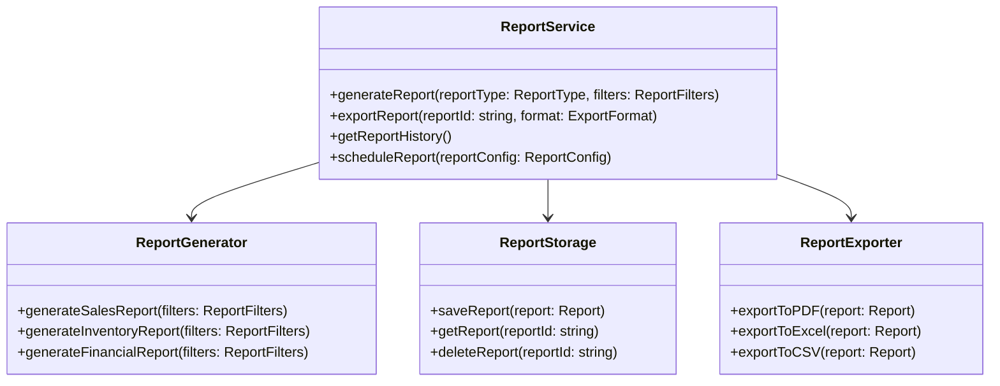
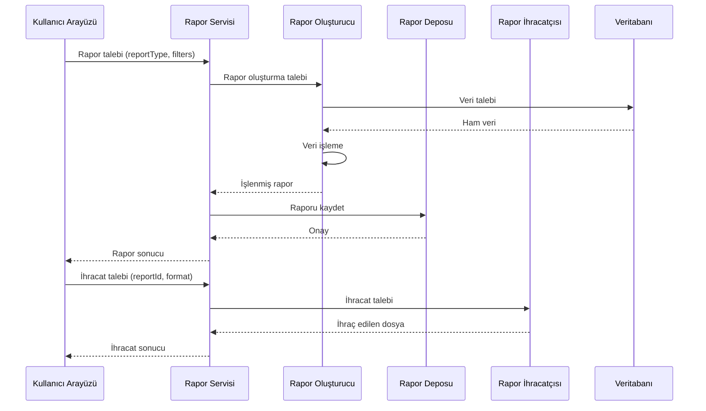
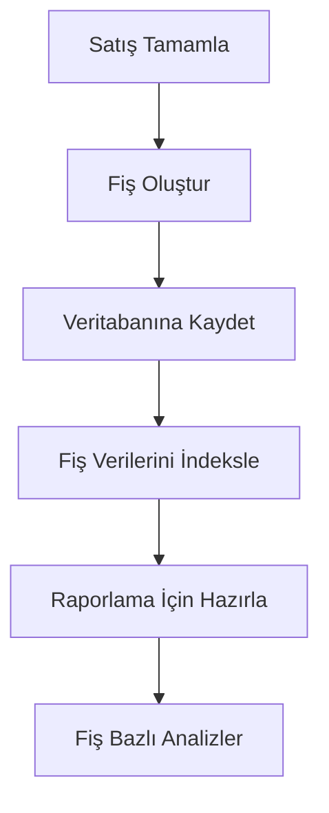
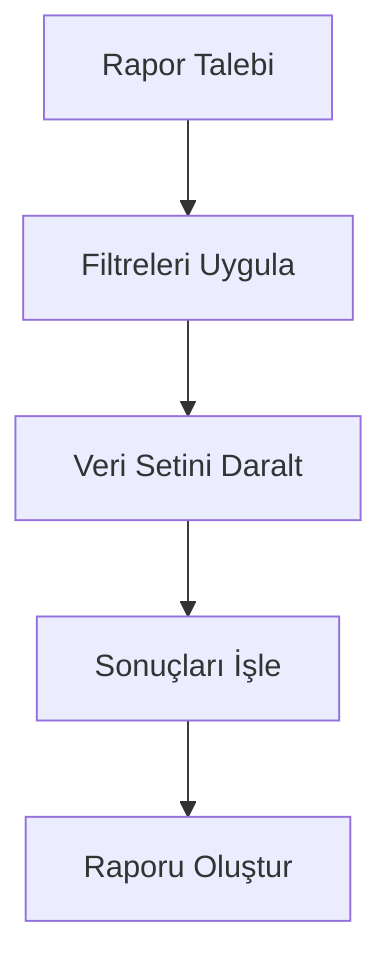
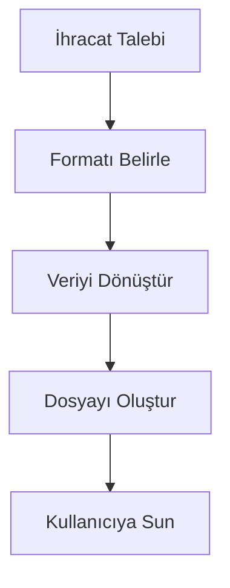
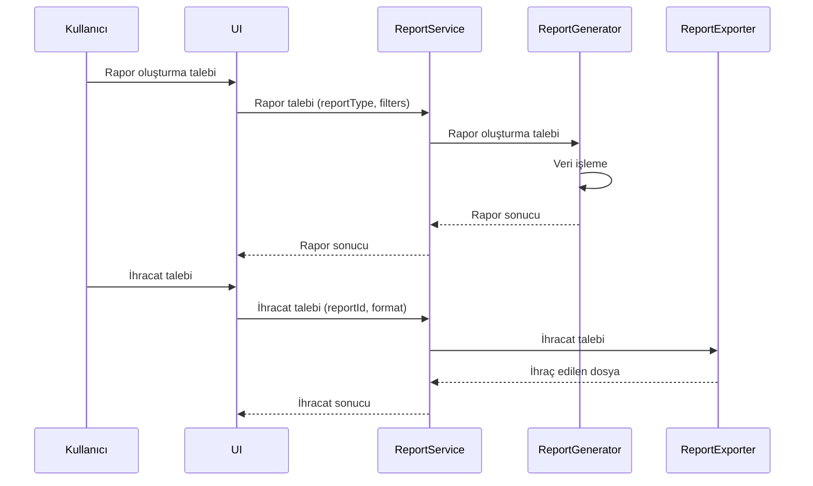

# POS Uygulaması Raporlama Sistemi Tasarımı

## 1. Giriş

Bu doküman, POS uygulaması için geliştirilecek gelişmiş raporlama sisteminin detaylı tasarımını içerir. Sistem, satışların tek tek fiş olarak kaydedilmesi, filtreleme ve analiz özelliklerini destekleyecek şekilde tasarlanmıştır.

## 2. Mevcut Durum Analizi

### 2.1 Mevcut Raporlama Özellikleri

- Temel satış raporları
- Sınırlı filtreleme seçenekleri
- Basit veri ihracatı
- Temel grafikler

### 2.2 İyileştirme Alanları

- Detaylı fiş bazlı raporlama
- Gelişmiş filtreleme ve analiz
- Esnek veri ihracatı
- Gerçek zamanlı raporlama
- Kullanıcı dostu görselleştirme

## 3. Raporlama Sistemi Gereksinimleri

### 3.1 Fonksiyonel Gereksinimler

1. **Fiş Bazlı Raporlama**: Her satışın ayrıntılı kaydı
2. **Gelişmiş Filtreleme**: Çoklu kriterlere göre filtreleme
3. **Esnek İhracat**: Çeşitli formatlarda veri ihracatı
4. **Gerçek Zamanlı Analiz**: Anlık satış verileri
5. **Kullanıcı Dostu Arayüz**: Kolay kullanım ve görselleştirme

### 3.2 Teknik Gereksinimler

- Verimli veri saklama ve erişim
- Hızlı rapor oluşturma
- Veri bütünlüğü ve tutarlılığı
- Ölçeklenebilirlik
- Güvenlik

## 4. Raporlama Sistemi Mimarisi

### 4.1 Genel Mimari



### 4.2 Raporlama Akış Diyagramı



## 5. Rapor Veri Modelleri

### 5.1 Rapor Talebi

```typescript
interface ReportRequest {
  reportType: 'sales' | 'inventory' | 'financial' | 'custom';
  filters: {
    dateRange?: { start: Date; end: Date };
    categories?: string[];
    products?: string[];
    paymentMethods?: string[];
    customers?: string[];
  };
  grouping?: 'daily' | 'weekly' | 'monthly' | 'yearly';
  format?: 'pdf' | 'excel' | 'csv' | 'json';
}
```

### 5.2 Rapor Sonucu

```typescript
interface ReportResult {
  reportId: string;
  reportType: string;
  generatedAt: Date;
  data: {
    rawData: any[];
    processedData: any[];
    statistics: ReportStatistics;
    charts: ReportChart[];
    tables: ReportTable[];
  };
  metadata: ReportMetadata;
}
```

## 6. Fiş Bazlı Raporlama

### 6.1 Fiş Veri Yapısı

```typescript
interface Receipt {
  receiptId: string;
  transactionId: string;
  date: Date;
  time: string;
  items: Array<{
    productId: string;
    productName: string;
    quantity: number;
    unitPrice: number;
    totalPrice: number;
    categoryId: string;
  }>;
  totalAmount: number;
  paymentMethod: string;
  customerId?: string;
  cashierId: string;
  registerId: string;
}
```

### 6.2 Fiş Raporlama Akışı



## 7. Gelişmiş Filtreleme

### 7.1 Filtreleme Kriterleri

```typescript
interface ReportFilters {
  dateRange?: { start: Date; end: Date };
  categories?: string[];
  products?: string[];
  paymentMethods?: string[];
  customers?: string[];
  minAmount?: number;
  maxAmount?: number;
  status?: string[];
  customFilters?: Record<string, any>;
}
```

### 7.2 Filtreleme Akışı



## 8. Veri İhracatı

### 8.1 İhracat Formatları

```typescript
enum ExportFormat {
  PDF = 'pdf',
  EXCEL = 'excel',
  CSV = 'csv',
  JSON = 'json',
  HTML = 'html'
}
```

### 8.2 İhracat Akışı



## 9. Kullanıcı Arayüzü Entegrasyonu

### 9.1 Ana Bileşenler

1. **Rapor Seçim Paneli**: Rapor türleri ve filtreler
2. **Rapor Görüntüleyici**: Rapor sonuçları ve görselleştirmeler
3. **İhracat Kontrolleri**: İhracat seçenekleri ve formatlar
4. **Rapor Geçmişi**: Önceki raporlara erişim

### 9.2 Kullanıcı Akışı



## 10. Performans Optimizasyonu

### 10.1 Optimizasyon Stratejileri

- Veri önbelleğe alma
- Arka planda veri işleme
- İlerleme göstergeleri
- Büyük veri setleri için sayfalama
- İhracat işlemleri için optimizasyon

### 10.2 Performans Metrikleri

- Rapor oluşturma süresi
- Veri işleme hızı
- İhracat süresi
- Bellek kullanımı

## 11. Uygulama Adımları

1. **Veri Modeli Geliştirme**: Raporlama veri yapılarını tanımlama
2. **Servis Katmanı**: Rapor oluşturma ve ihracat servisleri
3. **Veri Saklama**: Veritabanı şemalarını güncelleme
4. **Kullanıcı Arayüzü**: Raporlama bileşenlerini geliştirme
5. **Test ve Doğrulama**: Birim ve entegrasyon testleri

## 12. Gelecek Geliştirmeler

1. **Otomatik Raporlama**: Zamanlanmış raporlar
2. **Gelişmiş Analitik**: Yapay zeka tabanlı analizler
3. **Gerçek Zamanlı Görselleştirme**: Canlı veri panoları
4. **Bulut Entegrasyonu**: Bulut tabanlı rapor paylaşımı

## 13. Sonuç

Bu raporlama sistemi tasarımı, POS uygulamasına kapsamlı ve esnek bir raporlama altyapısı sunmayı hedefler. Fiş bazlı detaylı raporlama, gelişmiş filtreleme ve analiz özellikleri ile birleştirilen sistem, kullanıcı dostu bir arayüz ve güçlü veri ihracatı seçenekleri sunar.