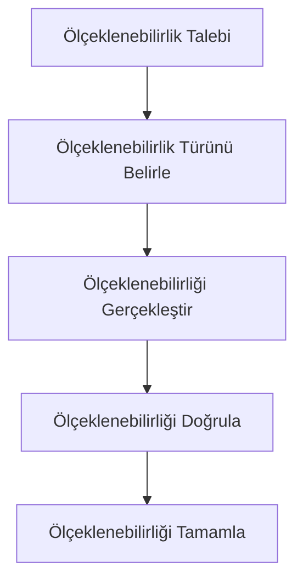
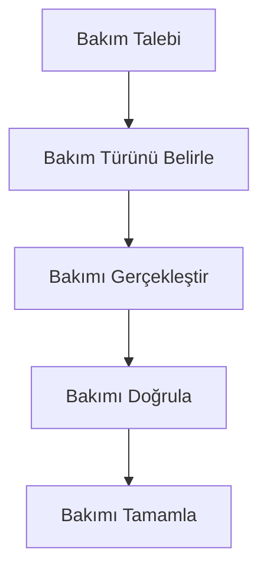
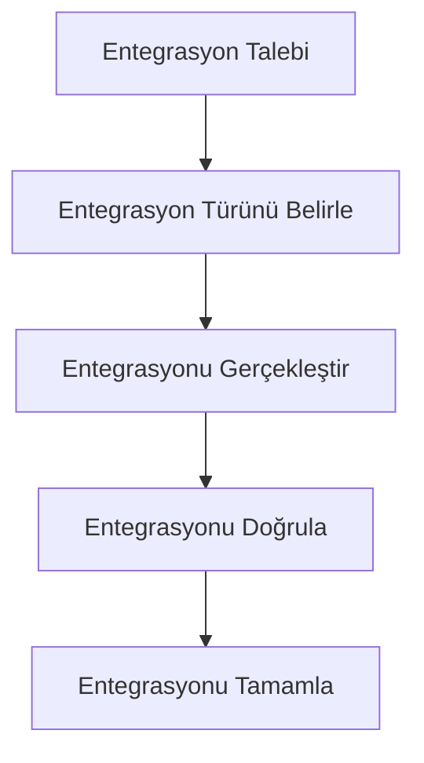
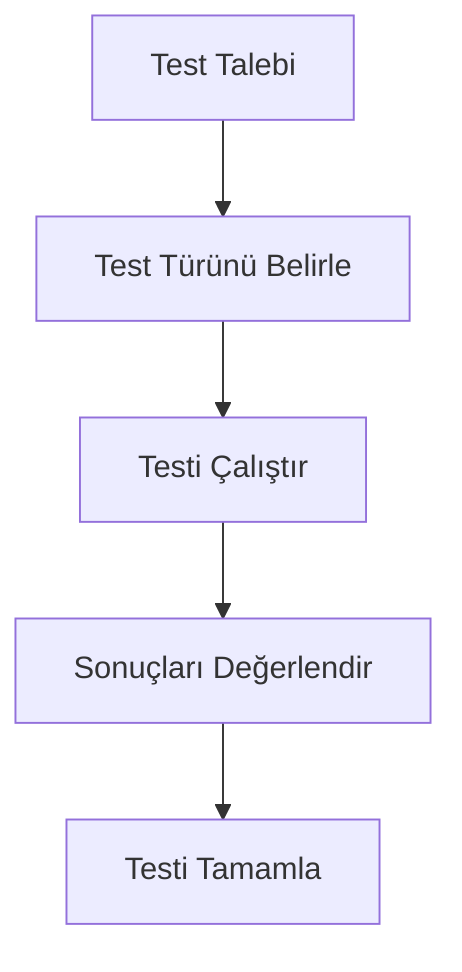
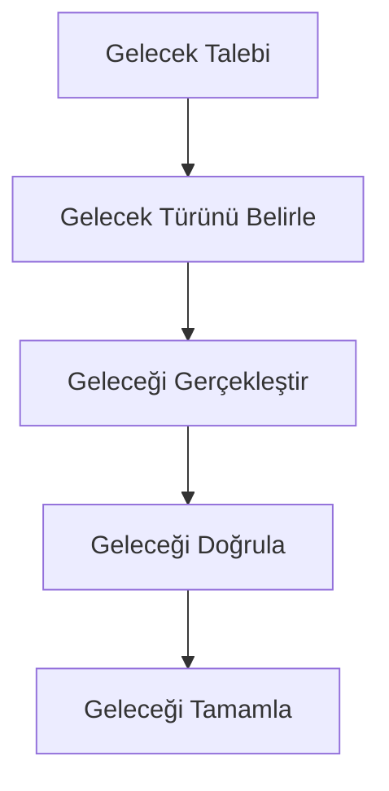

# POS Uygulaması Ölçeklenebilirlik ve Bakım Kolaylığı Önerileri

## 1. Giriş

Bu doküman, POS uygulaması için geliştirilecek ölçeklenebilirlik ve bakım kolaylığı önerilerini detaylı bir şekilde belgeleyen bir referans kaynağıdır.

## 2. Ölçeklenebilirlik Önerileri

### 2.1 Ölçeklenebilirlik Stratejileri

- **Yatay Ölçeklenebilirlik**: Yeni sunucular ekleyerek ölçeklenebilirlik
- **Dikey Ölçeklenebilirlik**: Mevcut sunucuların kaynaklarını artırarak ölçeklenebilirlik
- **Mikro Hizmetler**: Bileşenleri mikro hizmetlere ayırma
- **Bulut Entegrasyonu**: Bulut tabanlı hizmetler kullanma

### 2.2 Ölçeklenebilirlik Akışı

## 3. Bakım Kolaylığı Önerileri

### 3.1 Bakım Stratejileri

- **Düzenli Güncellemeler**: Düzenli güncellemeler
- **Hata Düzeltmeleri**: Hata düzeltmeleri
- **Yeni Özellikler**: Yeni özellikler
- **Dokümantasyon**: Kapsamlı dokümantasyon

### 3.2 Bakım Akışı

## 4. Ölçeklenebilirlik ve Bakım Kolaylığı Entegrasyonu

### 4.1 Entegrasyon Stratejileri

- **Düzenli Güncellemeler**: Düzenli güncellemeler
- **Hata Düzeltmeleri**: Hata düzeltmeleri
- **Yeni Özellikler**: Yeni özellikler
- **Dokümantasyon**: Kapsamlı dokümantasyon

### 4.2 Entegrasyon Akışı

## 5. Ölçeklenebilirlik ve Bakım Kolaylığı Testleri

### 5.1 Test Stratejileri

- **Birim Testleri**: Bileşenlerin birim testleri
- **Entegrasyon Testleri**: Bileşenlerin entegrasyon testleri
- **Kullanıcı Kabul Testleri**: Kullanıcı kabul testleri
- **Performans Testleri**: Performans testleri

### 5.2 Test Akışı

## 6. Ölçeklenebilirlik ve Bakım Kolaylığı Geleceği

### 6.1 Gelecek Geliştirmeler

- **Yeni Özellikler**: Yeni özellikler
- **Gelişmiş Analitik**: Gelişmiş analitik
- **Yapay Zeka Entegrasyonu**: Yapay zeka entegrasyonu
- **Bulut Entegrasyonu**: Bulut entegrasyonu

### 6.2 Gelecek Akışı

## 7. Sonuç

Bu ölçeklenebilirlik ve bakım kolaylığı önerileri dokümanı, POS uygulaması için ölçeklenebilirlik ve bakım kolaylığı önerilerini detaylı bir şekilde belgeleyen bir referans kaynağıdır.