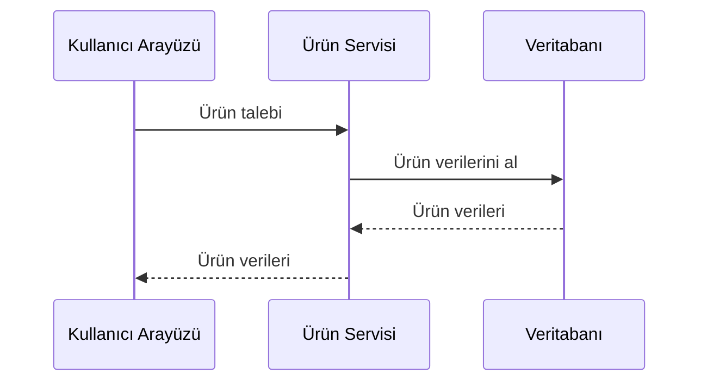
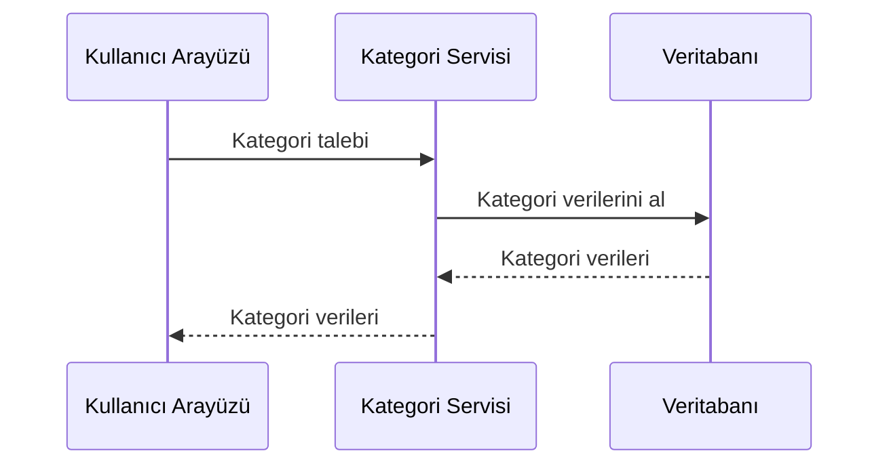
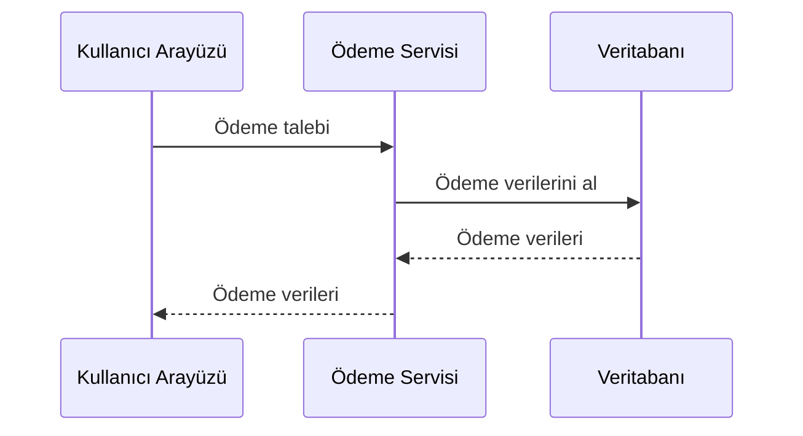
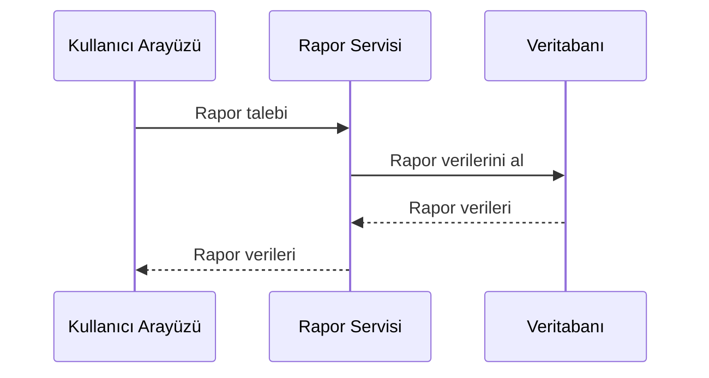
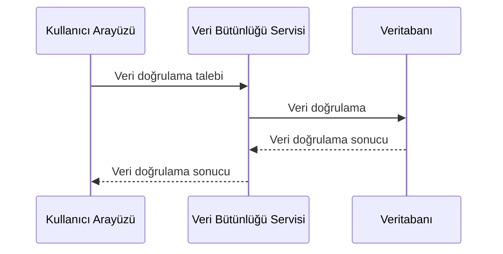
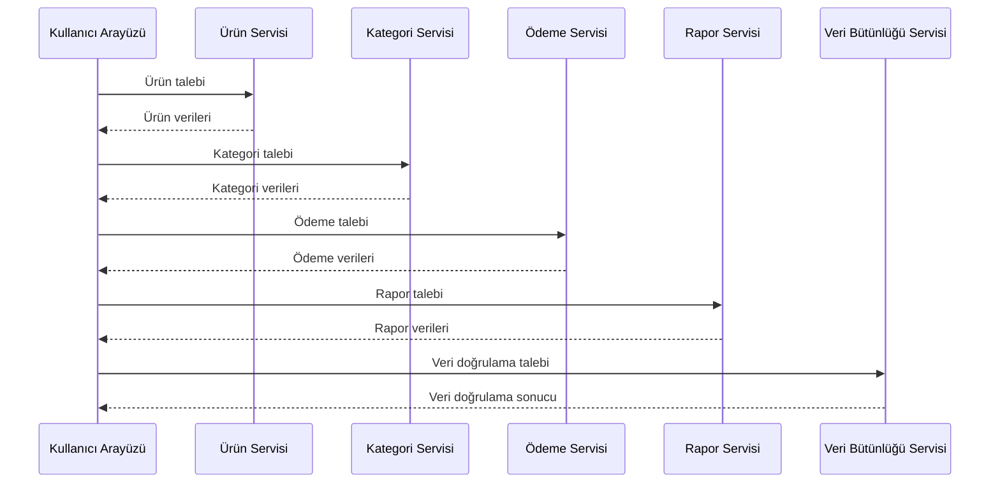
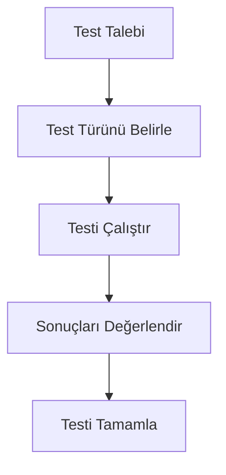
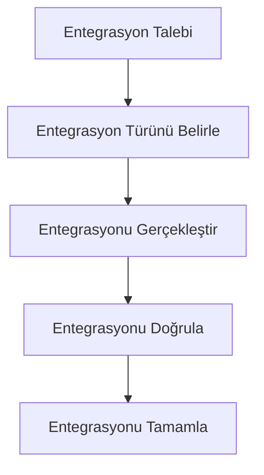
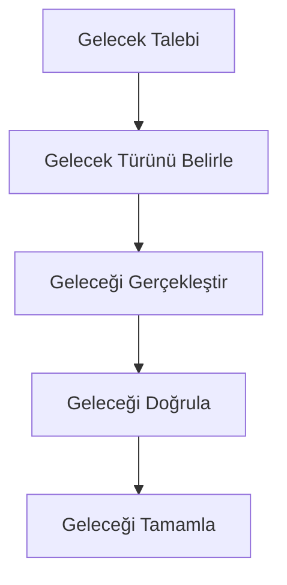

# POS Uygulaması Kullanıcı Arayüzü ve API Entegrasyonu

## 1. Giriş

Bu doküman, POS uygulaması için geliştirilecek kullanıcı arayüzü ve API entegrasyon noktalarını detaylı bir şekilde belgeleyen bir referans kaynağıdır.

## 2. Kullanıcı Arayüzü Bileşenleri

### 2.1 Ana Bileşenler

- **Ürün Yönetimi**: Ürün ekleme, düzenleme, silme
- **Kategori Yönetimi**: Kategori ekleme, düzenleme, silme
- **Ödeme Entegrasyonu**: Kredi kartı, nakit, karma ödeme
- **Raporlama Sistemi**: Fiş bazlı raporlama, filtreleme, ihracat
- **Veri Bütünlüğü**: Veri doğrulama, önbelleğe alma, indeksleme

### 2.2 Kullanıcı Arayüzü Yapısı

```
client/
├── src/
│   ├── components/
│   │   ├── pos/
│   │   ├── dashboard/
│   │   ├── modals/
│   │   └── ...
│   ├── services/
│   ├── types/
│   ├── utils/
│   └── ...
├── public/
└── ...
```

## 3. API Entegrasyon Noktaları

### 3.1 Ürün Yönetimi API

- **Ürün Ekleme**: `POST /api/products`
- **Ürün Düzenleme**: `PUT /api/products/{id}`
- **Ürün Silme**: `DELETE /api/products/{id}`
- **Ürün Listeleme**: `GET /api/products`

### 3.2 Kategori Yönetimi API

- **Kategori Ekleme**: `POST /api/categories`
- **Kategori Düzenleme**: `PUT /api/categories/{id}`
- **Kategori Silme**: `DELETE /api/categories/{id}`
- **Kategori Listeleme**: `GET /api/categories`

### 3.3 Ödeme Entegrasyonu API

- **Ödeme İşleme**: `POST /api/payments`
- **Ödeme İade**: `POST /api/payments/{id}/refund`
- **Ödeme Durumu**: `GET /api/payments/{id}/status`

### 3.4 Raporlama Sistemi API

- **Rapor Oluşturma**: `POST /api/reports`
- **Rapor İhracatı**: `GET /api/reports/{id}/export`
- **Rapor Geçmişi**: `GET /api/reports/history`

### 3.5 Veri Bütünlüğü API

- **Veri Doğrulama**: `POST /api/data/validate`
- **Veri Önbelleğe Alma**: `POST /api/data/cache`
- **Veri İndeksleme**: `POST /api/data/index`

## 4. Kullanıcı Arayüzü Entegrasyonu

### 4.1 Ürün Yönetimi Entegrasyonu



### 4.2 Kategori Yönetimi Entegrasyonu



### 4.3 Ödeme Entegrasyonu



### 4.4 Raporlama Sistemi Entegrasyonu



### 4.5 Veri Bütünlüğü Entegrasyonu



## 5. API Entegrasyonu

### 5.1 API Entegrasyon Noktaları

- **Ürün Yönetimi**: Ürün servisi ile entegrasyon
- **Kategori Yönetimi**: Kategori servisi ile entegrasyon
- **Ödeme Entegrasyonu**: Ödeme servisi ile entegrasyon
- **Raporlama Sistemi**: Rapor servisi ile entegrasyon
- **Veri Bütünlüğü**: Veri bütünlüğü servisi ile entegrasyon

### 5.2 API Entegrasyon Akışı



## 6. Kullanıcı Arayüzü Testleri

### 6.1 Test Stratejileri

- **Birim Testleri**: Bileşenlerin birim testleri
- **Entegrasyon Testleri**: Bileşenlerin entegrasyon testleri
- **Kullanıcı Kabul Testleri**: Kullanıcı kabul testleri
- **Performans Testleri**: Performans testleri

### 6.2 Test Akışı



## 7. API Testleri

### 7.1 Test Stratejileri

- **Birim Testleri**: API'nin birim testleri
- **Entegrasyon Testleri**: API'nin entegrasyon testleri
- **Kullanıcı Kabul Testleri**: API'nin kullanıcı kabul testleri
- **Performans Testleri**: API'nin performans testleri

### 7.2 Test Akışı


## 8. Kullanıcı Arayüzü ve API Entegrasyonu

### 8.1 Entegrasyon Stratejileri

- **Düzenli Güncellemeler**: Düzenli güncellemeler
- **Hata Düzeltmeleri**: Hata düzeltmeleri
- **Yeni Özellikler**: Yeni özellikler

### 8.2 Entegrasyon Akışı



## 9. Gelecek Geliştirmeler

### 9.1 Gelecek Geliştirmeler

- **Yeni Özellikler**: Yeni özellikler
- **Gelişmiş Analitik**: Gelişmiş analitik
- **Yapay Zeka Entegrasyonu**: Yapay zeka entegrasyonu
- **Bulut Entegrasyonu**: Bulut entegrasyonu

### 9.2 Gelecek Akışı



## 10. Sonuç

Bu kullanıcı arayüzü ve API entegrasyonu dokümanı, POS uygulaması için kullanıcı arayüzü ve API entegrasyon noktalarını detaylı bir şekilde belgeleyen bir referans kaynağıdır.