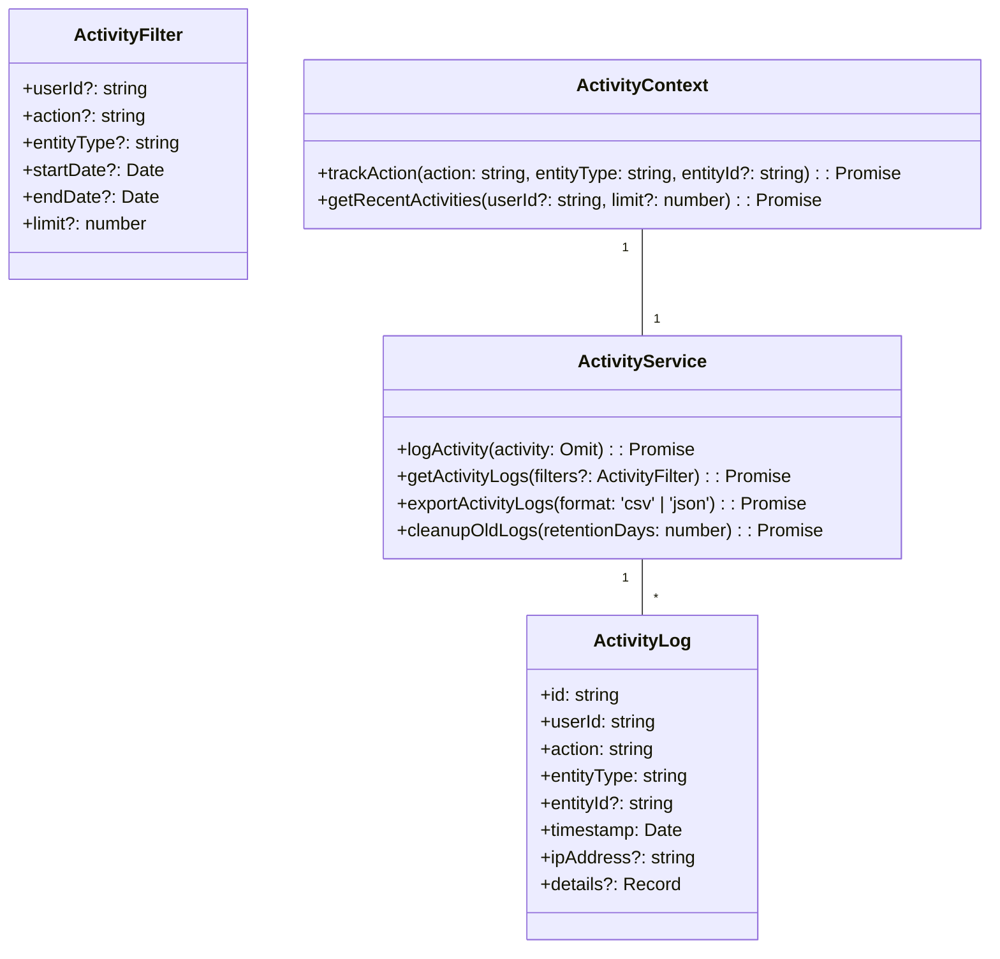

# Kullanıcı Aktivite İzleme Mekanizması Detaylı Tasarımı

## 1. Giriş

Bu doküman, POS uygulaması için kullanıcı aktivitelerinin izlenmesi ve denetim kaydı tutulması mekanizmasının detaylı tasarımını içerir.

## 2. Aktivite İzleme Mimarisi

### 2.1 Bileşenler



### 2.2 Aktivite Türleri

```typescript
enum ActivityAction {
  LOGIN = 'LOGIN',
  LOGOUT = 'LOGOUT',
  CREATE_USER = 'CREATE_USER',
  UPDATE_USER = 'UPDATE_USER',
  DELETE_USER = 'DELETE_USER',
  START_SALE = 'START_SALE',
  COMPLETE_SALE = 'COMPLETE_SALE',
  CANCEL_SALE = 'CANCEL_SALE',
  REFUND_TRANSACTION = 'REFUND_TRANSACTION',
  VIEW_REPORT = 'VIEW_REPORT',
  EXPORT_DATA = 'EXPORT_DATA',
  CHANGE_SETTING = 'CHANGE_SETTING',
  ACCESS_DENIED = 'ACCESS_DENIED'
}

enum EntityType {
  USER = 'USER',
  SALE = 'SALE',
  PRODUCT = 'PRODUCT',
  REPORT = 'REPORT',
  SETTING = 'SETTING',
  SYSTEM = 'SYSTEM'
}
```

## 3. Uygulama Detayları

### 3.1 Aktivite İzleme Context'i

```typescript
// client/src/contexts/ActivityContext.tsx
interface ActivityContextType {
  trackAction: (
    action: ActivityAction,
    entityType: EntityType,
    entityId?: string,
    details?: Record<string, any>
  ) => Promise<void>;
  getRecentActivities: (limit?: number) => Promise<ActivityLog[]>;
  getActivityByUser: (userId: string, limit?: number) => Promise<ActivityLog[]>;
  exportActivities: (format: 'csv' | 'json') => Promise<Blob>;
}

const ActivityContext = createContext<ActivityContextType | undefined>(undefined);

export const ActivityProvider: React.FC<{ children: ReactNode }> = ({ children }) => {
  const [activities, setActivities] = useState<ActivityLog[]>([]);
  const activityService = useActivityService();

  const trackAction = useCallback(async (
    action: ActivityAction,
    entityType: EntityType,
    entityId?: string,
    details?: Record<string, any>
  ) => {
    try {
      const log = await activityService.logActivity({
        action,
        entityType,
        entityId,
        details: {
          ...details,
          timestamp: new Date().toISOString(),
          userAgent: navigator.userAgent
        }
      });
      setActivities(prev => [log, ...prev].slice(0, 100)); // Keep last 100 activities
    } catch (error) {
      console.error('Activity tracking failed:', error);
    }
  }, [activityService]);

  // Other context methods...

  return (
    <ActivityContext.Provider value={{ trackAction, getRecentActivities, getActivityByUser, exportActivities }}>
      {children}
    </ActivityContext.Provider>
  );
};
```

### 3.2 Aktivite Servisi Uygulaması

```typescript
// client/src/services/ActivityService.ts
class ActivityService implements IActivityService {
  private storage: ActivityStorage;

  constructor(storage: ActivityStorage) {
    this.storage = storage;
  }

  async logActivity(activity: Omit<ActivityLog, 'id' | 'timestamp'>): Promise<ActivityLog> {
    const log: ActivityLog = {
      id: generateUUID(),
      timestamp: new Date(),
      ...activity
    };

    await this.storage.saveActivity(log);
    return log;
  }

  async getActivityLogs(filters?: ActivityFilter): Promise<ActivityLog[]> {
    return this.storage.queryActivities(filters);
  }

  async exportActivityLogs(format: 'csv' | 'json'): Promise<Blob> {
    const activities = await this.getActivityLogs();
    if (format === 'json') {
      return new Blob([JSON.stringify(activities, null, 2)], { type: 'application/json' });
    } else {
      // CSV conversion logic
      const csv = this.convertToCSV(activities);
      return new Blob([csv], { type: 'text/csv' });
    }
  }

  private convertToCSV(activities: ActivityLog[]): string {
    // CSV conversion implementation
  }
}
```

### 3.3 Aktivite Depolama Katmanı

```typescript
interface ActivityStorage {
  saveActivity(activity: ActivityLog): Promise<void>;
  queryActivities(filters?: ActivityFilter): Promise<ActivityLog[]>;
  cleanupOldActivities(retentionDays: number): Promise<number>;
}

// IndexedDB implementation
class IndexedDBActivityStorage implements ActivityStorage {
  private db: IDBDatabase;

  async saveActivity(activity: ActivityLog): Promise<void> {
    const transaction = this.db.transaction('activities', 'readwrite');
    const store = transaction.objectStore('activities');
    await store.add(activity);
    await transaction.done;
  }

  async queryActivities(filters?: ActivityFilter): Promise<ActivityLog[]> {
    const transaction = this.db.transaction('activities', 'readonly');
    const store = transaction.objectStore('activities');
    const index = filters?.userId ? store.index('userId') : store;

    let query = index;
    if (filters?.startDate || filters?.endDate) {
      const range = this.createDateRange(filters.startDate, filters.endDate);
      query = index.openCursor(range);
    }

    const results: ActivityLog[] = [];
    await query.iterate((cursor) => {
      if (cursor.value) results.push(cursor.value);
    });

    return results;
  }
}
```

## 4. Entegrasyon Örnekleri

### 4.1 Kullanıcı Oturum İzleme

```typescript
// Login component
const { trackAction } = useActivity();

const handleLogin = async (username: string, password: string) => {
  try {
    const success = await login(username, password);
    if (success) {
      await trackAction(
        ActivityAction.LOGIN,
        EntityType.USER,
        currentUser.id,
        { ipAddress: getClientIP() }
      );
    }
  } catch (error) {
    await trackAction(
      ActivityAction.ACCESS_DENIED,
      EntityType.SYSTEM,
      undefined,
      { error: error.message }
    );
  }
};
```

### 4.2 Satış İşlemi İzleme

```typescript
// POS component
const { trackAction } = useActivity();

const handleCompleteSale = async (saleData: SaleData) => {
  try {
    const sale = await completeSale(saleData);
    await trackAction(
      ActivityAction.COMPLETE_SALE,
      EntityType.SALE,
      sale.id,
      {
        amount: sale.totalAmount,
        paymentMethod: sale.paymentMethod,
        itemsCount: sale.items.length
      }
    );
  } catch (error) {
    await trackAction(
      ActivityAction.CANCEL_SALE,
      EntityType.SALE,
      saleData.id,
      { error: error.message }
    );
  }
};
```

## 5. Veri Saklama ve Performans

### 5.1 Veri Saklama Stratejisi

- Son 30 günlük aktiviteler lokalde saklanır
- Eski aktiviteler otomatik olarak temizlenir
- Kritik aktiviteler sunucuya senkronize edilir

### 5.2 Performans Optimizasyonu

```typescript
// Batch logging for performance
const batchTrack = async (actions: Array<{
  action: ActivityAction,
  entityType: EntityType,
  entityId?: string,
  details?: Record<string, any>
}>) => {
  const transaction = db.transaction('activities', 'readwrite');
  const store = transaction.objectStore('activities');

  actions.forEach(action => {
    const log: ActivityLog = {
      id: generateUUID(),
      timestamp: new Date(),
      ...action
    };
    store.add(log);
  });

  await transaction.done;
};
```

## 6. Güvenlik ve Gizlilik

### 6.1 Hassas Veri Koruma

- IP adresleri ve kullanıcı ajanları hash'lenir
- Kişisel veriler aktivite loglarından çıkarılır
- Yalnızca yetkili kullanıcılar aktivite loglarına erişebilir

### 6.2 Veri Erişim Kontrolü

```typescript
const useActivityAccess = () => {
  const { hasPermission } = usePermission();

  const canViewActivities = hasPermission(Permission.AUDIT_LOG_VIEWING);
  const canExportActivities = hasPermission(Permission.REPORT_VIEWING);

  return { canViewActivities, canExportActivities };
};
```

## 7. Test ve Doğrulama

1. Aktivite izleme doğruluğu testleri
2. Performans testleri (toplu işlemler)
3. Veri bütünlüğü doğrulama
4. Güvenlik ve erişim kontrolü testleri

## 8. Gelecek Geliştirmeler

1. Gerçek zamanlı aktivite izleme
2. Anomali tespit sistemi
3. Otomatik raporlama
4. Dış sistemlerle entegrasyon