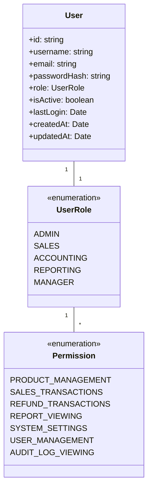

# POS Uygulaması Gelişmiş Kullanıcı Yönetimi Mimari Tasarımı

## 1. Giriş

Bu doküman, mevcut POS uygulamasına gelişmiş kullanıcı yönetimi özelliği eklemek için gereken mimari değişiklikleri ve tasarım kararlarını detaylandırır. Kullanıcı rollerinin yönetimi, izin sisteminin çalışma mantığı ve kullanıcı aktivitelerinin izlenmesi gibi temel bileşenleri içerir.

## 2. Mevcut Uygulama Analizi

Mevcut uygulama yapısı:
- React ve TypeScript tabanlı
- Ana bileşenler: `App.tsx`, `POSHeader.tsx`, `POSSettingsTab.tsx` vb.
- Context API kullanımı (`NotificationContext.tsx`)
- Sayfa tabanlı yönlendirme (`react-router-dom`)
- UI bileşenleri (`components/ui/` klasörü altında)

## 3. Gelişmiş Kullanıcı Yönetimi Mimarisi

### 3.1 Genel Yaklaşım

Gelişmiş kullanıcı yönetimi için aşağıdaki bileşenler eklenecek:
- Kullanıcı yönetim context'i
- Rol tabanlı izin sistemi
- Kullanıcı aktivite izleme mekanizması
- Kullanıcı arayüzü bileşenleri

### 3.2 Kullanıcı Rollerinin Tanımlanması



### 3.3 Rol ve İzin İlişkileri

| Rol | İzinler |
|-----|---------|
| ADMIN | Tüm izinler |
| MANAGER | PRODUCT_MANAGEMENT, SALES_TRANSACTIONS, REFUND_TRANSACTIONS, REPORT_VIEWING, USER_MANAGEMENT |
| SALES | SALES_TRANSACTIONS, REFUND_TRANSACTIONS |
| ACCOUNTING | REPORT_VIEWING, SYSTEM_SETTINGS (sınırlı) |
| REPORTING | REPORT_VIEWING |

### 3.4 Kullanıcı Yönetim Sistemi

Yeni bir `UserManagementContext` oluşturulacak:

```typescript
// client/src/contexts/UserManagementContext.tsx
interface User {
  id: string;
  username: string;
  email: string;
  role: UserRole;
  isActive: boolean;
  lastLogin?: Date;
  createdAt: Date;
  updatedAt: Date;
}

interface UserManagementContextType {
  currentUser: User | null;
  users: User[];
  roles: UserRole[];
  permissions: Record<UserRole, Permission[]>;
  login: (username: string, password: string) => Promise<boolean>;
  logout: () => void;
  createUser: (userData: Omit<User, 'id' | 'createdAt' | 'updatedAt'>) => Promise<User>;
  updateUser: (userId: string, userData: Partial<User>) => Promise<User>;
  deleteUser: (userId: string) => Promise<boolean>;
  checkPermission: (permission: Permission) => boolean;
  getUserActivity: (userId: string) => Promise<ActivityLog[]>;
}

const UserManagementContext = createContext<UserManagementContextType | undefined>(undefined);
```

### 3.5 Kullanıcı Aktivite İzleme Mekanizması

```typescript
interface ActivityLog {
  id: string;
  userId: string;
  action: string;
  entityType: string;
  entityId?: string;
  timestamp: Date;
  ipAddress?: string;
  details?: Record<string, any>;
}

interface AuditService {
  logActivity: (activity: Omit<ActivityLog, 'id' | 'timestamp'>) => Promise<ActivityLog>;
  getActivityLogs: (filters?: {
    userId?: string;
    action?: string;
    startDate?: Date;
    endDate?: Date;
  }) => Promise<ActivityLog[]>;
  exportActivityLogs: (format: 'csv' | 'json') => Promise<Blob>;
}
```

## 4. Uygulama Adımları

1. **Kullanıcı Context'i Oluşturma**
   - Yeni `UserManagementContext.tsx` dosyası
   - Kullanıcı doğrulama ve yetkilendirme fonksiyonları

2. **Veritabanı Yapısını Güncelleme**
   - Kullanıcı tablolarını ekleme
   - Rol ve izin ilişkilerini tanımlama
   - Aktivite log tablolarını oluşturma

3. **Ana Uygulamayı Güncelleme**
   - `App.tsx`'de UserManagementProvider ekleme
   - Kimlik doğrulama mantığını entegre etme

4. **Bileşenleri Güncelleme**
   - `POSHeader.tsx` için kullanıcı menüsü ekleme
   - `POSSettingsTab.tsx` için kullanıcı yönetimi sekmesi ekleme

5. **Ayarlar Sayfasını Güncelleme**
   - Kullanıcı yönetimi için yeni sekme ekleme
   - Rol ve izin yönetimi arayüzleri

## 5. Teknik Detaylar

### 5.1 Kimlik Doğrulama Mantığı

```typescript
const authenticateUser = async (username: string, password: string): Promise<User | null> => {
  try {
    const response = await api.post('/auth/login', { username, password });
    if (response.data.success) {
      const user = response.data.user;
      await logActivity({
        userId: user.id,
        action: 'LOGIN',
        entityType: 'USER',
        details: { ipAddress: getClientIP() }
      });
      return user;
    }
    return null;
  } catch (error) {
    console.error('Authentication failed:', error);
    return null;
  }
};
```

### 5.2 İzin Kontrol Hook'u

```typescript
const usePermission = () => {
  const context = useContext(UserManagementContext);
  if (!context) {
    throw new Error('usePermission must be used within a UserManagementProvider');
  }

  const hasPermission = (permission: Permission) => {
    if (!context.currentUser) return false;
    const userPermissions = context.permissions[context.currentUser.role] || [];
    return userPermissions.includes(permission);
  };

  return { hasPermission, currentUser: context.currentUser };
};
```

### 5.3 Aktivite İzleme Bileşeni

```typescript
const ActivityTracker = ({ children }: { children: ReactNode }) => {
  const { currentUser } = useContext(UserManagementContext);
  const { logActivity } = useAuditService();

  const trackAction = useCallback(async (action: string, entityType: string, entityId?: string) => {
    if (currentUser) {
      await logActivity({
        userId: currentUser.id,
        action,
        entityType,
        entityId,
        details: { timestamp: new Date().toISOString() }
      });
    }
  }, [currentUser, logActivity]);

  return (
    <ActivityContext.Provider value={{ trackAction }}>
      {children}
    </ActivityContext.Provider>
  );
};
```

## 6. Entegrasyon Örneği

### 6.1 Mevcut Bileşen (Önce)

```typescript
// POSHeader.tsx
<button onClick={onStartNewSale}>
  Yeni Satış
</button>
```

### 6.2 Güncellenmiş Bileşen (Sonra)

```typescript
// POSHeader.tsx
const { hasPermission } = usePermission();

{hasPermission(Permission.SALES_TRANSACTIONS) && (
  <button onClick={() => {
    onStartNewSale();
    trackAction('START_SALE', 'SALE_TRANSACTION');
  }}>
    Yeni Satış
  </button>
)}
```

## 7. Test ve Doğrulama

1. Kullanıcı doğrulama ve yetkilendirme testleri
2. Rol tabanlı izin kontrolü doğrulaması
3. Aktivite izleme ve denetim kaydı testleri
4. Performans testleri (kimlik doğrulama süresi)

## 8. Gelecek Geliştirmeler

1. İki faktörlü kimlik doğrulama
2. Kullanıcı oturum yönetimi
3. Şifre sıfırlama akışı
4. Kullanıcı aktivite raporlama paneli