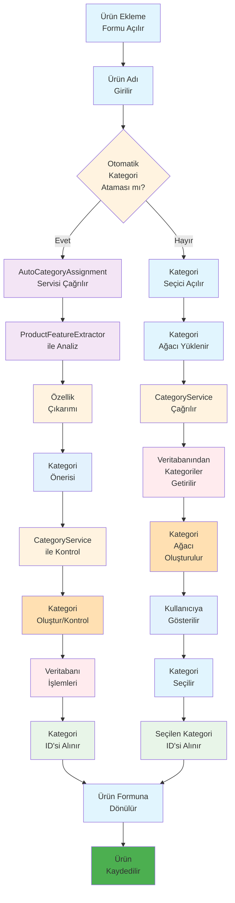
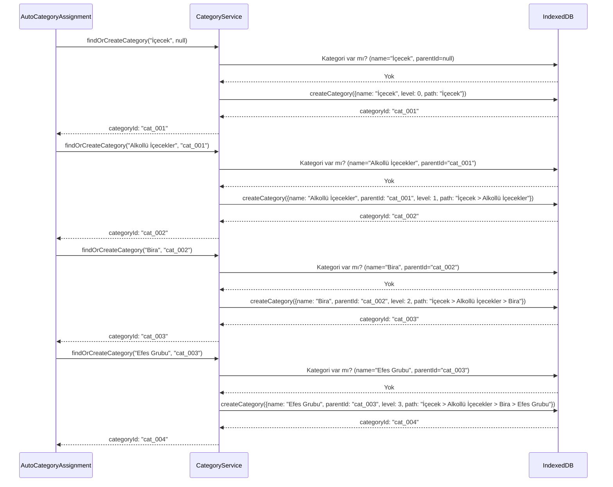
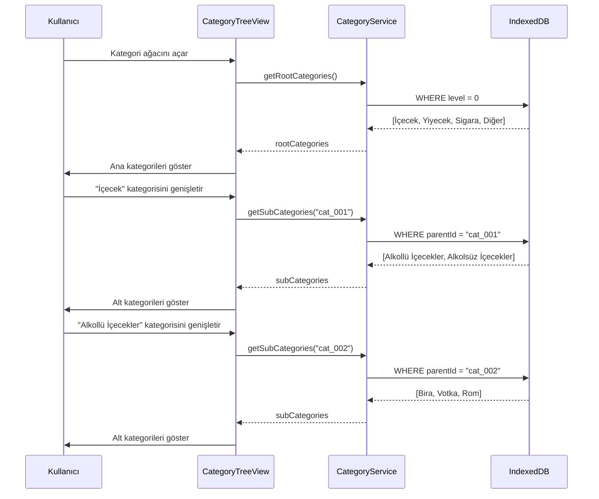
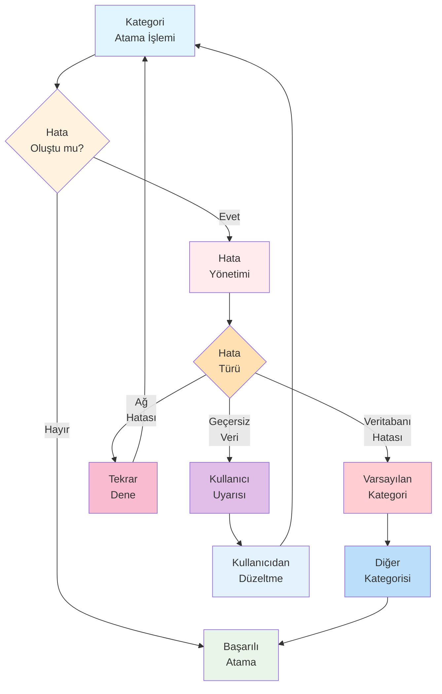
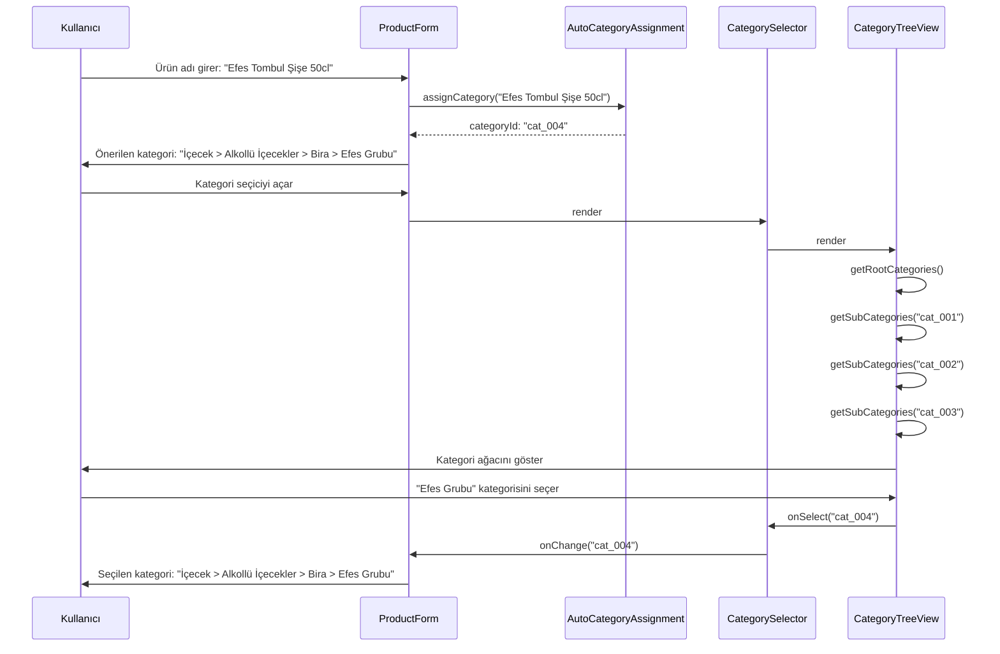
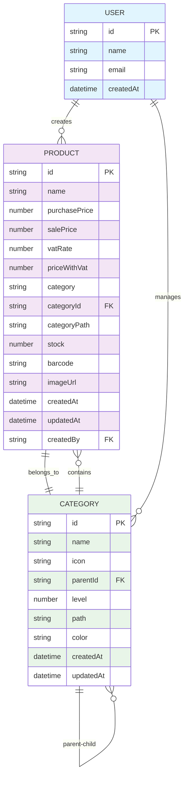

# RoxoePOS Kategori Sistemi Tam İş Akışı

## 1. Tam Sistem İş Akışı (Baştan Sona)



## 2. Özellik Çıkarımı Detayı

```mermaid
graph TD
    A[Ürün Adı:<br/>"Efes Tombul Şişe 50cl"] --> B[Marka<br/>Tespiti]
    A --> C[Ürün Türü<br/>Tespiti]
    A --> D[Ambalaj<br/>Türü Tespiti]
    A --> E[Hacim<br/>Tespiti]
    A --> F[Alkol<br/>İçeriği Tespiti]
    
    B --> G{Marka<br/>Listesinde<br/>var mı?}
    G -->|Evet| H[Efes]
    G -->|Hayır| I[Bilinmiyor]
    
    C --> J{İçerik<br/>Analizi}
    J -->|Bira| K[Bira]
    J -->|Votka| L[Votka]
    J -->|Rom| M[Rom]
    J -->|Diğer| N[Bilinmiyor]
    
    D --> O{Ambalaj<br/>Tipi}
    O -->|Şişe| P[Şişe]
    O -->|Kutu| Q[Kutu]
    O -->|PET| R[PET]
    O -->|Diğer| S[Diğer]
    
    E --> T{Hacim<br/>Deseni}
    T -->|50cl| U[50 cl]
    T -->|33cl| V[33 cl]
    T -->|Diğer| W[Bilinmiyor]
    
    F --> X{Alkol<br/>İçeriği}
    X -->|Alkollü| Y[Evet]
    X -->|Alkolsüz| Z[Hayır]
    
    H --> AA[Kategori<br/>Önerisi]
    K --> AA
    P --> AA
    U --> AA
    Y --> AA
    
    AA --> AB["İçecek > Alkollü İçecekler > Bira > Efes Grubu"]
    
    style A fill:#E1F5FE
    style B fill:#F3E5F5
    style C fill:#F3E5F5
    style D fill:#F3E5F5
    style E fill:#F3E5F5
    style F fill:#F3E5F5
    style G fill:#FFF3E0
    style J fill:#FFF3E0
    style O fill:#FFF3E0
    style T fill:#FFF3E0
    style X fill:#FFF3E0
    style AA fill:#E3F2FD
    style AB fill:#BBDEFB
```

## 3. Kategori Hiyerarşisi Oluşturma



## 4. Kategori Ağacı Yükleme



## 5. Cache Kullanımı ve Performans

```mermaid
graph TD
    A[İlk İstek] --> B[Cache<br/>Kontrolü]
    B --> C{Cache'de<br/>var mı?}
    C -->|Hayır| D[Veritabanı<br/>Sorgusu]
    D --> E[Cache'e<br/>Ekle]
    E --> F[Sonuç<br/>Döndür]
    C -->|Evet| F
    F --> G[Cache<br/>Kullanımı]
    
    A -->|getRootCategories| H[treeCache<br/>Map]
    A -->|getCategory(id)| I[cache<br/>Map]
    
    style A fill:#E1F5FE
    style B fill:#FFF3E0
    style C fill:#FFE0B2
    style D fill:#FFEBEE
    style E fill:#E8F5E8
    style F fill:#BBDEFB
    style G fill:#E3F2FD
    style H fill:#F8BBD0
    style I fill:#E1BEE7
```

## 6. Hata Durumları ve Geri Dönüşler



## 7. UI Bileşenleri Etkileşimi



## 8. Veri Modeli ve İlişkiler



Bu tam iş akışı diyagramı, RoxoePOS kategori sisteminin baştan sona nasıl çalıştığını detaylı bir şekilde göstermektedir. Tüm bileşenlerin etkileşimleri, veri akışları ve hata durumları kapsamlı olarak ele alınmıştır.