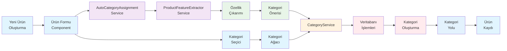
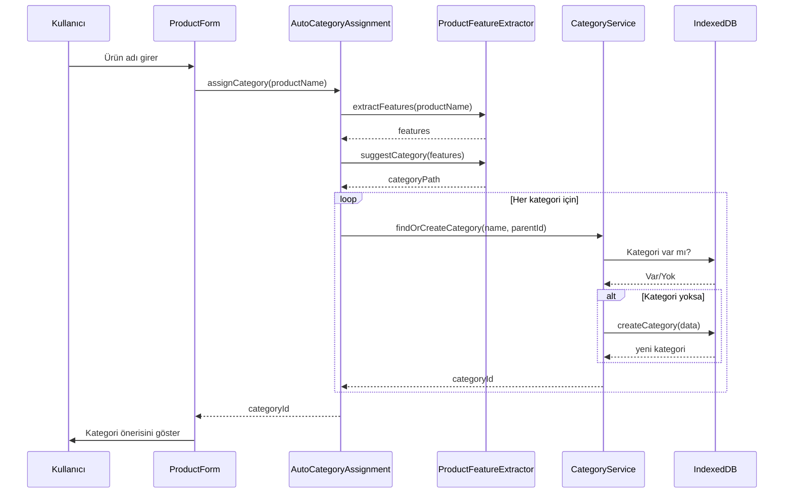
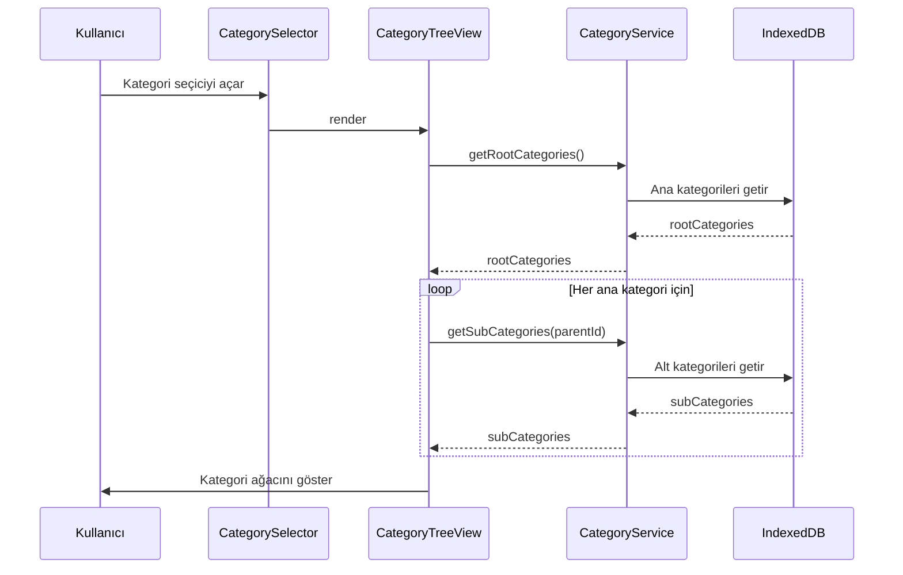
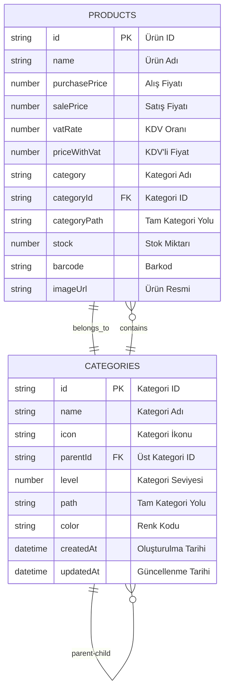
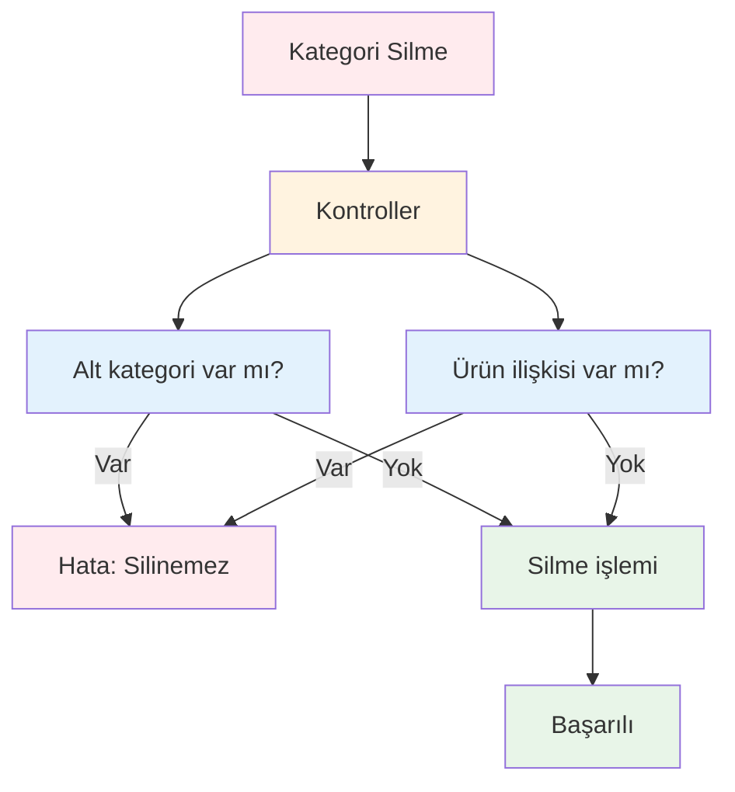
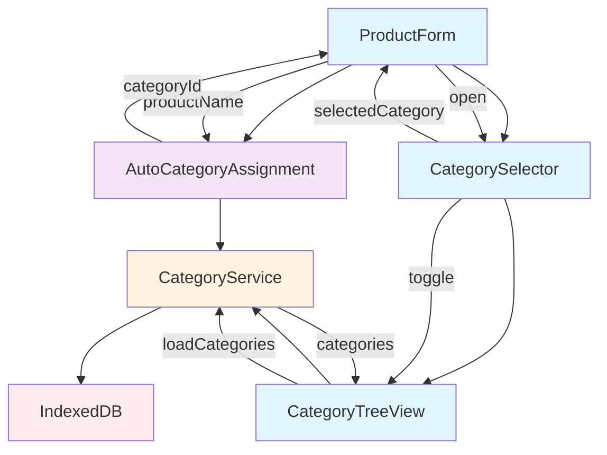

# RoxoePOS Kategori Sistemi Veri Akışı

## 1. Sistem Bileşenleri ve Veri Akışı



## 2. Kategori Oluşturma Süreci



## 3. Kategori Ağacı Yükleme Süreci



## 4. Kategori Veri Yapısı ve İlişkiler



## 5. Cache Yönetimi ve Performans

```mermaid
graph TD
    A[CategoryService] --> B[Cache Sistemi]
    B --> C[Kategori Cache<br/>Map&lt;id, Category&gt;]
    B --> D[Ağaç Cache<br/>Map&lt;'root', CategoryNode[]&gt;]
    A --> E[DB İşlemleri]
    E --> F[IndexedDB]
    
    C --> G[getCache(id)]
    C --> H[setCache(category)]
    D --> I[getTreeCache()]
    D --> J[setTreeCache(tree)]
    B --> K[clearCache()]
    
    style A fill:#e3f2fd
    style B fill:#fff3e0
    style C fill:#e8f5e8
    style D fill:#e8f5e8
    style E fill:#ffebee
    style F fill:#ffebee
```

## 6. Hata Yönetimi ve Güvenlik



## 7. UI Bileşenleri Arasındaki Etkileşim



## 8. Ters Hiyerarşik Kategorizasyon Süreci

```mermaid
flowchart LR
    A[Ürün Adı:<br/>"Efes Tombul Şişe 50cl"] --> B[Özellik Çıkarımı]
    B --> C{Marka: "Efes"<br/>Tür: "Bira"<br/>Ambalaj: "Şişe"<br/>Hacim: "50cl"}
    C --> D[Kategori Önerisi]
    D --> E["İçecek > Alkollü İçecekler > Bira > Efes Grubu"]
    E --> F[Kategori Hiyerarşisi<br/>Oluşturma/Kontrol]
    F --> G[Kategori ID<br/>Döndür]
    
    style A fill:#e1f5fe
    style B fill:#e8f5e8
    style C fill:#fff3e0
    style D fill:#e3f2fd
    style E fill:#e3f2fd
    style F fill:#f3e5f5
    style G fill:#ffebee
```

Bu diyagramlar, RoxoePOS kategori sisteminin tüm yönlerini kapsamlı bir şekilde göstermektedir. Sistem, kullanıcıların büyük ürün envanterlerini etkili bir şekilde yönetmelerini sağlayan gelişmiş bir hiyerarşik kategori yapısını destekler.