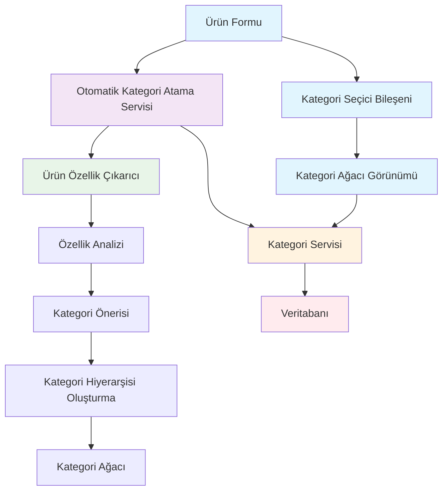
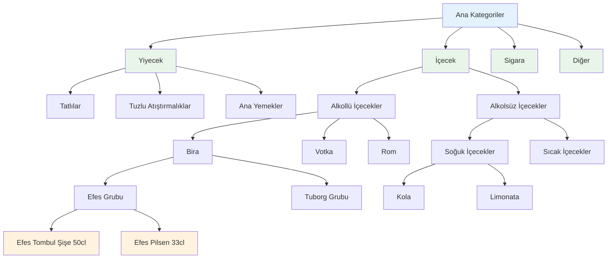
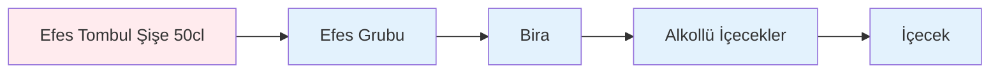
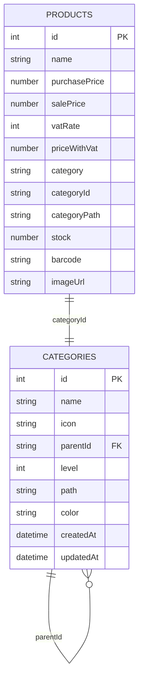
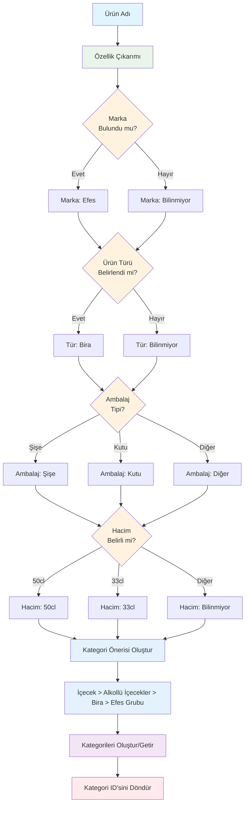
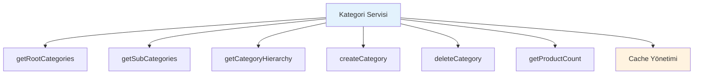
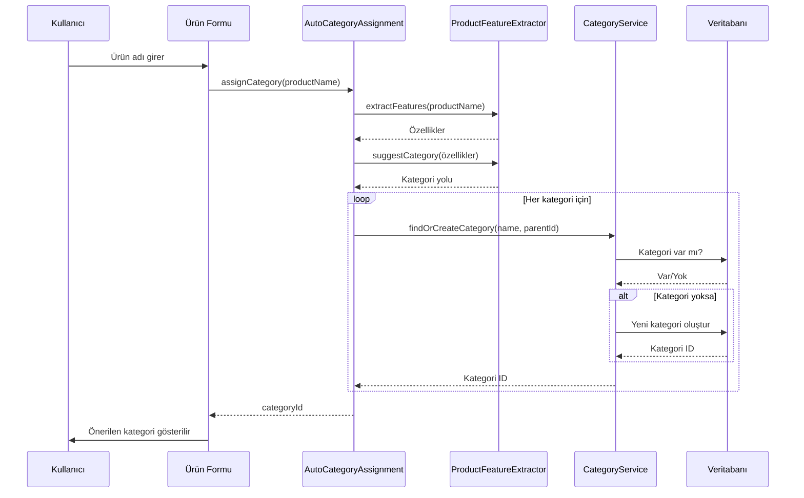
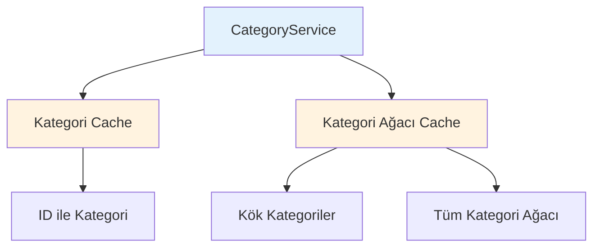
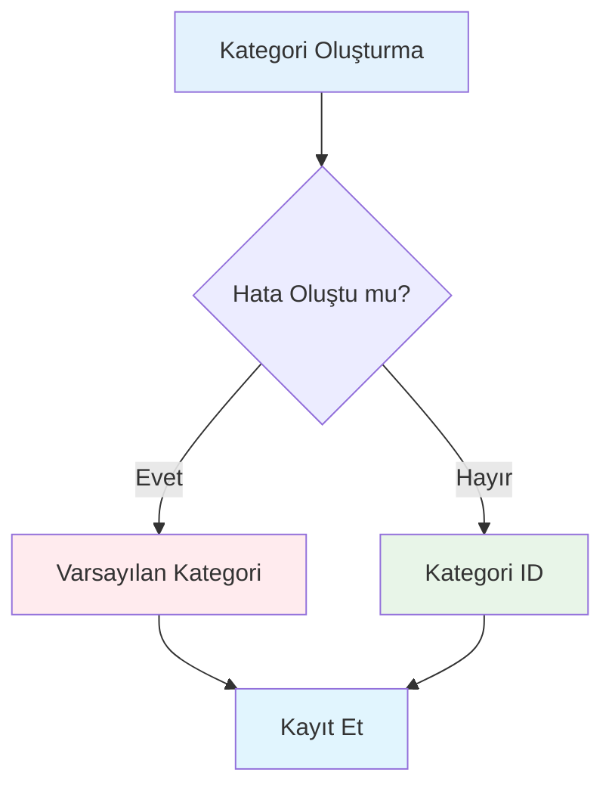

# RoxoePOS Kategori Sistemi Haritası

## 1. Genel Sistem Mimarisi



## 2. Kategori Hiyerarşisi Örneği



## 3. Ters Hiyerarşik Kategorizasyon



## 4. Kategori Veri Yapısı



## 5. Otomatik Kategori Atama İş Akışı



## 6. Kategori Servisi Bileşenleri



## 7. UI Bileşenleri

```mermaid
graph TD
    A[Kategori Seçici] --> B[Kategori Ağacı Görünümü]
    A --> C[Kategori Arama]
    
    B --> B1[Ana Kategoriler]
    B1 --> B11[Yiyecek]
    B11 --> B111[Tatlılar]
    B11 --> B112[Tuzlu Atıştırmalıklar]
    
    B1 --> B12[İçecek]
    B12 --> B121[Alkollü İçecekler]
    B121 --> B1211[Bira]
    B1211 --> B12111[Efes Grubu]
    
    C --> C1[Arama: "Efes"]
    C1 --> C11[Efes Tombul Şişe 50cl - İçecek > Alkollü İçecekler > Bira > Efes Grubu]
    
    style A fill:#e1f5fe
    style B fill:#e8f5e8
    style C fill:#e8f5e8
    style C11 fill:#fff3e0
```

## 8. Veritabanı İşlemleri



## 9. Cache Yönetimi



## 10. Hata Yönetimi



Bu harita, RoxoePOS kategori sisteminin tüm bileşenlerini ve aralarındaki ilişkileri göstermektedir. Sistem, kullanıcıların büyük ürün envanterlerini daha etkili yönetmelerini sağlayan gelişmiş bir hiyerarşik kategori yapısını destekler.