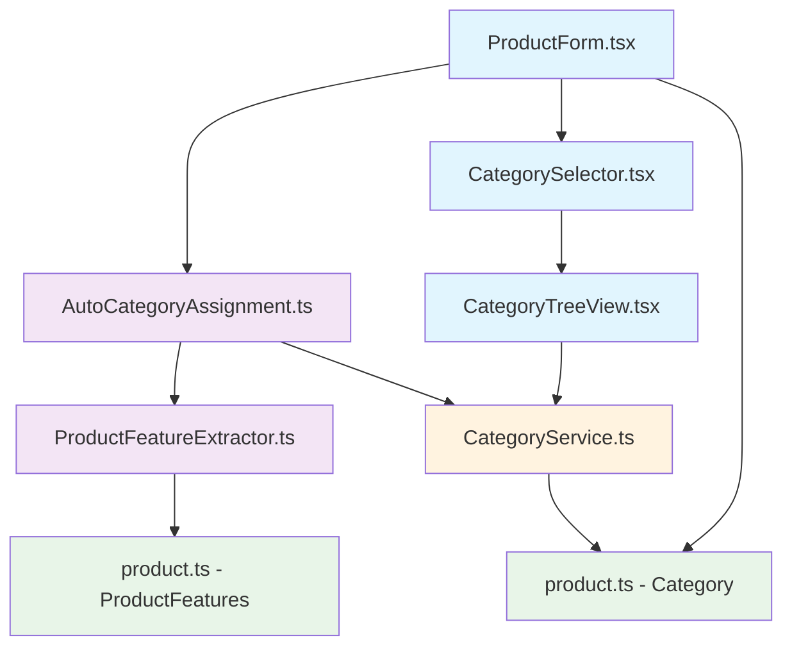
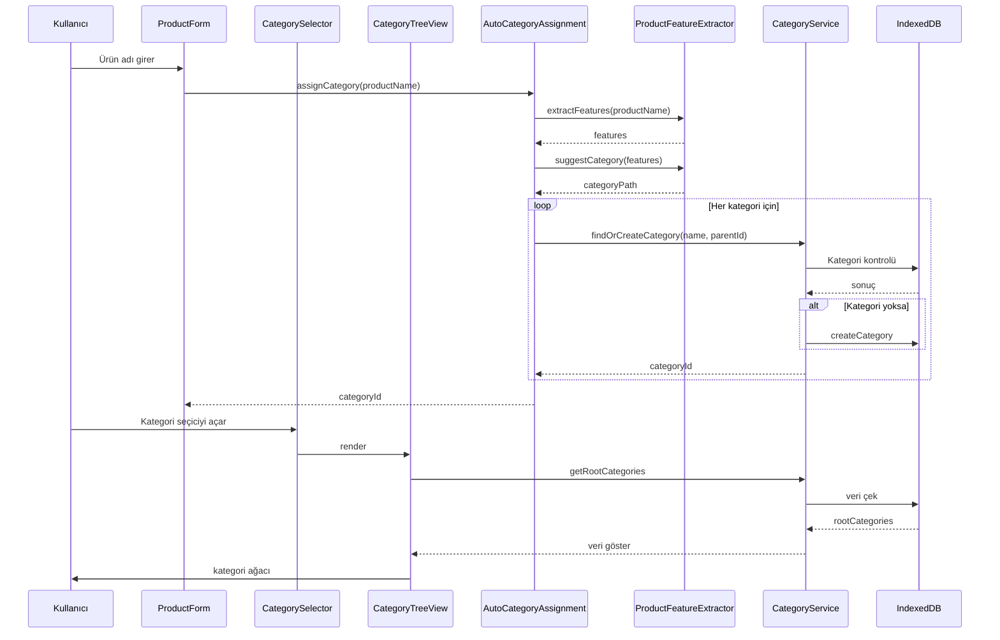
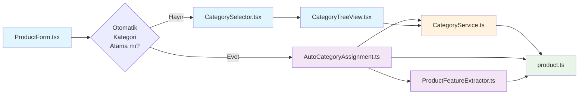

# RoxoePOS Kategori Sistemi Dosya Yapısı ve İlişkiler

## 1. Dosya Yapısı

```
client/src/
├── components/
│   ├── CategorySelector.tsx
│   ├── CategoryTreeView.tsx
│   └── ProductForm.tsx
├── services/
│   ├── categoryService.ts
│   ├── productFeatureExtractor.ts
│   └── autoCategoryAssignment.ts
├── types/
│   └── product.ts
└── helpers/
    └── (diğer yardımcı dosyalar)
```

## 2. Dosya İlişkileri ve Bağımlılıklar



## 3. Her Dosyanın Detaylı Açıklaması

### 3.1. types/product.ts

Bu dosya, kategori ve ürün tiplerini tanımlar.

**Ana Arayüzler:**
- `Category`: Kategori veri yapısı
- `Product`: Ürün veri yapısı (genişletilmiş)

**İlişkiler:**
- CategoryService, AutoCategoryAssignment ve diğer bileşenler bu tipleri kullanır

### 3.2. services/categoryService.ts

Kategori yönetimi için temel servis.

**Ana Fonksiyonlar:**
- `getRootCategories()`: Kök kategorileri getirir
- `getSubCategories(parentId)`: Alt kategorileri getirir
- `createCategory(data)`: Yeni kategori oluşturur
- `deleteCategory(categoryId)`: Kategori siler

**Özellikler:**
- Cache yönetimi
- Kategori hiyerarşisi oluşturma

### 3.3. services/productFeatureExtractor.ts

Ürün adından özellik çıkarımı yapan servis.

**Ana Fonksiyonlar:**
- `extractFeatures(productName)`: Ürün adından özellik çıkarır
- `suggestCategory(features)`: Özelliklere göre kategori önerisi oluşturur

### 3.4. services/autoCategoryAssignment.ts

Otomatik kategori atama servisi.

**Ana Fonksiyonlar:**
- `assignCategory(productName)`: Ürün adını kullanarak kategori atar
- `findOrCreateCategory(name, parentId)`: Kategori bulur veya oluşturur

### 3.5. components/CategorySelector.tsx

Kategori seçimi için UI bileşeni.

**Özellikler:**
- Dropdown arayüz
- Kategori ağacı entegrasyonu
- Seçim geri dönüşü

### 3.6. components/CategoryTreeView.tsx

Hiyerarşik kategori ağacı gösterimi.

**Özellikler:**
- Expand/collapse fonksiyonelliği
- Lazy loading
- Seviye bazlı gösterim

### 3.7. components/ProductForm.tsx

Ürün oluşturma/güncelleme formu.

**Özellikler:**
- Otomatik kategori önerisi
- Manuel kategori seçimi
- Form validasyonu

## 4. Veri Akışı Diyagramı



## 5. Bağımlılık Haritası



## 6. Teknik Detaylar

### 6.1. Cache Yönetimi
- CategoryService içinde Map yapısı ile cache tutulur
- Kategori ve ağaç verileri için ayrı cache'ler
- Performans optimizasyonu için kritik öneme sahiptir

### 6.2. Lazy Loading
- CategoryTreeView bileşeni sadece ihtiyaç duyulan kategorileri yükler
- Bellek kullanımını optimize eder
- Kullanıcı deneyimini iyileştirir

### 6.3. Hata Yönetimi
- Tüm servislerde try-catch blokları
- Kullanıcı dostu hata mesajları
- Varsayılan değerler ile sistem sürekliliği

Bu yapı sayesinde, kategori sistemi modüler, sürdürülebilir ve genişletilebilir bir şekilde tasarlanmıştır.