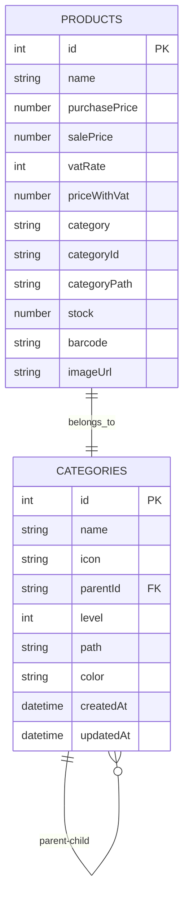

# RoxoePOS Hiyerarşik Kategori Sistemi - Detaylı Özeti

## Sistem Genel Bakış

RoxoePOS'un gelişmiş stok yönetimi sistemi, ürünlerin mantıksal gruplara ayrılması için çok seviyeli hiyerarşik kategori yapısını destekler. Bu yapı özellikle büyük ürün envanterlerinin yönetilmesini kolaylaştırır.

## 1. Temel Özellikler

### 1.1. Hiyerarşik Kategori Yapısı
- Sınırsız seviye derinliğinde kategori desteği
- Her kategori bir üst kategoriye (parentId) sahip olabilir
- Kök kategoriler parentId'si null olan kategorilerdir
- Her kategori seviyesini (level) ve tam yolunu (path) saklar

### 1.2. Ters Hiyerarşik Kategorizasyon
- Ürün adından yola çıkarak otomatik kategori önerisi
- "Efes Tombul Şişe 50cl" → "İçecek > Alkollü İçecekler > Bira > Efes Grubu"
- Özellik çıkarımı ile akıllı kategori atama

### 1.3. Performans Optimizasyonları
- Kategori cache sistemi
- Lazy loading ile kategori ağacı yükleme
- Veritabanı indeksleme

## 2. Veri Yapıları

### 2.1. Kategori Arayüzü
```typescript
interface Category {
  id: number;
  name: string;
  icon: string;
  parentId?: string; // Üst kategori ID (null ise ana kategori)
  level: number; // Kategori seviyesi (0: Ana, 1: Alt, 2: Alt-alt, ...)
  path: string; // Kategori yolu (örn: "Diğer > Temizlik Malzemeleri > Deterjan")
  color?: string; // Renk kodu
  createdAt: Date;
  updatedAt: Date;
}
```

### 2.2. Ürün Arayüzü (Kategori ile Genişletilmiş)
```typescript
interface Product {
  id: number;
  name: string;
  purchasePrice: number;
  salePrice: number;
  vatRate: VatRate;
  priceWithVat: number;
  category: string;
  categoryId: string; // Hiyerarşik kategori ID
  categoryPath: string; // Ürünün tam kategori yolu
  stock: number;
  barcode: string;
  imageUrl?: string;
}
```

## 3. Ana Servisler

### 3.1. CategoryService
- Kategori oluşturma, silme, güncelleme
- Kategori hiyerarşisi oluşturma
- Kök ve alt kategorileri getirme
- Cache yönetimi

### 3.2. ProductFeatureExtractor
- Ürün adından özellik çıkarımı
- Kategori önerisi oluşturma
- Marka, tür, ambalaj, hacim tespiti

### 3.3. AutoCategoryAssignment
- Otomatik kategori atama
- Kategori hiyerarşisi oluşturma
- Hata durumunda varsayılan kategori atama

## 4. UI Bileşenleri

### 4.1. CategorySelector
- Kategori seçimi için dropdown bileşeni
- Arama ve filtreleme desteği
- Seçilen kategorinin görsel gösterimi

### 4.2. CategoryTreeView
- Hiyerarşik kategori ağacı gösterimi
- Expand/collapse fonksiyonelliği
- Lazy loading desteği

### 4.3. ProductForm
- Yeni ürün oluşturma formu
- Otomatik kategori önerisi
- Manuel kategori seçimi

## 5. Veritabanı Şeması



## 6. İş Akışları

### 6.1. Yeni Ürün Ekleme ve Otomatik Kategori Atama

1. Kullanıcı ürün adı girer
2. Ürün adı analiz edilir (ProductFeatureExtractor)
3. Özelliklere göre kategori önerisi oluşturulur
4. Kategori hiyerarşisi kontrol edilir/oluşturulur
5. Ürün kategoriye atanır
6. Kullanıcıya önerilen kategori gösterilir

### 6.2. Kategori Ağacı Yükleme

1. Kök kategoriler yüklenir
2. Kullanıcı bir kategoriyi genişlettiğinde alt kategoriler yüklenir
3. Lazy loading ile performans optimizasyonu sağlanır
4. Cache kullanılarak tekrarlayan istekler optimize edilir

## 7. Güvenlik ve Doğrulama

- Kategoriler silinmeden önce alt kategori ve ürün kontrolü
- Kategori yolu otomatik olarak oluşturulur ve güncellenir
- Veritabanı işlemleri için hata yönetimi

## 8. Performans Optimizasyonları

- Kategori cache sistemi (Map yapısı ile)
- Kategori ağacı cache
- Lazy loading ile sadece ihtiyaç duyulan kategoriler yüklenir
- Veritabanı indeksleme

## 9. Gelecekteki Geliştirmeler

- Makine öğrenimi ile daha akıllı kategori önerileri
- Kategori istatistikleri ve analizleri
- Kategori geçmişi ve versiyonlama
- Çoklu dil desteği

## 10. Kullanım Örnekleri

### 10.1. "Efes Tombul Şişe 50cl" Ürünü için Süreç

1. Kullanıcı ürün adını girer: "Efes Tombul Şişe 50cl"
2. Sistem özellikleri çıkarır:
   - Marka: Efes
   - Tür: Bira
   - Ambalaj: Şişe
   - Hacim: 50cl
   - Alkollü: Evet
3. Kategori önerisi oluşturulur: "İçecek > Alkollü İçecekler > Bira > Efes Grubu"
4. Kategori hiyerarşisi kontrol edilir/oluşturulur
5. Ürün bu kategoriye atanır

Bu sistem, kullanıcıların büyük ürün envanterlerini daha etkili ve organize bir şekilde yönetmelerini sağlar. Ters hiyerarşik yaklaşım sayesinde kullanıcı müdahalesi olmadan doğru kategorilere otomatik atama yapılır.