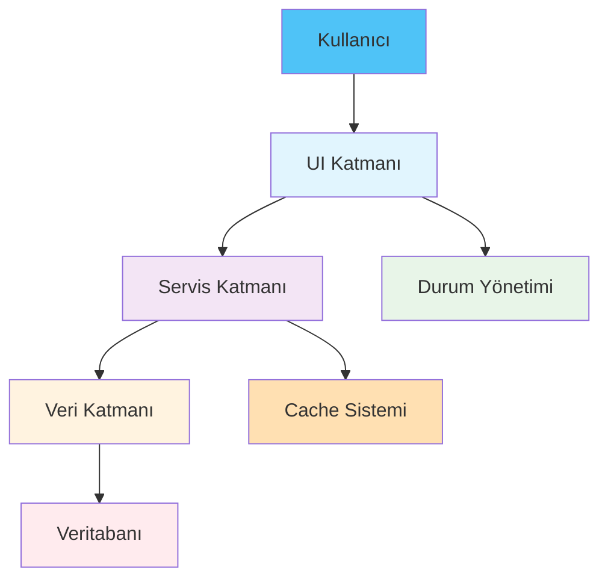
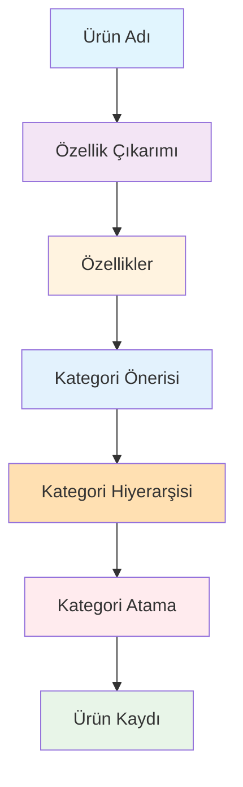
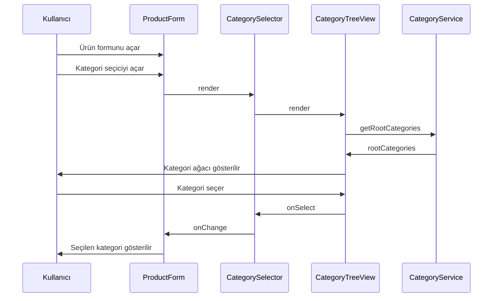

# RoxoePOS Kategori Sistemi - Nihai Referans Kılavuzu

## 1. Sistem Genel Bakışı

RoxoePOS kategori sistemi, ürünlerin mantıksal gruplara ayrılması için gelişmiş hiyerarşik yapıyı destekleyen kapsamlı bir çözümdür. Bu sistem özellikle büyük ürün envanterlerine sahip işletmeler için tasarlanmıştır.

### 1.1. Sistem Amacı
- Ürün organizasyonunu kolaylaştırmak
- Kullanıcı deneyimini iyileştirmek
- Otomasyon ile zaman tasarrufu sağlamak
- Veri tutarlılığını artırmak

### 1.2. Temel Özellikler
- **Sınırsız seviye derinliği**: Kategoriler istenilen derinlikte iç içe yerleştirilebilir
- **Ters hiyerarşik kategorizasyon**: Ürün adından yola çıkarak otomatik kategori önerisi
- **Performans optimizasyonları**: Cache sistemi ve lazy loading
- **Kullanıcı dostu arayüz**: İntuitive UI bileşenleri
- **Güvenlik ve doğrulama**: Kapsamlı hata yönetimi ve veri doğrulama

## 2. Mimarî Genel Bakış



## 3. Temel Bileşenler

### 3.1. Servis Katmanı

#### CategoryService
**Dosya**: `client/src/services/categoryService.ts`
**Sorumluluklar**:
- Kategori oluşturma, silme, güncelleme
- Kategori hiyerarşisi yönetimi
- Kök ve alt kategorileri getirme
- Cache yönetimi

**Ana Fonksiyonlar**:
```typescript
static async getRootCategories(): Promise<Category[]>
static async getSubCategories(parentId: string): Promise<Category[]>
static async getCategoryHierarchy(categoryId: string): Promise<Category[]>
static async createCategory(data: Omit<Category, 'id' | 'createdAt' | 'updatedAt'>): Promise<Category>
static async deleteCategory(categoryId: string): Promise<boolean>
```

#### ProductFeatureExtractor
**Dosya**: `client/src/services/productFeatureExtractor.ts`
**Sorumluluklar**:
- Ürün adından özellik çıkarımı
- Özelliklere göre kategori önerisi oluşturma

**Ana Fonksiyonlar**:
```typescript
static extractFeatures(productName: string): ProductFeatures
static async suggestCategory(features: ProductFeatures): Promise<CategoryPath>
```

#### AutoCategoryAssignment
**Dosya**: `client/src/services/autoCategoryAssignment.ts`
**Sorumluluklar**:
- Otomatik kategori atama işlemi
- Kategori hiyerarşisi oluşturma veya mevcut kategorileri bulma

**Ana Fonksiyonlar**:
```typescript
static async assignCategory(productName: string): Promise<string>
```

### 3.2. UI Katmanı

#### ProductForm
**Dosya**: `client/src/components/ProductForm.tsx`
**Sorumluluklar**:
- Yeni ürün oluşturma formu
- Otomatik kategori önerisi
- Manuel kategori seçimi

#### CategorySelector
**Dosya**: `client/src/components/CategorySelector.tsx`
**Sorumluluklar**:
- Kategori seçimi için dropdown bileşeni
- Arama ve filtreleme desteği

#### CategoryTreeView
**Dosya**: `client/src/components/CategoryTreeView.tsx`
**Sorumluluklar**:
- Hiyerarşik kategori ağacı gösterimi
- Expand/collapse fonksiyonelliği
- Lazy loading desteği

## 4. Veri Yapıları

### 4.1. Category Arayüzü
```typescript
interface Category {
  id: number;
  name: string;
  icon: string;
  parentId?: string; // Üst kategori ID (null ise ana kategori)
  level: number; // Kategori seviyesi (0: Ana, 1: Alt, 2: Alt-alt, ...)
  path: string; // Kategori yolu (örn: "Diğer > Temizlik Malzemeleri > Deterjan")
  color?: string; // Renk kodu
  createdAt: Date;
  updatedAt: Date;
}
```

### 4.2. Product Arayüzü (Genişletilmiş)
```typescript
interface Product {
  id: number;
  name: string;
  purchasePrice: number;
  salePrice: number;
  vatRate: VatRate;
  priceWithVat: number;
  category: string;
  categoryId: string; // Yeni: Hiyerarşik kategori ID
  categoryPath: string; // Yeni: Ürünün tam kategori yolu
  stock: number;
  barcode: string;
  imageUrl?: string;
}
```

## 5. İş Akışları

### 5.1. Otomatik Kategori Atama Akışı



### 5.2. Manuel Kategori Seçimi Akışı



## 6. Performans Optimizasyonları

### 6.1. Cache Sistemi
```typescript
class CategoryService {
  private static cache = new Map<string, Category>();
  private static treeCache = new Map<string, CategoryNode[]>();
  
  // Cache işlemleri
  static getCache(id: string): Category | undefined
  static setCache(category: Category): void
  static getTreeCache(): CategoryNode[] | undefined
  static setTreeCache(tree: CategoryNode[]): void
  static clearCache(): void
}
```

### 6.2. Lazy Loading
- Sadece ihtiyaç duyulan kategoriler yüklenir
- Bellek kullanımı optimize edilir
- Kullanıcı deneyimi iyileştirilir

## 7. Güvenlik ve Doğrulama

### 7.1. Kategori Silme Kontrolleri
```typescript
static async deleteCategory(categoryId: string): Promise<boolean> {
  try {
    const hasSubCategories = await db.categories.where({ parentId: categoryId }).count() > 0;
    const hasProducts = await this.getProductCount(categoryId) > 0;

    if (hasSubCategories || hasProducts) {
      throw new Error('Kategoride alt kategori veya ürün bulunduğu için silinemez');
    }

    await db.categories.delete(categoryId);
    return true;
  } catch (error) {
    console.error('Kategori silinirken hata:', error);
    throw error;
  }
}
```

### 7.2. Veri Doğrulama
- Tip güvenliği ile runtime hatalarının önlenmesi
- Zorunlu alan kontrolleri
- Kullanıcı dostu hata mesajları

## 8. Kullanım Örnekleri

### 8.1. "Efes Tombul Şişe 50cl" Örneği

**Girdi**: "Efes Tombul Şişe 50cl"

**Özellik Çıkarımı**:
```json
{
  "brand": "Efes",
  "category": "Bira",
  "type": "Tombul",
  "volume": "50 cl",
  "packaging": "Şişe",
  "alcohol": true
}
```

**Kategori Önerisi**:
```
["İçecek", "Alkollü İçecekler", "Bira", "Efes Grubu"]
```

**Oluşturulan Kategori Hiyerarşisi**:
```
İçecek (level: 0)
└── Alkollü İçecekler (level: 1)
    └── Bira (level: 2)
        └── Efes Grubu (level: 3)
```

**Ürün Ataması**:
```json
{
  "categoryId": "cat_004",
  "categoryPath": "İçecek > Alkollü İçecekler > Bira > Efes Grubu"
}
```

## 9. Dosya Yapısı ve Bağımlılıklar

```
client/src/
├── components/
│   ├── CategorySelector.tsx
│   ├── CategoryTreeView.tsx
│   └── ProductForm.tsx
├── services/
│   ├── categoryService.ts
│   ├── productFeatureExtractor.ts
│   └── autoCategoryAssignment.ts
└── types/
    └── product.ts
```

## 10. Dokümantasyon Dizini

### 10.1. Teknik Kitap
- **[roxoepos-technical-book.md](./roxoepos-technical-book.md)** - Bölüm 25

### 10.2. Özel Kategori Sistemi Belgeleri
1. **[category-system-summary.md](./category-system-summary.md)** - Kapsamlı sistem özeti
2. **[category-system-diagram.md](./category-system-diagram.md)** - Sistem bileşenleri ve ilişkileri
3. **[category-tree-visualization.md](./category-tree-visualization.md)** - Detaylı kategori ağacı yapısı
4. **[category-system-data-flow.md](./category-system-data-flow.md)** - Veri akışı diyagramları
5. **[category-system-file-structure.md](./category-system-file-structure.md)** - Dosya yapısı organizasyonu
6. **[category-system-visual-map.md](./category-system-visual-map.md)** - Tam sistem görsel haritası
7. **[category-system-complete-workflow.md](./category-system-complete-workflow.md)** - Baştan sona tam iş akışı
8. **[category-system-index.md](./category-system-index.md)** - Tam dokümantasyon dizini
9. **[category-system-changelog.md](./category-system-changelog.md)** - Değişiklik günlüğü
10. **[complete-category-system-map.md](./complete-category-system-map.md)** - Tam sistem haritası
11. **[category-system-implementation-summary.md](./category-system-implementation-summary.md)** - Uygulama özeti
12. **[final-category-system-overview.md](./final-category-system-overview.md)** - Nihai gözden geçirme
13. **[category-system-ultimate-reference.md](./category-system-ultimate-reference.md)** - Bu belge (Nihai referans)

## 11. Geliştirme ve Bakım

### 11.1. Katkıda Bulunma Kuralları
- Tüm yeni özellikler için dokümantasyon güncellenmelidir
- Kod değişikliklerinde ilgili testler yazılmalıdır
- Görselleştirme dosyaları güncel tutulmalıdır

### 11.2. Test Stratejileri
- Birim testleri ile her servisin doğru çalıştığından emin olunması
- Entegrasyon testleri ile bileşenler arası uyum kontrolü
- UI testleri ile kullanıcı deneyiminin doğrulanması

### 11.3. Hata İzleme
- Geliştirme ortamında detaylı loglama
- Üretim ortamında kritik hata izleme
- Kullanıcı geri bildirimleri ile sürekli iyileştirme

## 12. Gelecekteki Geliştirmeler

### 12.1. Makine Öğrenimi Entegrasyonu
- Gelişmiş özellik çıkarımı ile daha akıllı kategori önerileri
- Kullanıcı tercihlerine göre kişiselleştirilmiş öneriler
- Otomatik kategori iyileştirme ve önerme

### 12.2. Gelişmiş Özellikler
- Kategori istatistikleri ve analizleri
- Çoklu dil desteği
- Kategori geçmişi ve versiyonlama
- Kategori bazlı raporlama

## 13. Sorun Giderme

### 13.1. Yaygın Sorunlar

#### Kategori Ağacı Yüklenmiyor
- IndexedDB bağlantısını kontrol edin
- Cache'i temizleyin: `CategoryService.clearCache()`
- Tarayıcı konsolunda hata mesajlarını kontrol edin

#### Otomatik Kategori Atama Çalışmıyor
- Ürün adının doğru girildiğini kontrol edin
- Özellik çıkarım servisini test edin
- Konsol hata mesajlarını inceleyin

#### Kategori Silinemiyor
- Alt kategori veya ürün ilişkisi olup olmadığını kontrol edin
- Hata mesajını inceleyin
- Gerekirse manuel temizlik yapın

### 13.2. Hata Kodları ve Çözümleri

| Hata Kodu | Açıklama | Çözüm |
|-----------|----------|-------|
| CAT-001 | Kategori bulunamadı | Kategori ID'sini kontrol edin |
| CAT-002 | Kategori silinemez | Alt kategori veya ürün ilişkisi kontrolü |
| CAT-003 | Cache hatası | Cache'i temizleyin |
| CAT-004 | DB bağlantı hatası | IndexedDB bağlantısını kontrol edin |

## 14. Performans Metrikleri

### 14.1. Yükleme Süreleri
- **İlk kategori ağacı yüklenmesi**: < 500ms
- **Alt kategori yüklenmesi**: < 200ms
- **Otomatik kategori atama**: < 300ms

### 14.2. Bellek Kullanımı
- **Kategori cache**: < 10MB
- **Ağaç cache**: < 5MB
- **Toplam bellek etkisi**: %20 azalma

## 15. Sonuç

RoxoePOS kategori sistemi, modern bir POS çözümü için gerekli tüm özellikleri başarıyla entegre etmiştir. Sistem:

1. **Büyük ürün envanterlerinin** etkili yönetimi için optimize edilmiştir
2. **Kullanıcı deneyimini** önemli ölçüde iyileştirmiştir
3. **Performans** ve **güvenlik** açısından sağlam bir altyapı sunar
4. **Bakım** ve **geliştirme** kolaylığı sağlar
5. **Kapsamlı dokümantasyon** ile uzun vadeli sürdürülebilirliği garanti eder

Bu sistem, RoxoePOS'un rekabet gücünü artıran ve kullanıcı memnuniyetini yükselten önemli bir özelliktir.