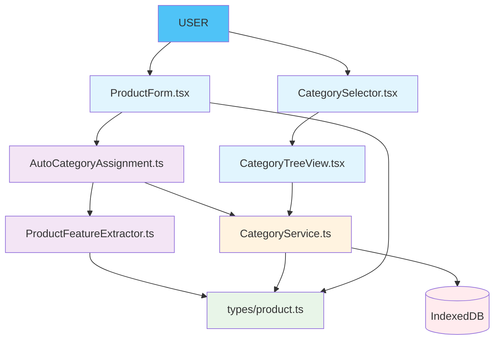
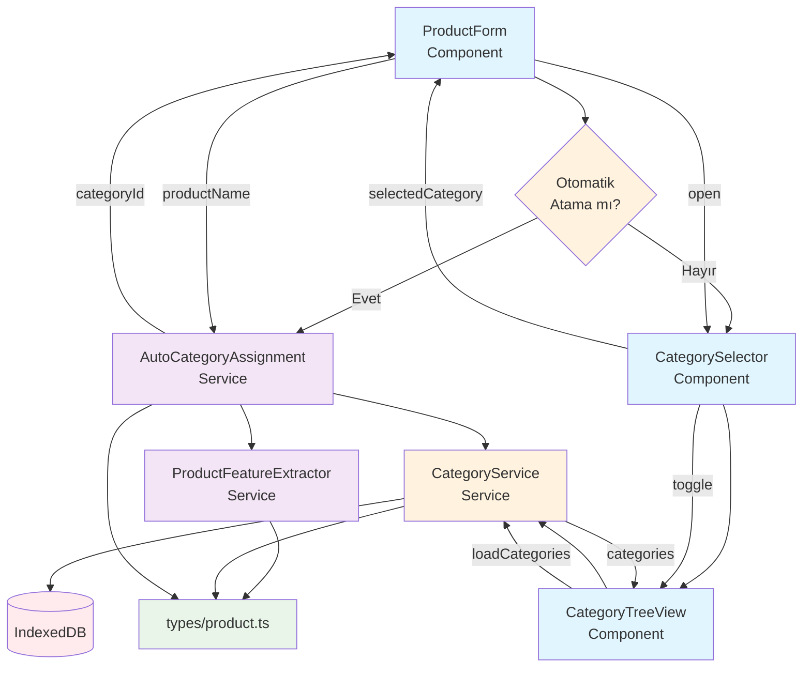
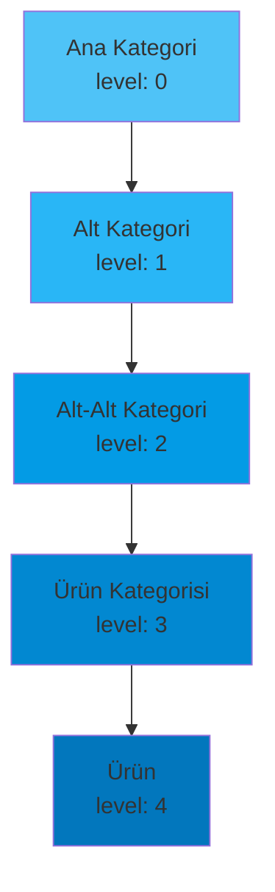
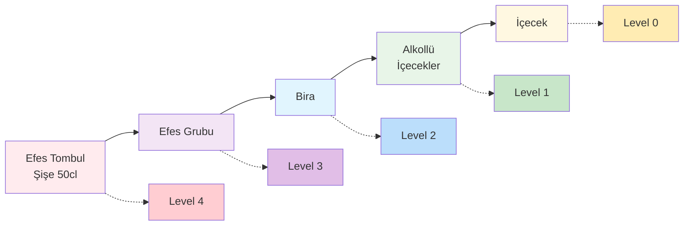
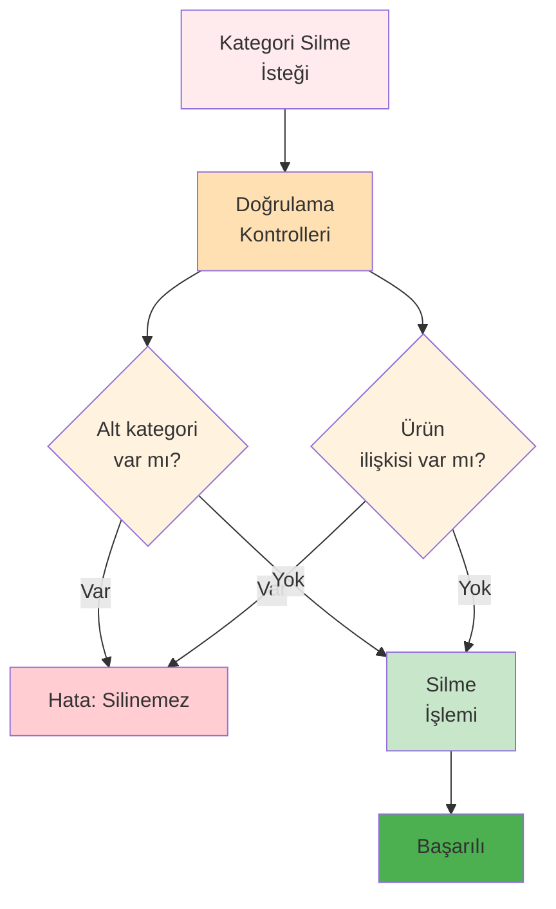
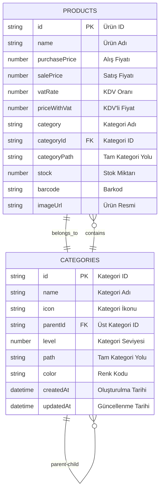
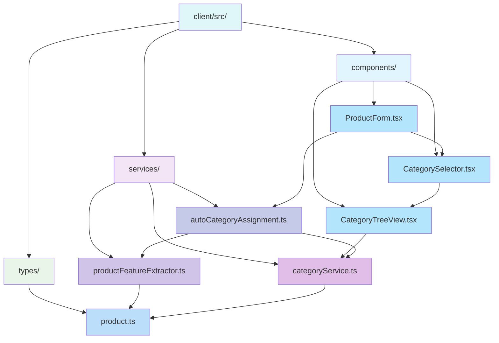
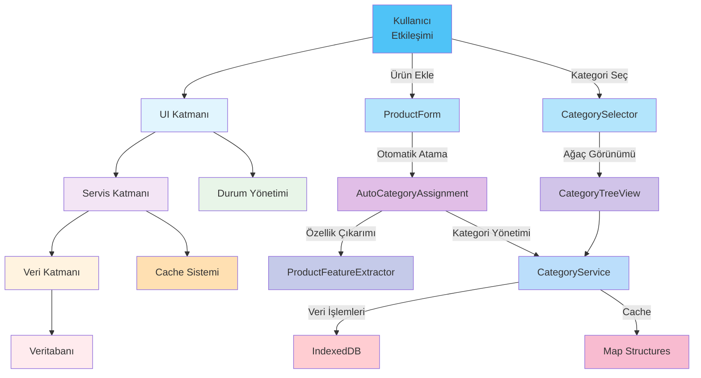

# RoxoePOS Kategori Sistemi Görsel Haritası

## 1. Sistem Bileşenleri ve İlişkileri



## 2. Kategori Hiyerarşisi ve Veri Akışı

```mermaid
graph LR
    A[Ürün Adı:<br/>"Efes Tombul Şişe 50cl"] --> B[ProductFeatureExtractor]
    B --> C{Özellik<br/>Çıkarımı}
    C --> D[Marka: Efes<br/>Tür: Bira<br/>Ambalaj: Şişe<br/>Hacim: 50cl]
    D --> E[Kategori<br/>Önerisi]
    E --> F["İçecek > Alkollü İçecekler > Bira > Efes Grubu"]
    F --> G[CategoryService]
    G --> H[Kategori<br/>Oluşturma/Kontrol]
    H --> I[Veritabanı<br/>İşlemleri]
    I --> J[Kategori<br/>Yolu]
    J --> K[Ürün<br/>Kaydı]
    
    style A fill:#4FC3F7
    style B fill:#F3E5F5
    style C fill:#FFF3E0
    style D fill:#FFF3E0
    style E fill:#E3F2FD
    style F fill:#E3F2FD
    style G fill:#FFF3E0
    style H fill:#FFE0B2
    style I fill:#FFEBEE
    style J fill:#E8F5E8
    style K fill:#4FC3F7
```

## 3. UI Bileşenleri ve Etkileşimleri



## 4. Kategori Ağacı ve Seviyeler



## 5. Ters Hiyerarşik Kategorizasyon Akışı



## 6. Cache ve Performans Yönetimi

```mermaid
graph TD
    A[CategoryService] --> B[Cache Yönetimi]
    B --> C[Kategori Cache<br/>Map&lt;id, Category&gt;]
    B --> D[Ağaç Cache<br/>Map&lt;'root', CategoryNode[]&gt;]
    A --> E[DB İşlemleri]
    E --> F[IndexedDB]
    
    C --> G[getCache(id)]
    C --> H[setCache(category)]
    D --> I[getTreeCache()]
    D --> J[setTreeCache(tree)]
    B --> K[clearCache()]
    
    style A fill:#FFF3E0
    style B fill:#FFE0B2
    style C fill:#FFCC80
    style D fill:#FFB74D
    style E fill:#FFA726
    style F fill:#FF9800
    style G fill:#FF8A65
    style H fill:#FF7043
    style I fill:#FF5722
    style J fill:#F4511E
    style K fill:#E64A19
```

## 7. Hata Yönetimi ve Güvenlik



## 8. Veritabanı İlişkileri



## 9. Dosya Yapısı ve Bağımlılıklar



## 10. Tam Sistem Entegrasyonu



Bu görsel harita, RoxoePOS kategori sisteminin tüm yönlerini ve bileşenlerini kapsamlı bir şekilde göstermektedir. Her bileşenin rolü, ilişkileri ve veri akışları açıkça tanımlanmıştır.