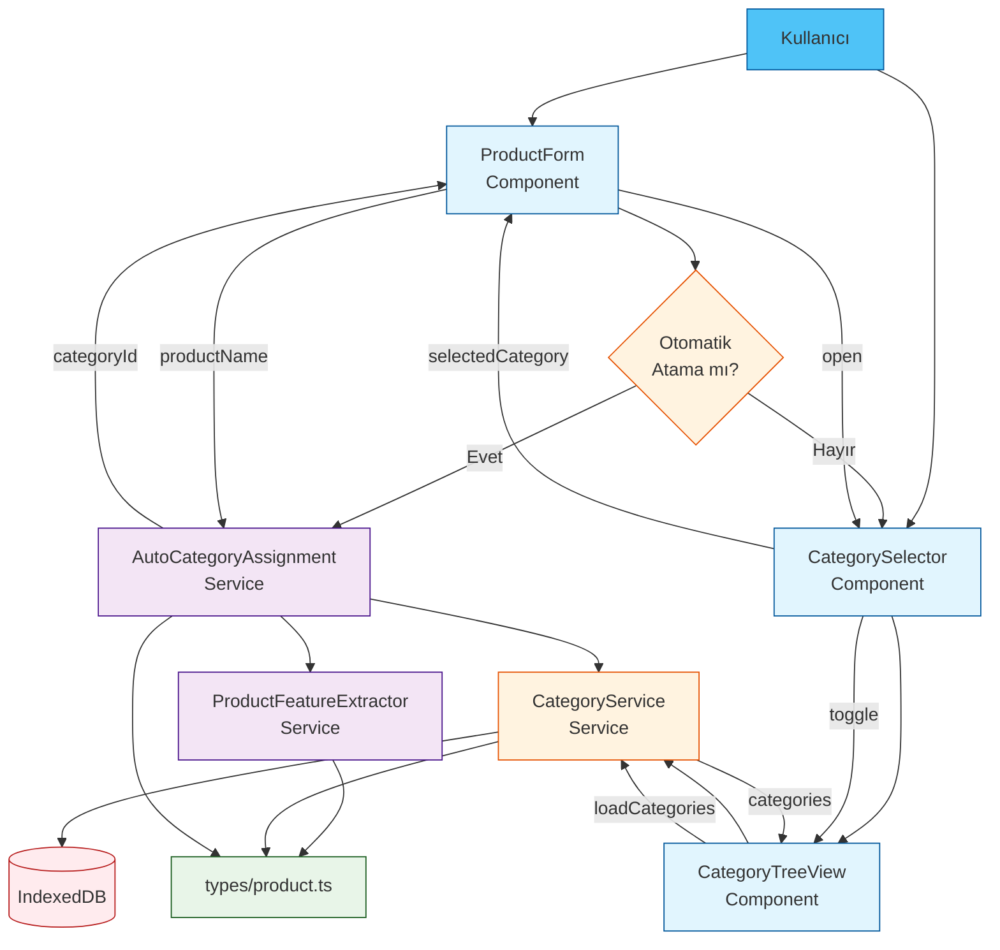
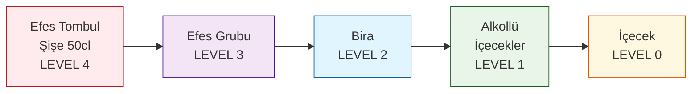
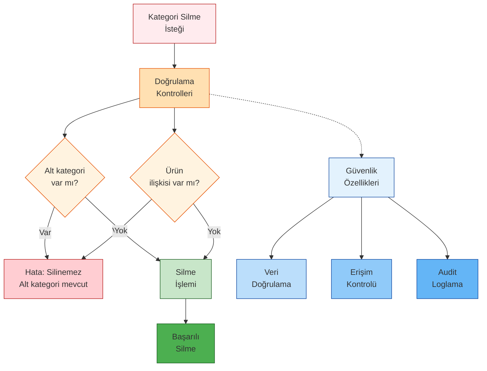
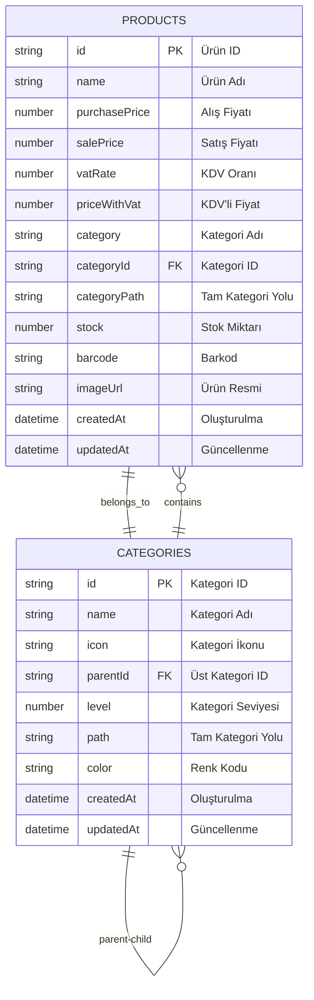
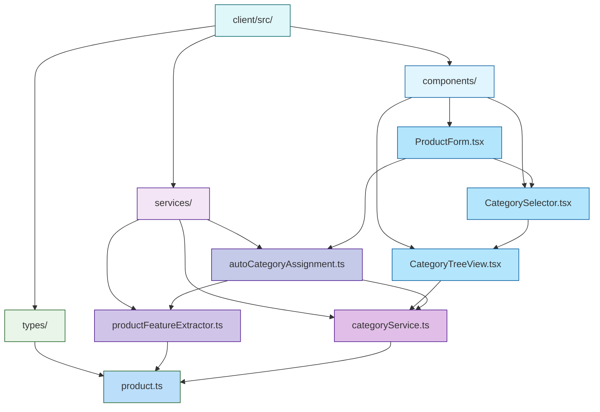
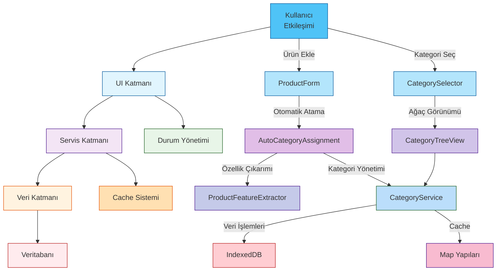

# RoxoePOS Tam Kategori Sistemi Haritası

## 1. Sistem Bileşenleri ve İlişkileri

```mermaid
graph TD
    %% Users and Main Components
    USER[Kullanıcı] --> PRODUCT_FORM[ProductForm.tsx]
    USER --> CATEGORY_SELECTOR[CategorySelector.tsx]
    
    %% Product Form Flow
    PRODUCT_FORM --> AUTO_ASSIGN[AutoCategoryAssignment.ts]
    AUTO_ASSIGN --> FEATURE_EXTRACT[ProductFeatureExtractor.ts]
    AUTO_ASSIGN --> CATEGORY_SERVICE[CategoryService.ts]
    
    %% Category Selector Flow
    CATEGORY_SELECTOR --> CATEGORY_TREE[CategoryTreeView.tsx]
    CATEGORY_TREE --> CATEGORY_SERVICE
    
    %% Data Layer
    CATEGORY_SERVICE --> DATABASE[(IndexedDB)]
    FEATURE_EXTRACT --> TYPES[types/product.ts]
    CATEGORY_SERVICE --> TYPES
    PRODUCT_FORM --> TYPES
    
    %% Cache System
    CATEGORY_SERVICE --> CACHE[CACHE SİSTEMİ]
    CACHE --> CATEGORY_CACHE[Kategori Cache<br/>Map&lt;id, Category&gt;]
    CACHE --> TREE_CACHE[Ağaç Cache<br/>Map&lt;'root', CategoryNode[]&gt;]
    
    %% Styling
    style USER fill:#4FC3F7,stroke:#01579B
    style PRODUCT_FORM fill:#E1F5FE,stroke:#01579B
    style CATEGORY_SELECTOR fill:#E1F5FE,stroke:#01579B
    style AUTO_ASSIGN fill:#F3E5F5,stroke:#4A148C
    style FEATURE_EXTRACT fill:#F3E5F5,stroke:#4A148C
    style CATEGORY_SERVICE fill:#FFF3E0,stroke:#E65100
    style CATEGORY_TREE fill:#E1F5FE,stroke:#01579B
    style DATABASE fill:#FFEBEE,stroke:#B71C1C
    style TYPES fill:#E8F5E8,stroke:#1B5E20
    style CACHE fill:#FFE0B2,stroke:#E65100
    style CATEGORY_CACHE fill:#FFCC80,stroke:#E65100
    style TREE_CACHE fill:#FFB74D,stroke:#E65100
```

## 2. Kategori Hiyerarşisi ve Veri Akışı

```mermaid
flowchart LR
    %% Product Analysis Flow
    PRODUCT_NAME[Ürün Adı:<br/>"Efes Tombul Şişe 50cl"] --> FEATURE_EXTRACT2[Özellik<br/>Çıkarımı]
    FEATURE_EXTRACT2 --> FEATURES{Özellikler}
    FEATURES --> FEATURE_LIST[Marka: Efes<br/>Tür: Bira<br/>Ambalaj: Şişe<br/>Hacim: 50cl]
    FEATURE_LIST --> CATEGORY_SUGGEST[Kategori<br/>Önerisi]
    CATEGORY_SUGGEST --> CATEGORY_PATH["İçecek > Alkollü İçecekler > Bira > Efes Grubu"]
    CATEGORY_PATH --> CATEGORY_SERVICE2[Kategori<br/>Servisi]
    CATEGORY_SERVICE2 --> CATEGORY_PROCESS[Kategori<br/>İşlemleri]
    CATEGORY_PROCESS --> DB_OPERATIONS[Veritabanı<br/>İşlemleri]
    DB_OPERATIONS --> CATEGORY_RESULT[Kategori<br/>Sonucu]
    CATEGORY_RESULT --> PRODUCT_SAVE[Ürün<br/>Kaydı]
    
    %% Styling
    style PRODUCT_NAME fill:#4FC3F7,stroke:#01579B
    style FEATURE_EXTRACT2 fill:#F3E5F5,stroke:#4A148C
    style FEATURES fill:#FFF3E0,stroke:#E65100
    style FEATURE_LIST fill:#FFF3E0,stroke:#E65100
    style CATEGORY_SUGGEST fill:#E3F2FD,stroke:#0D47A1
    style CATEGORY_PATH fill:#E3F2FD,stroke:#0D47A1
    style CATEGORY_SERVICE2 fill:#FFF3E0,stroke:#E65100
    style CATEGORY_PROCESS fill:#FFE0B2,stroke:#E65100
    style DB_OPERATIONS fill:#FFEBEE,stroke:#B71C1C
    style CATEGORY_RESULT fill:#E8F5E8,stroke:#1B5E20
    style PRODUCT_SAVE fill:#4FC3F7,stroke:#01579B
```

## 3. UI Bileşenleri ve Etkileşimleri



## 4. Kategori Ağacı ve Seviyeler

```mermaid
graph TD
    %% Category Hierarchy Levels
    LEVEL0[Ana Kategori<br/>level: 0<br/>parentId: null] --> LEVEL1[Alt Kategori<br/>level: 1<br/>parentId: cat_001]
    LEVEL1 --> LEVEL2[Alt-Alt Kategori<br/>level: 2<br/>parentId: cat_002]
    LEVEL2 --> LEVEL3[Ürün Kategorisi<br/>level: 3<br/>parentId: cat_003]
    LEVEL3 --> LEVEL4[Ürün<br/>level: 4<br/>categoryId: cat_004]
    
    %% Example Path
    LEVEL4 -.-> PATH[categoryPath:<br/>"İçecek > Alkollü İçecekler > Bira > Efes Grubu"]
    
    %% Styling
    style LEVEL0 fill:#4FC3F7,stroke:#01579B
    style LEVEL1 fill:#29B6F6,stroke:#01579B
    style LEVEL2 fill:#039BE5,stroke:#01579B
    style LEVEL3 fill:#0288D1,stroke:#01579B
    style LEVEL4 fill:#0277BD,stroke:#01579B
    style PATH fill:#E3F2FD,stroke:#0D47A1
```

## 5. Ters Hiyerarşik Kategorizasyon Akışı



## 6. Cache ve Performans Yönetimi

```mermaid
graph TD
    %% Cache System
    CATEGORY_SERVICE4[CategoryService] --> CACHE_MGMT[Cache Yönetimi]
    CACHE_MGMT --> CATEGORY_CACHE2[Kategori Cache<br/>Map&lt;id, Category&gt;<br/>getCache/setCache]
    CACHE_MGMT --> TREE_CACHE2[Ağaç Cache<br/>Map&lt;'root', CategoryNode[]&gt;<br/>getTreeCache/setTreeCache]
    CATEGORY_SERVICE4 --> DB_OPERATIONS2[DB İşlemleri]
    DB_OPERATIONS2 --> INDEXEDDB[IndexedDB]
    
    CACHE_MGMT --> CLEAR_CACHE[clearCache()]
    
    %% Performance Benefits
    CACHE_MGMT -.-> PERFORMANCE[Performans<br/>Avantajları]
    PERFORMANCE --> REDUCED_DB[DB Sorgu<br/>Azaltımı]
    PERFORMANCE --> FASTER_LOAD[Hızlı<br/>Yükleme]
    PERFORMANCE --> MEMORY_OPT[Bellek<br/>Optimizasyonu]
    
    %% Styling
    style CATEGORY_SERVICE4 fill:#FFF3E0,stroke:#E65100
    style CACHE_MGMT fill:#FFE0B2,stroke:#E65100
    style CATEGORY_CACHE2 fill:#FFCC80,stroke:#E65100
    style TREE_CACHE2 fill:#FFB74D,stroke:#E65100
    style DB_OPERATIONS2 fill:#FFA726,stroke:#E65100
    style INDEXEDDB fill:#FF9800,stroke:#E65100
    style CLEAR_CACHE fill:#FF8A65,stroke:#E65100
    style PERFORMANCE fill:#81C784,stroke:#1B5E20
    style REDUCED_DB fill:#AED581,stroke:#1B5E20
    style FASTER_LOAD fill:#DCE775,stroke:#1B5E20
    style MEMORY_OPT fill:#FFF176,stroke:#1B5E20
```

## 7. Hata Yönetimi ve Güvenlik



## 8. Veritabanı İlişkileri



## 9. Dosya Yapısı ve Bağımlılıklar



## 10. Tam Sistem Entegrasyonu



Bu tam sistem haritası, RoxoePOS kategori sisteminin tüm yönlerini ve bileşenlerini kapsamlı bir şekilde göstermektedir. Her bileşenin rolü, ilişkileri ve veri akışları açıkça tanımlanmıştır.