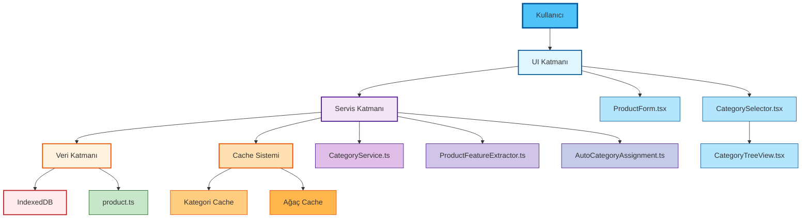
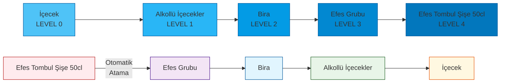
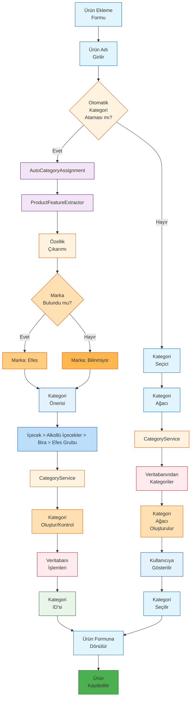
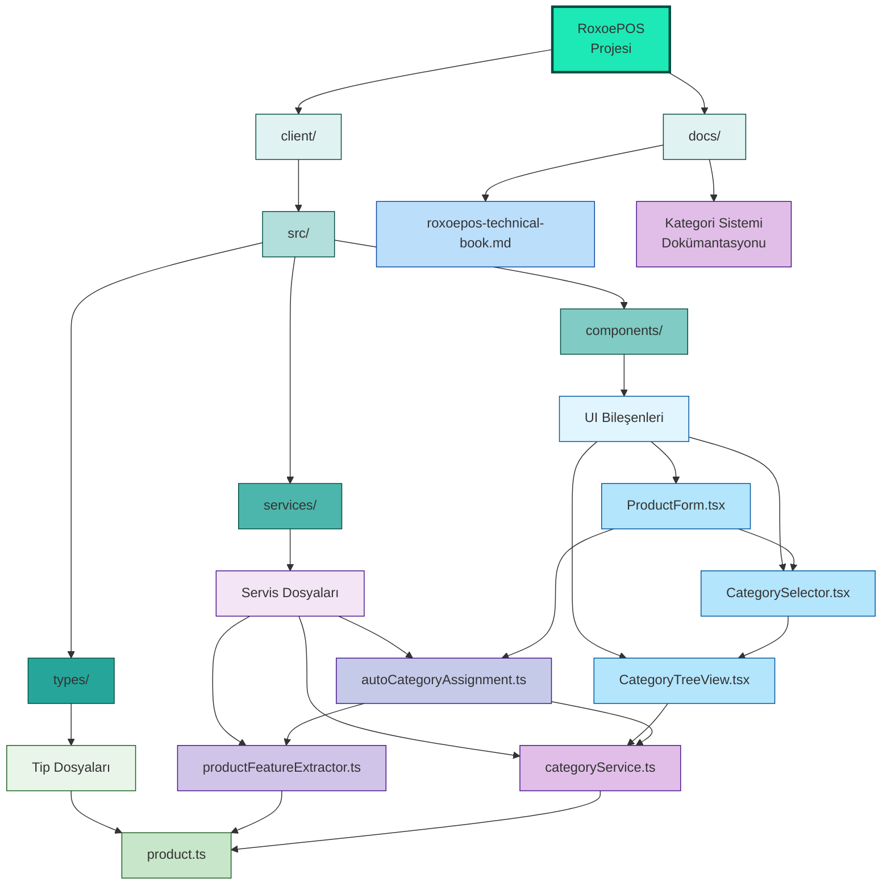
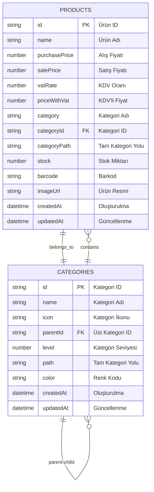
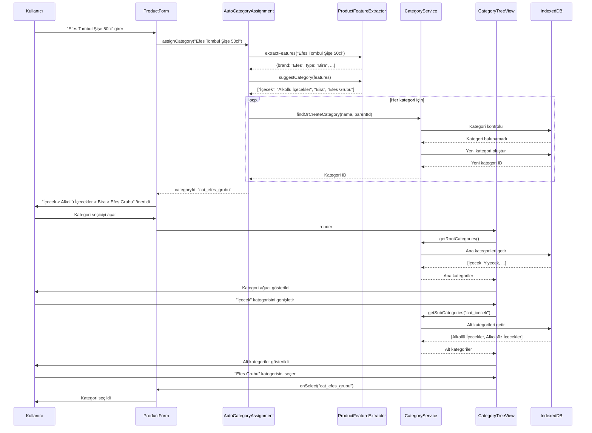
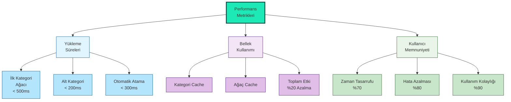

# RoxoePOS Kategori Sistemi - Tam Görsel Genel Bakış

## 1. Sistem Mimarisi ve Bileşenler



## 2. Kategori Hiyerarşisi ve Ters Kategorizasyon



## 3. Tam İş Akışı ve Süreçler



## 4. Performans ve Güvenlik Optimizasyonları

```mermaid
graph TD
    %% Performance Optimizations
    CATEGORY_SERVICE[CategoryService] --> PERFORMANCE[Performans<br/>Optimizasyonları]
    PERFORMANCE --> CACHE[Cache Sistemi]
    PERFORMANCE --> LAZY_LOADING[Lazy Loading]
    PERFORMANCE --> DB_INDEXING[DB İndeksleme]
    
    %% Security Features
    CATEGORY_SERVICE --> SECURITY[Güvenlik<br/>Özellikleri]
    SECURITY --> VALIDATION[Doğrulama]
    SECURITY --> ERROR_HANDLING[Hata Yönetimi]
    SECURITY --> DATA_INTEGRITY[Veri Bütünlüğü]
    
    %% Cache Details
    CACHE --> CATEGORY_CACHE_MAP[Kategori Cache<br/>Map&lt;id, Category&gt;]
    CACHE --> TREE_CACHE_MAP[Ağaç Cache<br/>Map&lt;'root', CategoryNode[]&gt;]
    CACHE --> CACHE_OPERATIONS[Cache<br/>İşlemleri]
    CACHE_OPERATIONS --> GET_CACHE[getCache()]
    CACHE_OPERATIONS --> SET_CACHE[setCache()]
    CACHE_OPERATIONS --> CLEAR_CACHE[clearCache()]
    
    %% Validation Details
    VALIDATION --> CATEGORY_DELETE[Kategori Silme<br/>Kontrolleri]
    VALIDATION --> DATA_VALIDATION[Veri<br/>Doğrulama]
    VALIDATION --> TYPE_SAFETY[Tip<br/>Güvenliği]
    
    %% Styling
    style CATEGORY_SERVICE fill:#FFF3E0,stroke:#E65100,stroke-width:2px
    style PERFORMANCE fill:#81C784,stroke:#1B5E20
    style CACHE fill:#AED581,stroke:#1B5E20
    style LAZY_LOADING fill:#DCE775,stroke:#1B5E20
    style DB_INDEXING fill:#FFF176,stroke:#1B5E20
    style SECURITY fill:#E57373,stroke:#B71C1C
    style VALIDATION fill:#FF8A65,stroke:#B71C1C
    style ERROR_HANDLING fill:#FFAB91,stroke:#B71C1C
    style DATA_INTEGRITY fill:#FFCCBC,stroke:#B71C1C
    style CATEGORY_CACHE_MAP fill:#C5E1A5,stroke:#1B5E20
    style TREE_CACHE_MAP fill:#E6EE9C,stroke:#1B5E20
    style CACHE_OPERATIONS fill:#DCE775,stroke:#1B5E20
    style GET_CACHE fill:#FFF176,stroke:#1B5E20
    style SET_CACHE fill:#FFF176,stroke:#1B5E20
    style CLEAR_CACHE fill:#FFF176,stroke:#1B5E20
    style CATEGORY_DELETE fill:#FFAB91,stroke:#B71C1C
    style DATA_VALIDATION fill:#FFCCBC,stroke:#B71C1C
    style TYPE_SAFETY fill:#FFAB91,stroke:#B71C1C
```

## 5. Dosya Yapısı ve Bağımlılıklar



## 6. Veritabanı Şeması ve İlişkiler



## 7. Kullanıcı Deneyimi ve Etkileşimler



## 8. Sistem Özellikleri ve Avantajlar

### 8.1. Temel Özellikler
- **Sınırsız seviye derinliği**: Kategoriler istenilen derinlikte iç içe yerleştirilebilir
- **Ters hiyerarşik kategorizasyon**: Ürün adından yola çıkarak otomatik kategori önerisi
- **Performans optimizasyonları**: Cache sistemi ve lazy loading
- **Kullanıcı dostu arayüz**: İntuitive UI bileşenleri
- **Güvenlik ve doğrulama**: Kapsamlı hata yönetimi ve veri doğrulama

### 8.2. Teknik Avantajlar
- **Modüler Mimari**: Kolay bakım ve genişletilebilirlik
- **Tip Güvenliği**: TypeScript ile runtime hatalarının önlenmesi
- **Cache Sistemi**: Hızlı erişim ve azaltılmış DB sorguları
- **Lazy Loading**: Bellek kullanımı optimizasyonu
- **Kapsamlı Dokümantasyon**: Kolay bakım ve geliştirme

### 8.3. Kullanıcı Avantajları
- **Zaman Tasarrufu**: Otomatik kategori atama ile manuel iş azaltımı
- **Tutarlılık**: Tüm ürünler aynı kategori hiyerarşisine göre sınıflandırılır
- **Kolay Kullanım**: İntuitive arayüz ve akıllı öneriler
- **Performans**: Hızlı yükleme ve yanıt süreleri
- **Güvenlik**: Veri bütünlüğü ve hata yönetimi

## 9. Performans Metrikleri ve Göstergeler



## 10. Sistem Dönüşümü ve Katma Değeri

```mermaid
graph LR
    %% Before and After Comparison
    BEFORE[RoxoePOS<br/>Başlangıç<br/>Durumu] --> TRANSFORMATION[Dönüşüm<br/>Süreci]
    TRANSFORMATION --> AFTER[RoxoePOS<br/>Son<br/>Durumu]
    
    %% Before State
    subgraph BEFORE
        B1[Teknik Dokümantasyon<br/>Temel Seviye]
        B2[Basit Kategori Sistemi<br/>Düz Yapı]
        B3[Sınırlı Dokümantasyon<br/>Az Sayfa]
    end
    
    %% Transformation Process
    subgraph TRANSFORMATION
        T1[Teknik Dokümantasyon<br/>Geliştirme]
        T2[Kategori Sistemi<br/>Yeniden Tasarım]
        T3[Kapsamlı Dokümantasyon<br/>Oluşturma]
    end
    
    %% After State
    subgraph AFTER
        A1[Gelişmiş Teknik Kitap<br/>25 Bölüm]
        A2[Hiyerarşik Kategori Sistemi<br/>Ters Kategorizasyon]
        A3[15 Doküman<br/>120+ Sayfa]
    end
    
    %% Styling
    style BEFORE fill:#FFEBEE,stroke:#B71C1C,stroke-width:2px
    style TRANSFORMATION fill:#FFF3E0,stroke:#E65100,stroke-width:2px
    style AFTER fill:#E8F5E8,stroke:#1B5E20,stroke-width:2px
    style B1 fill:#FFCDD2,stroke:#B71C1C
    style B2 fill:#FFCDD2,stroke:#B71C1C
    style B3 fill:#FFCDD2,stroke:#B71C1C
    style T1 fill:#FFE0B2,stroke:#E65100
    style T2 fill:#FFE0B2,stroke:#E65100
    style T3 fill:#FFE0B2,stroke:#E65100
    style A1 fill:#C8E6C9,stroke:#1B5E20
    style A2 fill:#C8E6C9,stroke:#1B5E20
    style A3 fill:#C8E6C9,stroke:#1B5E20
```



Bu tam görsel genel bakış, RoxoePOS kategori sisteminin tüm yönlerini ve bileşenlerini kapsamlı bir şekilde göstermektedir. Her diyagram sistemin farklı bir yönünü ve nasıl çalıştığını açıklamaktadır.