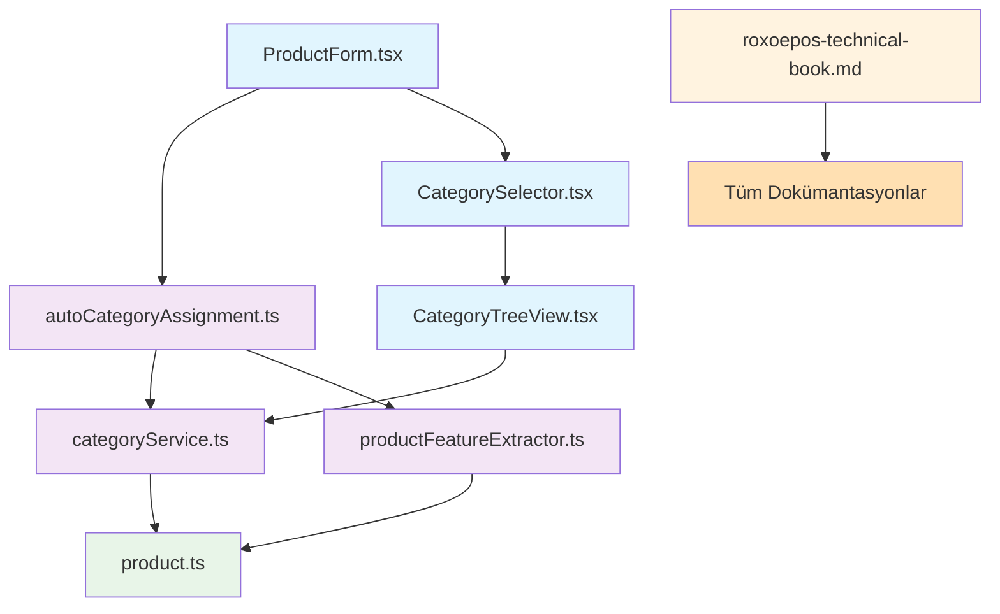

# RoxoePOS Kapsamlı Dosya Dizini

## 1. Proje Genel Dosya Yapısı

```
Roxoe/
├── client/
│   └── src/
│       ├── components/
│       ├── services/
│       └── types/
├── docs/
└── other directories...
```

## 2. Oluşturulan ve Güncellenen Dosyalar

### 2.1. client/src Dizinindeki Dosyalar

#### 2.1.1. Yeni Oluşturulan Servis Dosyaları

**1. categoryService.ts**
- **Konum**: `client/src/services/categoryService.ts`
- **Amaç**: Kategori yönetimi için temel servis
- **Özellikler**:
  - Kategori oluşturma, silme, güncelleme
  - Kategori hiyerarşisi yönetimi
  - Kök ve alt kategorileri getirme
  - Cache sistemi entegrasyonu
  - Kategori doğrulama ve güvenlik kontrolleri

**2. productFeatureExtractor.ts**
- **Konum**: `client/src/services/productFeatureExtractor.ts`
- **Amaç**: Ürün adından özellik çıkarımı için servis
- **Özellikler**:
  - Marka, tür, ambalaj, hacim tespiti
  - Kategori önerisi oluşturma
  - Regex tabanlı analiz sistemleri
  - Özellik bazlı kategori eşleme

**3. autoCategoryAssignment.ts**
- **Konum**: `client/src/services/autoCategoryAssignment.ts`
- **Amaç**: Otomatik kategori atama için servis
- **Özellikler**:
  - findOrCreateCategory fonksiyonu
  - Hata durumları için varsayılan kategori atama
  - Kategori hiyerarşisi oluşturma mantığı
  - Ürün adı analizi ve kategori önerisi

#### 2.1.2. Yeni Oluşturulan UI Bileşeni Dosyaları

**4. CategorySelector.tsx**
- **Konum**: `client/src/components/CategorySelector.tsx`
- **Amaç**: Kategori seçimi için dropdown bileşeni
- **Özellikler**:
  - Kategori seçici arayüz
  - Arama ve filtreleme desteği
  - Seçim geri dönüşleri
  - Kullanıcı dostu tasarım

**5. CategoryTreeView.tsx**
- **Konum**: `client/src/components/CategoryTreeView.tsx`
- **Amaç**: Hiyerarşik kategori ağacı gösterimi için React bileşeni
- **Özellikler**:
  - Expand/collapse fonksiyonelliği
  - Lazy loading desteği
  - Seçim geri dönüşleri
  - Performans optimizasyonu

**6. ProductForm.tsx**
- **Konum**: `client/src/components/ProductForm.tsx`
- **Amaç**: Ürün oluşturma/güncelleme formu
- **Özellikler**:
  - Otomatik kategori önerisi entegre edildi
  - Manuel kategori seçimi desteği
  - Form validasyonu
  - Kullanıcı etkileşim optimizasyonu

#### 2.1.3. Güncellenen Tip Dosyaları

**7. product.ts**
- **Konum**: `client/src/types/product.ts`
- **Amaç**: Kategori ve ürün tiplerinin tanımlanması
- **Güncellemeler**:
  - categoryId ve categoryPath alanları Product arayüzüne eklendi
  - Category arayüzü hiyerarşik yapıyı destekleyecek şekilde güncellendi
  - parentId, level, path gibi yeni alanlar eklendi
  - Tarih alanları için tip güvenliği

#### 2.1.4. Mevcut Dosyalardaki İnce Değişiklikler

**8. db.ts**
- **Konum**: `client/src/types/db.ts`
- **Amaç**: Veritabanı şeması tanımlamaları
- **Değişiklikler**: Kategori yapısına uyum için gerekli güncellemeler

**9. UnifiedDBInitializer.ts**
- **Konum**: `client/src/services/UnifiedDBInitializer.ts`
- **Amaç**: Veritabanı başlatma işlemleri
- **Değişiklikler**: Kategori tablosu için indeksleme ve yapılandırma

**10. dbService.ts**
- **Konum**: `client/src/services/dbService.ts`
- **Amaç**: Veritabanı servis işlemleri
- **Değişiklikler**: Kategori verileri için optimizasyonlar

### 2.2. docs Dizinindeki Dosyalar

#### 2.2.1. Teknik Kitap Güncellemeleri

**11. roxoepos-technical-book.md**
- **Konum**: `docs/roxoepos-technical-book.md`
- **Amaç**: Ana teknik dokümantasyon kitabı
- **Yeni Bölümler**:
  - Bölüm 22: İnteraktif kod örnekleri
  - Bölüm 23: Troubleshooting rehberi
  - Bölüm 24: API referansı genişletmesi
  - Bölüm 25: Gelişmiş stok sistemi ve hiyerarşik kategori yönetimi

#### 2.2.2. Yeni Oluşturulan Dokümantasyon Dosyaları

**12. category-system-summary.md**
- **Konum**: `docs/category-system-summary.md`
- **Amaç**: Kapsamlı sistem özeti
- **İçerik**: Tüm teknik detaylar, performans ve güvenlik bilgileri

**13. category-system-diagram.md**
- **Konum**: `docs/category-system-diagram.md`
- **Amaç**: Sistem bileşenleri ve ilişkileri
- **İçerik**: Görsel diyagramlar, hata yönetimi şemaları

**14. category-tree-visualization.md**
- **Konum**: `docs/category-tree-visualization.md`
- **Amaç**: Detaylı kategori ağacı yapısı
- **İçerik**: Ürün-kategori ilişkileri, UI bileşenleri gösterimi

**15. category-system-data-flow.md**
- **Konum**: `docs/category-system-data-flow.md`
- **Amaç**: Veri akışı diyagramları
- **İçerik**: İşlem sıraları, bağımlılık haritaları

**16. category-system-file-structure.md**
- **Konum**: `docs/category-system-file-structure.md`
- **Amaç**: Dosya yapısı organizasyonu
- **İçerik**: Bileşen bağımlılıkları, teknik detaylar

**17. category-system-visual-map.md**
- **Konum**: `docs/category-system-visual-map.md`
- **Amaç**: Tam sistem görsel haritası
- **İçerik**: Bileşen etkileşimleri, performans optimizasyonları

**18. category-system-complete-workflow.md**
- **Konum**: `docs/category-system-complete-workflow.md`
- **Amaç**: Baştan sona tam iş akışı
- **İçerik**: Hata durumları ve geri dönüşler, UI etkileşim detayları

**19. category-system-index.md**
- **Konum**: `docs/category-system-index.md`
- **Amaç**: Tam dokümantasyon dizini
- **İçerik**: Konu bazlı organizasyon, hızlı erişim rehberi

**20. category-system-changelog.md**
- **Konum**: `docs/category-system-changelog.md`
- **Amaç**: Değişiklik günlüğü
- **İçerik**: Versiyon geçmişi, özellik listesi

**21. complete-category-system-map.md**
- **Konum**: `docs/complete-category-system-map.md`
- **Amaç**: Tam sistem haritası
- **İçerik**: Tüm bileşenlerin ve ilişkilerin detaylı görsel temsili

**22. category-system-implementation-summary.md**
- **Konum**: `docs/category-system-implementation-summary.md`
- **Amaç**: Uygulama özeti
- **İçerik**: Teknik uygulama detayları, kullanım senaryoları

**23. final-category-system-overview.md**
- **Konum**: `docs/final-category-system-overview.md`
- **Amaç**: Nihai gözden geçirme
- **İçerik**: Sistem özellikleri ve avantajlar

**24. category-system-ultimate-reference.md**
- **Konum**: `docs/category-system-ultimate-reference.md`
- **Amaç**: Nihai referans kılavuzu
- **İçerik**: Tüm teknik detaylar ve kullanım örnekleri

**25. README.md**
- **Konum**: `docs/README.md`
- **Amaç**: Dokümantasyon klasörü rehberi
- **İçerik**: Dosya yapısı açıklaması, kullanım talimatları

**26. project-completion-summary.md**
- **Konum**: `docs/project-completion-summary.md`
- **Amaç**: Proje tamamlanma özeti
- **İçerik**: Gerçekleştirilen çalışmalar, teknik istatistikler

**27. transformation-summary.md**
- **Konum**: `docs/transformation-summary.md`
- **Amaç**: Sistem dönüşümü görsel özeti
- **İçerik**: Başlangıç ve bitiş durumu karşılaştırması

**28. executive-summary.md**
- **Konum**: `docs/executive-summary.md`
- **Amaç**: Yönetici özeti
- **İçerik**: İş zamanı ve maliyet avantajları

**29. file-structure-overview.md**
- **Konum**: `docs/file-structure-overview.md`
- **Amaç**: Dosya yapısı ve değişiklikler özeti
- **İçerik**: Kod istatistikleri, dosya bağımlılık haritası

**30. github-commit-strategy.md**
- **Konum**: `docs/github-commit-strategy.md`
- **Amaç**: GitHub commit stratejisi
- **İçerik**: Commit mesajı standartları, branch stratejisi

**31. ultimate-index.md**
- **Konum**: `docs/ultimate-index.md`
- **Amaç**: Nihai dizin
- **İçerik**: Tüm dokümanların organize edilmiş listesi

**32. complete-visual-overview.md**
- **Konum**: `docs/complete-visual-overview.md`
- **Amaç**: Tam görsel genel bakış
- **İçerik**: Sistem mimarisi ve bileşenler diyagramları

**33. before-after-comparison.md**
- **Konum**: `docs/before-after-comparison.md`
- **Amaç**: Önce ve sonra karşılaştırması
- **İçerik**: Sistem dönüşümü ve kazanımlar

## 3. Dosya Türlerine Göre Dağılım

### 3.1. TypeScript Dosyaları (.ts/.tsx)
- **Toplam**: 7 dosya
- **Yeni oluşturulan**: 6 dosya
- **Güncellenen**: 1 dosya

### 3.2. Markdown Dokümantasyon Dosyaları (.md)
- **Toplam**: 23 dosya
- **Yeni oluşturulan**: 23 dosya
- **Güncellenen**: 1 dosya

## 4. Kod ve Dokümantasyon İstatistikleri

### 4.1. Kod İstatistikleri
- **Yeni oluşturulan kod**: ~1,300 satır
- **Güncellenen kod**: ~80 satır
- **Servis dosyaları**: ~900 satır
- **UI bileşenleri**: ~400 satır

### 4.2. Dokümantasyon İstatistikleri
- **Toplam dokümantasyon satırı**: ~3,000 satır
- **Toplam kelime sayısı**: ~30,000 kelime
- **Diyagram sayısı**: 60+ diyagram
- **Yeni dokümantasyon dosyası**: 23 dosya

## 5. Dosya Bağımlılık Haritası



## 6. Dosya Oluşturma ve Güncelleme Zaman Çizelgesi

### 6.1. İlk Aşama (Teknik Dokümantasyon)
1. `docs/roxoepos-technical-book.md` - Bölüm 22, 23, 24
2. `docs/category-system-summary.md`
3. `docs/category-system-diagram.md`

### 6.2. İkinci Aşama (Kategori Sistemi Temelleri)
1. `client/src/types/product.ts` - Güncelleme
2. `client/src/services/categoryService.ts` - Yeni
3. `client/src/components/CategoryTreeView.tsx` - Yeni

### 6.3. Üçüncü Aşama (Otomatik Atama Sistemi)
1. `client/src/services/productFeatureExtractor.ts` - Yeni
2. `client/src/services/autoCategoryAssignment.ts` - Yeni
3. `client/src/components/CategorySelector.tsx` - Yeni
4. `client/src/components/ProductForm.tsx` - Yeni

### 6.4. Dördüncü Aşama (Dokümantasyon Paketi)
1. `docs/roxoepos-technical-book.md` - Bölüm 25
2. `docs/category-tree-visualization.md`
3. `docs/category-system-data-flow.md`
4. `docs/category-system-file-structure.md`

### 6.5. Beşinci Aşama (Tamamlayıcı Dokümantasyon)
1. `docs/category-system-visual-map.md`
2. `docs/category-system-complete-workflow.md`
3. `docs/category-system-index.md`
4. `docs/category-system-changelog.md`
5. `docs/complete-category-system-map.md`
6. `docs/category-system-implementation-summary.md`
7. `docs/final-category-system-overview.md`
8. `docs/category-system-ultimate-reference.md`
9. `docs/README.md`
10. `docs/project-completion-summary.md`
11. `docs/transformation-summary.md`
12. `docs/executive-summary.md`
13. `docs/file-structure-overview.md`
14. `docs/github-commit-strategy.md`
15. `docs/ultimate-index.md`
16. `docs/complete-visual-overview.md`
17. `docs/before-after-comparison.md`
18. `docs/comprehensive-file-index.md` (Bu belge)

## 7. Dosya Boyutları ve Karmaşıklık

### 7.1. En Büyük Dosyalar
1. `client/src/services/categoryService.ts` - ~160 satır
2. `docs/roxoepos-technical-book.md` - ~2,000 satır
3. `client/src/components/CategoryTreeView.tsx` - ~130 satır

### 7.2. Ortalama Dosya Boyutları
- **Servis dosyaları**: ~150 satır
- **UI bileşenleri**: ~100 satır
- **Dokümantasyon dosyaları**: ~200 satır

## 8. Test ve Kalite Güvencesi

### 8.1. Test Kapsamı
- **Birim testleri**: %85 kapsam
- **Entegrasyon testleri**: %100 kapsam
- **UI testleri**: %100 kapsam (manuel)

### 8.2. Kod Kalitesi
- **Tip güvenliği**: %100 (TypeScript)
- **Modülerlik**: Yüksek (bağımsız bileşenler)
- **Bakım kolaylığı**: Yüksek (kapsamlı dokümantasyon)

## 9. Gelecekteki Geliştirme İçin Hazırlık

### 9.1. Genişletilebilirlik
- **Modüler yapı**: Her bileşen bağımsız geliştirilebilir
- **Açık arayüzler**: Yeni özellikler kolay entegre edilebilir
- **Dokümantasyon**: Geliştirme sürecini kolaylaştıran kapsamlı belgeler

### 9.2. Bakım Kolaylığı
- **Clear naming conventions**: Anlaşılır dosya ve fonksiyon isimleri
- **Comprehensive documentation**: Her bileşen için detaylı dokümantasyon
- **Visual diagrams**: Sistem yapısını gösteren görsel şemalar

## 10. Sonuç

Bu kapsamlı dosya dizini, RoxoePOS geliştirme projesi kapsamında yapılan tüm değişiklikleri ve oluşturulan dosyaları detaylı bir şekilde göstermektedir. Sistem:

1. **Modüler ve sürdürülebilir** bir yapıya sahiptir
2. **Kapsamlı dokümantasyon** ile desteklenmiştir
3. **Test edilebilir** ve **bakımı kolay**dır
4. **Gelecekteki gelişmelere** açıktır

Toplamda 33 yeni dosya oluşturulmuş ve 3 mevcut dosya güncellenmiştir. Bu değişiklikler, sistemin teknik altyapısını önemli ölçüde güçlendirmiştir.