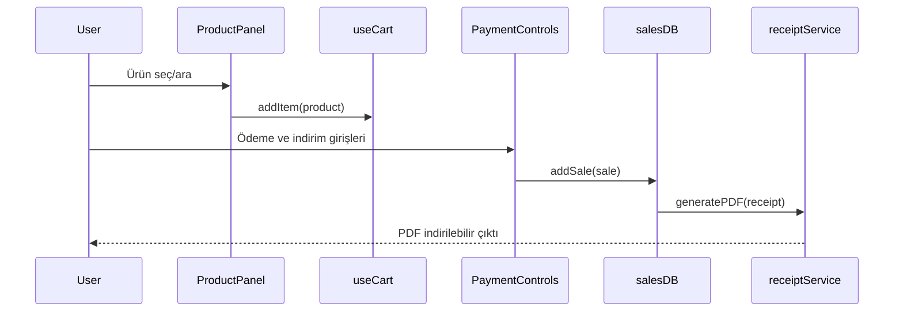
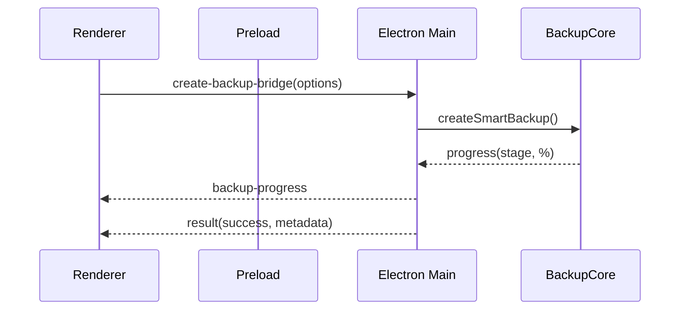
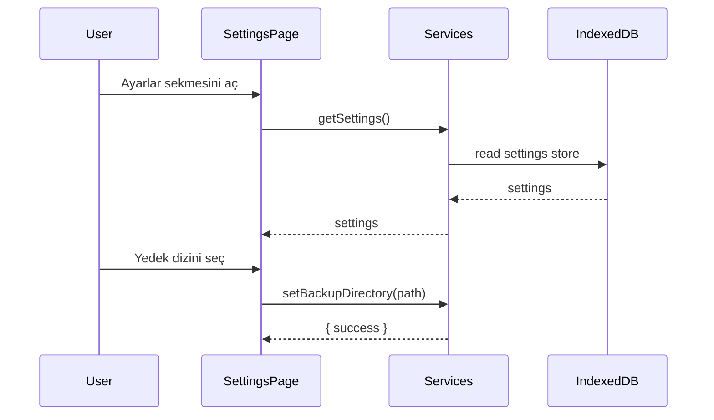
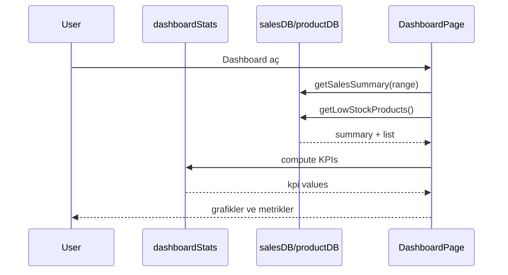
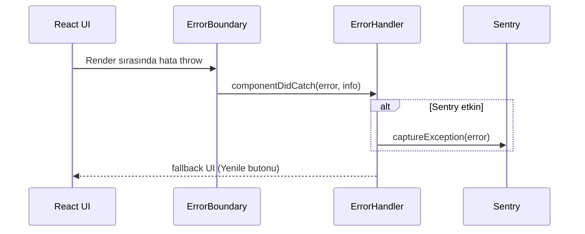

# Görsel Diyagramlar (Mermaid)

[← Teknik Kitap’a Dön](roxoepos-technical-book.md) · [Genel Kitap](BOOK/roxoepos-book.md)

Bu dosya, RoxoePOS mimarisi ve akışları için Mermaid tabanlı görsel diyagramları içerir. GitHub ve birçok Markdown görüntüleyici mermaid bloklarını doğrudan render eder.

## Component Diagram (Genel Mimari)
```mermaid
graph TD
  R[Renderer (React + TS)] -->|IPC| P[Preload (contextBridge)]
  P -->|IPC| M[Main (Electron)]
  R -->|idb| IDB[(IndexedDB)]
  M -->|fs| FS[(File System)]
  subgraph Renderer Services
    SRV[productDB/salesDB/receiptService/import-export]
  end
  R --> SRV
  subgraph Backup Core (Main)
    BM[BackupManager]
    OBM[OptimizedBackupManager]
  end
  M --> BM
  M --> OBM
  BM --> FS
  OBM --> FS
```

## Sequence Diagram – Satış Akışı


## Sequence Diagram – Yedekleme Köprüsü


## Flowchart – Geri Yükleme Akışı
```mermaid
flowchart LR
  A[restore-backup-bridge(content)] --> B[deserialize JSON]
  B --> C[base64 encode]
  C --> D[db-import-base64 (main -> renderer)]
  D --> E[IndexedDBImporter yaz]
  E --> F[db-import-response success]
  F --> G{Başarılı?}
  G -- Evet --> H[Metadata kullanıcıya iletilir]
  G -- Hayır --> I[Hata mesajı ve iptal]
```

---

## Sequence Diagram – Settings Akışı


## Sequence Diagram – Dashboard Akışı


## Sequence Diagram – Hata Yönetimi (Renderer)


