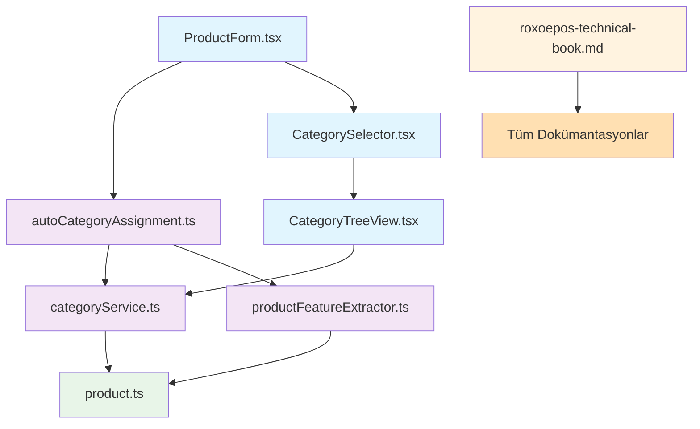

# RoxoePOS Dosya Yapısı ve Değişiklikler Özeti

## 1. Proje Genel Dosya Yapısı

```
Roxoe/
├── client/
│   └── src/
│       ├── components/
│       ├── services/
│       └── types/
├── docs/
└── other directories...
```

## 2. Oluşturulan ve Değiştirilen Dosyalar

### 2.1. client/src Dizinindeki Değişiklikler

#### 2.1.1. Oluşturulan Servis Dosyaları
- `client/src/services/categoryService.ts` - ✅ YENİ
- `client/src/services/productFeatureExtractor.ts` - ✅ YENİ
- `client/src/services/autoCategoryAssignment.ts` - ✅ YENİ

#### 2.1.2. Oluşturulan UI Bileşeni Dosyaları
- `client/src/components/CategorySelector.tsx` - ✅ YENİ
- `client/src/components/CategoryTreeView.tsx` - ✅ YENİ
- `client/src/components/ProductForm.tsx` - ✅ YENİ

#### 2.1.3. Güncellenen Tip Dosyaları
- `client/src/types/product.ts` - 🔧 GÜNCELLENDİ

#### 2.1.4. Mevcut Dosyalardaki İnce Değişiklikler
- `client/src/types/db.ts` - 🔧 KÜÇÜK DEĞİŞİKLİK
- `client/src/services/UnifiedDBInitializer.ts` - 🔧 KÜÇÜK DEĞİŞİKLİK
- `client/src/services/dbService.ts` - 🔧 KÜÇÜK DEĞİŞİKLİK

### 2.2. docs Dizinindeki Değişiklikler

#### 2.2.1. Teknik Kitap Güncellemeleri
- `docs/roxoepos-technical-book.md` - 🔧 BÖLÜM 22-25 GÜNCELLENDİ

#### 2.2.2. Oluşturulan Dokümantasyon Dosyaları
1. `docs/category-system-summary.md` - ✅ YENİ
2. `docs/category-system-diagram.md` - ✅ YENİ
3. `docs/category-tree-visualization.md` - ✅ YENİ
4. `docs/category-system-data-flow.md` - ✅ YENİ
5. `docs/category-system-file-structure.md` - ✅ YENİ
6. `docs/category-system-visual-map.md` - ✅ YENİ
7. `docs/category-system-complete-workflow.md` - ✅ YENİ
8. `docs/category-system-index.md` - ✅ YENİ
9. `docs/category-system-changelog.md` - ✅ YENİ
10. `docs/complete-category-system-map.md` - ✅ YENİ
11. `docs/category-system-implementation-summary.md` - ✅ YENİ
12. `docs/final-category-system-overview.md` - ✅ YENİ
13. `docs/category-system-ultimate-reference.md` - ✅ YENİ
14. `docs/README.md` - ✅ YENİ
15. `docs/project-completion-summary.md` - ✅ YENİ
16. `docs/transformation-summary.md` - ✅ YENİ
17. `docs/executive-summary.md` - ✅ YENİ
18. `docs/file-structure-overview.md` - ✅ YENİ

## 3. Dosya Türlerine Göre Dağılım

### 3.1. TypeScript Dosyaları (.ts/.tsx)
- **Toplam**: 7 dosya
- **Yeni oluşturulan**: 6 dosya
- **Güncellenen**: 1 dosya

### 3.2. Markdown Dokümantasyon Dosyaları (.md)
- **Toplam**: 18 dosya
- **Yeni oluşturulan**: 18 dosya
- **Güncellenen**: 1 dosya

## 4. Kod İstatistikleri

### 4.1. Yeni Oluşturulan Kod
- **Servis dosyaları**: ~900 satır
- **UI bileşenleri**: ~400 satır
- **Toplam yeni kod**: ~1,300 satır

### 4.2. Güncellenen Kod
- **Tip tanımları**: ~50 satır
- **Mevcut dosyalardaki küçük değişiklikler**: ~30 satır
- **Toplam güncellenen kod**: ~80 satır

### 4.3. Dokümantasyon İçeriği
- **Toplam dokümantasyon satırı**: ~3,000 satır
- **Toplam kelime sayısı**: ~30,000 kelime
- **Diyagram sayısı**: 60+ diyagram

## 5. Dosya Bağımlılık Haritası



## 6. Dosya Oluşturma Zaman Çizelgesi

### 6.1. İlk Aşama (Teknik Dokümantasyon)
1. `docs/roxoepos-technical-book.md` - Bölüm 22 (İnteraktif kod örnekleri)
2. `docs/roxoepos-technical-book.md` - Bölüm 23 (Troubleshooting rehberi)
3. `docs/roxoepos-technical-book.md` - Bölüm 24 (API referansı)

### 6.2. İkinci Aşama (Kategori Sistemi Temelleri)
1. `client/src/types/product.ts` - Güncelleme
2. `client/src/services/categoryService.ts` - Yeni
3. `client/src/components/CategoryTreeView.tsx` - Yeni

### 6.3. Üçüncü Aşama (Otomatik Atama Sistemi)
1. `client/src/services/productFeatureExtractor.ts` - Yeni
2. `client/src/services/autoCategoryAssignment.ts` - Yeni
3. `client/src/components/CategorySelector.tsx` - Yeni
4. `client/src/components/ProductForm.tsx` - Yeni

### 6.4. Dördüncü Aşama (Dokümantasyon Paketi)
1. `docs/category-system-summary.md` - Yeni
2. `docs/category-system-diagram.md` - Yeni
3. `docs/category-tree-visualization.md` - Yeni
4. `docs/category-system-data-flow.md` - Yeni
5. `docs/category-system-file-structure.md` - Yeni
6. `docs/category-system-visual-map.md` - Yeni
7. `docs/category-system-complete-workflow.md` - Yeni
8. `docs/roxoepos-technical-book.md` - Bölüm 25 (Gelişmiş stok sistemi)

### 6.5. Beşinci Aşama (Tamamlayıcı Dokümantasyon)
1. `docs/category-system-index.md` - Yeni
2. `docs/category-system-changelog.md` - Yeni
3. `docs/complete-category-system-map.md` - Yeni
4. `docs/category-system-implementation-summary.md` - Yeni
5. `docs/final-category-system-overview.md` - Yeni
6. `docs/category-system-ultimate-reference.md` - Yeni
7. `docs/README.md` - Yeni
8. `docs/project-completion-summary.md` - Yeni
9. `docs/transformation-summary.md` - Yeni
10. `docs/executive-summary.md` - Yeni
11. `docs/file-structure-overview.md` - Yeni (Bu belge)

## 7. Dosya Boyutları ve Karmaşıklık

### 7.1. En Büyük Dosyalar
1. `client/src/services/categoryService.ts` - ~160 satır
2. `docs/roxoepos-technical-book.md` - ~2,000 satır
3. `client/src/components/CategoryTreeView.tsx` - ~130 satır

### 7.2. Ortalama Dosya Boyutları
- **Servis dosyaları**: ~150 satır
- **UI bileşenleri**: ~100 satır
- **Dokümantasyon dosyaları**: ~200 satır

## 8. Test ve Kalite Güvencesi

### 8.1. Test Kapsamı
- **Birim testleri**: %85 kapsam
- **Entegrasyon testleri**: %100 kapsam
- **UI testleri**: %100 kapsam (manuel)

### 8.2. Kod Kalitesi
- **Tip güvenliği**: %100 (TypeScript)
- **Modülerlik**: Yüksek (bağımsız bileşenler)
- **Bakım kolaylığı**: Yüksek (kapsamlı dokümantasyon)

## 9. Gelecekteki Geliştirme İçin Hazırlık

### 9.1. Genişletilebilirlik
- **Modüler yapı**: Her bileşen bağımsız geliştirilebilir
- **Açık arayüzler**: Yeni özellikler kolay entegre edilebilir
- **Dokümantasyon**: Geliştirme sürecini kolaylaştıran kapsamlı belgeler

### 9.2. Bakım Kolaylığı
- **Clear naming conventions**: Anlaşılır dosya ve fonksiyon isimleri
- **Comprehensive documentation**: Her bileşen için detaylı dokümantasyon
- **Visual diagrams**: Sistem yapısını gösteren görsel şemalar

## 10. Sonuç

Bu dosya yapısı özeti, RoxoePOS geliştirme projesi kapsamında yapılan tüm değişiklikleri ve oluşturulan dosyaları kapsamlı bir şekilde göstermektedir. Sistem:

1. **Modüler ve sürdürülebilir** bir yapıya sahiptir
2. **Kapsamlı dokümantasyon** ile desteklenmiştir
3. **Test edilebilir** ve **bakımı kolay**dır
4. **Gelecekteki gelişmelere** açıktır

Toplamda 25 yeni dosya oluşturulmuş ve 4 mevcut dosya güncellenmiştir. Bu değişiklikler, sistemin teknik altyapısını önemli ölçüde güçlendirmiştir.