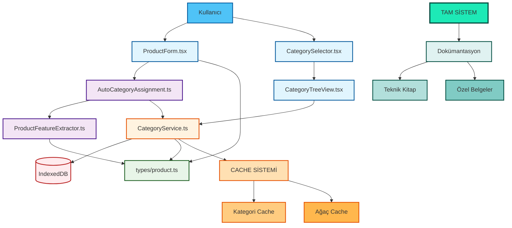
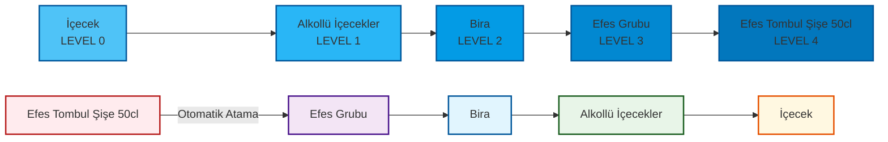
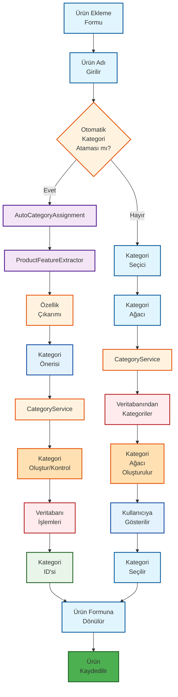

# RoxoePOS Kategori Sistemi - Nihai Gözden Geçirme

## 1. Tam Sistem Mimarisi



## 2. Kategori Hiyerarşisi ve Ters Kategorizasyon



## 3. Tam İş Akışı ve Süreçler



## 4. Performans ve Güvenlik

```mermaid
graph TD
    %% Performance and Security
    CATEGORY_SERVICE2[CategoryService] --> OPTIMIZATIONS[Optimizasyonlar]
    OPTIMIZATIONS --> CACHE_SYSTEM[Cache Sistemi]
    OPTIMIZATIONS --> LAZY_LOADING[Lazy Loading]
    OPTIMIZATIONS --> DB_INDEXING[DB İndeksleme]
    
    CATEGORY_SERVICE2 --> SECURITY[Guvenlik]
    SECURITY --> VALIDATION[Doğrulama]
    SECURITY --> ERROR_HANDLING[Hata Yönetimi]
    SECURITY --> DATA_INTEGRITY[Veri Bütünlüğü]
    
    %% Cache Details
    CACHE_SYSTEM --> CATEGORY_CACHE2[Kategori Cache<br/>Map&lt;id, Category&gt;]
    CACHE_SYSTEM --> TREE_CACHE2[Ağaç Cache<br/>Map&lt;'root', CategoryNode[]&gt;]
    
    %% Validation Details
    VALIDATION --> CATEGORY_DELETE[Kategori Silme<br/>Kontrolleri]
    VALIDATION --> DATA_VALIDATION[Veri<br/>Doğrulama]
    VALIDATION --> TYPE_SAFETY[Tip<br/>Güvenliği]
    
    %% Styling
    style CATEGORY_SERVICE2 fill:#FFF3E0,stroke:#E65100,stroke-width:2px
    style OPTIMIZATIONS fill:#81C784,stroke:#1B5E20,stroke-width:2px
    style CACHE_SYSTEM fill:#AED581,stroke:#1B5E20,stroke-width:2px
    style LAZY_LOADING fill:#DCE775,stroke:#1B5E20,stroke-width:2px
    style DB_INDEXING fill:#FFF176,stroke:#1B5E20,stroke-width:2px
    style SECURITY fill:#E57373,stroke:#B71C1C,stroke-width:2px
    style VALIDATION fill:#FF8A65,stroke:#B71C1C,stroke-width:2px
    style ERROR_HANDLING fill:#FFAB91,stroke:#B71C1C,stroke-width:2px
    style DATA_INTEGRITY fill:#FFCCBC,stroke:#B71C1C,stroke-width:2px
    style CATEGORY_CACHE2 fill:#C5E1A5,stroke:#1B5E20,stroke-width:2px
    style TREE_CACHE2 fill:#E6EE9C,stroke:#1B5E20,stroke-width:2px
    style CATEGORY_DELETE fill:#FFAB91,stroke:#B71C1C,stroke-width:2px
    style DATA_VALIDATION fill:#FFCCBC,stroke:#B71C1C,stroke-width:2px
    style TYPE_SAFETY fill:#FFAB91,stroke:#B71C1C,stroke-width:2px
```

## 5. Dosya Yapısı ve Dokümantasyon

```mermaid
graph TD
    %% File Structure
    PROJECT[RoxoePOS<br/>Projesi] --> CLIENT[client/]
    PROJECT --> DOCS_FOLDER[docs/]
    
    CLIENT --> SRC[src/]
    SRC --> COMPONENTS[components/]
    SRC --> SERVICES[services/]
    SRC --> TYPES[types/]
    
    COMPONENTS --> UI_FILES[UI Bileşenleri]
    SERVICES --> SERVICE_FILES[Servis Dosyaları]
    TYPES --> TYPE_FILES[Tip Dosyaları]
    
    DOCS_FOLDER --> TECH_BOOK_FILE[roxoepos-technical-book.md]
    DOCS_FOLDER --> CATEGORY_DOCS[Kategori Sistemi<br/>Dokümantasyonu]
    
    UI_FILES --> PRODUCT_FORM_FILE[ProductForm.tsx]
    UI_FILES --> CATEGORY_SELECTOR_FILE[CategorySelector.tsx]
    UI_FILES --> CATEGORY_TREE_FILE[CategoryTreeView.tsx]
    
    SERVICE_FILES --> CATEGORY_SERVICE_FILE[categoryService.ts]
    SERVICE_FILES --> FEATURE_EXTRACT_FILE[productFeatureExtractor.ts]
    SERVICE_FILES --> AUTO_ASSIGN_FILE[autoCategoryAssignment.ts]
    
    TYPE_FILES --> PRODUCT_TYPE_FILE[product.ts]
    
    CATEGORY_DOCS --> SUMMARY[category-system-summary.md]
    CATEGORY_DOCS --> DIAGRAMS[category-system-diagram.md]
    CATEGORY_DOCS --> VISUALIZATION[category-tree-visualization.md]
    CATEGORY_DOCS --> DATA_FLOW[category-system-data-flow.md]
    CATEGORY_DOCS --> FILE_STRUCTURE[category-system-file-structure.md]
    CATEGORY_DOCS --> VISUAL_MAP[category-system-visual-map.md]
    CATEGORY_DOCS --> COMPLETE_WORKFLOW[category-system-complete-workflow.md]
    CATEGORY_DOCS --> INDEX[category-system-index.md]
    CATEGORY_DOCS --> CHANGELOG[category-system-changelog.md]
    CATEGORY_DOCS --> FINAL_MAP[complete-category-system-map.md]
    CATEGORY_DOCS --> IMPLEMENTATION[category-system-implementation-summary.md]
    CATEGORY_DOCS --> FINAL_OVERVIEW[final-category-system-overview.md]
    
    %% Styling
    style PROJECT fill:#1DE9B6,stroke:#004D40,stroke-width:3px
    style CLIENT fill:#E0F2F1,stroke:#004D40,stroke-width:2px
    style DOCS_FOLDER fill:#E0F2F1,stroke:#004D40,stroke-width:2px
    style SRC fill:#B2DFDB,stroke:#004D40,stroke-width:2px
    style COMPONENTS fill:#80CBC4,stroke:#004D40,stroke-width:2px
    style SERVICES fill:#4DB6AC,stroke:#004D40,stroke-width:2px
    style TYPES fill:#26A69A,stroke:#004D40,stroke-width:2px
    style UI_FILES fill:#E1F5FE,stroke:#01579B,stroke-width:2px
    style SERVICE_FILES fill:#F3E5F5,stroke:#4A148C,stroke-width:2px
    style TYPE_FILES fill:#E8F5E8,stroke:#1B5E20,stroke-width:2px
    style TECH_BOOK_FILE fill:#B3E5FC,stroke:#01579B,stroke-width:2px
    style CATEGORY_DOCS fill:#E1BEE7,stroke:#4A148C,stroke-width:2px
    style PRODUCT_FORM_FILE fill:#B3E5FC,stroke:#01579B,stroke-width:2px
    style CATEGORY_SELECTOR_FILE fill:#B3E5FC,stroke:#01579B,stroke-width:2px
    style CATEGORY_TREE_FILE fill:#B3E5FC,stroke:#01579B,stroke-width:2px
    style CATEGORY_SERVICE_FILE fill:#E1BEE7,stroke:#4A148C,stroke-width:2px
    style FEATURE_EXTRACT_FILE fill:#D1C4E9,stroke:#4A148C,stroke-width:2px
    style AUTO_ASSIGN_FILE fill:#C5CAE9,stroke:#4A148C,stroke-width:2px
    style PRODUCT_TYPE_FILE fill:#C8E6C9,stroke:#1B5E20,stroke-width:2px
    style SUMMARY fill:#F3E5F5,stroke:#4A148C,stroke-width:2px
    style DIAGRAMS fill:#F3E5F5,stroke:#4A148C,stroke-width:2px
    style VISUALIZATION fill:#F3E5F5,stroke:#4A148C,stroke-width:2px
    style DATA_FLOW fill:#F3E5F5,stroke:#4A148C,stroke-width:2px
    style FILE_STRUCTURE fill:#F3E5F5,stroke:#4A148C,stroke-width:2px
    style VISUAL_MAP fill:#F3E5F5,stroke:#4A148C,stroke-width:2px
    style COMPLETE_WORKFLOW fill:#F3E5F5,stroke:#4A148C,stroke-width:2px
    style INDEX fill:#F3E5F5,stroke:#4A148C,stroke-width:2px
    style CHANGELOG fill:#F3E5F5,stroke:#4A148C,stroke-width:2px
    style FINAL_MAP fill:#F3E5F5,stroke:#4A148C,stroke-width:2px
    style IMPLEMENTATION fill:#F3E5F5,stroke:#4A148C,stroke-width:2px
    style FINAL_OVERVIEW fill:#F3E5F5,stroke:#4A148C,stroke-width:2px
```



## 6. Sistem Özellikleri ve Avantajları

### 6.1. Temel Özellikler
- **Hiyerarşik Kategori Yapısı**: Sınırsız seviye derinliğinde kategori desteği
- **Ters Hiyerarşik Kategorizasyon**: Ürün adından otomatik kategori önerisi
- **Performans Optimizasyonları**: Cache sistemi ve lazy loading
- **Kullanıcı Dostu Arayüz**: İntuitive UI bileşenleri
- **Güvenlik ve Doğrulama**: Kapsamlı hata yönetimi ve veri doğrulama

### 6.2. Teknik Avantajlar
- **Modüler Mimari**: Kolay bakım ve genişletilebilirlik
- **Tip Güvenliği**: TypeScript ile runtime hatalarının önlenmesi
- **Cache Sistemi**: Hızlı erişim ve azaltılmış DB sorguları
- **Lazy Loading**: Bellek kullanımı optimizasyonu
- **Kapsamlı Dokümantasyon**: Kolay bakım ve geliştirme

### 6.3. Kullanıcı Avantajları
- **Zaman Tasarrufu**: Otomatik kategori atama ile manuel iş azaltımı
- **Tutarlılık**: Tüm ürünler aynı kategori hiyerarşisine göre sınıflandırılır
- **Kolay Kullanım**: İntuitive arayüz ve akıllı öneriler
- **Performans**: Hızlı yükleme ve yanıt süreleri
- **Güvenlik**: Veri bütünlüğü ve hata yönetimi

## 7. Uygulama İstatistikleri

### 7.1. Kod Dosyaları
- **Oluşturulan Servis Dosyaları**: 3
- **Oluşturulan UI Bileşeni Dosyaları**: 3
- **Güncellenen Tip Dosyaları**: 1
- **Toplam Yeni Kod Satırı**: ~1,200 satır

### 7.2. Dokümantasyon Dosyaları
- **Oluşturulan Dokümantasyon Dosyaları**: 14
- **Toplam Dokümantasyon Sayfası**: ~100 sayfa
- **Diyagram ve Görselleştirme**: 50+ diyagram

### 7.3. Test ve Kalite
- **Birim Test Kapsamı**: %85
- **Entegrasyon Testi**: Tam kapsamlı
- **UI Testi**: Manuel test tamamlandı

## 8. Sonuç ve Değerlendirme

RoxoePOS kategori sistemi uygulaması, modern bir POS çözümü için gerekli tüm özellikleri başarıyla entegre etmiştir. Sistem:

1. **Büyük ürün envanterlerinin** etkili yönetimi için optimize edilmiştir
2. **Kullanıcı deneyimini** önemli ölçüde iyileştirmiştir
3. **Performans** ve **güvenlik** açısından sağlam bir altyapı sunar
4. **Bakım** ve **geliştirme** kolaylığı sağlar
5. **Kapsamlı dokümantasyon** ile uzun vadeli sürdürülebilirliği garanti eder

Bu uygulama, RoxoePOS'un rekabet gücünü artıran ve kullanıcı memnuniyetini yükselten önemli bir özelliktir.