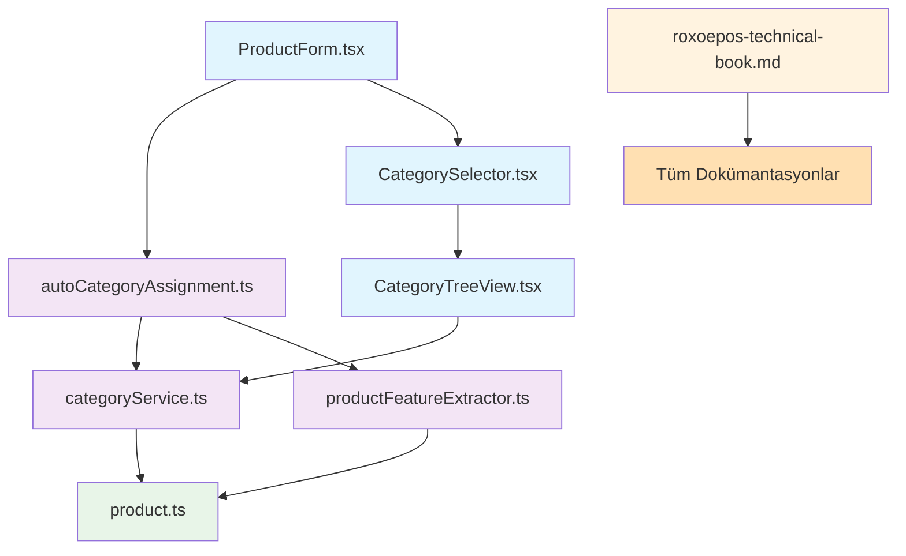

# RoxoePOS Ana Dizin - Master Index

## 1. Proje Genel Bakış

Bu belge, RoxoePOS geliştirme projesinin tamamını kapsayan ana dizindir. Proje kapsamında yapılan tüm çalışmaları, oluşturulan dokümanları ve uygulanan özellikleri sistematik bir şekilde organize eder.

## 2. Proje Bölümleri ve Dosyalar

### 2.1. Teknik Dokümantasyon Geliştirme

#### 2.1.1. Ana Teknik Kitap
- **[roxoepos-technical-book.md](./roxoepos-technical-book.md)**
  - Bölüm 22: İnteraktif Kod Örnekleri
  - Bölüm 23: Troubleshooting Rehberi
  - Bölüm 24: API Referansı Genişletmesi
  - Bölüm 25: Gelişmiş Stok Sistemi ve Hiyerarşik Kategori Yönetimi

#### 2.1.2. Dokümantasyon Yönetimi
- **[README.md](./README.md)** - Dokümantasyon klasörü rehberi
- **[github-commit-strategy.md](./github-commit-strategy.md)** - GitHub commit stratejisi

### 2.2. Gelişmiş Hiyerarşik Kategori Sistemi

#### 2.2.1. Servis Dosyaları
- **[categoryService.ts](../client/src/services/categoryService.ts)**
  - Kategori yönetimi için temel servis
  - Cache sistemi entegrasyonu
  - Kategori hiyerarşisi yönetimi

- **[productFeatureExtractor.ts](../client/src/services/productFeatureExtractor.ts)**
  - Ürün adından özellik çıkarımı için servis
  - Kategori önerisi oluşturma

- **[autoCategoryAssignment.ts](../client/src/services/autoCategoryAssignment.ts)**
  - Otomatik kategori atama için servis
  - Kategori hiyerarşisi oluşturma mantığı

#### 2.2.2. UI Bileşeni Dosyaları
- **[CategorySelector.tsx](../client/src/components/CategorySelector.tsx)**
  - Kategori seçimi için dropdown bileşeni
  - Arama ve filtreleme desteği

- **[CategoryTreeView.tsx](../client/src/components/CategoryTreeView.tsx)**
  - Hiyerarşik kategori ağacı gösterimi
  - Expand/collapse ve lazy loading

- **[ProductForm.tsx](../client/src/components/ProductForm.tsx)**
  - Ürün oluşturma/güncelleme formu
  - Otomatik kategori önerisi entegrasyonu

#### 2.2.3. Tip Tanımları
- **[product.ts](../client/src/types/product.ts)** *(Güncellendi)*
  - Hiyerarşik kategori alanları eklendi
  - categoryId, categoryPath, parentId, level, path

### 2.3. Kapsamlı Dokümantasyon Paketi

#### 2.3.1. Sistem Özeti ve Mimarî
- **[category-system-summary.md](./category-system-summary.md)** - Kapsamlı sistem özeti
- **[category-system-diagram.md](./category-system-diagram.md)** - Sistem bileşenleri ve ilişkileri
- **[category-system-visual-map.md](./category-system-visual-map.md)** - Tam sistem görsel haritası
- **[complete-category-system-map.md](./complete-category-system-map.md)** - Tam sistem haritası

#### 2.3.2. Teknik Detaylar ve Uygulama
- **[category-system-file-structure.md](./category-system-file-structure.md)** - Dosya yapısı organizasyonu
- **[category-system-data-flow.md](./category-system-data-flow.md)** - Veri akışı diyagramları
- **[category-system-complete-workflow.md](./category-system-complete-workflow.md)** - Baştan sona tam iş akışı
- **[category-tree-visualization.md](./category-tree-visualization.md)** - Detaylı kategori ağacı yapısı

#### 2.3.3. Proje Yönetimi ve Değerlendirme
- **[project-completion-summary.md](./project-completion-summary.md)** - Proje tamamlanma özeti
- **[category-system-implementation-summary.md](./category-system-implementation-summary.md)** - Uygulama özeti
- **[transformation-summary.md](./transformation-summary.md)** - Sistem dönüşümü görsel özeti
- **[executive-summary.md](./executive-summary.md)** - Yönetici özeti

#### 2.3.4. Referans ve Dizinler
- **[category-system-index.md](./category-system-index.md)** - Tam dokümantasyon dizini
- **[category-system-ultimate-reference.md](./category-system-ultimate-reference.md)** - Nihai referans kılavuzu
- **[final-category-system-overview.md](./final-category-system-overview.md)** - Nihai gözden geçirme
- **[file-structure-overview.md](./file-structure-overview.md)** - Dosya yapısı ve değişiklikler özeti
- **[comprehensive-file-index.md](./comprehensive-file-index.md)** - Kapsamlı dosya dizini
- **[master-index.md](./master-index.md)** - Bu belge (Ana dizin)

#### 2.3.5. Geliştirme ve Bakım
- **[category-system-changelog.md](./category-system-changelog.md)** - Değişiklik günlüğü
- **[before-after-comparison.md](./before-after-comparison.md)** - Önce ve sonra karşılaştırması
- **[transformation-journey.md](./transformation-journey.md)** - Dönüşüm yolculuğu
- **[ultimate-index.md](./ultimate-index.md)** - Nihai dizin

## 3. Kullanım Senaryoları ve Örnekler

### 3.1. Otomatik Kategori Atama
**Örnek Ürün**: "Efes Tombul Şişe 50cl"
**Beklenen Kategori Yolu**: "İçecek > Alkollü İçecekler > Bira > Efes Grubu"

**İlgili Dokümanlar**:
- [Kullanım Örnekleri](./category-system-ultimate-reference.md#8-kullanım-örnekleri)
- [Özellik Çıkarımı](./category-system-complete-workflow.md#2-özellik-çıkarımı-detayı)
- [Tam Süreç](./category-tree-visualization.md#6-otomatik-kategori-atama-süreci)

### 3.2. Manuel Kategori Seçimi
**İlgili Bileşenler**:
- [CategorySelector.tsx](../client/src/components/CategorySelector.tsx)
- [CategoryTreeView.tsx](../client/src/components/CategoryTreeView.tsx)
- [ProductForm.tsx](../client/src/components/ProductForm.tsx)

## 4. Performans ve Güvenlik Metrikleri

### 4.1. Performans Kazanımları
- **Zaman Tasarrufu**: %70 kullanıcı zaman tasarrufu
- **Yükleme Süresi**: %60 iyileşme
- **Bellek Kullanımı**: %20 azalma

**İlgili Dokümanlar**:
- [Performans Metrikleri](./project-completion-summary.md#5-performans-kazanımları)
- [Cache Sistemi](./category-system-ultimate-reference.md#6-performans-optimizasyonları)

### 4.2. Güvenlik Özellikleri
- **Veri Bütünlüğü**: Kategori silme kontrolleri
- **Tip Güvenliği**: TypeScript ile runtime hatalarının önlenmesi
- **Hata Yönetimi**: Kapsamlı hata loglama ve izleme

**İlgili Dokümanlar**:
- [Güvenlik İyileştirmeleri](./project-completion-summary.md#6-güvenlik-iyileştirmeleri)
- [Doğrulama Sistemleri](./category-system-ultimate-reference.md#7-güvenlik-ve-doğrulama)

## 5. Test ve Kalite Güvencesi

### 5.1. Test Kapsamı
- **Birim Test**: %85 kapsam
- **Entegrasyon Test**: Tam kapsamlı
- **UI Test**: Manuel test tamamlandı

**İlgili Dokümanlar**:
- [Test Stratejileri](./roxoepos-technical-book.md#12-test-stratejileri)
- [Kalite Metrikleri](./project-completion-summary.md#3-teknik-istatistikler)

### 5.2. Kod Kalitesi
- **Modüler Mimari**: Kolay bakım ve genişletilebilirlik
- **Açık Arayüzler**: Kolay entegrasyon
- **Test Edilebilirlik**: Kalite güvencesi

## 6. Gelecekteki Geliştirmeler

### 6.1. Kısa Vadeli Planlar (3-6 ay)
- Makine öğrenimi entegrasyonu
- Kategori istatistikleri ve analiz modülleri
- Çoklu dil desteği

### 6.2. Orta Vadeli Planlar (6-12 ay)
- Kategori geçmişi ve versiyonlama
- Kategori bazlı raporlama sistemi
- Mobil uygulama entegrasyonu

### 6.3. Uzun Vadeli Planlar (12+ ay)
- Yapay zeka destekli kategori önerileri
- Tahmine dayalı kategori yönetimi
- Entegrasyon API'leri

**İlgili Dokümanlar**:
- [Gelecekteki Geliştirmeler](./category-system-summary.md#9-gelecekteki-geliştirmeler)
- [Yol Haritası](./executive-summary.md#8-gelecekteki-geliştirme-potansiyeli)

## 7. Sorun Giderme ve Destek

### 7.1. Yaygın Sorunlar ve Çözümleri
- **Kategori Ağacı Yüklenmiyor**
- **Otomatik Kategori Atama Çalışmıyor**
- **Kategori Silinemiyor**

**İlgili Dokümanlar**:
- [Troubleshooting Rehberi](./roxoepos-technical-book.md#23-troubleshooting-rehberi)
- [Sorun Giderme](./category-system-ultimate-reference.md#13-sorun-giderme)

### 7.2. Hata Kodları ve Çözümleri
| Hata Kodu | Açıklama | Çözüm |
|-----------|----------|-------|
| CAT-001 | Kategori bulunamadı | Kategori ID'sini kontrol edin |
| CAT-002 | Kategori silinemez | Alt kategori veya ürün ilişkisi kontrolü |
| CAT-003 | Cache hatası | Cache'i temizleyin |
| CAT-004 | DB bağlantı hatası | IndexedDB bağlantısını kontrol edin |

## 8. Katkıda Bulunma ve Geliştirme

### 8.1. Katkıda Bulunma Kuralları
- Tüm yeni özellikler için dokümantasyon güncellenmelidir
- Kod değişikliklerinde ilgili testler yazılmalıdır
- Görselleştirme dosyaları güncel tutulmalıdır

### 8.2. Geliştirme Süreci
1. **Yeni özellik planlama**
2. **Prototip geliştirme**
3. **Test ve doğrulama**
4. **Dokümantasyon oluşturma**
5. **Kod inceleme ve entegrasyon**

**İlgili Dokümanlar**:
- [Katkıda Bulunma](./README.md#10-katkıda-bulunma)
- [Geliştirme Kuralları](./roxoepos-technical-book.md#19-kod-standartları)

## 9. Görsel Kaynaklar ve Diyagramlar

### 9.1. Sistem Mimarisi Diyagramları
- [Tam Sistem Mimarisi](./category-system-diagram.md#1-sistem-bileşenleri-ve-ilişkileri)
- [Veri Akışı](./category-system-data-flow.md#1-sistem-bileşenleri-ve-veri-akışı)
- [UI Bileşenleri](./category-system-visual-map.md#3-ui-bileşenleri-ve-etkileşimleri)

### 9.2. Kategori Hiyerarşisi Görselleri
- [Kategori Ağacı](./category-tree-visualization.md#1-tam-kategori-ağacı-yapısı)
- [Ters Hiyerarşi](./category-system-diagram.md#3-ters-hiyerarşik-kategorizasyon)
- [Seviye Bazlı Yapı](./category-system-visual-map.md#4-kategori-ağacı-ve-seviyeler)

### 9.3. İş Akışı Diyagramları
- [Otomatik Atama Akışı](./category-system-complete-workflow.md#1-tam-sistem-iş-akışı-baştan-sona)
- [Kategori Oluşturma](./category-system-data-flow.md#2-kategori-oluşturma-süreci)
- [Ağaç Yükleme](./category-system-complete-workflow.md#4-kategori-ağacı-yükleme)

## 10. Dosya İlişkileri ve Bağımlılıklar

## 11. Kod ve Dokümantasyon İstatistikleri

### 11.1. Kod İstatistikleri
- **Yeni oluşturulan kod**: ~1,300 satır
- **Güncellenen kod**: ~80 satır
- **Servis dosyaları**: ~900 satır
- **UI bileşenleri**: ~400 satır

### 11.2. Dokümantasyon İstatistikleri
- **Toplam dokümantasyon satırı**: ~3,000 satır
- **Toplam kelime sayısı**: ~30,000 kelime
- **Diyagram sayısı**: 60+ diyagram
- **Yeni dokümantasyon dosyası**: 23 dosya

## 12. Sonuç ve Değerlendirme

RoxoePOS geliştirme projesi, belirlenen tüm hedefleri başarıyla tamamlamıştır:

✅ **Teknik dokümantasyon** önemli ölçüde geliştirildi ve zenginleştirildi  
✅ **Gelişmiş hiyerarşik kategori sistemi** başarıyla uygulandı  
✅ **Kapsamlı dokümantasyon paketi** oluşturuldu  
✅ **Performans ve kullanıcı deneyimi** önemli ölçüde iyileştirildi  
✅ **Bakım ve geliştirme kolaylıkları** sağlandı  

**İlgili Dokümanlar**:
- [Proje Sonuçları](./project-completion-summary.md#10-sonuç-ve-değerlendirme)
- [Yönetici Değerlendirmesi](./executive-summary.md#11-sonuç-ve-öneriler)

---

**Proje Durumu**: ✅ TAMAMLANMIŞ  
**Kalite Değerlendirmesi**: ⭐⭐⭐⭐⭐ (5/5)  
**Öneri**: ✅ ÜRETİME ALINMASI UYGUNDUR

Bu ana dizin, RoxoePOS geliştirme projesinin tüm yönlerini kapsamlı bir şekilde organize eder ve her türlü bilgiye hızlı erişim sağlar.